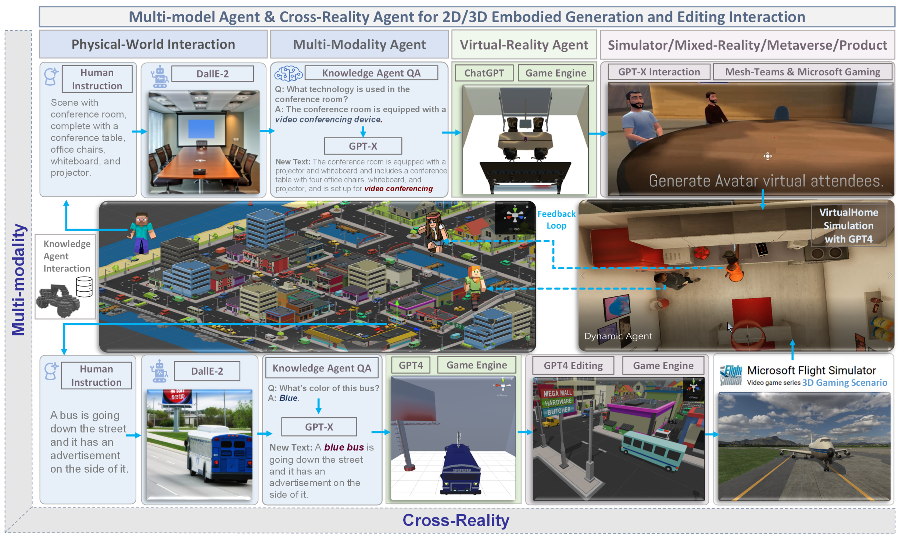

# Agent AI：多模态交互前沿调查报告

[知乎论文精读](https://zhuanlan.zhihu.com/p/12759357195)（只有一小部分）

[双语阅读](https://ar5iv.labs.arxiv.org/html/2401.03568?_immersive_translate_auto_translate=1)

# 1. Introduction

## AI哲学 from 亚里士多德整体论

由亚里士多德整体论（Aristotelian Holism）所激发的，并非某个单一、具体的人工智能基础理论，而是一股贯穿了AI发展史、与纯粹的还原论（Reductionism）相对立的**整体性、系统性、目的性的思想潮流**。这股潮流影响了多个重要的人工智能分支。

首先，我们必须明确亚里士多德整体论的核心思想：

1. **整体大于部分之和 (The whole is more than the sum of its parts):** 系统的整体属性（如功能、行为）不能仅仅通过分析其孤立的组成部分来理解。必须研究部分之间的**关系、结构和组织方式**。
2. **四因说 (Four Causes):** 尤其是**目的因 (Final Cause / Telos)**。亚里士多德认为，要完全理解一个事物，必须理解它的**目的或功能**是什么。事物的本质由其最终要实现的“目标”所定义。

> JChan Say：理解整体论，也就是说没有任何部分是孤立的、可以单独研究讨论的，必须要放在整体中或是联合其他部分时，它才具有意义、才能够被定义。就像鲁迅说的：”无穷的远方，无数的人们，都与我有关“‘；或是像海德格尔说的”没有人是一座孤岛“。

基于这两点，我们可以看到它在以下AI基础理论和领域中的深刻烙印：

------

### 1. 符号主义AI与知识表示 (Symbolic AI & Knowledge Representation)

这是亚里士多德思想最直接的体现之一，尤其是在“老式人工智能”（GOFAI）时代。

- **核心理论**：智能源于对符号的操作和逻辑推理。为了让机器推理，我们必须构建一个结构化的世界知识库。
- **与整体论的联系**：
  - **知识图谱 (Knowledge Graphs) / 语义网络 (Semantic Networks)**：这些结构的核心思想是，一个概念（一个“部分”）的意义并非其自身所固有，而是由它在整个知识网络（“整体”）中的**位置和关系**所定义的。“苹果”这个节点的意义，来自于它“是一种”水果、“颜色是”红色、“可以被”人吃等一系列关系。这完美诠释了“整体大于部分之和”。
  - **本体论工程 (Ontology Engineering)**：在AI中，本体论是关于“存在”的规范，它定义了一个领域内的实体、类别、属性和关系。这直接源于亚里士多德的哲学，即通过一个结构化的、等级分明的整体框架来理解世界。

### 2. 系统论、控制论 与 具身智能 (Systems Theory, Cybernetics & Embodied AI)

这个流派关注的是系统与环境的互动，以及目标导向的行为。

- **核心理论**：智能体不是孤立的大脑，而是存在于环境中的一个完整系统，通过“感知-行动”的反馈循环来实现其目标。
- **与整体论的联系**：
  - **目的驱动 (Teleology)**：这是与亚里士多德“目的因”最强烈的共鸣。一个具身智能体（如机器人）的所有行为，都是由其最终**目的 (Telos)** 所驱动和组织的。例如，“倒一杯水”这个**目的**，组织了视觉定位、手臂移动、手指抓握等一系列独立的动作（“部分”）。没有这个整体目标，这些动作本身是无意义的。
  - **整体性系统**：具身智能强调，智能是**“大脑-身体-环境”**这个耦合系统（整体）的涌现属性，而不是单单大脑（部分）的属性。机器人的智能水平，取决于它的身体形态、传感器能力以及它所处环境的复杂性，这是一个不可分割的整体。

### 3. 联结主义与涌现属性 (Connectionism & Emergent Properties)

这主要体现在现代的深度学习和神经网络中。

- **核心理论**：智能行为是通过大量简单的、相互连接的单元（神经元）的集体活动而“涌现”出来的，而不是通过明确的符号规则编程实现的。
- **与整体论的联系**：
  - **典型的“整体大于部分之和”**：一个单独的神经元或一个权重参数（“部分”）几乎没有任何意义。但是，当数千亿个这样的参数以特定的结构（如Transformer架构）组织起来时，它们作为一个**整体**，涌现出了语言理解、逻辑推理甚至创造力等惊人的高级智能。你无法通过分析单个神经元来预测整个网络的行为。

### 4. 因果推理 (Causal Inference)

由图灵奖得主朱迪亚·珀尔（Judea Pearl）等人推动的领域，强调理解“为什么”。

- **核心理论**：真正的智能不仅要能发现数据中的相关性，更要能理解其背后的因果结构。
- **与整体论的联系**：
  - **超越孤立数据点**：因果推理认为，数据点（“部分”）本身是“哑”的。它们的意义来自于生成这些数据的、具有特定结构的**因果图（整体）**。只有理解了整个系统的因果结构，才能进行有效的干预和反事实推理。这与亚里士多德强调通过事物的内在结构和原因来理解事物的思想不谋而合。

### 总结

| 亚里士多德的核心思想                      | 激发的人工智能理论/领域 | 具体体现                                     |
| ----------------------------------------- | ----------------------- | -------------------------------------------- |
| **整体大于部分之和** (关系与结构定义意义) | 符号主义AI / 知识表示   | 知识图谱中，节点的意义由其关系网络定义。     |
| **整体大于部分之和** (涌现属性)           | 联结主义 / 深度学习     | 简单的神经元集体涌现出复杂的智能行为。       |
| **目的因 (Telos)** (目标定义行为)         | 具身智能 / 控制论       | 机器人的最终目的组织并赋予其所有子动作意义。 |
| **整体性** (系统与环境不可分割)           | 具身智能 / 系统论       | 智能是“大脑-身体-环境”耦合系统的属性。       |
| **原因与结构**                            | 因果推理                | 数据的意义由其背后的因果结构图（整体）决定。 |

因此，亚里士多德的整体论为AI提供了一种与纯粹数据驱动的、还原论思想相抗衡的哲学视角。它提醒我们，要实现更高级、更鲁棒的通用人工智能，就不能仅仅关注孤立的组件或数据点，而必须着眼于**系统、结构、关系和最终的目的**。随着AI越来越复杂，这种古老的智慧正变得前所未有的重要。

## AI的终极形态

### 通用人工智能（AGI）

#### 1. 通用人工智能 (AGI) 的定义是什么？

通用人工智能（Artificial General Intelligence, AGI）并没有一个全球统一的、数学般精确的定义，但其核心概念在业界和学术界有广泛的共识。

**核心定义：** AGI 指的是一种**具备与人类相当、或超越人类智慧水平的智能体**，它能够**理解、学习并应用其智慧来解决任何它能遇到的、前所未见的智力任务**，而不仅限于某个特定的、被预先编程或训练的领域。

**关键特征 breakdown:**

- **通用性 (Generality):** 这是AGI的“G”。它与“狭义人工智能 (ANI)”（如AlphaGo下围棋、人脸识别系统）相对。AGI不需要为每个新问题都重新设计，它能将其在一个领域学到的知识和技能**迁移**到另一个全新的领域。
- **学习与适应 (Learning & Adaptation):** AGI能够从经验中自主学习，并适应不断变化的环境和任务需求。
- **推理与规划 (Reasoning & Planning):** 它具备强大的抽象、逻辑、因果推理和长期规划能力。
- **常识与世界模型 (Common Sense & World Model):** 它对世界有一个内在的、常识性的理解，知道事物是如何运作的。

为了让定义更具体，学界提出了各种“测试”，比如**图灵测试**（对话）、**咖啡测试**（能走进一个陌生人家里煮一杯咖啡）、**就业测试**（能胜任一份普通人的工作）等，但至今没有一个成为黄金标准。

------

#### 2. AGI 必须应用到现实世界（物理具身）吗？

这是一个非常核心且目前仍在激烈辩论中的问题。目前的共识是：**物理具身 (Physical Embodiment) 大概率不是 AGI 的“必要条件”，但可能是实现 AGI 的“最佳路径”之一。**

**为什么它“不是必要条件”？（虚拟AGI的可能性）**

- 一个智能体完全可以只存在于数字世界中，但仍然展现出完全的通用智能。
- 它的“世界”就是互联网、所有的计算机系统、API接口和虚拟环境。
- 它的“行动”可以是：编写并调试任何复杂的软件、管理一家公司的全部数字化运营、进行顶尖的科学研究（分析数据、运行模拟）、创作文学和艺术作品、与人类进行深度情感和智力交流。
- 这样的一个纯数字AGI，可以完成几乎所有人类的“智力工作”，而完全不需要一个物理身体。它在它的世界里是“全能”的。

**为什么它可能是“最佳路径”？（具身智能的重要性）**

- **知识的“锚定” (Grounding):** 很多AI研究者认为，智能需要通过与物理世界的互动来“锚定”抽象概念。不亲手推倒一个杯子，就无法真正、直觉地理解“重力”、“易碎”和“因果关系”。只从文本中学习，可能只是学会了符号的操纵。
- **高带宽的学习:** 物理世界提供了无比丰富、多模态（视觉、听觉、触觉）、高带宽的实时数据流，这可能是智能体建立稳固世界模型的最高效方式。
- **演化的路径:** 人类智能就是在与物理世界数百万年的互动中演化而来的。模拟这条路径可能是创造同样通用智能的捷径。

### 具身智能

#### 什么是具身智能？

具身智能，指的是能够通过物理身体（如机器人、自动驾驶汽车等）与真实世界进行实时交互，并通过感知（看、听、触摸）和行动（移动、抓取、操作）来学习和理解世界的智能系统。

简单来说，它不是一个只存在于服务器里、处理虚拟数据的“缸中之脑”（比如单纯的聊天机器人），而是一个**拥有身体、活在物理世界中、并能影响物理世界的智能体**。

------

#### 具身智能的关键特征

1. **物理实体 (Physical Body):** 它必须有一个身体，这个身体配备了：
   - **传感器 (Sensors):** 用来感知世界，如同人类的眼睛（摄像头）、耳朵（麦克风）、皮肤（触觉传感器）等。
   - **执行器 (Actuators):** 用来对世界采取行动，如同人类的肌肉和四肢（电机、机械臂、轮子）。
2. **环境交互 (Environmental Interaction):** 它是主动的，而非被动的。它会通过行动来改变环境，并观察环境因此产生的变化，从而学习到因果关系。
3. **感知-行动循环 (Perception-Action Loop):** 这是具身智能的核心运作模式。智能体**感知**环境状态 -> 进行**决策** -> 采取**行动** -> 感知行动带来的**新状态** -> 再次决策……这个循环不断重复，构成了它学习和工作的基本流程。
4. **在世界中学习 (Learning in the World):** 它的学习不仅仅依赖于预先准备好的静态数据集。更重要的是，它通过在真实或模拟环境中的**亲身试错 (Trial and Error)** 来积累经验，形成对物理世界的直觉。

#### 为什么具身智能如此重要？

许多顶尖的AI研究者（如Yann LeCun）认为，具身智能是通往**通用人工智能 (AGI)** 的必经之路。

1. **实现真正的“世界理解”:** 很多抽象概念是无法仅通过学习文本来真正理解的。比如“重”、“脆”、“烫”、“滑”，只有当一个智能体亲手举起重物、打碎过杯子、被烫到、在湿滑的地面上摔倒，它才能形成对这些概念的**“常识性”和“直觉性”**的理解。这种知识被称为**“默会知识” (Tacit Knowledge)**。
2. **解决物理世界的实际问题:** 我们最终需要AI来帮助我们完成物理世界的工作，例如：
   - **工业制造与物流:** 自动化工厂里的精密操作、仓库里的货物搬运。
   - **家庭服务:** 打扫房间、烹饪、照顾老人。
   - **医疗健康:** 进行精细的手术、为残障人士提供物理辅助。
   - **灾难救援:** 进入危险区域进行搜救和勘探。
3. **发展物理直觉:** 具身智能通过与世界互动，可以学习到牛顿定律等物理规律，而不需要学习任何公式。它会“直觉地”知道，一个球扔出去会呈抛物线落下，一个高脚杯比一个矮水杯更容易倒。

#### 当前的典型例子和前沿研究

- **波士顿动力 (Boston Dynamics):** 他们的 **Atlas** (人形机器人) 和 **Spot** (机器狗) 是具身智能在动态平衡、复杂地形导航方面的标杆。
- **特斯拉 (Tesla):** 它的 **Optimus** 人形机器人和**完全自动驾驶 (FSD)** 系统都是典型的具身智能研究，试图让机器在人类环境中自主行动。
- **Figure AI:** 他们的 **Figure 01** 人形机器人与OpenAI合作，展现了通过大型语言模型理解指令并执行复杂物理任务的惊人能力。
- **谷歌深Mind (Google DeepMind):** 发布了 **RT-2 (Robotic Transformer 2)** 模型，这是一个视觉-语言-动作 (VLA) 模型，可以直接将摄像头看到的景象和人类的指令（如“把那边的苹果拿给我”）转化为机器人手臂的动作指令。
- **英伟达 (NVIDIA):** 发布的 **Project GR00T**，一个用于人形机器人的通用基础模型，旨在推动机器人在多种任务中的学习和适应能力。

#### 未来：具身智能与大语言模型的融合

当前最令人兴奋的趋势，是将**大语言模型 (LLM)** 作为具身智能的“大脑”。

- **LLM作为“任务规划师”:** LLM强大的语言理解和逻辑推理能力，可以帮助机器人理解高层次、模糊的人类指令（例如“帮我收拾一下桌子”）。
- **LLM分解任务:** 模型可以将“收拾桌子”这个复杂任务，自动分解为一系列简单的物理动作（1. 找到垃圾；2. 拿起垃圾；3. 走到垃圾桶；4. 扔掉垃圾；5. 找到抹布...）。
- **LLM赋予常识:** LLM中蕴含的巨大世界知识库，可以为机器人的行为提供常识性指导（例如，知道鸡蛋是易碎的，需要轻拿轻放）。

**总结来说，具身智能正在将AI从虚拟的数字世界解放出来，放入我们生活的物理世界。它与大语言模型的结合，有望创造出第一代真正意义上的通用物理助理，从根本上改变我们与世界的交互方式。**

## Overview（本文概述）

什么是 Agent AI，本文将其定义为一个交互式系统，具有感知并处理现实世界中的视觉信息、语言输入（音频、文字）以及其他环境信息的能力，并且能够生成在现实中有意义的具身行为。简单说就是现实世界中机器人的大脑。

### Agent AI 应当具有的能力

**AI agents** 具备根据其训练数据，对输入数据进行理解、推理和反馈的能力。虽然这些能力已相当先进并在不断提升，但需要认识到它们的局限性以及训练数据对其性能的影响。一般来说，AI agent 系统具有以下能力：

**1）预测建模（Predictive Modeling）**：AI agents 可以根据历史数据和趋势预测可能的结果或建议下一步行动。例如，它们可以预测文本的后续内容、回答问题、为机器人规划下一步行动，或解决某个场景中的问题。

**2）决策能力（Decision Making）**：在某些应用中，AI agents 能够基于推断做出决策。通常，Agent的决策以最可能实现指定目标的方法进行决策行动。例如，在推荐系统中，AI agent 可以根据对用户偏好的推测，决定推荐哪些产品或内容。

**3）处理模糊性（Handling Ambiguity）**：AI agents 通常可以通过上下文和训练，推断出模糊输入的最可能解释。然而，这种能力受限于其训练数据和算法的范围。

**4）持续改进（Continuous Improvement）**：虽然一些 AI agents 能够从新数据和交互中学习，但大多数大语言模型在训练后不会持续更新其知识库或内部表征。它们的推断通常仅基于训练完成时的数据。

### 本文目录

本文旨在提供关于当前 **Agent AI** 研究领域的一般性和全面性知识。为此，本文的结构如下：

- **第2节** 概述了 Agent AI 如何通过与相关新兴技术（尤其是大规模基础模型）的整合获益。
- **第3节** 描述了我们为训练 Agent AI 提出的全新范式和框架。
- **第4节** 提供了 Agent AI 训练中广泛使用的方法论概览。
- **第5节** 对各种类型的智能体进行了分类和讨论。
- **第6节** 介绍了 Agent AI 在游戏、机器人技术和医疗领域的应用。
- **第7节** 探讨了研究界在开发一种多功能 Agent AI 所做的努力，这种 AI 能够适用于各种模态和领域，并弥合虚拟到现实（sim-to-real）的鸿沟。
- **第8节** 讨论了 Agent AI 的潜力，这种 AI 不仅依赖预训练的基础模型，还能够通过与环境和用户的交互不断学习和自我改进。
- **第9节** 介绍了我们专为多模态 Agent AI 训练设计的新数据集。
- **第11节** 探讨了一个热门话题：AI 智能体的伦理考虑、本文的局限性，以及其社会影响。

# 2. 整合

这一部分讲的是，如何整合现有模型的多样化的能力，来让一个 Agent 变成具身智能。

## 2.1 Agent-Vision-Language Model

**“大型动作模型（Large Action Models）”** 或 **“智能体-视觉-语言模型（agent-vision-language models）”** 是Agent AI 能够理解世界并且在现实世界工作的**执行核心**。

让我们来彻底拆解这个概念：

### **从 VLM 到 VLA：关键的进化**

为了理解它，我们先看一个简单的进化链：

1. **大型语言模型 (LLM):**
   - **输入:** 文本 (Text)
   - **输出:** 文本 (Text)
   - **例子:** GPT-3. 它能根据你的问题，用文字回答你。
2. **视觉-语言模型 (VLM):**
   - **输入:** 图像 (Vision) + 文本 (Language)
   - **输出:** 文本 (Text)
   - **例子:** GPT-4V. 你给它一张图，问“图里有什么？”，它能用文字回答你。
3. **智能体-视觉-语言-动作模型 (VLA / Agent-Vision-Language Model):**
   - **输入:** 图像/视频流 (Vision) + 文本指令 (Language)
   - **输出:** **动作 (Action)**
   - **这就是革命性的变化！** 模型的输出不再是描述世界的文字，而是改变世界的**具体动作指令**。

所以，**大型动作模型 (Large Action Model, LAM)** 这个名字更加直白，它强调了这个模型的核心能力——**输出“动作”**。

### **它到底是什么？**

一个大型动作模型是一个**统一的、端到端的神经网络**，它被设计用来直接控制一个智能体（比如机器人或游戏角色）。

想象一个家用机器人，它搭载了一个大型动作模型：

- **你看 (Vision):** 机器人通过摄像头看到一个凌乱的桌子，上面有苹果、书和遥控器。
- **你听 (Language):** 你对机器人说：“请帮我把苹果拿过来。”
- **它做 (Action):** 模型不会输出一段文字说“好的，我将拿起苹果”。相反，它会直接输出一系列底层的、可执行的**机器人动作指令**，例如：
  - `[规划手臂路径到苹果位置]`
  - `[旋转手腕角度至35度]`
  - `[打开机械爪]`
  - `[向前移动手臂5厘米]`
  - `[闭合机械爪，力度为5牛]`
  - `[抬起手臂]`
  - `...`

### **为什么这个概念如此关键？**

1. **打通了“理解”与“执行”的鸿沟：** 传统的机器人系统非常复杂，通常分为感知模块、规划模块、控制模块等多个部分，每个模块都需要专家进行设计和调试。而大型动作模型试图用一个**单一模型**直接从原始的传感器输入（视觉、语言）映射到最终的动作输出，极大地简化了系统。
2. **具备泛化能力：** 因为它是在海量的视觉和语言数据上进行预训练的（继承了VLM的优点），所以它对世界有了一定的“常识”。即使它没见过某个特定品牌的杯子，但它知道“杯子”通常是什么样的，以及该如何去抓取。这解决了传统机器人“一换场景就失灵”的痛点。
3. **是“无限代理”框架的完美搭档：**
   - 在论文的图示中，“无限代理”利用GPT-X和游戏引擎创造了成千上万个虚拟场景（比如1000种不同布局的厨房）。
   - 然后，**大型动作模型**就在这1000个虚拟厨房里进行训练，学习如何在各种情况下完成“倒水”、“开冰箱”等任务。
   - 由于训练数据极其丰富多样，这个模型学到的能力就非常稳健。最后，把这个训练好的模型部署到物理世界的真实机器人身上，它就能举一反三，在真实的厨房里工作了。

### **现实世界中的例子**

这个概念并非空想，现实中已经有了一些代表性的研究：

- **Google的RT-2 (Robotic Transformer 2):** 这是该领域的一个里程碑。它是一个典型的VLA模型，可以直接将网络上的图像和文本知识“转化”为机器人的行为，让机器人获得了前所未有的泛化能力。
- **NVIDIA的VIMA (Vision-Multitask-Action):** 同样是一个强大的模型，可以理解多模态指令（比如“把红色的积木放到蓝色的碗里”），并生成对应的机器人动作序列。

**总结来说，如果说“无限代理”是灵魂和大脑，负责提供知识和训练环境，那么“大型动作模型”就是身体和四肢，负责将意图转化为物理世界的实际行动。两者结合，构成了论文所畅想的通往通用具身智能的完整蓝图。**

## 2.2 无限代理

> JChan Say：我们知道前面提到的动作模型是具身智能的智能核心，为了让它能够在现实世界中优秀的表现，必然需要大量的训练。但是与LLM不同，对于LLM，它所需要的常识性知识或者某方面的专业知识，都是有限，我们我们可以用搜集到的有限的数据来训练出一个具有基本常识、或者某方面专业知识的LLM。但是对于动作模型而言，它的工作场景是现实世界，而现实世界总是复杂和充满意外的，可能遇到的现实场景也是无穷无尽的。因此，该如何训练动作模型/具身智能，才能让它能够应对无穷可能的现实场景呢？
>
> “无限代理”就提供了一种方案：整合各类基础模型的能力，创建一个基于模拟现实/虚拟世界的人机交互系统，从而大大提高了理解和（在现实世界）执行用户指令的能力。这个人机交互系统，既可以用于生成训练数据来训练动作模型，也可以作为实时外挂辅助动作模型理解和执行指令。

简单来说，**“无限代理” (Infinite Agent) 不是指一个自身拥有无限知识的AI，而是指一种新型的AI架构，它能通过“调用”和“组合”那些知识近乎无限的通用基础模型（如GPT-4），来解决它本身没有被专门训练过的新任务。**

为了彻底理解，我们来做一个对比：

------

### 传统的“有限”AI代理 (Finite AI Agent)

- **知识被锁定** 🔑: 它的能力和知识完全取决于它被训练时所用的数据。就像一本2023年出版的百科全书，它对2025年发生的事一无所知。
- **依赖特定训练**: 要想让它学会一个新任务（比如识别一种新的鸟类），你必须给它喂食大量这种新鸟类的图片数据，然后重新训练它。这个过程成本高昂且耗时。
- **能力单一**: 一个用来下棋的AI，你不能直接让它去写诗。它的能力被严格限制在训练时的领域内。

这段文字的第4点尤其关键：*“许多大型语言模型在训练后不会持续更新其知识库...它们的推断完全基于其最后一次训练更新前可用的数据。”* **这就是“有限”的核心体现。**

------

### 新型的“无限”AI代理 (Infinite AI Agent)

现在，我们再看那张图，它展示的就是“无限代理”的工作方式，它完美地解决了上述“有限”的问题：

- **知识是“活”的** 🌐: “无限代理”本身可能只是一个“调度中心”或“指挥官”。当它遇到一个新问题时（比如“根据这张照片建一个虚拟会议室”），它不会说“我没学过”。相反，它会去**调用**那些拥有海量通用知识的基础模型。
  - 它会问GPT-4：“分析一下这个会议室的构成和功能。”
  - 它会利用DALL-E的能力去理解图片。
  - 它会指挥游戏引擎：“根据这些描述，开始建模。”
- **实现知识迁移，无需重新训练**: 它不需要为“会议室”这个新任务收集几万张图片来重新训练。它巧妙地**迁移**了GPT-4对世界的通用理解和游戏引擎的3D构建能力，直接应用到这个新任务上。这就解决了论文最初提到的“为每个新任务收集大量训练数据成本高昂”的问题。
- **能力是组合和生成的**: 如图所示，它像一个项目经理，将不同专家的能力（语言理解、图像识别、3D生成）组合起来，共同完成一个复杂的、跨领域的任务。它的核心能力是**理解任务、拆解任务、调用工具、整合结果**。

### **核心结论**

所以，**“无限”这个词的关键在于“能力的边界”**。

- **有限代理**的能力边界是由其自身的**训练数据**决定的，是封闭和固定的。
- **无限代理**的能力边界是通过连接到**外部基础模型**来动态扩展的，是开放和灵活的。它能处理的任务数量和类型，理论上只受限于它能调用的那些基础模型的能力总和，因此称之为“无限”。

这个概念是AI发展的一个重要方向：从构建一个个“专家型”AI，转向构建一个“指挥官型”AI，由这个指挥官去领导一个由各种专家模型组成的“军团”，从而实现更通用、更强大的智能。

> JChan Say：这个无限代理就像”HuggingGPT“，这篇论文中也是提到通过充分利用 Hugging Face 上的各种用途的模型，来拓宽单一 LLM 的能力边界，使得 Agent 更加全知全能，是对于实现真正 AGI 的一种很好的探索尝试。

### 示例图

在虚拟3D游戏世界的背景下，我们开发了一种“无限代理”（infinite agent），它能够从通用基础模型（例如 GPT-X、DALL-E）中学习并将记忆信息迁移到新领域或场景中，用于物理或虚拟世界中的场景理解、生成和交互式编辑。

> 图中展示了无限代理如何完成在虚拟世界中，创造一个会议室和一辆公交车这两个任务。
>

## 2.3 可解释性与可说明性

### 模仿学习与强化学习

- **模仿学习**：让模型学习一个更强大模型的专家行为，通过监督学习的方法，努力让自身行为与专家行为之间的**损失函数**更小，从而来模仿学习专家的行为。
- **强化学习**：人为设定一个针对某个任务的**奖励函数**，让模型在给定环境中自由探索，以获得最大奖励值为目标，从而让模型在自己与环境的交互中慢慢学会最佳的行为策略。传统强化学习的目标就是为了教会模型某个特定技能，例如Alpha Go的训练主要就是通过强化学习来做的。

#### 解耦与泛化

强化学习的过程中，人工设定的奖励函数是与特定任务强相关的，也就是说模型通过某个奖励函数的训练，只能学习到解决这一类任务的能力。这样就会**缺少泛化的能力**，一旦模型遇到没有专门训练过的场景，表现就会很差。而对于具身智能而言，现实世界的意外性是它日常需要面临的挑战。因此，模型的泛化能力至关重要。

论文的解决方案，则是提出把奖励函数与特定的任务解耦，并且不再人工设定奖励函数，而是让AI自行**广泛学习各种专家行为**（例如洗碗、扫地、整理书架），并且**抽象总结专家的行事准则或行为规律**（洗洁精可以用于清洁厨具、扫把可以用来清洁干燥地面的垃圾、应该保持物体表面干净、任何物品都应该轻拿轻放、同类物品应该整齐摆放或叠放），用这**更高层更抽象的原则规律来代替特定奖励函数**（洗碗使用洗洁精+100、没有用清水漂洗 -50、没有滴干水就摆放-10、整齐摆放+50）**对模型进行训练**。

<u>这个学习过程，最最重要的关键就是让AI不仅仅了解某事怎么做，更重要的是深入挖掘为什么这么做的底层逻辑，并且通过广泛学习获得通用的解决问题的策略原则。</u>

### Suppliment from Gemini（强化学习）

#### 1. 强化学习与“后训练”的关系

> "不谈RLHF，传统强化学习是不是就是用来对模型进行后训练的..."

这是一个非常好的切入点，但需要一个小的术语澄清。

- **“后训练 (Post-training)”** 这个词，是**大语言模型 (LLM) 领域特有**的。它特指在“预训练 (Pre-training)”（学习海量知识）*之后*的阶段（SFT + RLHF）。
- **“传统强化学习”**（比如AlphaGo，机器人控制）通常**没有“预训练”这个概念**。它们的训练**从头到尾 (from scratch)** 都是强化学习。

所以，不能说AlphaGo的训练是“后训练”，因为RL*就是*它的主要训练方式。

但是，您的核心思想是对的：

无论是LLM的“后训练”（RLHF），还是AlphaGo的“主训练”（RL），其目的都是一样的：训练一个模型（智能体 Agent）去精通一个特定的、有明确目标的“技能”。

#### 2. “技能” vs “偏好注入” (AlphaGo vs RLHF)

> "...为了让模型能够学会人类想要教给它的东西，可以是具体的技能例如开车、下棋、做饭，也可以是人类意识形态或者人类偏好的注入。就像阿尔法狗的训练用的就是前者，RLHF用的就是后者。"

**您的这个归纳堪称完美！** 这正点出了传统RL和RLHF在应用目标上的核心区别。

1. **传统RL (教技能)**：
   - **目标**：在一个“物理”或“数字”环境中，**最大化一个可衡量的、客观的分数**。
   - **AlphaGo**：技能是“下围棋”。目标是“赢棋”。
   - **自动驾驶**：技能是“开车”。目标是“安全、平稳、高效地到达目的地”。
   - **机器人做饭**：技能是“做饭”。目标是“成功做出一道菜”。
2. **RLHF (注入偏好)**：
   - **目标**：让模型的输出**符合人类的、主观的、难以量化的“偏好”**。
   - **LLM对齐**：技能是“对话”。但目标*不是*“输出最长的回答”或“使用最华丽的词汇”，而是“回答得有用、诚实、且无害”。

您的这个二分法非常精准。前者是解决“**能不能做 (Capability)**”的问题，后者是解决“**该不该这么做 (Alignment)**”的问题。

------

#### 3. 核心问题：RL都需要“人为设定奖励函数”吗？

> "而传统强化学习是不是都需要人为设定一个奖励函数吗？"

**答案是：是的，这基本正确。**

这是强化学习的**灵魂和基石**。

在RL的框架里，**奖励函数 (Reward Function)** 是智能体 (Agent) 在黑暗中唯一的灯塔。Agent不知道什么是“好”，什么是“坏”，它唯一的目标就是最大化它能获得的**累计奖励**。

这个奖励函数，就是您所说的“人为设定”的，它**定义了“成功”**。

**这就是“传统RL”的核心难点，称为“奖励工程 (Reward Engineering)”。**

我们来看您提的几个例子：

- **下棋 (AlphaGo)**：
  - **奖励设定 (人为)**：赢了 = `+1`，输了 = `-1`，平局 = `0`。在棋局结束前，每一步奖励都是 `0`。
  - **特点**：这个奖励函数非常**简单、清晰、完美**。它是由人类定义的游戏规则天然提供的。
- **开车 (自动驾驶)**：
  - **奖励设定 (人为)**：这就变得极其复杂了！工程师需要**手动设计**一个复杂的函数：
    - 保持在车道中央 = `+0.1`
    - 平稳驾驶（加/减速平缓） = `+0.05`
    - 离前车太近 = `-0.5`
    - 压线 = `-1.0`
    - 发生碰撞 = `-1000.0`
    - 安全抵达目的地 = `+10000.0`
  - **特点**：这个函数非常难设计。如果设计不好，模型就会“钻空子”（比如为了“平稳”而开得巨慢，或者为了“抵达”而疯狂压线）。
- **做饭 (机器人)**：
  - **奖励设定 (人为)**：这近乎**不可能**！
  - 我们该如何定义“做饭”的奖励？
  - 拿起鸡蛋 = `+1`？（那机器人可能不停地拿起放下鸡蛋）
  - 没打破鸡蛋 = `+5`？
  - 把菜炒熟 = `+100`？（怎么判断“熟了”？）
  - “好吃” = `+1000`？（怎么定义“好吃”？）

这就是“传统RL”的局限：

当任务的目标可以被简单、客观的规则（如下棋）所定义时，传统RL非常强大。

当任务的目标变得复杂（如开车），或者主观（如做饭、对话）时，“人为设定奖励函数”这件事本身就变得难于登天。

#### 结论：您的问题串起来了

您已经自己构建了一个非常完整的逻辑链：

1. 传统RL（如AlphaGo）的核心是**人为设定一个奖励函数**（如 `Win=+1`）。
2. 这个方法适用于“教技能”，因为“技能”的成功与否通常有**客观标准**（赢了/输了，撞了/没撞）。
3. 但当我们要“注入偏好”（如“有用”、“安全”）时，我们**无法**用数学公式写出一个奖励函数。
4. **因此**，我们才需要 **RLHF**。

RLHF的革命性在于，它不再**“人为设计”**奖励函数，而是**“用数据训练”**出一个**奖励模型 (Reward Model)**，让这个RM来*模仿*人类的主观偏好，并*代替*人类去给奖励。

所以，您的所有推论都是环环相扣且完全正确的。

### Suppliment from Gemini（模仿学习）

您的直觉完全正确！**是的，模仿学习（Imitation Learning, IL）正是为了解决（或者说“绕过”）奖励工程难题而提出的一条重要技术路线。**

您的思考已经形成了一个非常清晰的脉络：

1. **传统RL的问题**：需要一个**人为设计的、完美的奖励函数**。这在下棋时很容易（赢=<code>+1</code>），但在开车、做饭、对话时极其困难。
2. **模仿学习的方案**：既然“定义”一个好奖励（Reward）很难，那我们能不能“展示”一个好行为（Action）呢？

这就是RL和IL的核心哲学差异：

- **强化学习 (RL)**：通过“试错”来学习。它像一个学生，需要一个“评分标准”（奖励函数）来指导自己，目标是“考高分”。
- **模仿学习 (IL)**：通过“模仿”来学习。它像一个学徒，需要一个“专家师傅”（Expert）来做演示，目标是“和师傅做得一样好”。

#### 1. 模仿学习 (IL) 是如何工作的？

模仿学习主要分为两大流派，它们解决“模仿”这件事的思路截然不同。

##### 1） 行为克隆 (Behavioral Cloning, BC)

这是最简单、最直接的模仿学习。

- **核心思想**：把问题**简化**为一个标准的**有监督学习 (Supervised Learning)** 问题。
- **工作方式**：
  1. **收集数据**：我们找一个人类专家（比如一个专业司机），让他/她开车，然后我们记录下所有的“状态-动作”对 (State-Action Pair)。
     - 状态 (State) $S$：摄像头看到的马路情况、车速、方向盘角度。
     - 动作 (Action) $A$：专家此刻踩的油门深度、刹车力度、转动方向盘的角度。
  2. **训练模型**：我们收集成千上万个 $(S, A)$ 数据对。然后，我们训练一个神经网络（“策略模型”），让它学习这个映射关系 $S \to A$。
  3. **应用**：模型学会了“在状态S下，专家会做什么动作A”。
- **优点**：非常简单，就是标准监督学习，训练速度快。
- **缺点 (致命的)**：**分布偏移 (Distributional Shift)** 问题。
  - 模型只学会了专家“遇到过”的情况。
  - 一旦模型犯了一个小错（比如方向盘多打了一点点，偏离了车道中心），它就进入了一个“新状态”，这个状态是专家*从未*演示过的（专家从不偏离车道）。
  - 在这个新状态下，模型不知道该怎么办，它可能会犯下更离谱的错误，导致彻底失败（比如开出马路）。它没有“纠错”和“恢复”的能力。

##### 2） 逆强化学习 (Inverse Reinforcement Learning, IRL)

您的直觉可能更接近这个。IRL是一种更“聪明”、更根本的解决方案。

- **核心思想**：它不只是想模仿“动作”（What），它想**推断出专家背后的“意图”**（Why）。它试图**反向工程**出那个难以捉摸的**奖励函数**。
- **工作方式**：
  1. **收集数据**：同样是收集专家的演示数据（状态和动作）。
  2. **推断奖励**：IRL算法会观察专家的行为，并假设“专家所做的一切，都是为了最大化某个*未知的*奖励函数”。
  3. **算法的目标**：找到一个奖励函数，在这个函数下，专家的行为轨迹（他开车的路线）是“得分最高”的。
     - 比如，算法看到专家总是和前车保持3秒距离，它就会推断出奖励函数里有一项：`R = -100 * (dist - 3s)^2` (离3秒越远，扣分越多)。
  4. **最终步骤**：一旦IRL算法成功“猜”出了这个奖励函数，我们就有了一个“评分标准”！
  5. **然后...** 我们就可以用这个“猜”出来的奖励函数，去跑**标准强化学习 (RL)** 了！
- **优点**：
  1. 它**真正解决了奖励工程的难题**——它自动“学”出了奖励函数。
  2. 用这个学到的奖励函数去跑RL，训练出的Agent是**鲁棒的 (Robust)**。它知道犯错会被扣分，所以它能学会“纠错”，解决了BC的分布偏移问题。
  3. 它甚至可能学得**比专家还好**（因为专家有时也会犯小错，但RL会追求奖励最大化）。
- **缺点**：极其复杂，计算量巨大。

#### 2. 模仿学习与大模型（LLM）的联系

您作为LLM应用方向的研究生，看到这里一定会有一个“啊哈！”的时刻：

**我们前面聊的“指令微调 (SFT)”，本质上就是“行为克隆 (BC)”！**

- **状态 (State)**：用户输入的指令 (Prompt)，如 "请总结这篇文章..."
- **专家动作 (Action)**：人工标注员写的高质量回答 (Output)。
- **SFT训练**：模型在“有监督”地学习 $(Prompt, Output)$ 这个映射关系。

**而我们聊的“RLHF”，其思想与“逆强化学习 (IRL)”在哲学上高度一致！**

- **IRL**：从专家的“行为演示”中推断出奖励函数。
- **RLHF**：从人类的“偏好排序” (A > B) 中训练出一个**奖励模型 (Reward Model)**。

在这两种情况下，我们都是在用“人类数据”来“学习一个奖励函数（或其代理模型）”，因为我们无法“手动设计”它。然后，我们都用这个学到的“奖励”去跑强化学习。

**总结一下：**

| **方法**          | **目标**            | **解决方式**                               | **LLM中的对应**    |
| ----------------- | ------------------- | ------------------------------------------ | ------------------ |
| **标准RL**        | 学会技能 (AlphaGo)  | 人为**设计**奖励函数                       | (无)               |
| **行为克隆 (IL)** | 模仿专家动作 (开车) | **绕过**奖励，直接用监督学习模仿 $S \to A$ | **指令微调 (SFT)** |
| **逆RL (IL)**     | 推断专家意图        | 从专家演示中**反推**奖励函数，再用RL       | **RLHF** (哲学上)  |

# 8. 持续与自我改进的Agent

## 基于与人类的交互数据

- **基于过滤策略的训练数据收集**：基于一定规则或策略来区分成功的、失败的、经过人为修改的交互示例。
- 人**类偏好学习**：类似 ChatGPT 在交互过程中提供多个输出，人为选定一个人为最优的输出。
- **安全培训/红队演练**：使用一个专门团队来企图在交互中发掘并利用Agent系统中的弱点或漏洞，目的是发现一切可能让Agent系统产生非预期输出的方法，以提高系统的安全性和输出有害性。

## 基于基础模型生成的数据

- **LLM 指令微调**：利用更强大 LLM 的输出服从指令的输出，用于微调更小的、开源的模型。实际上也是一种用教师模型指导学生模型的一种知识蒸馏的方式。
- **视觉-语言对**：在视频/图片理解领域，使用 VLM 和 LLM 来为视频/图片添加标题和文本描述，作为后续 VLM 的训练数据。
