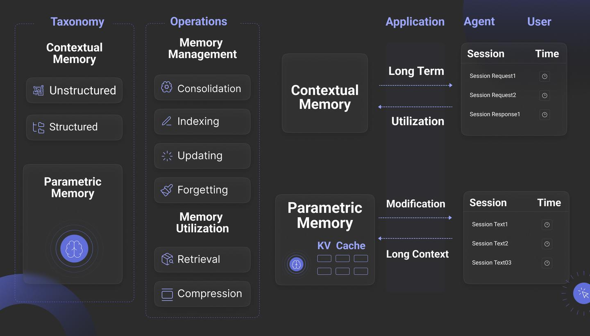
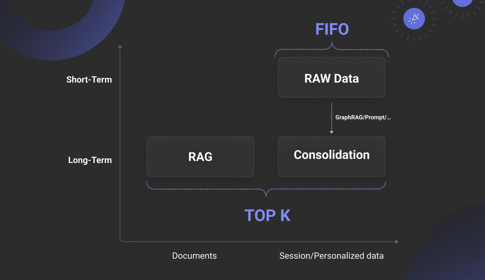

# Memory

> **RAG 是实现 Agent 长期记忆（特别是语义记忆）的核心技术之一，但 Agent 的记忆管理是一个比 RAG 更宏大、更复杂的系统工程。**

它不仅包括如何“检索”信息（RAG），还包括了信息如何**存储**、如何**分类**（分层记忆）、如何**总结与反思**（高阶认知），以及如何形成**技能**（程序性记忆）。而所有这些复杂的记忆操作，都离不开强大而便捷的 **Data Infra** 作为底层的支撑。

### 1. 什么是 Data Infra (数据基础设施)？

您可以将 **Data Infra** 理解为 **Agent 的“外接大脑”和“工具箱”**。

如果说 LLM 是 Agent 的核心“思考单元”，负责推理、规划和生成，那么它本身是“空有大脑，没有手脚”的，也记不住太久远的事情。而 Data Infra 就是赋予它“手脚”和“长期记忆”的一整套系统、工具和服务。

在您给出的语境中，Data Infra 主要包括：

- **数据库 (Databases):**
  - **关系型数据库 (如 Supabase 提供的 PostgreSQL):** 用于存储结构化信息，比如用户个人资料、订单历史、精确的规则或状态。就像一个 Agent 的“记事本”，记录着准确无误、需要严格查询的信息。
  - **NoSQL 数据库:** 用于存储更灵活、半结构化的数据。
  - **实时数据库/分析平台 (如 Rockset):** 允许 Agent 快速查询和分析海量实时数据，比如实时监控系统日志、分析用户行为流等。这给了 Agent “洞察动态世界”的能力。
- **向量数据库 (Vector Databases):**
  - 这是 RAG 的核心。它们存储的是信息的“含义”（通过向量嵌入），而非原始文本。这让 Agent 可以进行模糊的、基于语义的搜索。比如，当 Agent 需要回忆“上次我们聊到的那个关于太空探索的有趣想法”时，它会在向量数据库里搜索，而不是进行关键词匹配。
- **外部服务的接口 (APIs):**
  - 无论是调用天气查询、股票交易、还是发送邮件，这些外部工具的接口都属于 Data Infra 的一部分。它们是 Agent “与世界互动”的触手。

**总结一下：**

> **一句话比喻：** 如果 Agent 是一个顶级大厨 (LLM)，那么 Data Infra 就是他的整个厨房——包括了存放食材的**冰箱 (数据库)**、记录食谱的**卡片索引 (向量数据库)**，以及可以下单采购的**电话 (API Tools)**。

因此，原文说“RAG 和诸多 Data Infra 的地位似乎等同”，是非常精准的。从 Agent 的视角看，无论是调用一个向量数据库来“回忆”知识（RAG），还是调用一个 SQL 数据库来查询用户信息，或调用一个天气 API，本质上都是在**调用一个外部工具 (Tool)** 来获取信息，以增强其上下文 (In-Context Learning) 的内容，从而做出更好的决策。

------

### 2. Agent 的记忆管理已经进化到什么程度了？

这是目前 Agent 技术层面最核心、最活跃的研究方向之一。Agent 的记忆已经远远超出了“把聊天记录存起来”的范畴，进化出了一个类似于人脑记忆机制的、复杂的多层次体系。

我们可以将其分为以下几个层次：

#### 层次一：短期记忆 (Short-Term Memory)

- **是什么：** 这就是 LLM 的**上下文窗口 (Context Window)**。Agent 当前对话的所有内容、最近调用的工具结果，都会被放进这个窗口里。
- **特点：** 读取速度极快，LLM 可以直接利用里面的全部信息进行推理。但它的容量有限、成本高昂，并且是“易失性”的，对话一旦结束或窗口满了，最早的信息就会被遗忘。
- **进化程度：** 主要依赖于 LLM 本身的进化（比如从 4K 窗口进化到 200K 甚至 1M 窗口），框架层面的工作不多。

#### 层次二：长期记忆 (Long-Term Memory) - 核心进化区

这是当前所有 Agent 框架发力的重点，也是您问题中“技术层面的工作”的核心体现。它主要通过各种 **Data Infra** 来实现。

**1. 感知记忆 / 原始记忆流 (Sensory Memory / Raw Memory Stream):**

- **是什么：** Agent 将所有经历的原始信息，比如完整的对话历史、观察到的环境变化、工具调用的结果，不加处理地存入一个“记忆流”中。通常存储在传统的数据库或日志文件中。
- **进化程度：** 技术上最简单，但为后续的记忆处理提供了原始材料。

**2. 情感/语义记忆 (Semantic Memory):**

- **是什么：** 这就是 **RAG 发挥核心作用**的地方。Agent 会将原始记忆进行处理，提取出关键信息、知识片段、对话摘要，然后将它们**向量化**后存入向量数据库。当 Agent 需要回忆某个概念或过去的经验时，它会用当前的问题作为查询，去向量数据库里进行语义搜索，找到最相关的记忆片段。
- **进化程度：** 这是目前最成熟、应用最广的长期记忆形式。OpenAI 对 Rockset 的收购（增强实时 RAG）和对 Supabase 的投资（其 pgvector 插件）都是在强化这个能力。

**3. 反思性记忆 (Reflective Memory):**

- **是什么：** 这是 Agent 记忆管理的**“高阶认知”**。Agent 不再只是被动地存储和检索信息，而是会像人一样“反思”和“总结”。它会周期性地扫描自己的原始记忆流，问自己一些高层次的问题，比如：“我从最近的几次任务中学到了什么？”“我和用户 A 的主要互动模式是什么？”。
- **如何实现：** 它会将这些反思和总结出的“高层见解”或“经验法则”也存入向量数据库。
- **进化程度：** 这是区分高级 Agent 和普通 RAG 系统的关键。例如，Google DeepMind 的研究和一些开源框架（如 Langroid）已经开始实现这种机制。这让 Agent 能够从经验中学习和成长，而不仅仅是重复检索。

**4. 程序性记忆 (Procedural Memory):**

- **是什么：** 记忆“如何做某事”的流程和技能。Agent 通过与工具的交互，可以学习到完成某个复杂任务需要分几步、每一步调用什么工具。比如，学习到“预订一张机票”需要先查询航班、再选择座位、最后支付。
- **如何实现：** 通常通过存储和优化“工具调用序列”或“任务计划”来实现。当遇到类似任务时，可以直接调用这个“记忆”中的流程。
- **进化程度：** 正在快速发展，是实现复杂任务自动化（Automation）的核心。

# RAG vs 语义记忆

> 问：关于RAG，它在最开始提出来的时候解决的问题应该是突破LLM本身的知识的局限，通过接入外部知识库，来让LLM应用可以回答一些需要专业/私有知识的问题。但是最近的RAG，好像是不是更多地用于长期记忆的管理了。这应该是RAG应用的两个主要方面吧？

**RAG 是一种技术模式**。我们可以用它来构建“知识问答模块”，也可以构建“记忆模块”。我们通常不会在记忆模块的命名中包含“RAG”字眼，但我们会说“这个记忆模块是通过 RAG 的方式来实现的”。

### 方面一：作为“外部知识库”的 RAG (The "Librarian" RAG)

这确实是 RAG **最初的、最经典的应用场景**。它被设计出来的核心目的，就是为了解决 LLM 的三大固有缺陷：

1. **知识的局限性：** 模型的知识停留在某个训练截止日期，对新发生的事情一无所知。
2. **事实的不可靠性（幻觉）：** 当被问到其知识范围外或模糊的问题时，LLM 可能会“一本正经地胡说八道”。
3. **知识的私有性：** 模型没有学习过任何特定企业、组织或个人的私有数据，比如公司的内部文档、项目代码库、个人笔记等。

在这种模式下，RAG 扮演的角色就像一个**“带着图书管理员的开卷考试”**。

- **LLM** 是考生。
- **外部知识库**（公司的 PDF、网站、数据库等）是教科书。
- **RAG 的检索器 (Retriever)** 就是那位能根据问题，迅速帮你从堆积如山的教科书中找到最相关页面的图书管理员。

LLM 不需要记住所有知识，只需要在回答问题前，先看一眼“图书管理员”递过来的“参考资料”，就能做出精准、有据可依的回答。这是 RAG 最基础也是最广泛的应用。

### 方面二：作为“长期记忆”的 RAG (The "Memory" RAG)

这是 RAG 在 **Agent 时代**被赋予的**新的、更高级的使命**。

当 LLM 不再只是一个“问答机器人”，而是要成为一个能够执行复杂任务、可以与用户进行多轮、长期交互的 **Agent** 时，一个全新的问题就出现了：**Agent 如何记住过去发生的事情？**

- 如何记住用户的偏好？（“老样子，咖啡要燕麦奶”）
- 如何记住上一次对话的结论，以便这次接着聊？
- 如何记住自己从过去的成功或失败任务中学到的经验？

LLM 的短期记忆（上下文窗口）显然无法满足这种长期的、动态的需求。而人们很快发现，RAG 的核心机制——**将信息向量化存储，并通过语义相似度进行检索**——完美地契合了“回忆”这个动作。

在这种模式下，RAG 扮演的角色更像 **Agent 的“个人日记”或“海马体”**。

- **被存储的内容不再是外部的、静态的知识**，而是 Agent 在与世界互动中产生的**动态的、个性化的经验**。
- 当 Agent 面对新情况时，它会先“自省”一下，用 RAG 检索自己的“记忆库”，看看“我以前是否处理过类似的情况？”或者“关于这个用户，我有什么需要记起来的特别信息？”。

这将 Agent 的能力从“博学”提升到了“有经验”。

------

### 总结：一体两面，从“读书”到“读自己”

所以，您的总结非常精辟。我们可以这样理解这两种应用的关系：

| 特性         | **知识库 RAG**                  | **记忆 RAG**                           |
| ------------ | ------------------------------- | -------------------------------------- |
| **目标**     | 解决知识局限，确保事实准确      | 赋予 Agent 连续性、个性化和成长能力    |
| **数据源**   | 外部的、静态/半静态的文档、数据 | Agent 自身产生的、动态演化的经验、对话 |
| **角色比喻** | **开卷考试的图书管理员**        | **个人日记与海马体**                   |
| **核心动作** | **“去读书” (Read the book)**    | **“去读自己” (Read the self)**         |

在复杂的 Agent 系统中，这两个方面的 RAG 往往是**同时存在**的。

一个高级客服 Agent 在回答用户问题时，可能会：

1. **先调用“记忆 RAG”**：检索与该用户的历史对话，回忆起用户的身份、历史问题和情绪。（“读自己”）
2. **再调用“知识库 RAG”**：根据当前问题，从最新的产品手册中检索标准的解决方案。（“读书”）
3. **最后**，LLM 结合这两部分信息，生成一个既有标准答案、又富有个性化关怀的回复。

您的观察非常敏锐，这确实是理解当前 RAG 技术发展的关键视角。它已经从一个简单的“外挂知识库”插件，演变成了构建智能体长期记忆和认知能力的基石。

# Agent 记忆系统深度解析

Agent 的记忆系统是一个复杂的、多层次的生命周期管理系统，而**不仅仅是一个数据存储**。它的核心任务是高效地**编码、存储、索引、检索、更新和遗忘**信息，从而为 Agent 的决策提供持续、相关的上下文。RAG 是实现其**长期记忆检索**功能的核心技术模式，但整个记忆系统所包含的范畴远大于 RAG。

------

#### **一、 记忆的分类法 (Taxonomy) 与核心操作 (Operations)**

这张图（第一张图）为我们提供了一个宏观的架构蓝图，将记忆系统分解为“是什么”（分类）和“做什么”（操作）。

##### **1. 记忆的两大基本类型 (Taxonomy)**

- **上下文记忆 (Contextual Memory):**
  - **定义:** 这是指存储在 LLM **外部**的记忆，是 Agent 的“外接硬盘”或“云端大脑”。它包含了所有可以通过检索等方式加载到上下文中的信息。
  - **构成:**
    - **非结构化 (Unstructured):** 如原始对话记录、PDF 文档、网页内容等。
    - **结构化 (Structured):** 如用户信息表、知识图谱、数据库记录等。
  - **特点:** 容量几乎无限，可以持久化保存，但需要高效的检索机制（如 RAG）来访问。我们之前讨论的长期记忆主要就属于这一类。
- **参数化记忆 (Parametric Memory):**
  - **定义:** 这是指编码在 LLM **内部**的记忆。它不是通过外部检索，而是直接通过模型自身的参数（权重）或在推理过程中产生的状态来体现的。
  - **构成:**
    - **模型权重:** LLM 在训练过程中学到的“世界知识”，这是最底层的参数化记忆。
    - **KV Cache:** 在生成每个 token 时，为避免重复计算而缓存的键值对。它本质上是模型对当前上下文的“瞬时理解和压缩”，是一种**重量级的、与推理引擎紧密绑定的短期记忆**。
  - **特点:** 读取速度极快，与模型推理融为一体，但容量有限，且通常是“易失性”的（随会话结束而消失）。

##### **2. 记忆管理的六大核心操作 (Operations)**

这六个操作定义了记忆系统的完整生命周期，让记忆“活”了起来。

- **① Indexing (索引):**
  - **拓展解释:** 这不仅是存储，更是为了“能被找到”而组织数据。它强调的是**搜索能力**，特别是实时搜索。当新的会话数据（Session Data）进入短期记忆后，必须能被立刻索引，以便 Agent 能基于这些最新信息进行上下文相关的搜索。例如，搜索“刚才提到的那个技术名词是什么？”。实现方式包括向量索引、关键词索引、图索引等。
- **② Forgetting (遗忘):**
  - **拓展解释:** “遗忘”是高级记忆系统不可或缺的主动能力。其价值在于：
    - **认知聚焦:** 像人一样，忘记不重要的信息可以更好地专注于关键信息，避免信息过载。
    - **性能保证:** 从技术上讲，一个更小、更精准的索引库可以显著提升搜索速度和准确度。
    - **合规与隐私:** 能够按规则（如 GDPR）遗忘用户数据。
    - 实现方式通常包括设置数据的生命周期（TTL）、基于相关性评分淘汰低价值记忆等。
- **③ Consolidation (整合/巩固):**
  - **拓展解释:** 这是从“原始数据”到“结构化知识”的关键一步，是记忆从量变到质变的过程。它模仿人类通过“写日记”和“做总结”来巩固记忆。
  - **技术关联:** 这与 **GraphRAG** 或更广义的**知识提取**技术紧密相关。具体做法是：**周期性地或在会话结束后，调用 LLM 来处理短期记忆中的原始数据（Raw Data），从中提取关键实体、关系、摘要、用户意图等，然后将这些高度浓缩的“知识”或“笔记”存入长期记忆的知识图谱或结构化数据库中**。这使得未来的检索不仅能找到原始片段，还能利用这些结构化的“知识”进行更复杂的推理。
- **④ Updating (更新):** 比较好理解，即对已有的记忆进行修改或补充，确保其时效性。
- **⑤ Retrieval (检索):** 记忆系统的核心出口，即根据查询从记忆库中找到最相关的信息。
- **⑥ Compression (压缩):** 指通过摘要、降维等方式减小记忆占用的空间，提升效率。

------

#### **二、 RAG 在记忆系统中的真实定位**

第二张图清晰地展示了 RAG 在整个记忆数据流中的位置。

- **短期记忆 (Short-Term):**
  - **内容:** 主要是高时效性的**原始数据 (RAW Data)**，如实时会话（Session）、用户的个性化信息等。
  - **管理方式:** 通常采用 **FIFO (先进先出)** 策略，因为最新的对话通常最重要。
- **长期记忆 (Long-Term):**
  - **内容:** 包含两部分：
    1. 外部导入的**文档 (Documents)**，这是传统 RAG 的知识库。
    2. 从短期记忆中通过 **Consolidation (整合)** 沉淀下来的**高价值个性化数据**。
  - **管理方式:** 采用 **TOP K (最相关 K 个)** 的检索方式，这正是 **RAG** 发挥作用的地方。RAG 作为长期记忆的“搜索引擎”，负责从海量的、经过处理的记忆中，精准地捞取最相关的信息。

**结论:** RAG 是**长期记忆系统的核心检索组件**。一个没有高效 RAG 的记忆系统，就像一个没有搜索引擎的图书馆，只是一个无法利用的数据仓库，是“空中楼阁”。

------

#### **三、 深度洞察：两种记忆，两种注意力机制**

这是您分享的文字中最深刻的洞见，它将记忆的实现方式与 Transformer 的核心原理——注意力机制，关联了起来。

- **以 RAG 为依托的上下文记忆 = 稀疏注意力 (Sparse Attention)**
  - **原理:** Agent 在决策时，并不会“看到”记忆库中的所有内容。RAG 的检索器（Retriever）扮演了注意力筛选的角色，从庞大的记忆库（可能是数百万个信息片段）中，只挑选出最相关的少数几个（Top K）片段。
  - **效果:** LLM 的注意力被“稀疏地”集中在这些被检索出的关键信息上。这是一种**高效、可扩展**的注意力机制，让 LLM 具备了近乎无限的上下文能力。
- **以 KV Cache 为依托的参数化记忆 = 稠密注意力 (Dense Attention)**
  - **原理:** 在标准的 Transformer 推理中，上下文窗口内的每一个 Token 都要和所有在它之前的 Token 计算注意力分数。
  - **效果:** 这是一种“稠密”的连接，模型在每一步都审视了当前窗口内的全部历史信息。这种方式**信息保真度最高，但计算成本极高**，并且受限于上下文窗口的物理长度。

**核心观点:** 从信息论的角度看，这两种记忆技术并**没有绝对的高下之分**。它们都是为了给 LLM 提供决策所需的上下文，本质上都是注意力机制的应用。它们代表了在**效率、成本和信息保真度**这个“不可能三角”中的不同取舍和权衡。

