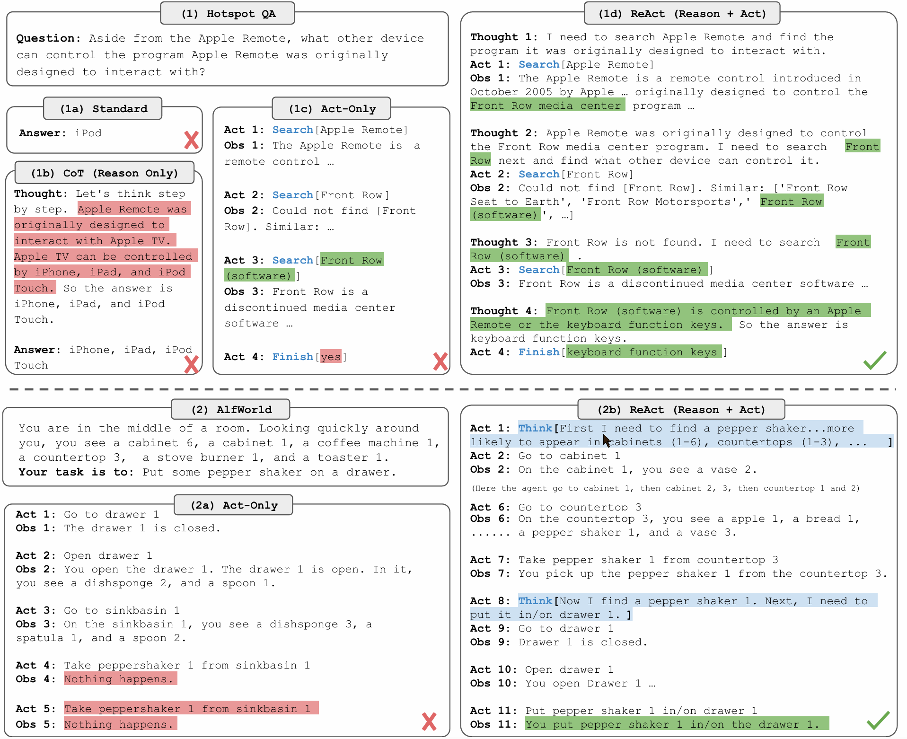

# ReAct 论文

**CoT推理**：LLM 具有强大推理能力的一种体现，但是这种推理是一种黑盒，只在内部进行。这种无法与外界交互的推理，容易出现**幻觉**或是**错误累积**。

**ReAct推理**：把LLM的语言推理与交互式决策结合起来（SYNERGIZING REASONING AND ACTING —— 协同推理与行动），从而使得LLM能够发挥出更强大的**交互式推理**能力，能够解决更抽象更复杂的推理问题。

## Act-Only -> ReAct Agent 的模式演进

简单来说，论文核心思想在讲：**传统 AI Agent 只会“做”，而 ReAct 框架让 AI Agent 在“做”之前，先学会“想”**。这种“先想后做”的模式，让 AI 变得更聪明、更强大、也更容易让人理解。

### 1. 传统 AI Agent 的困境 (The Problem)

首先，论文描述了传统的智能体（Agent）是如何工作的。

- **基本模式**: 在一个时间点 t，Agent 看到一个**观察** (Ot)，然后根据它看到的所有历史信息（**上下文** Ct），决定要采取一个**行动** (At)。这个过程就像你玩游戏：你看到屏幕上的画面（观察），然后根据你之前的操作和画面，决定下一步按哪个键（行动）。**而每次的决策，Agent所参考的上下文是先前多轮“观察 - 行动” + 当前“观察”。也就是说，Agent需要从历史“观察-行动“记录以及当前”观察“，直接推理决策出当前的行动。**
- **挑战所在**: 这个模式的难点在于，有时候从“观察”到“行动”的跨度太大了，需要非常复杂的推理。论文举了两个例子来说明这个困境：
  1. **复杂问答 (Figure 1(1c))**: Agent 在回答一个问题前，需要先搜索、再搜索、再整合信息。如果它不能在脑子里形成一个清晰的推理链条，就可能在最后一步卡住，无法给出正确答案。它缺少一个“思考”的过程来连接零散的信息。
  2. **产生幻觉 (Figure 1(2a))**: Agent 被要求在一个虚拟厨房里找胡椒瓶。它看到水槽里没有胡椒瓶，但它的“脑子”没转过来这个弯，还在不停地生成“从水槽里拿出胡椒瓶”这种不存在的、凭空想象的（hallucinating）动作。

#### **小结**

传统的 Agent 是一个头脑简单的“行动派”，缺乏“思考”能力，其在做出决策时脑子里面（上下文）只参考了前面几步的“观察-行动”的**“行动日志”**，这会导致：

1. 之前每一步的行动**不具有解释性**，当任务线拉长时，到后面Agent都不知道前面为什么做出那些动作，就更难决策出当前该做的正确动作；
2. 在复杂任务中容易犯错或卡住。

------

### 2. ReAct 的核心思想：引入“思考”作为一种行动 (The Solution)

为了解决上面的问题，ReAct 提出了一个非常巧妙且简单的想法。

- **扩展行动空间**: ReAct 扩展了 Agent 能做的事情。原本 Agent 的**行动空间 A** 只包含那些能对外部环境产生影响的动作（比如“搜索”、“点击”）。ReAct 在此基础上增加了一个**语言空间** L，形成了一个新的行动空间 A′=A∪L。（所谓”语言空间“其实就是语言模型的思考能力，这就是在给传统Agent赋予思考能力）
- **“思考”也是一种行动**: 在这个语言空间里的行动，论文称之为**“思考” (thought)** 或**“推理轨迹” (reasoning trace)**。
  - **特点**: 这种“思考”行动**不会改变外部环境**。比如 Agent 生成一句内心独白：“嗯，第一步我应该先搜索一下 ReAct 论文的作者”，这个想法本身不会让浏览器打开。
  - **作用**: “思考”的目的是帮助 Agent **梳理信息、制定计划、更新自己的思路**。这个“想法”会作为新的信息加入到上下文 Ct 中，变成 Ct+1，从而指导下一步是继续思考还是采取一个实际的行动。
- **“思考”能做什么**: 论文列举了“思考”的多种用途，比如：
  - 分解任务，制定计划 (e.g., "要回答这个问题，我需要先做什么，再做什么")
  - 引入常识 (e.g., "苹果是一种水果，它通常是红色的")
  - 从观察中提取关键信息 (e.g., "搜索结果的第一条看起来最相关，我应该点进去看看")
  - 跟踪任务进度 (e.g., "我已经完成了第一步，现在进行第二步")
  - 处理意外情况，调整计划 (e.g., "这个链接打不开，我需要换一个关键词重新搜索")

#### **小结**

ReAct 的核心就是让 LLM 学会“自言自语”或“打草稿”。这个过程虽然不直接改变世界，但能极大地帮助它理清思路，从而做出更合理、更有效的实际行动。这就形成了一个 **观察 -> 思考 -> 行动** 的强大循环。加入思考环节的关键改变就是，使得 Agent 的每一步行动决策所参考的，是完整的历史”观察 - 思考 - 行动“日志记录，而 Agent 可以从这个日志中观察到历史思考/推理历程，对于当下做出正确决策具有很大帮助。

这个循环感官上让人觉得和CoT很接近（CoT思考过程看起来也是一步一步逐步进行），但是实际上CoT并不是一个循环，而只是一次性的内部思考。这个思考过程是没有和外界或是外部环境的交互的，类似人类的”冥思苦想“。而 ReAct Agent 类似于人类在思考的过程中，不断通过查找、询问、计算等外界交互的方式，来不断验证推进自己思考的过程。

------

### 3. 如何实现 ReAct (The Implementation)

理论很棒，但怎么让模型学会这种“思考”呢？

- **不重新训练**: ReAct 并不需要从头训练一个模型。它利用的是已经非常强大的、**“冻结”的 (frozen)** 大语言模型（LLM），比如论文里用的 PaLM-540B。“冻结”意味着模型的参数是固定不变的。

- **使用提示工程 (Prompting)**: 实现的关键在于**“少样本上下文示例” (few-shot in-context examples)**。这就像是给模型几个“范例”让它模仿。
  
  - 具体做法是，在正式向 LLM 提问前，先在提示（Prompt）里写下 1 到 6 个由人类专家完成的、包含**“思考-行动-观察”**完整轨迹的例子。
  
  - LLM 在看到这些范例后，就学会了这种工作模式。当它接到新任务时，就会自动模仿这种模式，在生成实际行动指令之前，先生成一段“思考”文本。
  
  - 提示词示例（LangChain实现）：
  
    ```python
    from langchain_core.prompts import PromptTemplate
    
    template = '''Answer the following questions as best you can. You have access to the following tools:
    
    {tools}
    
    Use the following format:
    
    Question: the input question you must answer
    Thought: you should always think about what to do
    Action: the action to take, should be one of [{tool_names}]
    Action Input: the input to the action
    Observation: the result of the action
    ... (this Thought/Action/Action Input/Observation can repeat N times)
    Thought: I now know the final answer
    Final Answer: the final answer to the original input question
    
    Begin!
    
    Question: {input}
    Thought:{agent_scratchpad}'''
    
    prompt = PromptTemplate.from_template(template)
    ```
  
- **两种模式**:
  
  1. **交替模式**: 对于主要工作是反复思考推理的任务，强制模型按照“思考 -> 行动 -> 观察 -> 思考 -> 行动...”的节奏来。
  2. **异步模式**: 对于网页导航这种重行动（只需要关键、稀疏思考）的任务，让模型自己决定什么时候需要停下来“想一想”，什么时候可以连续“做动作”。

------

###  4. ReAct 的优点 (The Benefits)

最后，论文总结了 ReAct 框架的四大优点 (A, B, C, D)：

- **A) 直观易设计 (Intuitive and easy to design)**: 创建范例很简单，只需要让人类在执行任务时，顺便把自己的想法写下来就行了，非常自然。
- **B) 通用且灵活 (General and flexible)**: 因为“思考”是用自然语言进行的，所以这个框架能适用于各种各样的任务，从问答到玩游戏，再到网页操作。
- **C) 性能好且稳健 (Performant and robust)**: 即使只给很少的范例，ReAct 的表现也远超那些只会“思考”（只推理不行动）或只会“行动”（只行动不推理）的基线模型。
- **D) 对齐人类且可控 (Human-aligned and controllable)**: 这是非常重要的一点。因为我们可以看到模型的每一步“思考”，所以它的决策过程是透明的、可解释的。如果发现它的想法跑偏了，人类甚至可以中途干预，修改它的“想法”，从而引导它走上正确的道路。


## Act-Only/ReAct Agent 模式深入剖析



> 问：论文中提到的那种 Act-only ，是不是每次的行动也是通过把当前所有上下文喂给LLM，然后LLM做出的行动？但是这个过程中LLM不是也有思考和推理吗？这怎么算是 Act Only 呢？
>
> 答：这是一个非常深刻且关键的问题！你说的完全正确，即使是在 “act-only” 模式下，当 LLM 接收所有上下文并输出一个行动时，它的内部毫无疑问地进行了复杂的计算和“思考”。你所指出的，正是一个看似矛盾但实际上是理解 ReAct 核心价值的关键点。这个矛盾可以通过区分 **“隐性推理” (Implicit Reasoning)** 和 **“显性推理” (Explicit Reasoning)** 来完美解释。

### **1. 核心洞察：根本区别在于“上下文”的构成**

经过深入思考，ReAct 与 Act-only 两种 Agent 模式最根本的区别，不在于大语言模型（LLM）是否在内部进行了“思考”，而在于其“思考”过程是否被**显性化 (Explicit)、结构化地记录下来，并成为 Agent 工作记忆（即上下文 Context）的一部分**。

- **Act-only 模式**：LLM 的推理是**隐性 (Implicit)** 的。上下文只记录了外部的“行动”(`Action`)和“观察”(`Observation`)序列，形成了一本**行动日志**。
- **ReAct 模式**：LLM 的推理是**显性 (Explicit)** 的。它强制模型在决定行动前，先生成一段“思考”(`Thought`)文本。这个 `Thought` 连同 `Action` 和 `Observation` 一起被存入上下文，形成了一本详尽的**决策日记**。

正是这种上下文构成的差异，导致了两种模式在处理复杂、多步任务时性能的巨大分野。

### **2. Agent 模式的循环机制回顾**

为了更好地理解上下文的差异，我们首先回顾两种模式的伪代码循环：

**2.1 Act-only 模式 (反应式循环)**

```python
context = "Initial Task"
while True:
    action = LLM(context)  # 直接决策行动
    observation = execute(action)
    context += f"\nAction: {action}\nObservation: {observation}" # 只记录行动和观察
    if task_is_done(action):
        break
```

**2.2 ReAct 模式 (思考-行动-观察循环)**

```python
context = "Initial Task"
while True:
    # LLM 一次性生成思考和行动
    thought_and_action = LLM(context) 
    thought = parse_thought(thought_and_action)
    action = parse_action(thought_and_action)
    
    observation = execute(action)
    # 将思考、行动、观察全部记录
    context += f"\nThought: {thought}\nAction: {action}\nObservation: {observation}" 
    if task_is_done(action):
        break
```

### **3. 关键区别：上下文历史的实例对比**

> 上下文构成的区别在上面论文的图中其实就已经能看出来了——每次实际Act之前，都有一步 Think 动作。

这是理解两者差异最直观的部分。假设我们的任务是：**“《星际穿越》的导演是谁？他还有哪些评分超过8.5的电影作品？”**

**3.1 Act-only 模式的上下文历史 (行动日志)**

在 Act-only 模式下，整个交互历史可能如下所示。注意，历史记录中没有任何关于“为什么”的线索。

```
User: 《星际穿越》的导演是谁？他还有哪些评分超过8.5的电影作品？
---
> Action: search(query="《星际穿越》的导演")
> Observation: 克里斯托弗·诺兰
---
> Action: search(query="克里斯托弗·诺兰 评分超过8.5的电影")
> Observation: 返回结果列表：['《黑暗骑士》', '《盗梦空间》', '《致命魔术》']
---
> Action: finish(answer="《星际穿越》的导演是克里斯托弗·诺兰。他评分超过8.5的电影作品有《黑暗骑士》、《盗梦空间》和《致命魔术》。")
```

- **分析**：这个上下文非常简洁，但也很“脆弱”。如果第二步搜索失败或返回无关信息，LLM 很难从这个贫瘠的上下文中分析出失败原因并进行有效纠错。它必须完全依赖其内部的、不可见的推理能力来连接步骤1和步骤2。

**3.2 ReAct 模式的上下文历史 (决策日记)**

在 ReAct 模式下，同样的任务会生成一个信息丰富得多的上下文。

```
User: 《星际穿越》的导演是谁？他还有哪些评分超过8.5的电影作品？
---
> Thought: 用户的任务包含两个关联的问题。我需要先找出《星际穿越》的导演，然后用导演的名字去查找他符合条件的其他电影。第一步，先搜索导演。
> Action: search(query="《星际穿越》的导演")
> Observation: 克里斯托弗·诺兰
---
> Thought: 好的，我已经找到了导演是克里斯托弗·诺兰。现在我需要进行第二步，搜索他的其他高分电影。我会使用他的名字和评分条件来构建搜索查询。
> Action: search(query="克里斯托弗·诺兰 评分超过8.5的电影")
> Observation: 返回结果列表：['《黑暗骑士》', '《盗梦空间》', '《致命魔术》']
---
> Thought: 我已经成功获取了所有需要的信息：导演的名字和他所有评分超过8.5的电影。现在我可以整合这些信息，形成最终的答案并结束任务。
> Action: finish(answer="《星际穿越》的导演是克里斯托弗·诺兰。他评分超过8.5的电影作品有《黑暗骑士》、《盗梦空间》和《致命魔术》。")
```

- **分析**：这个上下文不仅记录了**“做了什么”**，更重要的是记录了**“为什么这么做”**。`Thought` 文本为 Agent 提供了强大的**自我引导能力**。它清晰地展示了任务规划、中间步骤的确认和最终的整合策略。这种丰富的上下文使得 Agent 在面对意外情况（如API返回错误）时，能够更好地理解当前所处的任务阶段，从而进行调整和纠错。

### **4. 总结与启发**

现代支持工具调用的 LLM，其设计本身就在鼓励一种类 ReAct 的交互模式——即在输出结构化指令的同时，也输出解释性的自然语言。

总结来说，ReAct 框架的威力源于它将 Agent 的**工作记忆（上下文）从一个简单的“行动日志”升级为了一个包含元认知（Metacognition）的“决策日记”**。这种高质量、信息丰富的上下文，为 LLM 在多步、复杂的任务中进行可靠的规划、执行和动态调整提供了必要的信息支架（Scaffolding），是其实现更高性能和鲁棒性的关键所在。