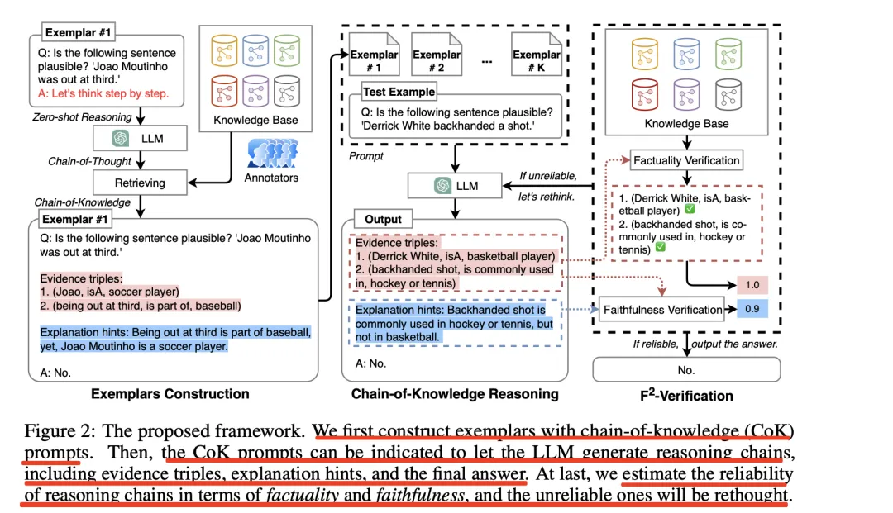

# 提示词工程

## 基础技巧：为模型提供范例

### **① 少样本提示 (Few-Shot Prompting)** 🎯

- **核心思想**: 这是教导模型如何行动的“示范教学法”。在提出你的真正问题之前，先给模型看几个完整的“问题-答案”范例。
- **详细说明**: 与“零样本”（直接提问）和“单样本”（给一个例子）相对，少样本（通常2-5个例子）能极大地帮助模型锁定任务的**模式**。它能学会你想要的答案**格式**（比如JSON）、**风格**（比如正式或口语化）和**逻辑**（比如分类或情感分析）。这是在不进行模型微调的情况下，定制化模型输出最有效的基础方法。

## 核心推理：让模型学会思考

### **② 思想链 (Chain-of-Thought, CoT)** 🚂

- **核心思想**: 与其让模型直接给出答案，不如通过“一步一步地思考”这样的指令，引导它输出一个详细的、线性的推理过程。
- **详细说明**: 这是提示工程领域的一个里程碑。它揭示了大型语言模型内部的推理潜力。通过将一个复杂问题分解为一系列中间步骤，CoT 不仅能显著提高模型在算术、常识和符号推理任务上的准确率，也让模型的“思考过程”变得透明和可审查，方便我们调试和纠错。

## 增强与优化：提升答案的稳定与可靠性

### **③ 自洽性 (Self-Consistency)** 🗳️

- **核心思想**: CoT 的一种增强策略，通过“集体智慧”来提高答案的可靠性。它会多次运行同一个 CoT 提示，并采用“少数服从多数”的原则对所有答案进行投票。
- **详细说明**: 实现上，它需要在调用API时将 `temperature` 参数设为大于0的值，以引入多样化的输出。然后，程序会循环调用模型，收集每个最终答案。这个方法的核心假设是：通往正确答案的推理路径有很多条，而通往错误答案的路径则更随机、更分散。因此，在多次尝试中，正确的答案最有可能成为共识。它的主要成本是增加了时间和token消耗。

### **④ 生成知识 (Generated Knowledge)** 📝

- **核心思想**: 在回答一个需要特定知识的问题前，先让模型自己生成一段关于这个主题的“背景知识”或“备忘录”，然后再根据这些知识来回答原始问题。
- **详细说明**: 这是在没有外部知识库时，一种“自力更生”的 RAG 模式。它能有效减少模型在回答复杂或创意性问题时的“幻觉”，因为它强迫模型先构建一个事实基础（即使这个基础来源于模型自身），然后再进行推理或创作，从而让最终的答案细节更丰富、逻辑更连贯。

## 复杂问题分解

### **⑤ 由简到繁 (Least-to-Most)** 🪜

- **核心思想**: 将一个复杂的大问题，拆解成一系列相互依赖的、更简单的子问题，然后按顺序依次解决。
- **详细说明**: 这个方法模仿了人类解决问题的自然方式。关键在于，前一个子问题的答案会成为下一个子问题提示的一部分，为后续步骤提供必要的上下文。这是一种强大的问题分解策略，尤其适用于那些一个大问题可以被清晰地分解为多个小步骤的任务。

### **⑥ 自我提问 (Self-Ask)** 🙋

- **核心思想**: 这是“由简到繁”策略的一种自动化实现。模型会以“提问-回答”的循环来分解问题。它会先自己提出一个简单子问题，然后这个子问题可以交由工具（如搜索引擎）来回答，再基于工具返回的答案提出下一个问题，直到解决主问题。这个过程让推理链条非常清晰。

## 与世界交互：工具的使用

### **⑦ 程序辅助语言模型 (Program-Aided Language Models, PAL)** 🐍

- **核心思想**: 将 LLM 的自然语言理解能力与代码解释器的精确执行能力相结合。让 LLM 不直接计算答案，而是生成一段可以解决问题的代码（如 Python）。
- **详细说明**: PAL 的应用远不止数学计算。任何代码比 LLM 更擅长的任务，都可以用这种方式“外包”出去，例如：使用 `pandas` 库进行复杂的数据分析，或使用正则表达式进行精准的文本处理。这是一种非常可靠的克服 LLM 局限性的方法。

### **⑧ ReAct 范式 (Reason and Act)** 🤖

- **核心思想**: 一种经典的 Agent 基础架构，让模型在一个“思考-行动-观察”的循环中工作。
- **详细说明**: **思考 (Thought)** 阶段，模型进行类似 CoT 的推理，分析当前情况并制定计划。**行动 (Action)** 阶段，模型决定调用哪个工具以及使用什么参数。**观察 (Observation)** 阶段，模型接收工具返回的结果。这个循环使得 Agent 能够与外部世界互动，并根据反馈动态调整自己的计划，是实现真正自主智能体的基石。

### **⑨ 自动推理与工具使用 (ART)** 🧰

- **核心思想**: 一个更宏观的框架，它让 Agent 面对一个**从未见过**的新任务时，能从一个预设的“工具库”中，自动挑选出完成该任务所需要的工具，并生成使用计划。
- **详细说明**: ART 的核心在于“自动”和“泛化”。它通过在提示中提供工具的详细“说明书”，让模型学会自主规划。这使得 Agent 不再局限于一小撮预设的场景，而是能够灵活地组合和使用工具，去解决更多样化、更开放的问题。

## 高级推理架构：突破思想链的极限

### **⑩ 思维树 (Tree-of-Thought, ToT)** 🌳

- **核心思想**: 克服 CoT 线性推理的局限，允许模型在每一步都探索多个不同的推理路径，并对这些路径进行评估，选择最优路径继续。
- **详细说明**: 一个完整的 ToT 框架包含三个部分：**思考生成器**（提出多种可能性）、**状态评估器**（判断各种可能性的优劣）和**搜索算法**（决定探索路径，如最佳优先、广度优先/完全展开、集束搜索或蒙特卡洛树搜索）。它通过系统地探索和“剪枝”，在解决需要规划和前瞻性的复杂问题时，远比 CoT 强大。

### **⑪ 苏格拉底式提示 (Maieutic Prompting)** 🤔

- **核心思想**: 与 ToT 的广度探索不同，它追求的是“深度反思”。通过引导模型不断地解释和质疑自己的初步答案，来发现其中隐藏的矛盾或错误假设，从而实现自我修正。
- **详细说明**: 这个方法模拟了苏格拉底式的对话。它通过特定的提示（例如：“你的推理中是否存在不一致的地方？”）来触发模型的自我审查机制。这对于戳破模型基于错误常识或假设而得出的“看似正确”的答案非常有效。

## 元技术：关于提示本身的方法论

### **⑫ 迭代式提示 (Iterative Prompting)** ✍️

- **核心思想**: 这是一种**工作方法**，是所有提示工程师的基本功。它指的是“假设-测试-分析-优化”的循环，通过不断试错和改进，逐步打磨出一个高质量的提示。
- **详细说明**: 几乎没有任何一个复杂的提示是可以一步到位的。这个过程包括：增加细节、提供范例、明确角色、限定格式等等，是连接理论和实践的桥梁。

### **⑬ 元提示 (Meta-Prompt)** 👨‍🏫

- **核心思想**: 这是一种“用提示来生成提示”的高级技术。你构建一个包含“如何写好提示”的原则和指令的主提示，它能将用户输入的简单指令，自动扩展和优化成一个结构完整、效果出色的复杂提示。
- **详细说明**: 这个主提示本身就像一个内置的提示工程师。它知道要定义角色、阐明目标、给出格式要求、处理边缘情况等。这使得非专业用户也能通过简单的输入，获得专业级的提示效果。

# Some Thinking

> - 目的方面，我觉得各种提示词技术，都是为了克服LLM缺点或劣势，获得更优质回答。 
>
> - 用法方面，各种技术基本上都不是可以在单次对话中就能实现的，都需要设计合理的多轮对话，才能起作用。 
>
> - 发展趋势方面，有些技术的出现都不是偶然出现的，都是伴随着大模型生态中的某种技术一起出现的。例如agent的react范式的提出、模型工具调用能力的发展、RAG的发展，等等。

**目的：扬长避短** 

你说的完全正确。所有这些高级技巧，本质上都是在做一个事情：**让LLM做它最擅长的事（理解、推理、规划），同时把LLM不擅长的事（精确计算、事实核查、记忆）外包出去**。外包给代码（PAL），外包给外部知识库（RAG），或者通过多次思考来规避单次回答的不稳定性（自洽性）。

**用法：从“提示”到“策略”** 

你的观察也非常到位。简单的提示词工程是在单次对话中完成的，而我们讨论的这些高级技术，已经超越了“写一个好提示”的范畴。它们更像是一套**“工作流”或“策略”**，需要通过代码或多轮对话来精心编排，引导模型一步步走向正确答案。

**发展：与生态共演进** 

这一点是最有洞察力的。提示词工程不是孤立发展的。它和模型本身的能力（比如工具调用）、和周边的技术（比如向量数据库催生了RAG），以及和大家对Agent的想象（比如ReAct和ART）是紧密相连、相互促进的。