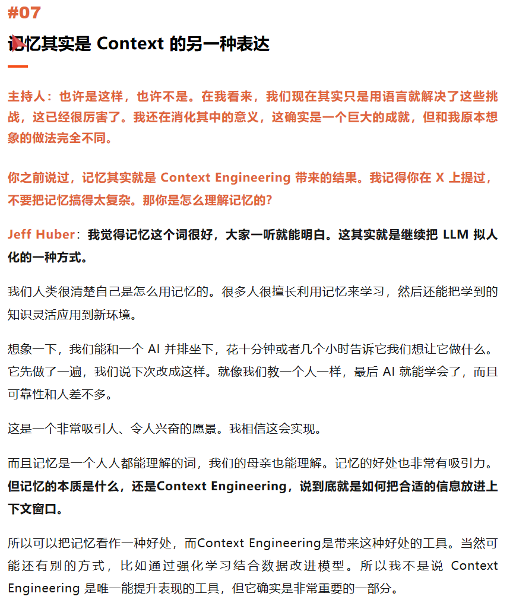
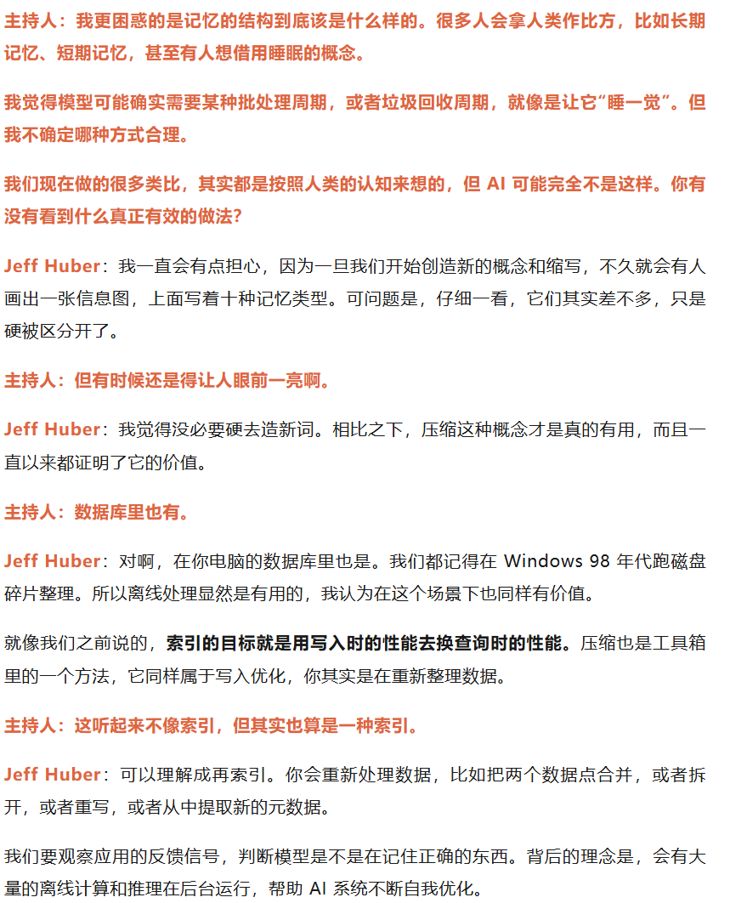
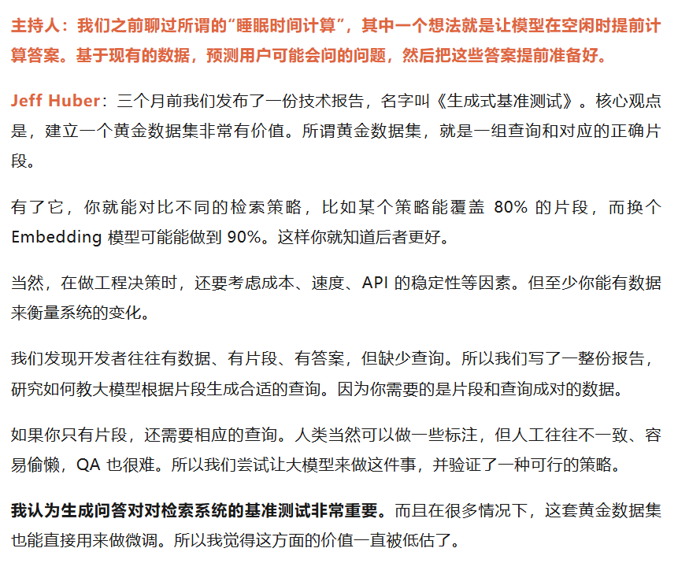

# 论文idea

### CoT 在 Agent 的简单子任务中是否“杀鸡用牛刀”？

您的这个判断是**完全正确的**，并且这正是 **Agent 优化领域（Agent Optimization）最前沿的研究方向**。

在一个已经被分解的 Agent 流程中，很多子任务确实非常简单（例如，“从这段文本中提取出人名”、“将这个数字乘以2”）。在这些步骤中，强行让模型进行一次长篇的 CoT 推理，确实是**“性能浪费”**，收益远小于其带来的延迟和成本。

那么，如何解决这个问题？这正是能体现您技术深度的地方，也是极佳的毕业设计创新点来源。

---

**前沿的解决方案：从“固定思考”到“自适应思考”**

为了解决“CoT 杀鸡用牛刀”的问题，业界正在探索以下几种更智能的 Agent 认知架构：

**1. 层级化模型架构 (Hierarchical Model Architecture):**

- **思想：** 这是“规划-执行”范式的进一步延伸，引入了不同“级别”的思考者。
- **做法：**
  - **规划器 (Planner):** 使用一个强大的、昂贵的、始终开启 CoT 模式的模型（如 GPT-5 级别），**只负责在最高层次进行宏观规划和复杂决策**。
  - **执行器/工具调用器 (Executor/Tool-Caller):** 使用一个极小的、便宜的、速度飞快的模型（例如，一个经过微调的 Llama-3-8B 或更小的模型），**默认不使用 CoT**。它只负责执行规划器下达的简单指令，并直接输出 Action JSON。
- **效果：** 将高昂的“CoT 税”限制在少数几次关键的宏观思考上，而大量的简单执行步骤则以极低的成本和延迟完成。

**2. 自适应 CoT (Adaptive CoT):**

- **思想：** 赋予 Agent **自主判断“当前任务是否需要深度思考”** 的能力。
- **做法（MCP 范式的完美应用）：**
  - 在 Agent 的控制器（Controller）中，设计一个**“预处理”节点**。
  - 这个节点会先调用一个极小的、快速的“任务复杂度分类”模型，来判断下一步的任务是“简单”还是“复杂”。
  - **`if task == "简单":`** 则调用主模型时，使用一个“直接输出 Action”的“快车道”Prompt。
  - **`if task == "复杂":`** 则调用主模型时，才使用我们之前讨论的、要求详细 CoT 的“慢车道”Prompt。
- **效果：** 实现了对思考资源的“按需分配”，在保证效果的同时，极大地优化了平均响应时间和成本。**这本身就是一个极好的、具有很高工程价值的毕业设计方向。**

**3. “思考过程”的蒸馏与编译 (Thought Process Distillation):**

- **思想：** 对于那些频繁出现的、相对固定的“简单思考路径”，我们能否将其“编译”成一个更快的模型？
- **做法：** 收集大量某个特定任务（例如，“从用户邮件中提取订单号并查询状态”）的 CoT 轨迹，然后用这些轨迹数据，**微调一个更小的模型，让它能直接从输入“跳”到最终的 Action，而无需生成中间的思考步骤**。它已经将这个特定的思考过程“内化”了。
- **效果：** 实现了特定任务的极致加速，适用于高频、标准化的 Agent 应用场景。

### AI学习的终极愿景：人类可以教会AI做事的方法，就像师父教徒弟

另外，当我们教会一个Agent做某件事，又该如何方便地移植Agent的这个能力到其他Agent。因为一个Agent系统通常是由多方面的能力组成的，而每个Agent所处的业务场景不同，需要的能力不同。有没有一种可能，可以把Agent学到的能力，通过MCP工具分享的方式，可以让开发者自由地传递和接入Agent能力，也就是做到plug-and-play。

这首先就需要定义Agent的**能力**或者是**技能**，我认为可以把“能力”定义为Agent在针对某一种特定任务时候的相对固定的解决模式，例如拥有“厨师”能力的人类，它应该可以在接收到来自用户的菜单（以及特殊的要求）时，能够做出让顾客满意的菜。

## 模仿人脑的记忆机制

**睡眠**：

- 人类在睡眠中加深短期记忆，巩固成长期记忆

- AI 可以利用**离线时间**来总结、整理、预测等等

  

  

**遗忘**：

- 人类遗忘不重要的事情，以便重要的事情能够被记得更加清楚深刻
- AI 也可以选择遗忘过时的内容，以便在后续的思考推理中可以容易聚焦到正确有效的信息片段上，获得更准确的思考结果