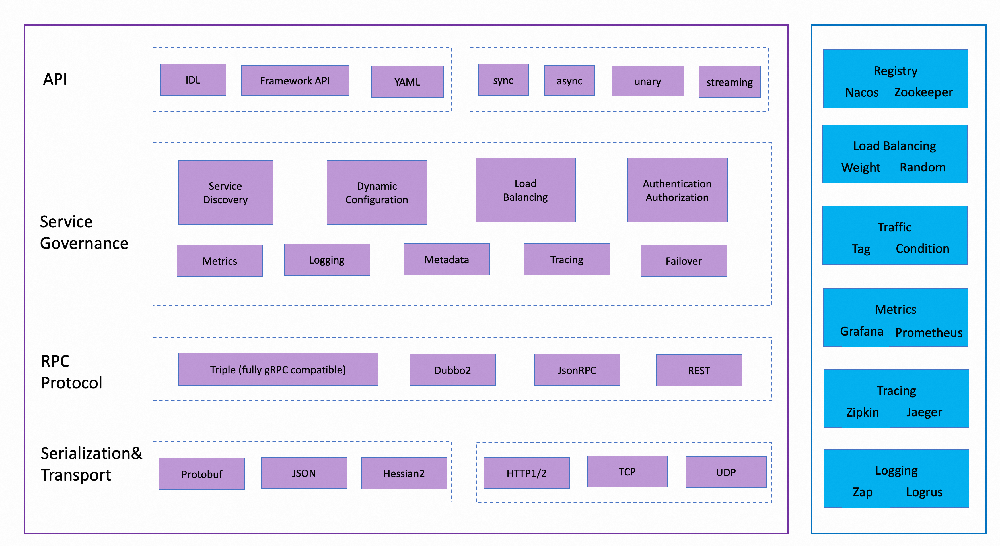
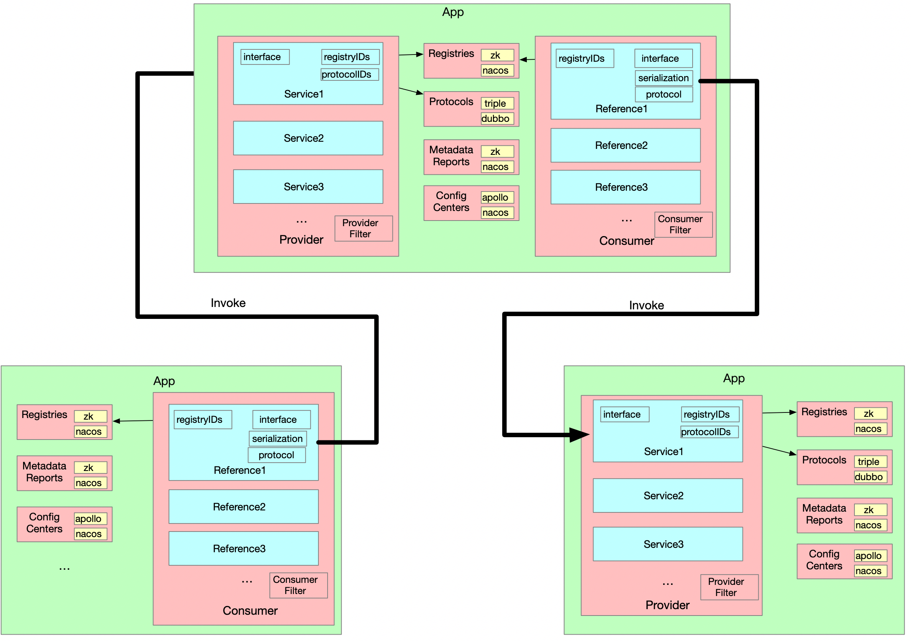

# Dubbo-Go 架构






# Dubbo-Go 初体验

### **引言：两种模式的核心区别**

本文旨在结合 `helloworld` 与 `registry/nacos` 两个 Go 示例，深入剖析并总结两种主流的服务开发模式：纯粹的远程过程调用（RPC）与现代微服务应用。

二者的核心区别在于，前者是**静态的、点对点的通信模型**，而后者通过引入第三方协调者（如注册中心），演进为**动态的、可治理的分布式系统**。本次笔记将融合理论、代码与实践中遇到的具体问题，力求清晰地呈现这一演进过程。

### 一、**纯 RPC 服务开发 （静态点对点通信）**

> 以 `helloworld` demo 为例

此模式是所有分布式通信的基础，其核心是让一个进程能够像调用本地函数一样调用另一个进程的方法。

#### **1. 核心原理**

其原理是基于一个预先约定的网络地址进行直接调用。客户端和服务端通过这个固定的地址（IP与端口）形成强依赖关系，整个通信链路中不存在任何中介或协调者。

#### **2. 代码实现剖析**

**服务端 (`server.go`)**

```go
// helloworld/go-server/cmd/server.go
func main() {
    srv, err := server.NewServer(
        // 关键配置：硬编码了协议和端口
        server.WithServerProtocol(
            protocol.WithPort(20000), // 明确绑定在 20000 端口
            protocol.WithTriple(),
        ),
    )
    // ...
    if err := srv.Serve(); err != nil { // 启动监听
        logger.Error(err)
    }
}
```

- **代码解读**：`server.WithServerProtocol(protocol.WithPort(20000), ...)` 这行代码明确指示了服务实例绑定在本地的 `20000` 端口。这个地址是静态的，并且在代码中写死。服务端启动后，就在这个固定的“摊位”上等待客户端来连接。

**客户端 (`client.go`)**

```go
// helloworld/go-client/cmd/client.go
func main() {
    cli, err := client.NewClient(
        // 关键配置：硬编码了服务端的URL
        client.WithClientURL("127.0.0.1:20000"),
    )
    // ...
    resp, err := svc.Greet(context.Background(), &greet.GreetRequest{Name: "hello world"})
    // ...
}
```

- **代码解读**：`client.WithClientURL("127.0.0.1:20000")` 是这种模式的典型特征。客户端在发起调用前，必须明确知道服务端的具体网络地址。这就是所谓的“紧耦合”。如果服务端的IP或端口发生任何变化，这里的代码**必须**手动修改并重新部署。

#### **3. 模式总结与局限**

- **优点**：架构非常简单，调用关系一目了然，便于开发调试和快速验证。
- **局限**：
  - **紧耦合 (Tight Coupling)**：客户端与服务端的物理网络位置强绑定。
  - **脆弱性 (Fragility)**：一旦服务端的网络地址变更，所有客户端都将调用失败，且无法自动恢复。
  - **扩展性差 (Poor Scalability)**：无法对服务端进行透明的水平扩容。若要增加实例来分担流量，必须在客户端或引入额外的负载均衡设备进行复杂的配置。

### **二、微服务应用开发模式（动态服务治理）**

> 以 `registry/nacos` demo 为例

此模式通过引入**服务注册与发现**机制，解决了纯 RPC 模式在分布式环境中的核心痛点。

#### **1. 代码实现剖析**

**服务端 (`server.go`)**

```go
// registry/nacos/go-server/cmd/server.go
func main() {
    ins, err := dubbo.NewInstance(
        // 为应用指定一个逻辑名称
        dubbo.WithName("dubbo_registry_nacos_server"), 
        // 关键配置：指定注册中心的位置
        dubbo.WithRegistry(
            registry.WithNacos(),
            registry.WithAddress("127.0.0.1:8848"),
        ),
        // 协议配置依然存在，但其作用更多是定义“如何”提供服务
        dubbo.WithProtocol(
            protocol.WithTriple(),
            protocol.WithPort(20000),
        ),
    )
    // ...
}
```

- **代码解读**：`dubbo.WithRegistry(...)` 是核心。它告诉服务实例：“你的户口本在 `127.0.0.1:8848` 这个地址的 Nacos 上，启动后你要去那里报个到。” 这使得服务拥有了“自我声明”的能力。

**客户端 (`client.go`)**

```go
// registry/nacos/go-client/cmd/client.go
func main() {
    ins, err := dubbo.NewInstance(
        dubbo.WithName("dubbo_registry_nacos_client"),
        // 关键配置：同样指定注册中心的位置去“问路”
        dubbo.WithRegistry(
            registry.WithNacos(),
            registry.WithAddress("127.0.0.1:8848"),
        ),
    )
    // ...
    // 注意：这里没有指定任何IP和端口！
    svc, err := greet.NewGreetService(cli)
    resp, err := svc.Greet(context.Background(), &greet.GreetRequest{Name: "hello world"})
    // ...
}
```

- **代码解读**：客户端在创建时，同样只配置了注册中心的位置，而完全没有 `WithClientURL` 这样的硬编码地址。当执行 `svc.Greet` 时，Dubbo-Go 框架会自动在后台执行服务发现流程，拿到地址后再发起调用。这完美地体现了**位置透明性 (Location Transparency)**。

#### **2. 模式总结与优势**

- **松耦合**：消费者和服务提供者通过服务名这一逻辑概念进行交互，物理位置解耦。
- **高可用与故障转移**：能自动感知故障节点，并将流量切换到健康节点。
- **易于水平扩展**：可以随时增减服务实例，消费者能自动感知，为客户端负载均衡提供了基础。

### **三、核心概念与实践要点**

#### **1. 核心概念：Nacos 的双重角色**

Nacos 为分布式系统提供了两个**独立且正交（Orthogonal）\**的核心能力：\*\*服务发现\*\*和\**动态配置管理**。一个 Dubbo-Go 应用可以被配置为独立使用其中任一功能，或同时使用两者。

##### **服务注册中心 (Registry Center)**

- **解决的问题**: 在动态分布式环境中，因实例网络位置不固定所带来的**位置透明性 (Location Transparency)**问题。
- **核心原理与工作流**:
  1. **服务注册 (Service Registration)**: 服务提供者 (Provider) 启动时，主动向 Nacos 上报其元数据（服务名, IP:Port, 协议等）。
  2. **服务发现 (Service Discovery)**: 服务消费者 (Consumer) 启动时，向 Nacos 查询服务名，获取健康的实例地址列表。
  3. **健康检查 (Health Checks)**: Provider 通过心跳机制，周期性地告知 Nacos 存活状态。若心跳中断，Nacos 会将该 Provider 实例标记为不健康并从服务列表中移除。
  4. **动态更新 (Dynamic Updates)**: Nacos 通过推送模型 (Push Model)，将实例列表的变更主动通知给订阅的 Consumer，确保其本地缓存的服务地址列表近乎实时准确。

##### **配置中心 (Configuration Center)**

- **解决的问题**: 对应用配置进行**集中化、动态化管理**的问题，实现配置与代码的解耦。
- **核心原理与工作流**:
  1. **集中化管理 (Centralized Management)**: 配置通过 Data ID 和 Group 在 Nacos 服务端统一存储。
  2. **配置拉取与订阅 (Configuration Pull & Subscription)**: 应用启动时，从 Nacos 拉取指定配置，并建立长连接订阅变更。
  3. **动态推送 (Dynamic Push)**: Nacos 将配置变更主动推送给所有订阅的客户端。
  4. **配置热加载 (Hot-Reload)**: 应用收到更新后，可在不重启的情况下动态调整其内部参数。

##### **两者的独立与协同**

- **独立性**: 应用可以只配置 `dubbo.WithRegistry(...)` 来单独使用注册中心功能，或只配置 `dubbo.WithConfigCenter(...)` 来单独使用配置管理功能。
- **协同性**: 在成熟的微服务实践中，两者协同工作。应用首先从**配置中心**获取运行参数（如端口），然后使用这些参数来初始化自己，并最终向**注册中心**注册服务信息。

#### **2. “常驻客户端”的必要性与应用场景**

Dubbo-Go 客户端在启动后会维持一个与注册中心的长连接，成为一个“常驻”进程。

- **价值1: 性能 (本地缓存)**：客户端首次从 Nacos 获取到地址列表后，会将其**缓存在本地内存**中。后续的调用直接从缓存中取地址，避免了每次调用都请求注册中心的网络开销。
- **价值2: 高可用 (推送更新)**：客户端**订阅**了服务变更。当提供者实例宕机或扩容时，Nacos 会**主动推送**更新，客户端收到后刷新本地缓存，从而实现快速的故障转移和动态伸缩。
- **典型场景**:
  - **API 网关**：作为所有外部请求的入口，需要持续、高效地调用下游多个微服务。
  - **服务调用链**：在一个复杂的业务流程中，如“订单服务”需要作为客户端去调用“库存服务”和“支付服务”。

#### **3. 环境搭建陷阱：Docker 与 Nacos**

在实践中，环境搭建是第一道坎，尤其是在使用 Docker 启动 Nacos 时。

**正确的 Nacos 2.x 启动命令**：

```sh
docker run --name nacos-standalone -e MODE=standalone -p 8848:8848 -p 9848:9848 -p 9849:9849 -d nacos/nacos-server:v2.3.1
```

- **陷阱一：镜像名称/标签错误**
  - **问题描述**：执行 `docker run` 时，使用了错误的镜像标签，如将 `v2.3.1` 错写成 `2.3.1`。
  - **现象**：Docker 报错 `Unable to find image 'nacos/nacos-server:2.3.1' locally` 或类似的“找不到镜像”的错误。
  - **原因与解决**：Docker 的镜像标签是精确匹配的字符串。必须从 Docker Hub 或官方文档中复制**完整的、正确的**镜像名称和标签。
- **陷阱二：gRPC 端口未暴露 (最常见、最隐蔽的错误)**
  - **问题描述**：在启动命令中，只暴露了 HTTP 端口 `-p 8848:8848`，忘记了暴露 gRPC 端口 `-p 9848:9848 -p 9849:9849`。
  - **现象**：Nacos 控制台 (`http://localhost:8848/nacos`) 可以正常访问，但 Dubbo-Go 服务端启动时，日志会卡住并最终报错 `client not connected, current status:STARTING` 或类似的连接超时错误。
  - **原因与解决**：Nacos 2.x 默认使用 gRPC (端口`9848`) 进行服务注册、发现和心跳等高性能通信。`8848` 端口主要用于控制台和旧版 API。如果 gRPC 端口不暴露，Dubbo-Go 客户端将永远无法成功连接到 Nacos 完成注册，导致启动失败。**必须同时暴露这三个端口**。


### **四、配置驱动开发模式（ 生产级实践）**

> 以 `configcenter` 为例

这是一种更高级的模式，它将应用的配置和初始化逻辑几乎完全委托给了框架和外部配置中心，是更贴近生产环境的实践。

#### **1. 核心思想：配置驱动 (Configuration-Driven)**

- **定义**：配置驱动是一种软件设计范式，其核心思想是将应用程序的行为逻辑（如使用哪个协议、监听哪个端口、连接哪个数据库、启用哪些功能）从硬编码的程序代码中分离出来，转移到外部的、可动态修改的配置文件或配置服务中。
- **核心思想**：应用程序在启动和运行时，通过读取这些外部配置来动态地“装配”和调整自身。代码本身变得更通用、更稳定，而易变的部分则全部由配置来定义。
- **为何更偏向生产应用**：
  - **环境隔离**：开发、测试、生产环境可以使用完全相同的代码包，只需加载不同的配置文件即可，极大简化了部署流程。
  - **运维友好**：可以在不重新编译和部署应用的情况下，通过修改配置来调整服务行为，如进行灰度发布、功能开关、性能调优等。
  - **职责分离**：开发人员专注于业务逻辑的实现，而运维人员（或 SRE）专注于通过配置来管理和保障服务的稳定运行。

#### **2. 代码剖析：控制反转 (IoC) 与依赖注入 (DI)**

`configcenter` demo 完美地诠释了**控制反转**和**依赖注入**。我们的代码不再主动创建和组装对象，而是将这个**控制权反转给了框架**。

##### **服务端：声明与启动**

```
// configcenter/go-server/cmd/main.go
func main() {
    // 1. 服务实现的注册
    config.SetProviderService(&GreeterProvider{})
    // 2. 配置加载与服务初始化
    if err := config.Load(); err != nil {
        panic(err)
    }
    select {}
}
```

在服务端，代码逻辑极其简洁。`config.SetProviderService(&GreeterProvider{})` 这一步，并非执行业务，而是向 Dubbo-Go 框架的服务容器**注册**了一个 `GreeterProvider` 的业务逻辑实现。这相当于告诉框架：“如果将来有针对 `GreeterProvider` 服务的配置或调用，你应该使用这个实例来处理。”

随后调用的 `config.Load()` 则触发了一个**两阶段引导 (Two-Stage Bootstrap)** 过程：首先加载本地的 `dubbogo.yml` 文件以找到 Nacos，然后从 Nacos 拉取完整的远程配置，并用这份配置来最终初始化和启动整个服务。

##### **客户端：依赖注入的艺术**

```go
// configcenter/go-client/cmd/main.go

// 1. 创建一个空壳实例/占位符
var grpcGreeterImpl = new(api.GreeterClientImpl)

func init() {
    // 2. 向框架进行依赖声明与注册
    config.SetConsumerService(grpcGreeterImpl)
}

func main() {
    // 3. 触发依赖解析与注入
    if err := config.Load(); err != nil {
        panic(err)
    }
    // 4. 调用被注入完成的客户端代理
    reply, err := grpcGreeterImpl.SayHello(context.Background(), req)
    // ...
}
```

客户端的逻辑更为精妙。首先，通过 `new(api.GreeterClientImpl)` 创建了一个**空壳实例**，它此时不具备任何功能。接着，在 `init` 函数中，通过 `config.SetConsumerService(grpcGreeterImpl)` 向框架**声明了一个依赖**：“我需要一个 `GreeterClientImpl` 类型的服务消费者，这是它的引用，请你来负责创建和初始化它。”

最后，`config.Load()` 扮演了**依赖注入容器**的角色。它根据从 Nacos 拉取到的远程配置，在后台构建出功能完备的 RPC 客户端代理，然后将这个代理的功能**注入**到之前注册的全局变量 `grpcGreeterImpl` 中。因此，当 `main` 函数执行到 `grpcGreeterImpl.SayHello` 时，它调用的不再是空壳，而是一个被框架完全初始化的、功能完备的 RPC 客户端。