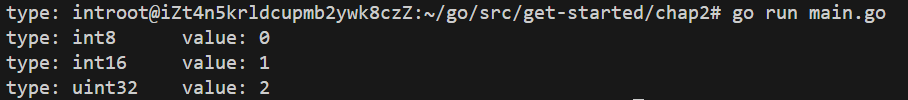
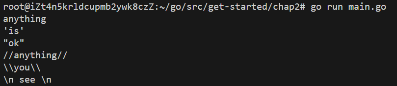
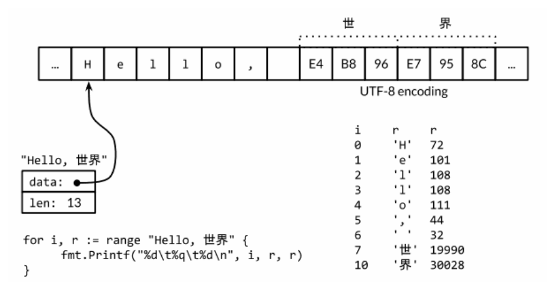

# Go语言基础

## 程序结构

### packages

go程序是由packages编译构建而成，每个go程序都从main这个package开始执行（入口点）

1. 每个.go源文件必须是以**package**声明语句开头，即`package <package-name>`，以说明当前源文件属于哪个包。一个包可能由多个源文件组成。

2. 紧跟在包声明语句后的是**import**语句，说明当前源文件所需要使用的依赖包。<u>import的包必须被使用到，否则编译出错！（可以使用goimports导入插件帮助我们根据程序导入或删除包）</u>
3. 然后才是一系列包级名字的声明

```go
package main      // 开头第一行指定当前文件的 package name

import (        // 导入外部的packages
    "fmt"
    "math/rand"
)
/* 
import "fmt"
import "math"
*/

func main() {
    fmt.Println("My favorite number is", rand.Intn(10))
}
```

#### 包的导入

- 一个包可能包含多个.go源文件，这些源文件必须在最开始的包声明语句中声明源文件所属的包

- 这些源文件放在一个目录中，目录名就是包名

- 包的导入路径是包的绝对路径去除`$GOPATH/src`的后缀路径。例如包gopl.io/ch1/helloworld对应的目录路径是 $GOPATH/src/gopl.io/ch1/helloworld

##### 包的命名导入

当导入同名的包时，可以在导入时给包取别名

```go
import (
	"fmt"
    myfmt "mylib/fmt"
)
```

##### 只执行包的初始化

有时候我们只需要执行包的init函数而不需要用到包中的名字，可以使用空白标识符命名导入的包，从而可以避免编译器的错误

```go
import (
	_ "example.com/pkg"
)
```


#### 包的初始化

包的初始化是指在包被导入时进行一些必要的准备工作。这包括全局变量的初始化和执行 `init` 函数。

##### `init` 函数

- **定义**：`init` 函数没有参数，也没有返回值。
- **自动执行**：在包被导入时，`init` 函数会自动执行，无需显式调用。（所有的init函数都会先于main函数执行）
- **多个 `init` 函数**：一个包中可以有多个 `init` 函数，它们会按照源文件中的顺序依次执行。
- **执行顺序**：在一个包的多个源文件中，`init` 函数的执行顺序按照编译器找到它们的顺序决定（通常是文件名的字母顺序）。

```go
var pc [256]byte
func init() {
    for i := range pc {
    	pc[i] = pc[i/2] + byte(i&1)
    }
}
```


### 名字

#### 名字作用域

- 局部名字：声明在函数内部的变量，只在函数内部可见
- 包级名字：声明在函数外部，**包级函数也算包级名字**
  - 首字母大写，相当于被C语言`extern`关键字修饰，在导入了当前包的package中也可见
  - 首字母小写，只是package内部可见

----

也就是说，当需要使用导入的package中的名字时，该名字一定是大写的。例如下面的println和pi：

```go
package main

import (
    "fmt"
    "math"
)

func main() {
    fmt.Println(math.Pi)
}
```

#### Go语言名字命名风格

- 尽量使用短小的名字，尤其是局部变量这种作用域小、生命周期短的变量，即类似`i`这样的名字
- 使用较长的有一定含义的名字，通常只有对于作用域大、生命周期长的名字才有意义

- **驼峰式命名**


## 函数

参数列表中，参数名在前，类型名在后

#### named return values - 命名返回值

返回值可以在指定返回值类型时直接命名

命名返回值会在函数开头自动定义指定的变量，最后通过一个**naked return**返回这些变量

```go
func split(sum int) (x, y int) {
    x = sum * 4 / 9
    y = sum - x
    return
}
```

NOTE：命名返回值最好用在短小的函数中，用在长函数中会影响代码可读性


## 数据类型与变量

### 基本数据类型

- bool
- string
- int  int8  int16  int32  int64
- uint uint8 uint16 uint32 uint64 uintptr
- byte // uint8的别名
- rune // int32的别名，用于表示Unicode字符
- float32 float64
- complex64 complex128

其中，`int, uint, uintptr`在32位机器上是32位，在64位机器上是64位。

---

**实际使用时：**

- **整数**：当想要使用整数变量时，除非特殊需要，最好都用`int`类型，这样可以保持代码的简洁性和可读性，且兼容性更好。

- **浮点数**：浮点数尽量使用`float64`，因为float32类型的累计计算误差很容易扩散，并且float32 能精确表示的正整数并不是很大（译注：因为float32的有效bit位只有23个，其它的bit位用于指数 和符号；当整数大于23bit能表达的范围时，float32的表示将出现误差）

  ```go
  var f float32 = 16777216 // 1 << 24
  fmt.Println(f == f+1) // "true"!
  ```

- **布尔值**：`&&`的优先级比`||`高，因此如下的表达式不需要小括号：

  ```go
  if 'a' <= c && c <= 'z' ||
      'A' <= c && c <= 'Z' ||
      '0' <= c && c <= '9' {
      // ...ASCII letter or digit...
  }
  ```

- **byte、rune与字符**：byte表示ASCII字符，rune表示unicode字符，两个类型都是整型的**别名**，也就是说本就是使用整型来表示的字符

  ```go
  // 理解“别名”的意思
  var a byte = 10
  var b uint8 = 'x' 
  c := a + b
  ```

  

### 类型转换

The expression `T(v)` converts the value `v` to the type `T`.

Some numeric conversions:

> var i int = 42
> var f float64 = float64(i)
> var u uint = uint(f)

Or, put more simply:

> i := 42
> f := float64(i)
> u := uint(f)

**NOTE:**

go中不存在隐式类型转换，只有上述的显式类型转换。所以需要在两个不同类型变量之间传递值时，需要注意类型转换！


### 变量

#### 变量的声明

主要有三种方式：

- `var x type`：标准声明，说明类型，省略初始值。变量会被零值初始化

- `var x = <value>`：给出初始值情况下省略变量类型

- `x := <value>`：使用符号`:=`进行简短声明，同时省略`var`和变量类型，但是这种方法能用于函数内部，即只能用于声明局部变量

```go
// 可以在一条声明中声明多个（不同类型的）变量
var i, j, k int 
var b, f, s = true, 2.3, "four" 
func f(){
    x, y, z := 1, 2.0, "3"
    
    // 从函数返回的多个值获取初始值
    var f, err = os.Open(filename)
}
```

---

#### **零值初始化机制**

- 数值类型变量对应的零值是0
- 布尔类型变量对应的零值是false
- 字符串类型对应的零值是空字符串`""`
- 接口或引用类型（包括slice、指针、map、chan和函数）变量对应的零值是`nil`
- 数组或结构体等聚合类型对应的零值是每个元素或字段都是对应该类型的零值

零值初始化机制可以确保每个声明的变量总是有一个良好定义的值，因此在**Go语言中不存在未初始化的变量**

#### 简短声明语句

简短变量声明左边的变量可能并不是全部都是刚刚声明的

如果有一些已经**在相同的词法域**声明过了，那么简短变量声明语句对这些已经声明过的变量就只有赋值行为了

```go
in, err := os.Open(infile)
// ...
out, err := os.Create(outfile)
```

- 简短变量声明语句中必须至少要声明一个新的变量，不能全是对旧变量的赋值（这应该用`=`）


#### 指针

```go
var p *int  // go语言中变量名在前，变量类型在后，所以指针类型不再是int*, 而是*int
```

- go语言的函数返回局部变量的指针是安全的，函数返回后局部变量会从栈被移动到堆中
- 创建或者复制指针其实就是为变量取别名的过程，`*p`就是变量的别名

> 指针的最大意义在于可以不用名字而访问一个变量，但是这会是一个双刃剑：要找到一个变量的所有访问者并不容易，我们必须知道变量全部的别名（这是Go语言的垃圾回收器所做的工作）

##### new函数

表达式`new(T)`将创建一个T类型的匿名变量，初始化为T类型的零值，然后返回变量地址，返回的指针类型为`*T`

**匿名变量**，是说这个变量没有名字，对于变量的访问是通过指针进行的

```go
p := new(int) // p, *int 类型, 指向匿名的 int 变量
fmt.Println(*p) // "0"
*p = 2 // 设置 int 匿名变量的值为 2
fmt.Println(*p) // "2"
```


#### 变量的生命周期 & 自动垃圾收集器GC

- 全局变量：和整个程序的运行周期一致
- 局部变量：从创建一个新变量的声明语句开始，直到该变量不再被引用为止，然后变量的存储空间可能被回收

##### 垃圾收集的流程：

1. **根对象（Root Objects）**：从每个包级的变量（全局变量）和每个当前运行函数的局部变量开始。这些变量被称为根对象，因为它们是引用图（Reference Graph）的起点。
2. **引用图的遍历**：从这些根对象出发，通过指针或引用的访问路径，遍历整个内存中的对象。如果一个对象可以通过任何路径从根对象到达，那么这个对象就是“**活跃**”的，不能被回收。
3. **标记阶段**：GC会遍历所有活跃的对象，并标记它们。这意味着它们在当前的程序执行中仍然被使用。
4. **清除阶段**：GC会遍历所有的内存，并回收那些没有被标记的对象。因为这些对象没有被任何活跃的对象引用，所以它们可以安全地被回收。

可以说，一个变量的有效周期只取决于是否可达


#### 局部变量存储空间的分配

编译器会自动选择在栈上还是在堆上分配局部变量的存储空间，但可能令人惊讶的是，这个选择并不是由用var还是new声明变量的方式决定的：

```go
var global *int

func f() {
	var x int
	x = 1
	global = &x // x在函数f外部可达，分配在堆上
}
func g() {
	y := new(int) // y只在函数内部可达，分配在栈上
	*y = 1
}
```

**局部变量的逃逸**：局部变量的声明周期只取决于是否可达，也就是说局部变量可能在函数返回后依然存活，这在go语言中叫做局部变量从函数中逃逸


### 常量

#### 常量的声明

方法和变量类似，只不过把`var`换成`const`，并且不能使用`:=`简短声明

**批量声明**

因为常量需要在编译时确定值，所以一定要有初始值。在批量声明时，第一个变量的初始值不能省略。后面省略初始值的常量会沿用前面最近的初始值。

```go
const (
a = 1
b
c = 2
d
)
fmt.Println(a, b, c, d) // "1 1 2 2"
```

#### iota常量生成器 vs 枚举

对于常量的批量声明语句，可以借助`iota`给常量初始值。`iota`起始值为0，每往下一行加一。

```go
type Weekday int
const (
    Sunday Weekday = iota
    Monday
    Tuesday
    Wednesday
    Thursday
    Friday
    Saturday
)  // 周日-周一 分别对应0-7
```

更复杂的初始值规则：

```go
const (
    _ = 1 << (10 * iota)   // 初始值规则就像一个函数，函数的x是iota
    KiB // 1024
    MiB // 1048576
    GiB // 1073741824
    TiB // 1099511627776 (exceeds 1 << 32)
    PiB // 1125899906842624
    EiB // 1152921504606846976
    ZiB // 1180591620717411303424 (exceeds 1 << 64)
    YiB // 1208925819614629174706176
)
```

#### 无类型常量

在声明常量是可以明确指定常量的基础类型，但是如果省略类型，那么常量通常是没有明确基础类型的。因此存在无类型整数、无类型浮点数等。所谓无类型，就是只能从初始值推断出这是整型，但是没有明确到底是哪一种整型。

- 无类型常量可以具有更大的精度，至少256bit

- 无类型常量可以避开类型安全的限制，将同一个常量混在不同类型的表达式中

  ```go
  	var a int8
  	var b int16
  	var c uint32
  	fmt.Printf("type: %T\tvalue: %d\n", a+Sunday, a+Sunday)
  	fmt.Printf("type: %T\tvalue: %d\n", b+Monday, b+Monday)
  	fmt.Printf("type: %T\tvalue: %d\n", c+Tuesday, c+Tuesday)
  ```

  

- 当无类型常量出现在具有明确类型的变量的赋值语句的右边时，可以发生隐式类型转换：

  ```go
  var f float64 = 3 + 0i // untyped complex ‐> float64
  f = 2 		// untyped integer ‐> float64
  f = 1e123 	// untyped floating‐point ‐> float64
  f = 'a'		// untyped rune ‐> float64
  ```

对于**常量面值**，不同的写法可能会对应不同的类型。例如0、0.0、0i和'\u0000'虽然有着相同的常量值，但是它们分别对应无类型的整数、无类型的浮点数、无类型的复数和无类型的字符等不同的常 量类型。


### 类型Type的声明

变量或表达式的类型定义了对应存储值的属性特征，例如数值在内存的存储大小（或者是元素的bit 个数），它们在内部是如何表达的，是否支持一些操作符，以及它们自己关联的方法集等。

```go
type 类型名字 底层类型
```

#### 声明新类型的意义

1. **提高代码可读性和可维护性**。通过定义新类型，可以使代码更加清晰和可读。读者可以通过类型名理解变量的含义和用途。
2. **增强类型安全性**。例如，我们可以用float64类型变量表示摄氏温度和华氏温度，但是我们绝不希望把表示摄氏温度和表示华氏温度的float64变量混在一个计算表达式中。这就可以通过声明Celsius类型和Fahrenheit类型来区分和标识float64变量所表示的具体类型。
3. 为类型添加方法，使其具有更多行为。
4. 实现接口，支持多态设计。
5. 促进代码复用和扩展。

```go
package tempconv
import "fmt"

type Celsius float64 // 摄氏温度
type Fahrenheit float64 // 华氏温度

const (
AbsoluteZeroC Celsius = ‐273.15 // 绝对零度
FreezingC Celsius = 0 // 结冰点温度
BoilingC Celsius = 100 // 沸水温度
)

func CToF(c Celsius) Fahrenheit { return Fahrenheit(c*9/5 + 32) /* 类型转换 */}
func FToC(f Fahrenheit) Celsius { return Celsius((f ‐ 32) * 5 / 9) /* 类型转换 */}
```

#### Go 的类型安全（重要概念）

在 Go 语言中，类型是一个非常重要的概念。Go 语言设计的一个核心理念是**类型安全**，这意味着在不同类型之间进行操作时，必须显式地进行类型转换，从而避免了许多潜在的错误。与许多其他语言不同，Go 不允许在不同类型之间进行隐式转换。例如，不能直接将 `int` 类型的值赋给 `float64` 类型的变量，反之亦然。

```go
var apples int32 = 1
var oranges int16 = 2
var compote int = apples + oranges // compile error
```


### 字符串

字符串：一个只读byte数组

- `len(s)`返回的是byte长度，即便`s`中存放有rune字符

- `s[i]`返回的是索引为`i`的字节对应的字符，即是按ASCII码解释字符串

- 字符串是不可修改的，但是**字符串变量**可以被赋予另一个字符串的值

  ```go
  s := "hello"
  s[0] = 'H'  // 错误，不能修改字符串内部的值
  s = s + ", world"  // 正确，但是不是在原有字符串后追加，而是生成一个新的字符串，并将其赋值给s
  ```

#### 原生字符串

可以在反引号中写原生的字符串字面值。所谓“原生”，看到的是什么就是什么，不存在转义：

```go
s := `anything
'is'
"ok"
//anything//
\\you\\
\n see \n
`
//注意第二行开始的内容要顶格写，不然缩进也会被认为是字符串的一部分
```



#### unicode码与utf-8编码

unicode收集了世界上所有符号系统，包括了一百多种语言，每个符号使用32bit表示。

**utf-32**：字符序列中，每个字符都使用32位来表示

**utf-8**：变长编码，每个字符可以使用1/2/3/4 byte表示

```
0xxxxxxx runes 0‐127 (ASCII)
110xxxxx 10xxxxxx 128‐2047 (values <128 unused)
1110xxxx 10xxxxxx 10xxxxxx 2048‐65535 (values <2048 unused)
11110xxx 10xxxxxx 10xxxxxx 10xxxxxx 65536‐0x10ffff (other values unused)
```

#### 使用转义的数字表示字符

可以使用转义在字符串面值包含任意的字节：

- `\xhh`：十六进制，其中两个h表示十六进制数字（大写或小写都可以）
- `\ooo`：八进制，包含三个八进制的o数字（0到7），但是不能超过\377
- `\uhhhh`：十六进制，对应16位码点值
- `\Uhhhhhhhh`：十六进制，对应32位码点值

```go
// 下面四者等价
"世界"
"\xe4\xb8\x96\xe7\x95\x8c"
"\u4e16\u754c"
"\U00004e16\U0000754c"
```

#### utf-8文本的解码与使用

```go
import "unicode/utf8"  // utf-8编码的工具在这个包中

s := "Hello, 世界"

// 按utf8编码计算字符串的长度
fmt.Println(len(s)) // "13"
fmt.Println(utf8.RuneCountInString(s)) // "9"

// 按utf8解码并打印字符串
for i := 0; i < len(s); {
    r, size := utf8.DecodeRuneInString(s[i:])
    fmt.Printf("%d\t%c\n", i, r)
    i += size
}

// range循环会隐式解码utf8字符串
for i, r := range "Hello, 世界" {
	fmt.Printf("%d\t%q\t%d\n", i, r, r)  // %q - 带单引号的unicode字符（%c不带单引号）
} // 输出结果见下图
```



#### `fmt.Printf`格式化输出

```
%d 十进制整数
%x, %o, %b 十六进制，八进制，二进制整数。
%f, %g, %e 浮点数： 3.141593 3.141592653589793 3.141593e+00
%t 布尔：true或false
%c 字符（rune） (Unicode码点)
%s 字符串
%q 带双引号的字符串"abc"或带单引号的字符'c'
%v 变量的自然形式（natural format）
%T 变量的类型
%% 字面上的百分号标志（无操作数）
```

#### 字符串与字节数组

字符串与字节数组（slice）可以相互转换：

```go
s := "abc"
b := []byte(s)   // 分配了一个新的字节数组用于保存字符串数据的拷贝
s2 := string(b)  // 由字节数组创建了一个字符串拷贝
```

##### strings与bytes包中的常用函数

```go
import "strings"

func Contains(s, substr string) bool   // 检查字符串 s 是否包含子字符串 substr
func Count(s, sep string) int   // 返回子字符串 sep 在字符串 s 中出现的次数
func Fields(s string) []string   // 将字符串 s 按照空白字符（空格、制表符等）分割成多个字段，并返回一个字符串切片
func HasPrefix(s, prefix string) bool   // 检查字符串 s 是否以子字符串 prefix 开头
func Index(s, sep string) int   // 返回子字符串 sep 在 s 中第一次出现的位置，未找到返回 -1（有LastIndex）
func Join(a []string, sep string) string   // 以sep为分隔符，将string数组中的字符串合成一个字符串
```

```go
import "bytes"

func Contains(b, subslice []byte) bool
func Count(s, sep []byte) int
func Fields(s []byte) [][]byte
func HasPrefix(s, prefix []byte) bool
func Index(s, sep []byte) int
func Join(s [][]byte, sep []byte) []byte
```

#### 动态增长的字节数组

bytes包提供了Buffer**类型**用于字节slice的缓存，可以实现字节数组的动态增长。Buffer类型变量不需要初始化，其零值也是有效的，表示Buffer为空：

```go
func intsToString(values []int) string {
	var buf bytes.Buffer // 声明Buffer变量
	buf.WriteByte('[')  // WriteByte方法向Buffer写ASCII字符
	for i, v := range values {
		if i > 0 {
			buf.WriteString(", ")  // WriteString方法向Buffer写字符串
		}
		fmt.Fprintf(&buf, "%d", v) // 通过fmt.Fprintf向Buffer写格式化字符串
	}
	buf.WriteByte(']')
	return buf.String()
}

func main() {
	fmt.Println(intsToString([]int{1, 2, 3})) // "[1, 2, 3]"
}
```


# 流控制

## for循环

#### 基础用法：

基本语法和C类似，但是有两点不同（同样适用于if）：

1. 不需要小括号

2. 必须要花括号

```go
	for i := 0; i < 10; i++ {
		sum += i
	}
```

**对于i的声明：**

通常用简短声明`:=`


#### 省略 init and post statements

```go
	for ; sum < 1000; {
		sum += sum
	}
```

#### 进一步省略分号 -> while

**NOTE：**在go中，没有while只有for，for只留下第二个判断表达式就是while

```go
	for sum < 1000 {
		sum += sum
	}
```

#### 再省略判断表达式 -> 无限循环

```go
	for {
	}
```

### if判断

#### 基础用法

```go
func sqrt(x float64) string {
	if x < 0 {
		return sqrt(-x) + "i"
	}
	return fmt.Sprint(math.Sqrt(x))
}
```

#### 前置预处理表达式

在判断之前，先执行一条预处理的语句

```go
func pow(x, n, lim float64) float64 {
	if v := math.Pow(x, n); v < lim {
		return v
	} else{
        fmt.Printf("%g >= %g\n", v, lim)
    }
	return lim
}
```
