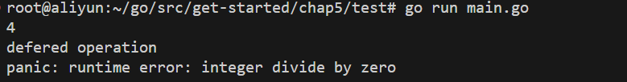

# 函数

**拥有函数名的函数只能在包级语法块中被声明**

```go
func name(parameter‐list) (result‐list) {
    body
}
```

**函数标识符**：即函数类型，由形参列表与返回值列表共同决定

#### 形参列表：

- go语言没有默认实参。因为默认实参违背了go语言**简洁和明确**的设计哲学。
- 函数调用不能通过指定形参名而赋予实参值，实参只能与形参列表的顺序一一对应（不支持关键字参数）。理由同上。

#### 返回值列表：

- 如果返回值列表不为空，函数体一定要以`return`语句结尾
- 给返回值命名，准确的变量名可以传达函数返回值的含义
  - 返回值会像形参一样被声明为一个**局部变量**，并被零值初始化
  - 如果所有的返回值都被命名，裸`return`语句就可以方便地返回所有返回值
  - 如果只有部分的返回值被命名，那么只能依次return所有的返回值


#### 函数体

- 没有函数体的函数声明，这表示该函数不是以Go实现的。这样的声明定义了函数标识符。

```go
func Sin(x float64) float //implemented in assembly language
```


## 错误处理

​	在Go中有一部分函数总是能成功的运行。比如strings.Contains和strconv.FormatBool函数，对各种可能的输入都做了良好的处理，使得运行时几乎不会失败，除非遇到灾难性的、不可预料的情况，比如运行时的内存溢出。

​	对于大部分函数而言，永远无法确保能否成功运行。这是因为错误的原因超出了程序员的控制。举 个例子，任何进行I/O操作的函数都会面临出现错误的可能，只有没有经验的程序员才会相信读写操作不会失败，即时是简单的读写。

​	因此在go程序中应该总是要考虑对各个（可能发生错误的）函数的错误处理。

​	在Go中，函数运行失败时会返回错误信息，这些错误信息被认为是一种**预期的值**而非异常 （exception），这使得Go有别于那些将函数运行失败看作是异常的语言。

### 错误处理策略

当一次函数调用返回错误时，调用者有应该选择何时的方式处理错误。根据情况的不同，有很多处理方式，让我们来看看常用的五种方式。

#### 1. 传播错误

当函数中某个子程序发生错误时，会变成该函数的失败。

- 把错误信息原封不断返回出去：

  ```go
  resp, err := http.Get(url)
  if err != nil{
      return nill, err
  }
  ```

- 为错误添加更具体的信息，以作为错误的因果链中的一环传递出去，以便程序员能够更清晰地定位和分析问题。使用`fmt.Errorf`为错误信息添加前缀信息：

  ```go
  doc, err := html.Parse(resp.Body)
  resp.Body.Close()
      if err != nil {
      return nil, fmt.Errorf("parsing %s as HTML: %v", url, err) 
  }
  ```

**错误信息的编写风格：**

1. 由于错误信息经常是以链式组合在一起的，所以错误信息中应避免大写和换行符。最终的错误信息可能很长，我们可以通过类似grep的工具处理错误信息。

2. 要确保错误信息对问题细节的描述是详尽的。尤其是要注意错误信息表达的一致性，例如OS包的一组文件操作（如os.Open、Read、Write、Close）返回的每个错误的描述都会包含文件名字，因此用户在构造错误信息时不用补充该信息。

#### 2. 重复尝试

当发生偶然性的、不可预知的错误时，常用做法是反复尝试，但是需要限定重试的次数或者时间

```go
func WaitForServer(url string) error {
	const timeout = 1 * time.Minute
	deadline := time.Now().Add(timeout)
	for tries := 0; time.Now().Before(deadline); tries++ {
		_, err := http.Head(url) 
		if err == nil {
			return nil // success
		}
		log.Printf("server not responding (%s);retrying…", err)
		time.Sleep(time.Second << uint(tries)) // exponential back‐off
	}
	return fmt.Errorf("server %s failed to respond after %s", url, timeout)
}
```

#### 3. 终止程序

当发生某种错误发生时，程序不能继续运行，就只能输出错误信息并且终止程序。注意，只能在main函数中终止程序，普通的（库）函数应该做的只是向上传递错误信息。

```go
// (In function main.)
if err := WaitForServer(url); err != nil {
    fmt.Fprintf(os.Stderr, "Site is down: %v\n", err)
    os.Exit(1)
}

// log.Fatalf 函数实现相同效果：输出错误信息并退出程序
if err := WaitForServer(url); err != nil {
    log.Fatalf("Site is down: %v\n", err)
}
```

#### 4. 只输出错误信息

输出错误信息意味着错误不会再向上传递，错误信息链到此为止，因此错误信息末尾需要添加换行符

```go
// 使用log包：log包中的函数会在错误信息后面添加换行符
if err := Ping(); err != nil {
    log.Printf("ping failed: %v; networking disabled",err)
}

// 使用 fmt.Fprintf，手动添加换行符
if err := Ping(); err != nil {
    fmt.Fprintf(os.Stderr, "ping failed: %v; networking disabled\n", err)
}
```

#### 5. 忽略错误信息

当函数执行出错时，如果该错误并没有实际影响或可以忽略，我们可以直接忽略返回的错误

```go
dir, err := ioutil.TempDir("", "scratch")
if err != nil {
    return fmt.Errorf("failed to create temp dir: %v",err)
}
// ...use temp dir…
os.RemoveAll(dir) // ignore errors; 临时目录会被操作系统周期性清理
```

### 读取文件的EOF错误

io包中很多函数在遇到文件末尾时都会发生错误，该错误被定义为`io.EOF`

```go
in := bufio.NewReader(os.Stdin)
for {
	r, _, err := in.ReadRune()
	if err == io.EOF {
		break // finished reading
	}
	if err != nil {
		return fmt.Errorf("read failed:%v", err)
	}
	// ...use r…
}
```


## 函数值

在Go中，函数被看作第一类值（first­class values）：函数像其他值一样，拥有类型，可以被赋值给其他变量，传递给函数，从函数返回

```go
func square(n int) int { return n * n }
func negative(n int) int { return ‐n }
func product(m, n int) int { return m * n }

f := square
fmt.Println(f(3)) // "9"
f = negative
fmt.Println(f(3)) // "‐3"
fmt.Printf("%T\n", f) // "func(int) int"

f = product // compile error: can't assign func(int, int) int to func(int) int
```

### 函数值与nil比较

调用nil函数值会导致panic异常

```go
var f func(int) int
if f != nil {
    f(3)
}
```

但是函数值之间不能比较，因此函数值不能作为map的key

### 应用

#### `string.Map(func, string)`函数

对string中每个字符调用func函数

```go
func add1(r rune) rune { return r + 1 }

fmt.Println(strings.Map(add1, "HAL‐9000")) // "IBM.:111"
fmt.Println(strings.Map(add1, "VMS")) // "WNT"
fmt.Println(strings.Map(add1, "Admix")) // "Benjy"
```

#### 使遍历与操作分离

下面的函数只对树进行遍历，而对节点的操作作为函数值参数传入

```go
 forEachNode(n *html.Node, pre, post func(n *html.Node)) {
	if pre != nil {
		pre(n)	// 先序的操作
	}
	for c := n.FirstChild; c != nil; c = c.NextSibling {
		forEachNode(c, pre, post)))))) // 遍历
	}
	if post != nil {
		post(n)  // 后序的操作
	}
}
```


## 匿名函数

在函数中定义的匿名函数可以访问这个函数中定义的变量，并且捕获的变量是引用类型，也就是可以在匿名函数中更新函数中的变量值

```go
// squares返回一个匿名函数。
// 该匿名函数每次被调用时都会返回下一个数的平方。
func squares() func() int {
	var x int
	return func() int {
		x++
		return x * x
	}
}
func main() {
	f := squares() // 局部变量x被零值初始化
	fmt.Println(f()) // "1"
	fmt.Println(f()) // "4"
	fmt.Println(f()) // "9"
	fmt.Println(f()) // "16"
}
```

### 匿名函数的递归

匿名函数需要递归时，需要首先声明函数变量，再将匿名函数的字面值赋值给它

```go
// 匿名函数对等差数列{1, 2, 3, ...， n}求和
func main() {
	var f func(int) int
	f = func(n int) int {
		if n > 1 {
			return n + f(n-1)
		}
		return 1
	}
	fmt.Println(f(10)) // 55
}
```

### 捕获迭代变量时注意

- 当在循环体中定义匿名函数时，会捕获循环体这个词法域中的变量
- 如果函数中要用到捕获的迭代变量，例如下面的dir，要注意在循环体中声明循环变量的副本，并在匿名函数中使用循环变量的副本

```go
// 下面这段代码，首先循环体中创建一些临时目录，最后又在循环体中删除这些临时目录
var rmdirs []func() // 函数列表，存储删除临时目录所需做的操作
for _, dir := range tempDirs() {
	d := dir               // 也可以是同名变量
	os.MkdirAll(d, 0755) 
	rmdirs = append(rmdirs, func() {
		os.RemoveAll(d)	// 捕捉到循环变量的副本d
	})
}
// ...do some work…
for _, rmdir := range rmdirs {
	rmdir() // clean up
}
```


## 可变参数

- 函数参数列表的最后一个参数类型前加上省略号`...`，表示在最后可能接收多个该类型的实参
- 该形参会被视作该类型的**切片**
- 调用时传入的可变实参会被放进一个临时**数组**，以此数组创建一个**切片**作为实参传入

```go
func sum(vals ...int) int {
    fmt.Printf("type of vals: %T\n", vals)  // type of vals: []int
    total := 0
    for _, val := range vals {
        total += val
    }
    
    return total
}

func main() {
    fmt.Println(sum()) // "0"
    fmt.Println(sum(3)) // "3"
    fmt.Println(sum(1, 2, 3, 4)) // "10"
    
    // 如果可变参数已经在切片中，可在切片后加上省略号...
    // 直接传入可变实参切片
    values := []int{1, 2, 3, 4}
	fmt.Println(sum(values...)) // "10"
}
```

#### 可变参数的函数类型

虽然可变参数的形参被作为切片处理，但在表示函数类型时，函数的参数类型就是可变参数类型而不是切片类型：

```go
func f(...int) {}
func g([]int) {}
fmt.Printf("%T\n", f) // "func(...int)"
fmt.Printf("%T\n", g) // "func([]int)"
```


## defer语句

- defer延迟一个**函数调用**的执行时间，执行会被推迟到**当前函数体执行结束之后 && 返回值返回之前**（这时候就可以通过闭包访问和修改*命名的返回值*）。

- defer语句常被用于成对的操作，如打开/关闭、连接/断开连接、加锁/释放锁、申请资源/释放资源。使用defer可以确保即便**函数有多个退出点**，只需要一条语句就可以关闭/断开连接/释放锁/释放资源，而不需要在所有函数退出点前添加相关操作
- 多条defer语句的执行顺序遵循**先进后出**的原则，在前面的defer语句后执行（先加的锁后释放）

```go
package ioutil
func ReadFile(filename string) ([]byte, error) {
    f, err := os.Open(filename)
    if err != nil {
        return nil, err
    }
    defer f.Close()
    return ReadAll(f)
    // ...
}
```

### defer返回函数的函数调用

函数会被立刻执行，然后把返回的函数注册到defer，作为延时执行的目标函数

```go
func main() {
	bigSlowOperation()
}

func bigSlowOperation() {
	defer trace("bigSlowOperation")()  // 后面的函数调用符必不可少
	// ...lots of work…
	time.Sleep(2 * time.Second)
}

func trace(msg string) func() {
	start := time.Now()
	log.Printf("enter %s", msg)
	return func() {
		log.Printf("exit %s (%s)", msg, time.Since(start))
	}
}

/*
2024/08/21 15:37:41 enter bigSlowOperation
2024/08/21 15:37:43 exit bigSlowOperation (2.000273798s)
*/
```

### 带参数的defer语句

defer注册的函数，其函数调用的实参会被立刻确定，而不是推迟到函数调用时确定（而闭包函数捕获的上下文变量的值则是在执行时确定）：

```go
func main() {
	double(3)
}

func double(x int) (result int) 
	defer fmt.Printf("doubld(%d) return %d\n", x, result)  // 传入函数实参result=0
	return x + x
}

// 输出：
// doubld(3) return 0
```

### defer闭包函数访问函数返回值

---

#### 函数返回值是如何返回的？

- **命名返回值**：函数return的值会被绑定到返回值变量，作为最终的返回值返回（如果没有显式return，那么会隐式返回函数体执行结束的那一刻的返回值变量）

- **匿名返回值**：没有给返回值命名时，函数运行时会自动创建一个匿名的返回值变量，并把return的值绑定到匿名返回值上

---

#### 闭包函数访问命名返回值

- **闭包函数特性**：闭包函数会自动捕获所需的上下文。而闭包函数的上下文是**运行上下文**，意味着它会在运行时才确定所捕获变量的值。

- **返回值必须命名才能被修改**：defer语句的具体执行时间是在更新函数的返回值后，这时defer语句可以访问或修改函数返回值，这要求**对函数返回值命名**。

- **匿名的返回值不能被修改**：由于匿名返回值变量没有可访问的入口，因此不能在defer中修改拥有匿名的函数返回值。

```go
func main() {
	double(3)
    fmt.Println(triple(3))
}

// double 函数将传入参数乘 2 倍
// 访问返回值
func double(x int) (result int) {
    defer func() { fmt.Printf("doubld(%d) return %d\n", x, result) }()  // 注意加上函数调用符()
	return x + x
    // 这里 return 的值被付给 result
    // 这里 result 的值被defer捕获
}

// double 函数将传入参数乘 3 倍
// 修改返回值
func triple(x int) (result int) {
	defer func() { result += x }()
	return double(x)
    // 这里 返回值 2x 被赋给 result
    // 这里 返回值被修改 result += x （即3x）
}

// 输出：
// doubld(3) return 6
// doubld(3) return 6
// 9
```


### 循环中的defer

defer语句常用在当函数有多个退出点时，在defer语句中一步到位注册函数在退出前需要执行的操作。在较为复杂的循环体中也可能有类似需求，例如循环体中可能在多个控制分支可以直接`continue`到下一次循环，但是存在一些需要在每次循环结束前执行的操作：

1. 把循环体整体放入到一个函数中
2. 在函数中使用defer注册需要在每次循环结束前执行的操作

```go
for _, filename := range filenames {
    if err := doFile(filename); err != nil {
        return err
    }
}

func doFile(filename string) error {
    f, err := os.Open(filename)
    if err != nil {
        return err
    }
    defer f.Close()
    // ...process f…
}
```

### 发生panic异常时

defer语句会在出现异常后立刻执行，然后才是程序崩溃并输出异常信息

```go
var a, b int
defer func() { fmt.Println("defered operation") }()
fmt.Scanf("%d%d", &a, &b)
fmt.Println(a / b)
```



### defer的实现机制


## Panic异常

panic异常会导致程序的崩溃，而任何可以预见的错误都应该利用go语言的错误机制进行优雅的处理。而遇到处理不了的错误/意料之外的错误时，最好的办法就是panic，再利用panic反馈的错误信息查找错误。

```go
func main() {
	c, err := f(10, 0)
	if err != nil {
		fmt.Printf("f: %v\n", err)
	}
	fmt.Println(c)
}

func f(a, b int) (res int, err error) {
	defer func() {
		if p := recover(); p != nil {
			err = fmt.Errorf("division error: %v", p)
		}
	}()
	res = a / b
	fmt.Println(res)
	return res, err
}
```

- 包中函数的运行失败应该在包中得到处理，并且作为错误返回
- 如果调用其他包的函数发生panic异常，不应该恢复
- panic发生时，程序终止，goroutine中的defer函数立刻被执行。所有defer函数以倒序执行。
