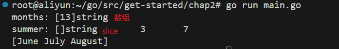
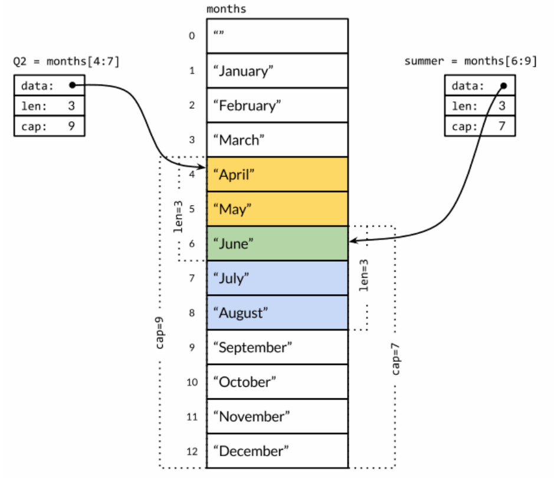
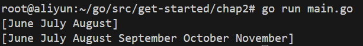

# 复合数据类型


## 数组

```go
// 数组的声明：指明数组长度与元素类型
var a [3]int // 所有元素被零值初始化

// 数组的初始化
var b = [3]int{11, 22, 33}   // 给出初始值
c := [...]int{111, 222, 333} // 省略数组长度
d := [...]int{9: 999}        // 指定索引为9的元素值999，同时数组长度被推断为10

// 数组的赋值
a = [3]int{1, 2, 3} // 只能严格赋予类型为[3]int的数组

// 数组的比较运算，只能是两个类型相同的数组
if a == b { // a == d则会导致编译错误
    fmt.Println("same array")
}

// 数组的range遍历
for i, v := range b {
    fmt.Printf("%d\t%d\n", i, v)
}

// 数组作为参数传递：不会像C/C++一样被解析为数组指针，而是传入整个副本
func zero(ptr *[32]byte) { // 因此要在函数中修改数组，需要显式地传入数组指针
    *ptr = [32]byte{}
}

// 数组的打印
fmt.Println(a) // [1 2 3]
```


## slice

slices是变长序列。声明数组时不指定长度，得到的就是slice。

```go
func main() {
	months := [...]string{  // 这是一个数组
		1:  "January",
		2:  "February",
		3:  "March",
		4:  "April",
		5:  "May",
		6:  "June",
		7:  "July",
		8:  "August",
		9:  "September",
		10: "October",
		11: "November",
		12: "December",
	}
	summer := months[6:9]	// 对数组切片得到slice
	if &summer[0] == &(months[6]) {   // slice共享数组的底层存储，是对数组子序列的引用
		fmt.Printf("months: %T\n", months)
		fmt.Printf("summer: %T\t%d\t%d\n", summer, len(summer), cap(summer))
		fmt.Println(summer)
	}
}
```



### slice的底层设计

slice共享数组的底层存储，是对数组子序列的“引用”。slice由三部分组成：

- 指针，指向底层数组的某个元素（slice的第一个元素）
- 长度，slice中元素的个数
- 容量，底层数组从slice的开始位置到最后一个元素的长度（即slice如果要扩展，最多能提供多少容量）



---

要正确地使用slice，需要记住尽管底层数组的元素是间接访问的，但是 slice对应结构体本身的指针、长度和容量部分是直接访问的。

slice并不是一个纯粹的引用类型，它实际上是一个类似下面 结构体 的聚合类型：

```go
type IntSlice struct { // 以[]int切片为例
    ptr *int
    len, cap int
}
```


### slice的创建

```go
// 1. 从字面量创建切片（类似数组声明，不指定长度）
fruits := []string{"apple", "banana", "cherry"}

// 2. 从数组或切片创建切片: [m:n]操作（因为不涉及到拷贝操作，因此耗费常量时间）
summer := months[6:9]

// 3. make函数: make([]type, len, cap)
slice1 := make([]int, 5)       
slice2 := make([]int, 3, 5)   

// 4. 空切片nil
var a []int
```

#### 切片的拓展

由slice的底层实现可知，slice是对底层数组对象的引用。slice的长度代表的只是slice的元素个数，而slice的容量取决于底层数组的长度。而从某个slice创建切片时，最多能从该slice得到多长的切片并不取决于slice的长度，而是容量（底层数组的长度）：

```go
//...
summer := months[6:9] // slice长度只有3
fmt.Println(summer)
longSummer := summer[:6] // 切片操作超过长度，但不超过容量，得到拓展的切片
fmt.Println(longSummer)
//...
```



#### nil切片

- 空切片，是指一个长度为0的切片

- nil切片，是指没有指向任何底层数组的切片，其长度、容量均为0

```go
var a []int  // 零值初始化为nil切片
b := []int{} // 已分配了一个长度为0的底层数组，不是nil切片
```

**没有初始值的类似切片、map的复合数据结构，都会被零值初始化为nil**


### append函数

- append函数可以向slice末尾追加元素，会使长度+1

- append函数对于slice底层存储的管理与C++的vector类似，当slice底层空间/容量不足以追加元素时，会另外分配一块内存空间用于slice的拓展，该空间的容量是之前的两倍

- 如果append操作会导致分配新的存储空间，append函数不会自动更新slice的底层指针，因此需要使用append的返回值进行显式地更新：

  ```go
  runes = append(runes, r)
  runes = append(runes, r1, r2, r3)  // 追加多个元素
  runes = append(runes, runes...)  // 追加整个slice


### slice的内存技巧

#### [:0]获取空切片

```go
students := []string{"Alice", "Bob", "Carl", "David"}
candidate := students[:0] // 空切片指向students的第一个元素
```

#### copy函数实现删除操作

`func copy(dst, src []T) int`

- `dst` 是目标切片，即要复制到的切片。

- `src` 是源切片，即要复制的切片。
- 返回值是复制的元素数目

```go
func remove(slice []int, i int) []int {
    copy(slice[i:], slice[i+1:])
    return slice[:len(slice)‐1]
}

func main() {
    s := []int{5, 6, 7, 8, 9}
    fmt.Println(remove(s, 2)) // "[5 6 8 9]"
}
```


## Map

map是对哈希表的引用，无序存放着key/value对的集合。map的类型：`map[K]V`。

**WARNING：**键的类型必须是可以使用`==`运算符进行比较的类型！因为map在哈希表中对键的查找，需要通过比较来进行。

#### map的创建

```go
// make函数创建空map
ages := make(map[string]int)

// 使用map字面值创建map
ages := map[string]int{
    "Alice": 16,	//逗号
    "Bob": 18, 		//最后也要加逗号
}
```

#### map的使用

```go
// 查询 & 修改
aliceAge := ages["Alice"] // 查找不存在key返回value的零值
ages["Alice"]++

// 删除
delete(ages, "Alice")

// 不能对map元素取值 <- map元素不是变量，map变大后内存空间可能会被重新分配
_ = &ages["bob"] // compile error

// map的range循环：range返回key, value
var names []string
for name := range ages { // 不关心range返回的第二个值，直接忽略
	names = append(names, name)
}
sort.Strings(names) //import "sort"
for _, name := range names { // 不关心range返回的第一个值，需要用_取代
	fmt.Printf("%s\t%d\n", name, ages[name])
}
```

#### map的零值nil

即没有指向任何哈希表的map。

map上的大部分操作，包括**查找、删除、len和range**循环都可以安全工作在nil值的map上，它们的行为和一个空的map类似。但是向一个nil值的map存入元素将导致一个panic异常：

```go
ages["carol"] = 21 // panic: assignment to entry in nil map
```

#### map查询key是否存在

使用key作为下标可以在map中查询对应value值，该查询操作会返回两个值：

- key对应的value值。key不存在则返回value的零值
- 一个布尔值，指示key是否存在于map中

```go
age, ok := ages["bob"] 
if age, ok := ages["bob"]; !ok { /* ... */ }
```

#### 布尔型value的map作为集合使用

```go
names := map[string]bool
if !names["Alice"] { // 布尔型的零值为false
    names["Alice"] = true
}
```


## 结构体

- 通常使用类型声明给结构体取名字
- 首字母大写的结构体以及结构体成员是**导出**的
- 结构体 & 结构体指针都是用点操作符访问成员，go语言没有`->`操作符

```go
type Employee struct {  // Employee及其所有成员都是导出的
    ID int
    Name, Address string
    DoB time.Time
    Position string
    Salary int
    ManagerID int
}

type tree struct {  // 不是导出的
    value int
    left, right *tree
}

var Alice Employee
var bestEmployee *Employee = &Alice
Alice.Position = "Manager"
bestEmployee.Position = "Senior " + bestEmployee.Position
```

#### 函数返回结构体指针

返回的结构体指针是左值，可以直接进行赋值操作

```go
var Alice Employee

func getEmployee() *Employee{  // 返回的是结构体指针，类似引用传递，是左值
	return &Alice
}
func getEmployee2() Employee{	// 返回的是结构体，是值传递，是右值
	return Alice
}

func main() {
	getEmployee().ID = 12345
    getEmployee2().ID = 23456  // 错误，不能对右值赋值
	fmt.Println(Alice)
}
```

#### 用结构体字面值初始化

```go
// 给出所有成员的初始值，按成员顺序赋值
btree := tree{-1, nil, nil}  
// 给出指定成员的初始值，其他成员零值初始化
Bond := Employee{ID: 007, Name: "James Bond", Position: "Top Killer"} 
```

### 结构体嵌入与匿名成员

```go
type Point struct {
    X, Y int
}
type Circle struct {
    Center Point // 声明了结构体成员的名字，此后访问该结构体中的成员，就需要通过该名字访问
    Radius int
}
type Wheel struct {
    Circle Circle // 声明了结构体成员的名字，此后访问该结构体中的成员，就需要通过该名字访问
    Spokes int
}

var w Wheel
w.Circle.Center.X = 8
w.Circle.Center.Y = 8
w.Circle.Radius = 5
w.Spokes = 20
```

#### 匿名成员

结构体嵌套会导致成员访问变得繁琐。可以通过**匿名成员**，使得访问嵌套结构体中的成员不用写出完整路径，这种机制叫做**提升/promote**。

- 匿名成员依旧可以通过类型名字访问
- 匿名成员并不能简化嵌套结构体繁琐的字面值

```go
type Circle struct {
    Point	// 只声明成员类型，不指定名字
    Radius int
}
type Wheel struct {
    Circle  // 只声明成员类型，不指定名字
    Spokes int  // Spokes：辐条
}

var w Wheel
w.X = 8 // w.Circle.Point.X = 8   still works，没有取成员名字但是依旧通过可以结构体的本身的名字访问
w.Y = 8 // w.Circle.Point.Y = 8   still works，没有取成员名字但是依旧通过可以结构体的本身的名字访问
w.Radius = 5 // equivalent to w.Circle.Radius = 5
w.Spokes = 20

w = Wheel{8, 8, 5, 20} // compile error: unknown fields
w = Wheel{X: 8, Y: 8, Radius: 5, Spokes: 20} // compile error: unknown fields
w = Wheel{Circle{Point{1, 2}, 10}, 12} // 依旧繁琐
```

#### 匿名成员的导出规则

当一个导出的结构体匿名嵌入一个未导出的结构体时，未导出的结构体的导出字段会被提升到导出的结构体的命名空间中。这意味着包外部可以通过导出的结构体间接访问这些导出字段。
