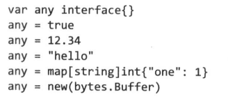
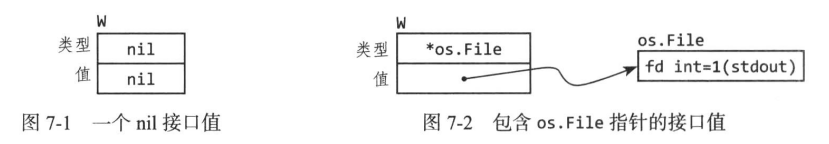
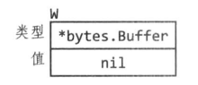
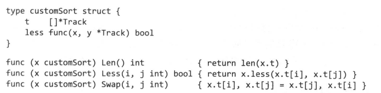
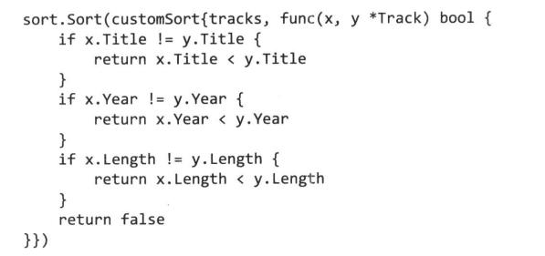

# 接口

关于接口首先要了解两个概念：具体类型 vs 抽象类型

#### 具体类型

指定了其中数据的精确布局，以及基于此的内部操作。也就是说，你知道这个类型是什么，其中有哪些数据，这些数据代表什么，又有哪些操作。

#### 抽象类型

接口就是一种抽象类型，对于抽象类型，你不知道其中精确的数据布局以及基于这些数据的操作。你只知道这个接口能够做什么，提供了哪些方法。

### 理解接口：接口即约定

在 Go 语言中，接口（interface）可以理解为一种 **约定** 或 **协议**，用于定义一种行为标准，而不具体实现该行为。其他类型只要**实现了接口规定的方法**，就满足了该接口的“约定”，可以被当作该接口类型来使用。

---

比如说我们定义两个接口，一个“牛”，一个“马”。我们**约定**：

- 会牛叫的，会耕地的就是“牛”
- 会马叫的，会驮人的就是“马”

那么现在，有一个具体类型叫做“牛马”，它这四样东西都会 --> 那么我们就既能把它当作“牛”，来用也能把它当作“马”来用

#### 接口也是抽象

`io.Writer` 是一个广泛使用的接口，它负责所有可以写入字节的类型的抽象，包括文件、内存缓冲区、网络连接、HTTP 客户端、打包器（archiver）、散列器（hasher）等。

`io.Reader` 就抽象了所有可以读取字节的类型

`io.Closer` 抽象了所有可以关闭的类型，比如文件或者网络连接。

#### 接口的实现

接口是一个抽象类型，而一个抽象类型是没有具体实现的。<u>我们说“接口即约定”，那么接口的实现，通常是通过使一个具体类型满足该约定（拥有规定的方法），来将这个具体类型实现为抽象的接口类型。</u>简单说，如果一个具体类型拥有接口规定的方法，那么这个具体类型就是该接口的实现；如果这个类型还满足其他接口的方法，那么它也可以同时作为很多接口的实现。

---

**注意：**如果某个接口的方法接收者是指针类型`*T`，那么我们只能说是指针类型`*T`而不是类型`T`实现了这个接口。而且这种接收者为指针的情况很常见，因为经常在接口方法中会涉及到修改接收者内部的数据。


### 空接口类型

空接口类型`interface{}`由于没有任何方法，也就意味着任何类型都可以看作它的实现：



- 但正是由于它没有任何方法，我们没有办法访问其中的数据。这需要使用后面**类型断言**的方法
- `fmt.Println`之所以能打印任何类型，就是因为其参数是空接口类型


### 判断具体类型是否实现某接口

可以用如下的方法来断言：

```cpp
// 如果 *bytes.Buffer 没有实现 io.Writer 接口，下列语句会报错
var _ io.Writer = (*bytes.Buffer)(nil)  
```

- 使用`_`是因为我们不需要这个变量名
- 使用`nil`是因为空类型不会被分配内存空间，但是却有类型该有的方法


### 接口值

任何类型都有值，函数有函数值，接口也有接口值。接口值包含两部分：

1. 接口的动态类型（由**类型描述符**指示）：一个具体类型（例如 `MyStringReader`)
2. 接口的动态值：该类型对应的一个值（例如 `MyStringReader`类型的变量`sr`）

**接口的的零值：**nil可以代表接口的零值，此时接口的动态类型和动态值都是nil

#### 空接口 vs nil接口

空接口描述某个接口是`interface{}`这样一个特殊的接口类型，这如同我们说某个接口是`io.Reader`接口一样，我们只是在**描述接口的类型**。

而nil接口，我们是在**描述接口的值**。也就是我们已经知晓这个接口的类型，现在说它是nil，是在说它的**值**是nil。

> 我们在描述接口时，一定要分清我们指的是类型还是值，值是值，类型是类型。一定要分清！

#### 接口的赋值

注意一个接口的结构：类型 + 值

```cpp
var w io.Writer  // 此时 w == nil
w = os.Stdout	// os.Stdout是一个*os.File类型
w.Write([]byte("hello")) // 通过接口调用Write方法
    
// 查看接口的动态类型
fmt.Printf("Type of w: %T", w)  // *os.File
```



#### 接口值的比较

- 当两个接口的动态类型和动态值都相同时，两个接口相等（`==`比较返回`true`）
- 这需要接口的动态类型可以相互比较，例如如果接口的动态类型是切片，这时用`==`, `!=`比较会导致报错
- 总之，接口可以比较，但是也有崩溃的可能

#### 注意非空接口的动态值为空！！！

```cpp
var w io.Writer = new(bytes.Buffer)  // 此处 new(bytes.Buffer) 返回的是一个字节切片的零值，而切片的零值是nil
```



此时接口的动态类型不为nil，但是动态值为nil。这导致该接口值不会被判定为nil，因此也被允许调用动态类型的方法

- 因此就相当于在使用nil作为接收者来调用动态类型的方法
- 所以，如果这个动态类型的方法不允许接收者为nil，那么此时的方法调用就会出错


### 接口具体类型的方法重写

有些情况，我们需要对某个接口实现多个具体类型，而这些具体类型之间的区别只有少数的方法。这时有两种代码复用的思路：

#### 1. 通过结构体嵌套 + 同名函数

Interface接口拥有Less方法，默认是对序列进行升序排序。如果我们想要使用`sort.Sort`函数进行降序排序，就可以另外实现一个Interface接口，并将Less实现为相反的效果：

1. 定义一个结构体reverse，其中嵌套Interface接口，这意味着reverse会继承接口的所有方法
2. 重写Less方法，将`i, j`交换位置后调用嵌入的Interface接口的Less方法

```cpp
type reverse struct {
	// This embedded Interface permits Reverse to use the methods of
	// another Interface implementation.
	Interface
}

// Less returns the opposite of the embedded implementation's Less method.
func (r reverse) Less(i, j int) bool {
	return r.Interface.Less(j, i)
}
```

#### 2. 结构体中添加函数值成员

以sort.Sort函数为例，它接受一个sort.Interface接口，然后利用接口的`Len, Less, Swap`三个方法对其中的数据序列排序。当我们需要实现多个只有`Less`方法不同的接口时，可以按照如下方式：

1. 定义一个结构体`customSort`
2. 结构体中有一个函数值成员`less`，存储需要变化的方法的具体实现
3. 实现接口需要满足的方法，并且在需要变化的less方法中，调用内部的`less`（也就是相当于封装，`customSort`的`less`方法的具体实现存放在函数值成员`less`中）
4. 在声明`customSort`对象时再传入具体的less方法






# 常用标准库

## bufio包

`bufio` 是 Go 标准库中的包，用于高效的缓冲输入输出操作。它通常用于处理 I/O 密集型任务，比如读取和写入文件、网络数据流等，因为它通过缓冲区可以减少系统调用次数，提高程序性能。下面是 `bufio` 包中几个常用的类型和方法：

### 1. `bufio.Reader`
`bufio.Reader` 提供了缓冲读取功能，允许你以更高效的方式从数据流中读取内容。常见的用法包括逐行读取、按分隔符读取等。

```go
file, _ := os.Open("example.txt")
defer file.Close()

reader := bufio.NewReader(file)
line, err := reader.ReadString('\n') // 读取直到遇到换行符
if err != nil {
    // 处理错误
}
fmt.Println(line)
```

常用方法：
- `Read(p []byte) (n int, err error)`: 读取字节到 `p`，返回读取的字节数和错误。
- `ReadString(delim byte) (string, error)`: 读取直到遇到 `delim` 分隔符并返回字符串。
- `ReadBytes(delim byte) ([]byte, error)`: 读取直到遇到 `delim`，返回字节切片。
- `ReadLine()`: 逐行读取内容，不包含行尾的换行符。

### 2. `bufio.Writer`
`bufio.Writer` 通过缓冲写入，避免频繁调用底层写操作（比如文件或网络写入）。适用于写入频繁的场景。

```go
file, _ := os.Create("output.txt")
defer file.Close()

writer := bufio.NewWriter(file)
writer.WriteString("Hello, World!\n")
writer.Flush() // 将缓冲区中的数据写入底层
```

常用方法：
- `Write(p []byte) (n int, err error)`: 将字节数据 `p` 写入缓冲区。
- `WriteString(s string) (n int, err error)`: 写入字符串。
- `Flush()`: 将缓冲区中的数据全部写入底层。

### 3. `bufio.Scanner`
`bufio.Scanner` 提供一种简单的逐行读取方式，通常用于读取标准输入或文本文件。

```go
file, _ := os.Open("example.txt")
defer file.Close()

scanner := bufio.NewScanner(file)
for scanner.Scan() {
    line := scanner.Text() // 获取当前行
    fmt.Println(line)
}
if err := scanner.Err(); err != nil {
    fmt.Fprintln(os.Stderr, "读取错误:", err)
}
```

常用方法：
- `Scan() bool`: 读取下一行，如果有内容返回 `true`。
- `Text() string`: 返回读取的内容（通常是每行内容）。
- `Bytes() []byte`: 返回读取的字节切片。

### 使用场景

- **缓冲 I/O 操作**: 通过减少系统调用的次数来提高性能。
- **逐行读取文件**: 适合处理文本文件或日志文件。
- **网络数据读取**: 在处理网络数据时避免频繁读取，提升效率。


`bufio.Scanner` 的默认分隔方式是按行读取，但可以通过自定义分隔函数来改变这一行为。例如，`bufio.ScanWords` 函数可以让 `Scanner` 按单词分隔。

### 4. `ScanWords`

`ScanWords` 是一个分隔函数，内置在 `bufio` 包中，用于让 `Scanner` 按单词进行分割。每次 `Scan()` 调用后，`Text()` 会返回一个单词，直至数据流末尾。

#### 示例代码

```go
package main

import (
    "bufio"
    "fmt"
    "strings"
)

func main() {
    text := "Hello, this is an example of bufio.ScanWords usage."
    scanner := bufio.NewScanner(strings.NewReader(text))

    // 设置分隔函数为 ScanWords
    scanner.Split(bufio.ScanWords)

    // 每次调用 Scan()，都会扫描下一个单词
    for scanner.Scan() {
        word := scanner.Text() // 获取当前单词
        fmt.Println(word)
    }

    if err := scanner.Err(); err != nil {
        fmt.Println("扫描错误:", err)
    }
}
```

#### 工作原理

- `ScanWords` 将输入流分割成一个个单词，以空格、制表符、换行等空白字符作为分隔符。
- 如果要按其他条件分隔（如标点、特定字符），可以自定义 `Split` 函数。

#### 自定义分隔函数
例如，可以自定义一个分隔函数，按句号分隔：

```go
scanner.Split(func(data []byte, atEOF bool) (advance int, token []byte, err error) {
    for i := 0; i < len(data); i++ {
        if data[i] == '.' {
            return i + 1, data[:i], nil
        }
    }
    return 0, nil, nil // Continue scanning if no '.' found
})
```

这种功能适用于需要灵活控制扫描行为的场景，例如按特殊标记分割日志内容。


## flag包

Go 的 `flag` 包提供了多种函数来定义和解析命令行标志，主要函数如下：

### 1. 定义标志函数
这些函数用于定义不同类型的标志（命令行参数），每个函数返回一个指向变量的指针。

这一步是在注册需要关注的命令行参数，并且把命令行参数与某个对象关联起来。是作为一个`Flag`对象加入到`FlagSet`集合中。

- **`flag.Bool`**  
  定义一个布尔类型的标志。
  
  ```go
  var debug = flag.Bool("debug", false, "Enable debugging mode")
  ```
  使用方法：`-debug=true` 或 `-debug=false`
  
- **`flag.Int`**  
  定义一个整型标志。
  
  ```go
  var port = flag.Int("port", 8080, "Port to run the server on")
  ```
  使用方法：`-port=8080`
  
- **`flag.Float64`**  
  定义一个 `float64` 类型的标志。
  ```go
  var timeout = flag.Float64("timeout", 5.0, "Timeout in seconds")
  ```
  使用方法：`-timeout=2.5`

- **`flag.String`**  
  定义一个字符串类型的标志。
  
  ```go
  var host = flag.String("host", "localhost", "Hostname of the server")
  ```
  使用方法：`-host=localhost`
  
- **`flag.Duration`**  
  定义一个 `time.Duration` 类型的标志，便于设置时间间隔。
  
  ```go
  var interval = flag.Duration("interval", time.Second, "Interval duration")
  ```
  使用方法：`-interval=2s`（支持带单位的时间格式，如 `1m`, `2h` 等）

### 2. 自定义标志
使用 `flag.Var` 可以注册实现了 `flag.Value` 接口的变量，以支持自定义标志类型。

```go
flag.Var(&ip, "ip", "Specify an IP address")  // 假设 `ip` 实现了 `flag.Value` 接口
```

### 3. 解析和帮助函数

- **`flag.Parse`**  
  解析命令行参数。必须在定义了标志后调用这个函数，通常放在 `main` 函数中。
  ```go
  flag.Parse()
  ```

- **`flag.Args`**  
  返回命令行参数中未解析的部分，即标志参数之后的那些参数，以字符串切片的形式返回。
  ```go
  extraArgs := flag.Args()
  ```

- **`flag.Arg`**  
  返回指定索引位置的未解析参数。
  
  ```go
  firstArg := flag.Arg(0)
  ```
  
- **`flag.NArg`**  
  返回未解析参数的数量。
  ```go
  count := flag.NArg()
  ```

- **`flag.Usage`**  
  
  打印注册的所有命令行参数信息。
  
  也可以自定义标志的帮助信息输出，以直接赋函数值的方法覆盖默认的帮助信息。
  
  ```go
  flag.Usage = func() {
      fmt.Println("Usage of the program:")
      flag.PrintDefaults()
  }
  ```

### 4. 设置和获取标志值的函数

- **`flag.Set`**  
  以字符串形式设置标志值，适用于需要在程序运行期间动态改变标志值的场景。
  
  ```go
  flag.Set("port", "9090")
  ```
  
- **`flag.Lookup`**  
  根据标志名称查找 `flag.Flag` 对象，返回的信息可用于获取或修改标志的状态。
  ```go
  f := flag.Lookup("port")
  fmt.Println(f.Value)  // 打印标志当前值
  ```

