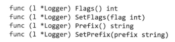

# 方法

### 方法的接收者只能是具体类型

#### 所谓**接收者**：

方法也就是一个普通的函数绑定到一个对象上，而这个对象就叫做”接收者“，表示这个对象接收/拥有了这个函数。

#### 所谓**具体类型**：

- 具体的**值类型**是像 `int`、`struct`、`float64` 这样的非指针类型，比如 `Point`。
- 具体的**指针类型**是像 `*Point` 这样的指向值类型的指针。
- 简单说，**类型别名**不算是具体类型。类型别名也不能作为方法的接收者。

```cpp
// 结构体对象Point（表示点的二维坐标）
type Point struct {
	X, Y float64
}

// ERROR: invalid receiver type Point2
// type Point2 *struct {
// 	X, Y float64
// }

// func (p Point2) Distance(q Point) float64 {
// 	return math.Hypot(p.X-q.X, p.Y-q.Y)
// }

// 方法的名字：Point.Distance
// 处于Point类型对象的命名空间
func (p Point) Distance(q Point) float64 {
	return math.Hypot(p.X-q.X, p.Y-q.Y)
}

// 方法的名字：(*Point).Distance2
func (p *Point) Distance2(q *Point) float64 {
	return math.Hypot(p.X-q.X, p.Y-q.Y)
}
```

而 `Point2` 作为 `*struct { X, Y float64 }` 的别名，不属于具体的值类型，也不属于具体的指针类型，而是指针类型的别名。因此，Go 不允许使用 `Point2` 作为方法的接收者类型。

这种限制存在是因为 Go 需要保证方法接收者的类型一致性，避免类型别名或多重指针导致的不必要复杂性。

### 指针接收者

某个对象在调用它的方法时，会将它自身的一个副本作为参数传递给方法。因此很多时候方法需要用到指针作为接收者（就像上面的`(*Point).Distance2`）：

- 当需要在方法中修改对象的内部数据
- 对象本身较大，不希望每次调用方法时都拷贝一次副本

---

**Warning：**按照go语言的编程习惯，如果某个对象有一个方法使用了指针接收者，那么所有的方法都应该使用指针接收者。

#### 隐式转换

当方法定义时使用的是指针接收者，而在方法调用时使用的是值接收者，那么go语言会**自动获取值接收者的地址**，然后再调用方法

```cpp
func (p *Point) Distance2(q *Point) float64 {
	return math.Hypot(p.X-q.X, p.Y-q.Y)
}

p := Point{1, 1}
q := Point{1, 4}
dist := p.Distance2(&q)  // 隐式转换为 *p
    
// 注意，只有调用方法时的接收者是变量（可以取地址的对象）时，go才会对其进行隐式转换
// 错误示例：
dist := Point{1, 1}.Distance2(&q) // 这里的Point{1, 1}其实是Point类型的字面值，而字面值是没有地址的
```

反之，当方法定义时使用的是值接收者，而在方法调用时使用的是指针接收者，那么go语言会**自动对指针接收者解引用**，然后再调用方法

```cpp
func (p Point) Distance(q Point) float64 {
	return math.Hypot(p.X-q.X, p.Y-q.Y)
}

p := Point{1, 1}
q := Point{1, 4}
dist := (&p).Distance2(q)  // 隐式转换为 p
```

### 嵌套成员的方法调用

当结构体匿名嵌套另一个结构体时，类似于可以直接以嵌套结构体的成员名字访问，也可以直接调用嵌套结构体的方法：

```cpp
// ...承接上面部分

type Circle struct {
	Point  // 注意这里是匿名结构体成员
	Radius int
}

p := Circle{Point{1, 1}, 5}
q := Circle{Point{1, 4}, 5}
fmt.Println(p.Distance(q.Point))   //  不需要p.Point.Distance(q.Point)
```

#### 继承 or 组合

- 以这种方式来调用方法，会使得这个外层结构体和内层结构体看起来像是继承的关系（派生类可以直接调用基类的方法）

- 但是这是一种"has a"即组合的关系（外层结构体有一个内层结构体 / 内层结构体只是外层结构体的一个成员）
- 通过这种组合的关系，一个对象可以拥有很多子对象，同时拥有所有这些子对象的方法的合集

#### 具体实现

之所以可以从外层结构体直接方便地调用内层结构体的方法，是因为编译器会为这些内嵌的字段生成类似如下的包裹函数：

```cpp
func (Circle p) Distance(q Point) float64 {
	return p.Point.Distance(q)  // 注意，当通过Circle对象调用Distance方法时，Distance方法的实际接收者并不是Circle而是Circle.Point
}
```

#### 同名方法重写（similar to 函数重载）

如果外层结构体定义了同名方法，Go 会优先使用外层结构体的方法。这样就可以实现覆盖或“重定义”嵌入方法的效果。

```cpp
type Inside struct {}

func (i Inside) Hello() {
	fmt.Println("hello from inside")
}

type Outside struct {
	Inside
}

func (o Outside) Hello() {  // 同名方法，外层覆盖内层
	fmt.Println("hello from outside")
}
```

**使用场景：**

- 当存在一个类型A时，我们需要另一个类型B，但是需要B拥有A中的所有方法，但是仅有某一个方法需要改变。这时就可以把A嵌套在B中，这样可以继承A的所有方法。然后再将需要改变的方法重写。


### 方法值

同函数值一样，不同的是，方法值包含了两个要素

- 函数本身
- 函数绑定的接收者

```cpp
p := geometry.Point{1, 1}
q := geometry.Point{1, 4}
distanceFromP := p.Distance  // 此时p的值已经被拷贝了一份作为一个隐形实参（方法的接收者）保存在方法值中
fmt.Println(distanceFromP(q))  // distanceFromP的调用看起来和函数调用没有区别
```

#### 方法表达式

上面的方法值拥有一个默认的实参（接收者），而方法表达式没有，只是在调用时会把第一个实参的值赋给接收者，从而对很多不同的接收者调用该方法：

```cpp
p := geometry.Point{1, 1}
q := geometry.Point{1, 4}
dist := geometry.Point.Distance  // 方法表达式
fmt.Println(dist(p, q))  // 接收者作为第一个参数传入
```


### 位向量

go中没有集合set，通常会用`map(T)bool`来表示集合，但是当集合元素为小的正整数时，可以用位图存储

- 位图在go里面叫做位向量，因为位图本身是一个整型切片，而切片就是数组、向量
- 对位向量的集合操作，通过绑定的方法来实现

```CPP
package bitmap

import (
	"bytes"
	"fmt"
)

type IntSet struct {
	words []uint64 // 每一行存64个数字
}

// 判断整数是否在集合中
func (s *IntSet) Has(num int) bool {
	if num < 0 {
		return false
	}
	word, bit := num/64, uint(num%64)
	return word < len(s.words) && s.words[word]&(1<<bit) != 0
}

// 加入集合
func (s *IntSet) Add(num int) {
	if num < 0 {
		return
	}
	word, bit := num/64, uint(num%64)
	if word < len(s.words) {
		s.words[word] |= 1 << bit
	} else {
		s.words = append(s.words, 1<<bit)
	}
}

// 集合求并集并存放进接收者集合中
func (s *IntSet) Union(t *IntSet) {
	for i, iword := range t.words {
		if i < len(s.words) {
			s.words[i] |= iword
		} else {
			s.words = append(s.words, iword)
		}
	}
}

// 打印集合中的内容
func (s *IntSet) String() string {
	var buf bytes.Buffer
	buf.WriteByte('{')
	for i, iword := range s.words {
		if iword == 0 {
			continue
		}

		for j := 0; j < 64; j++ {
			if iword&(1<<j) != 0 {
				if buf.Len() > len("{") {
					buf.WriteByte(' ')
				}
				fmt.Fprintf(&buf, "%d", i*64+j)
			}
		}
	}
	buf.WriteByte('}')
	return buf.String()
}
```

#### `*IntSet`的`String`方法

当某个对象拥有String方法时，使用`fmt.Println`不会默认打印对象的原始数据，而是会调用对象的`String`方法来打印

- 注意这里位向量的`String`方法的接收者是`*IntSet`而不是`IntSet`，在通过`fmt.Println`打印时必须传递指针！


### 封装

go语言**只有一种**机制来控制名字的可见与否，注意这是**唯一的控制名字可见性的机制**：

- 首字母大写，这个名字是导出的并且在包外可见
- 首字母小写，这个名字只在包内可见

所以：

- 要封装一个**对象**，必须要使用结构体，结构体中首字母小写的成员就是被封装的，不能从外部直接访问
- 要封装某个类型的**方法**，则需要方法的名字首字母小写，则这个方法不能在定义这个类型的包之外被访问

#### 结构体 —— 变量的封装

前面的集合之所以要把切片放到一个结构体里面，就是因为我们需要封装集合的数据，但是暴露集合的方法，也就是需要：

- 切片的名字是非导出
- 方法的名字是导出
- 进而，方法绑定的对象也需要是导出的，而由于结构体的特性，导致这个对象最合适的数据类型就是结构体

```cpp
type IntSet struct {
	words []uint64
}
```

#### 封装的单元是包

而不是类型！这是由于go语言控制名字可见性的机制所决定的。

对比C++有很大区别，C++封装的单元是类，被封装的变量/方法在类外不能被访问。而go是包外不能被访问。

#### 封装方法的命名规则

通常我们会把单纯获取某个成员的值，或者设置某个成员的值的方法，叫做getter和setter。

而getter函数需要加上`Get`前缀，而setter方法一般会加上`Set`前缀：

