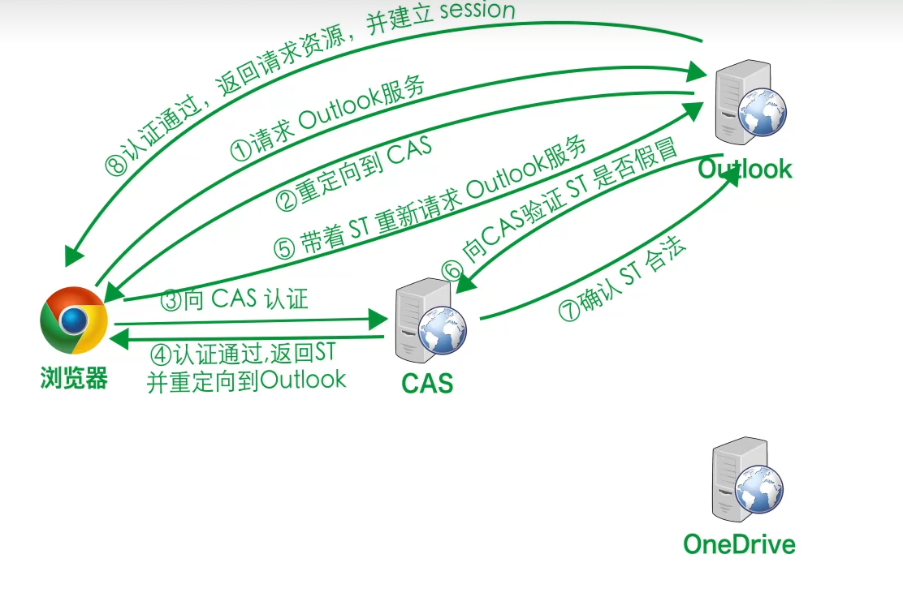

# 单点登录SSO

网站通过CAS（Central Autentication Service）管理单点登陆，单点登陆流程如下：

1. 用户名密码 、手机号验证码等方式，反正就是验证用户身份（对应下图1步骤3）。
2. 第一次CAS验证通过后，CAS给客户端发放TGT认证票据（cookie形式）。
3. 之后可以（在票据过期之前）根据这个票据访问网站所有服务，不再需要重复登陆。

---

#### 1. 单点登陆微软outlook服务

#### 2. 免登陆访问微软OneDrive服务

