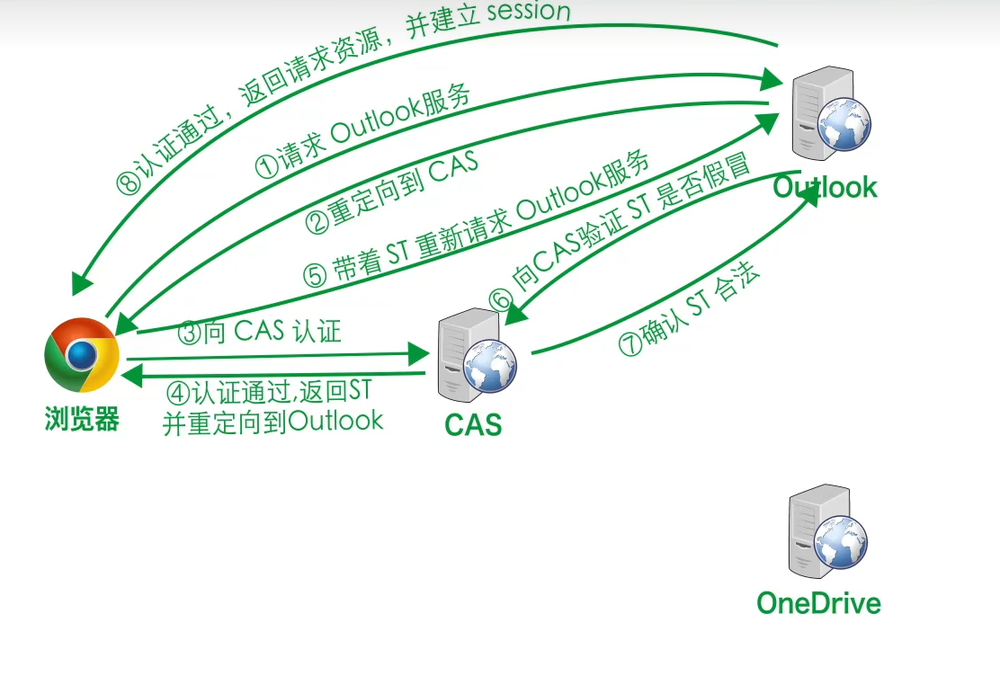
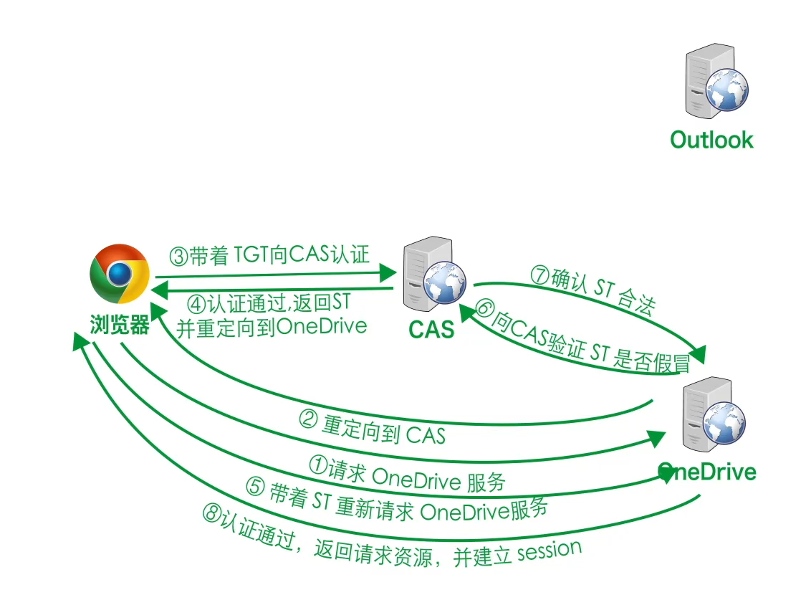
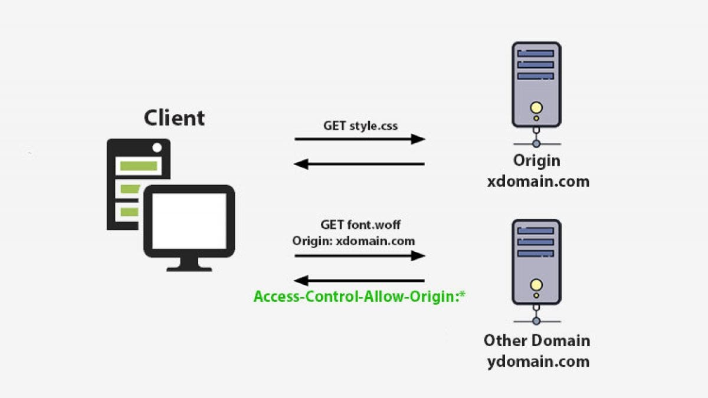

# 单点登录SSO

网站通过CAS（Central Autentication Service）管理单点登陆，单点登陆流程如下：

1. 用户名密码 、手机号验证码等方式，反正就是验证用户身份（对应下图1步骤3）。
2. 第一次CAS验证通过后，CAS给客户端发放TGT认证票据（cookie形式）。
3. 之后可以（在票据过期之前）根据这个票据访问网站所有服务，不再需要重复登陆。

---

#### 1. 单点登陆微软outlook服务



#### 2. 免登陆访问微软OneDrive服务




# 跨域请求

> **概要**
>  跨域请求（Cross-Origin Request）是指在网页中向不同源（Scheme、Host、Port 不全相同）的地址发起的请求，经常出现在 AJAX 调用、引用第三方 CDN 资源等场景；这样的请求会受到浏览器同源策略的限制。隐藏的问题主要包括 CSRF 等攻击，攻击者可利用用户的登录态在受信任站点执行操作。浏览器通过 SOP 阻止跨域读取敏感数据；服务端则可通过 CORS 配置和 CSRF 防护（如 CSRF Token、SameSite Cookie）来允许或限制合法的跨域请求，并防范伪造请求。

## 什么是跨域请求

### 术语定义

- **跨域请求** 指浏览器在页面中向不同源（协议、域名或端口任一不同就是不同源）的服务器发起的 HTTP 请求，不同源的请求被称为跨域请求。
- **CORS**（Cross-Origin Resource Sharing）是浏览器为安全地 *允许* 跨域请求而设计的机制，通过在服务端返回特定响应头来声明哪些源可访问资源 。
- **SOP 同源策略（Same-Origin Policy）** 是浏览器的安全机制，*阻止* 脚本在不同源间读取数据，防止恶意脚本窃取用户在其他站点的敏感信息。

### 跨域请求出现的场景

1. **前端通过 `fetch()` 或 `XMLHttpRequest` 调用第三方 API**
   - 比如在单页应用中从 `api.example.com` 获取数据，页面托管在 `app.example.com` 。
   - 比如前端通过k8s的api server的api获取pod列表相关数据，而网站并不在k8s集群中。
2. **引入第三方静态资源**
   - 如使用 CDN 加载图片、字体、脚本等，URL 与当前页面的源不同。
3. **跨域嵌入内容**
   - 使用 ``、`<script>`、`<iframe>` HTML标签直接加载外部资源（不受 SOP 限制），但脚本无法读取HTML标签加载的内容（受 SOP 限制） 。

## 跨域请求带来的安全隐患

### CSRF（跨站请求伪造 - Cross-Site Request Forgery）

- **场景**：用户在登陆银行账户时浏览器在短期内会存放用户在银行网站的cookie，如果用户访问完银行网站后随即访问另外的网站，而网站中的恶意代码（可能来自恶意网站本身，也可能是论坛类网站中其他恶意用户评论的内容）就可以读取浏览器中存放的cookie来对用户的银行账户进行操作。

- **定义：** CSRF 攻击通过诱导已登录用户浏览器自动携带 Cookie 向受信任站点发起伪造请求，使服务器误以为是合法用户操作，从而执行未授权操作 。
- **具体手段**：在恶意页面插入 ``，浏览器会携带 Cookie 发起删除操作 。

## 同源策略（SOP）

### 定义与作用

- SOP 限制不同源文档和脚本的交互。只有协议、域名、端口三者都相同，才被认为同源，脚本才能访问 DOM、Cookie、LocalStorage 等数据 。
- **作用**：隔离潜在恶意文档，减少跨站脚本（XSS）带来的数据泄露风险。

### 限制与放行

- 默认：所有跨域 AJAX 请求会被浏览器阻止读取响应内容。
- 放行：服务端在响应头中添加 `Access-Control-Allow-Origin`（可指定单个或 `*`）等 CORS 头，浏览器才允许脚本访问响应 。

## CORS

### 概览
CORS（Cross‑Origin Resource Sharing）通过在浏览器和服务器之间增设“许可对话”机制，确保只有被服务器明确允许的（由脚本发起的）跨源请求才能成功。它既允许前端灵活调用不同域的资源，又通过服务器端配置严格控制方法、头部和凭证的使用，从而保证安全性。

### 1. 什么是简单请求和需要预检的请求

- **简单请求（Simple Request）**  
  
  - 方法仅限于 GET、HEAD、POST  
  - 请求头仅限于 `Accept`、`Accept-Language`、`Content-Language`、`Content-Type`，且 `Content-Type` 值只能是 `application/x-www-form-urlencoded`、`multipart/form-data` 或 `text/plain`  （具体有哪些请求头很难记，那就记住**简单请求就是字面意思上的很简单的请求，请求所用到的头部都是一些基础的简单的头部，进行一些简单的资源获取、信息提交等操作**）
  - 浏览器直接带上 `Origin` 发起，服务器返回允许的源即可
  
  
  
- **需要预检的请求（Preflighted Request）**  
  
  - 方法或头部超出“简单”范围（比如 PUT、DELETE、自定义头部，或 `Content-Type: application/json`）  
  - 浏览器先发送一个 **`OPTIONS` 请求**（带上 `Origin`、`Access-Control-Request-Method`、`Access-Control-Request-Headers`），询问服务器允许的方法、源、头部等选项
  - 只有服务器在预检响应中返回允许的源、方法和头部，浏览器确认请求符合浏览器要求才会发送真正的请求
  
  

### 2. 简单请求流程

1. **浏览器发起请求**  
   - 在普通 AJAX 或 fetch 调用中自动附带 `Origin` 头  
2. **服务器响应并声明许可**  
   - 响应头中包含 `Access-Control-Allow-Origin`（指定允许的域或 `*`）  
   - 如需携带 Cookie，还要加上 `Access-Control-Allow-Credentials: true`   
3. **浏览器检查并暴露响应给脚本**  
   - 如果响应头许可通过，JavaScript 才能读取返回的内容；否则浏览器拦截，脚本拿不到数据

### 3. 预检请求流程

1. **浏览器发送预检 `OPTIONS` 请求**  
   - 包含 `Origin`、`Access-Control-Request-Method`（将要使用的方法）、`Access-Control-Request-Headers`（自定义头部列表）  
2. **服务器在预检响应中声明许可**  
   - `Access-Control-Allow-Origin`：允许的域  
   - `Access-Control-Allow-Methods`：允许使用的方法列表  
   - `Access-Control-Allow-Headers`：允许发送的自定义头部列表  
   - 可选 `Access-Control-Max-Age`：预检结果在客户端缓存的秒数  
3. **浏览器根据预检响应决定是否发送实际请求**  
   - 如果服务器许可，浏览器发起真正的跨域请求，过程同简单请求  
   - 否则直接失败，不会发起后续请求

### 4. 凭证（Cookies 与认证）控制

- 默认情况下，跨域请求**不携带** Cookie 或 HTTP 认证信息  
- 若需携带凭证，前端必须在 fetch/XHR 调用中设置 `credentials: 'include'`  
- 服务器响应必须包含 `Access-Control-Allow-Credentials: true`，且 `Access-Control-Allow-Origin` 不能是通配符 `*`

### 5. 安全要点

- **服务器主导许可**：所有跨域访问都由服务器在响应头中声明，浏览器仅负责执行，不可被客户端脚本修改  
- **严格预检**：复杂操作（如修改、删除）都需要额外的预检验证，防止恶意脚本未经授权执行敏感操作  
- **精细控制**：根据资源类型和调用场景，只开放必要的源、方法和头部，避免过度授权  

---

```go
// Go 语言示例：简单 CORS 中间件
func corsMiddleware(next http.Handler) http.Handler {
    return http.HandlerFunc(func(w http.ResponseWriter, r *http.Request) {
        w.Header().Set("Access-Control-Allow-Origin", "https://your.app.com")
        w.Header().Set("Access-Control-Allow-Methods", "GET,POST,OPTIONS")
        w.Header().Set("Access-Control-Allow-Headers", "Content-Type,Authorization")
        w.Header().Set("Access-Control-Allow-Credentials", "true")
        if r.Method == http.MethodOptions {
            w.WriteHeader(http.StatusNoContent)
            return
        }
        next.ServeHTTP(w, r)
    })
}
```

## CSRF 防护

### 防护原理

1. **CSRF Token**
   - 服务端为每个用户会话生成唯一、难以猜测的 Token，Token 在表单或请求头中传递，服务器校验后才执行操作，防止伪造请求。
2. **SameSite Cookie**
   - 设置 `Set-Cookie: SameSite=Lax` 或 `Strict`，浏览器在跨站点请求中不携带该 Cookie，可有效降低 CSRF 风险 。
3. **检查 Referer/Origin 头**
   - 服务端检查 `Origin` 或 `Referer` 是否来自信任域，拒绝跨站请求。

### 实践指南

- 对所有可能产生副作用的请求（如 POST、PUT、DELETE）都使用 CSRF Token。
- 对静态资源接口启用 CORS 白名单，对敏感 API 关闭或严格控制跨域访问。
- 配置 `Content Security Policy (CSP)` 策略，减少 XSS 漏洞，从根本上降低 CSRF 发生概率。


# 网站开发的前后端分离

### 一、什么是前后端分离

前后端分离是一种 Web 应用架构模式，指的是前端（用户界面和交互逻辑）与后端（业务逻辑和数据处理）相互独立、解耦开发、独立测试和部署的方式。前端通过 API（如 RESTful 接口）与后端进行通信。这种模式提升了团队协作效率，优化了性能与可维护性，但也需应对跨域通信、安全、Mock 数据、接口版本管理等挑战。

### 二、主要特点

- **独立开发**：前后端可并行开发，互不干扰。
- **接口通信**：前端通过 HTTP 请求（通常为 AJAX 或 Fetch）向后端获取 JSON 格式的数据。
- **前端负责 UI，后端负责数据**：前端处理页面展示和用户交互，后端专注于处理业务逻辑、存储数据等。

### 三、优点

- **提高开发效率**：前后端可同时进行，减少依赖等待。
- **职责分离清晰**：前端聚焦页面体验，后端聚焦逻辑处理。
- **技术栈灵活**：前后端可以使用各自最合适的技术。
- **利于团队协作**：接口文档清晰后，双方协作更高效。
- **有利于性能优化**：前端可部署在 CDN，加快响应速度。

### 四、缺点与挑战

- **跨域通信问题**：前端和后端部署在不同的域名/端口，需要 CORS 或代理解决跨域请求问题。
- **接口版本管理**：接口更新需维护兼容性，增加管理成本。
- **安全问题**：需要额外注意身份认证、权限控制、防止 CSRF/XSS 等安全风险。

## 五、常见实现方式

1. **RESTful API**  
   后端通过 GET/POST/PUT/DELETE 提供资源访问接口，返回 JSON 数据。

2. **单页面应用（SPA）**  
   使用 Vue、React 等框架构建前端应用，所有路由切换、数据更新在浏览器中完成，后端仅提供数据接口。

3. **Mock 数据/服务**  
   在后端接口未开发完成前，使用 Mock 工具模拟接口返回数据供前端调试。

### 六、常见部署方案

- 前端构建产物（HTML/CSS/JS）部署在静态服务器或 CDN。
- 后端部署在独立服务中，提供 API。
- 使用 Nginx 等反向代理工具将 `/api` 请求转发到后端，解决跨域问题。
- 使用 Docker/Compose 实现前后端统一部署与管理。

### 七、适用场景

- **中大型项目**：如后台管理系统、电商平台、社交网站等。
- **多终端共享后端**：Web、小程序、App 同时调用后端接口。
- **持续迭代发布**：前后端独立部署，降低上线风险。


# DDD项目结构（Domain Driven Design）

在领域驱动设计（DDD）中，项目结构的设计旨在清晰地分离业务逻辑、应用逻辑和基础设施，以增强系统的可维护性、可扩展性和测试性。这种结构通常采用分层架构，如洋葱架构（Onion Architecture）或六边形架构（Hexagonal Architecture），将系统划分为多个层次，每一层都有明确的职责和依赖关系。

## 🔍 各层职责详解

### 1. 领域层（Domain Layer）

领域层是整个系统的核心，负责表达业务概念、业务状态和业务规则。它不依赖于其他层，确保业务逻辑的纯粹性。

- **实体（Entities）**：具有唯一标识的对象，表示业务中的重要概念。
- **值对象（Value Objects）**：不具有唯一标识，表示一些属性的组合，如地址、货币等。
- **聚合根（Aggregates）**：一组相关对象的集合，具有统一的边界和一致性规则。
- **仓储接口（Repository Interfaces）**：定义持久化操作的接口，不涉及具体实现。
- **领域服务（Domain Services）**：封装无法归属到实体或值对象的业务逻辑。

### 2. 应用层（Application Layer）

应用层负责协调领域对象完成特定的业务用例，处理用户的请求，调用领域层的对象来完成业务逻辑。

- **命令（Commands）**：表示用户意图的操作请求。
- **查询（Queries）**：用于读取数据的请求。
- **处理器（Handlers）**：处理命令和查询，调用相应的领域对象。
- **应用服务（Application Services）**：封装业务用例的实现，协调领域层和基础设施层。[Microsoft Learn+2Medium+2Medium+2](https://blog.vincentboots.nl/net-clean-architecture-with-domain-driven-design-project-template-1d51802acd2f?utm_source=chatgpt.com)

### 3. 基础设施层（Infrastructure Layer）

基础设施层提供技术支持，如数据持久化、消息传递、外部系统集成等。

- **持久化（Persistence）**：实现仓储接口，与数据库交互。
- **消息传递（Messaging）**：集成消息队列，实现异步通信。
- **外部系统集成（External Systems）**：与外部服务或 API 的集成。

### 4. 接口层（Interface Layer）

接口层负责处理用户的输入和输出，如 Web API、UI 等。

- **控制器（Controllers）**：接收用户请求，调用应用服务。
- **数据传输对象（DTOs）**：在接口层与应用层之间传递的数据结构。

## Go 项目的 DDD 结构示例

```
bashCopyEdit/your_project/
├── cmd/                # 程序入口（main.go等），通常每个子项目一个子目录
│   └── yourapp/
│       └── main.go
├── internal/           # 内部应用代码（遵循 DDD 的核心）
│   ├── domain/         # 领域层：业务核心
│   │   ├── model/      # 实体(Entity)和值对象(Value Object)
│   │   ├── repository/ # 仓储接口（抽象层）
│   │   └── service/    # 领域服务
│   ├── application/    # 应用层：用例（UseCases）
│   │   ├── command/    # 写操作指令
│   │   ├── query/      # 读操作指令
│   │   └── service/    # 应用服务
│   ├── infrastructure/ # 基础设施层：实现细节
│   │   ├── persistence/ # 仓储实现（数据库、Redis等）
│   │   └── external/    # 外部接口调用（如第三方API）
│   └── interfaces/     # 接口层（HTTP, GRPC, CLI等）
│       ├── handler/    # 控制器层（处理HTTP请求）
│       ├── dto/        # 传输对象（Data Transfer Objects）
│       └── middleware/ # 中间件（认证、日志等）
├── pkg/                # 可共享的库（如果有的话）
├── configs/            # 配置文件（yaml, json等）
├── scripts/            # 部署或数据库脚本
├── go.mod              # Go Modules文件
└── README.md           # 项目说明
```

## 🧩 每一部分的职责

| 层                           | 职责描述                                                     |
| ---------------------------- | ------------------------------------------------------------ |
| **cmd/**                     | 应用入口，通常启动 web 服务器或者 worker。                   |
| **internal/domain/**         | 定义实体、值对象、领域服务、仓储接口（只定义抽象，不关心怎么实现）。 |
| **internal/application/**    | 编排用例（比如“创建订单”这样的业务流程）。                   |
| **internal/infrastructure/** | 技术细节，比如 MySQL、Redis、Kafka 的具体代码。              |
| **internal/interfaces/**     | 接收外部请求，比如 HTTP API。DTO在这里转换请求/响应。        |