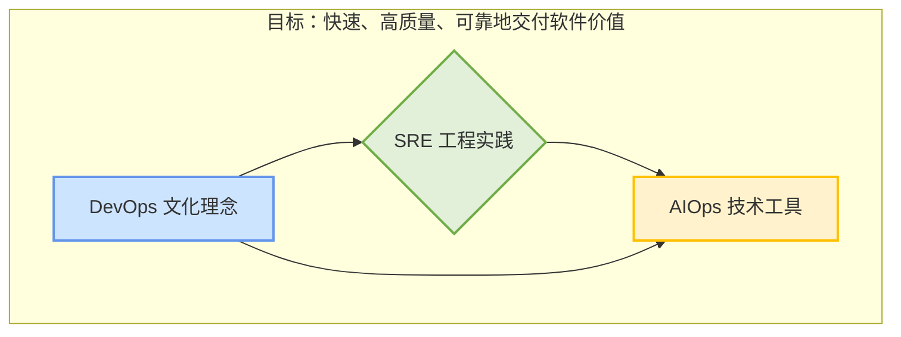
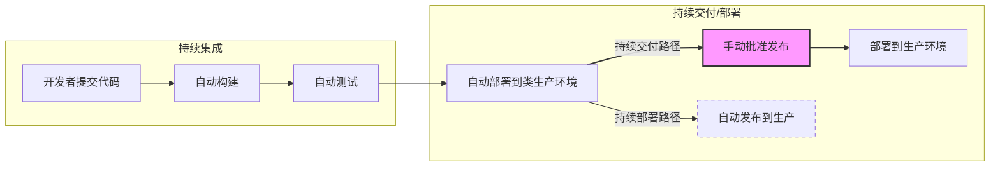

# DevOps、SRE 和 AIOps

好的，这几个术语确实在云原生和运维领域经常被提及，而且容易混淆。结合你项目中的思考，我来为你详细解释一下 DevOps、SRE 和 AIOps，并阐述它们之间的区别与联系。

### 1. 术语解释

#### **DevOps (Development and Operations | 开发与运维)**

DevOps 是一种**文化理念、实践和工具的集合**，其核心目标是打破开发（Dev）和运维（Ops）团队之间的壁垒，通过自动化和协作，来提高软件开发、测试和发布的速度与质量。它更侧重于 **“如何做”**，强调流程和文化变革。

- **核心理念**：
  - **文化 (Culture)**：强调“你构建，你负责”（You Build It, You Run It）的主人翁精神，促进团队间的沟通、协作和信任。
  - **自动化 (Automation)**：尽可能自动化软件交付的整个流程，包括集成、测试、部署和监控，即 CI/CD (持续集成/持续部署)。
  - **度量 (Measurement)**：通过收集数据和反馈来持续监控流程效率和产品性能，并以此为依据进行改进。
  - **分享 (Sharing)**：鼓励知识、工具和责任在团队间的共享。
- **实践举例**：
  - 建立统一的 CI/CD 流水线。
  - 使用版本控制系统（如 Git）管理所有代码，包括基础设施代码（IaC - Infrastructure as Code）。
  - 开发和运维团队共同参与需求评审、架构设计和发布计划。

------

#### **SRE (Site Reliability Engineering | 网站可靠性工程)**

SRE 是由 Google 提出的一套**具体的工程实践方法论**，可以看作是 **DevOps 理念的一种具体实现方式**。如果说 DevOps 是一个目标框架，那么 SRE 就是实现这个目标的一套详细的、可量化的“操作手册”。它更侧重于 **“做什么”**，强调数据和工程方法。

- **核心理念**：
  - **可靠性是首要特性**：将网站或服务的可靠性视为最重要的功能，并用工程手段来保障它。
  - **量化目标 (SLI/SLO/SLA)**：
    - **SLI (Service Level Indicator)**：服务水平指标。用于衡量服务性能的具体指标，如请求延迟、错误率、系统吞吐量。
    - **SLO (Service Level Objective)**：服务水平目标。为 SLI 设定的目标值，例如“99.9%的请求必须在200ms内完成”。这是团队内部承诺要达到的目标。
    - **SLA (Service Level Agreement)**：服务水平协议。是服务提供商与客户之间的正式合同，规定了未达到 SLO 时的后果（通常是赔偿）。
  - **错误预算 (Error Budget)**：基于 SLO 计算出的可容忍的“不可靠”额度。例如，如果 SLO 是 99.9%，那么错误预算就是 0.1%。开发团队可以在这个预算内进行新功能发布或实验；一旦预算耗尽，所有开发工作必须暂停，优先修复稳定性问题。
  - **琐事预算 (Toil Budget)**：SRE 团队致力于将重复、无创意的运维工作（称为 Toil）自动化，并设定目标，例如“确保琐事工作量不超过团队总工作量的50%”。
- **实践举例**：
  - SRE 工程师花大量时间编写代码，开发自动化工具来替代人工运维。
  - 进行容量规划、灾难恢复演练。
  - 定义和监控服务的 SLO，并管理错误预算。

------

#### **AIOps (AI for IT Operations | 智能运维)**

AIOps 是指将**人工智能（AI）和机器学习（ML）技术应用于 IT 运维领域**。它不是一种文化，也不是一套完整的流程，而是一种**技术手段或工具平台**，旨在通过智能化和自动化，进一步提升 DevOps 和 SRE 的效率和能力。它更侧重于 **“用什么工具做”**。

- **核心能力**：
  - **数据整合**：从各种监控工具、日志系统、链路追踪系统中收集海量、异构的运维数据 (Metrics, Logs, Traces)。
  - **模式识别与异常检测**：通过机器学习算法，自动从海量数据中发现异常模式，而无需人工预设阈值。
  - **根因分析 (Root Cause Analysis)**：当故障发生时，通过关联分析多个数据源，快速定位问题的根本原因。
  - **预测与预防**：基于历史数据预测未来可能发生的故障（如磁盘写满、容量不足），并提前告警。
  - **自动化修复**：在识别问题后，自动执行预设的修复脚本或流程。
- **实践举例**：
  - 你设计的 `KubeAI-Ops` 项目就是一个典型的 AIOps 实践：它自动发现 Pod 异常，整合日志和事件数据，利用 LLM 进行根因分析，并给出解决方案。
  - 监控系统利用 AI 动态调整告警阈值，减少误报和漏报。

### 2. 区别与联系

为了更清晰地理解，我们可以用一个比喻：

- **DevOps** 就像是国家的 **“宪法”**，它确立了“开发和运维需要紧密合作，快速高质量交付”的基本原则和精神。
- **SRE** 就像是基于宪法制定的 **“法律和法规”**，它提供了一套具体的、可执行的条文（如SLO、错误预算），来确保宪法精神得到落实。
- **AIOps** 就像是执法过程中使用的 **“高科技工具”**（如人脸识别、大数据分析平台），它让法律的执行变得更高效、更精准、更智能。

#### **区别**

| 特性       | DevOps                                   | SRE                                | AIOps                                      |
| ---------- | ---------------------------------------- | ---------------------------------- | ------------------------------------------ |
| **核心**   | 文化和流程                               | 工程实践和数据                     | AI 技术和算法                              |
| **关注点** | 打破壁垒，提升软件交付**速度**和**效率** | 用工程手段保障服务**可靠性**       | 用 AI 赋能运维，实现**智能化**和**自动化** |
| **本质**   | 一种文化理念和方法论                     | DevOps 的一种具体工程实现          | 一种技术手段或工具平台                     |
| **产出**   | 更快的迭代周期，更稳定的发布流程         | 可量化的可靠性目标 (SLO)、错误预算 | 智能告警、根因分析报告、自动化修复         |

#### **联系**

1. **SRE 是 DevOps 的一种成功实现**：DevOps 提出了目标，SRE 给出了实现该目标的具体路径和量化标准。一个遵循 SRE 实践的团队，自然也践行了 DevOps 的核心文化。
2. **AIOps 是 DevOps 和 SRE 的“放大器”和“加速器”**：
   - **对于 DevOps**：AIOps 可以让 CI/CD 流水线中的监控和反馈环节变得更加智能，从而更快地发现问题，缩短从部署到反馈的周期。
   - **对于 SRE**：随着系统规模扩大，SRE 团队面临的琐事（Toil）和数据量呈指数级增长。AIOps 可以帮助 SRE 工程师自动处理海量告警、快速定位根因，从而让他们从重复劳动中解放出来，更专注于提升系统可靠性的工程性工作，更好地守住 SLO 和错误预算。

**总结一下它们的关系图：**

Code snippet

在你的项目中，你正是在用 `Go` 和 `Kubernetes Operator` (SRE 思想的体现，用代码解决运维问题) 来构建一个 `AIOps` 工具，这个工具最终服务的正是 `DevOps` 的大目标。理解这三者的关系，能让你在面试中更好地阐述你项目的价值和你的技术视野。

### 3. 深入理解

#### DevOps 的理解

> “由于开发人员是最懂他们开发的东西该如何维护，所以就需要他们来开发自动化运维的工具，或者利用自动化运维工具来进行运维，从而打通开发和运维团队的壁垒，加快产品开发周期，降低运维难度、提高运维效率。”

这个理解**非常准确**。这正是 “You Build It, You Run It” 理念的体现。核心是**责任归属的转移和能力的融合**。开发团队不再是写完代码就扔给运维，而是要对服务的整个生命周期负责，包括它的部署、运行和稳定性。为了能“Run It”而又不被琐事拖垮，他们就必须借助和开发自动化工具，这就是打通壁垒、提升效率的关键。

#### SRE 的理解

> “SRE 你给我的感觉就是提出了一系列的两量化目标来量化和评估DevOps 的各个环节？”

这个理解抓住了“量化”这个关键特点，但 SRE 不仅仅是“评估”DevOps。更准确地说，SRE 是：

- **一套具体的工程实践**：它提供了一套完整的操作方法，来系统性地实现 DevOps 追求的“速度”与“质量”之间的平衡。
- **一种角色和团队组织形式**：SRE 工程师是专门的岗位，他们用软件工程的方法来解决运维问题。
- **用数据驱动决策**：它不是评估完就结束了，而是用量化目标（特别是**错误预算**）来直接指导日常工作决策——比如，这个月是该发布新功能，还是该停下来修复稳定性问题？

所以，SRE **不是 DevOps 的评估者，而是 DevOps 的一种“实现范式”或“实现流派”**。它回答了“我们该如何具体地、科学地落地 DevOps”这个问题。

### 4. 实际产品开发中的例子

假设我们有一个电商网站，一个开发团队（Dev Team）负责开发一个新的“个性化推荐”功能。

#### 场景一：DevOps 的实践方式

**目标**：快速、安全地将“个性化推荐”功能上线。

1. **统一工具链和流程**：公司有一个平台工程团队（Platform Team），他们提供了统一的 CI/CD 流水线。开发团队只需要在自己的项目仓库里添加一个 `pipeline.yml` 文件。
2. **基础设施即代码 (IaC)**：开发团队需要为新的推荐服务编写 Kubernetes 的部署文件 (`deployment.yaml`, `service.yaml`)，或者一个 Terraform 脚本，来定义服务需要的资源。这些文件和业务代码一起存放在 Git 仓库里。
3. **自动化流水线 (CI/CD)**：
   - 开发人员提交代码后，CI (持续集成) 自动运行，进行单元测试、代码扫描、构建 Docker 镜像。
   - 通过后，CD (持续部署) 自动将服务部署到“预发布环境”。
   - 在预发布环境，自动化端到端测试运行，验证新功能和原有功能的兼容性。
4. **共同负责发布**：
   - 所有测试通过后，开发团队负责人可以在一个发布系统（如 Jenkins, GitLab CI）上点击“发布到生产环境”按钮。
   - 发布采用“金丝雀发布”，先让 1% 的用户流量进入新版服务。
5. **共同监控**：
   - 开发团队和平台团队**共同**盯着监控大盘（Dashboard）。这个大盘上不仅有 CPU、内存等系统指标，更有开发团队自己定义的**业务指标**，比如“推荐点击率”、“API 成功率”。
   - 如果发现新版本的错误率上升或点击率下降，开发团队可以立刻在发布系统上“一键回滚”。
6. **文化与协作**：如果在发布中出了问题，事后会有一个“无指责的复盘会议”（Blameless Postmortem），开发和运维人员一起分析问题根源，目标是改进流程和工具，而不是追究个人责任。

在这个例子中，DevOps 体现为**流程的自动化、工具的标准化以及开发与运维之间模糊的界限和共同的责任**。

#### 场景二：SRE 的实践方式

现在，我们给上面的 DevOps 实践加入 SRE 的具体方法论。

**目标**：在保障网站**99.95%** 可用性的前提下，快速迭代推荐功能。

1. **设定量化目标 (SLO)**：
   - SRE 团队和产品、开发团队一起开会，确定“个性化推荐”服务的 **SLO (服务水平目标)**。他们不谈模糊的“高可用”，而是定义具体的 **SLI (服务水平指标)**：
     - **可用性 SLI**：API 请求的成功率（HTTP 状态码为 2xx 或 3xx 的比例）。
     - **延迟 SLI**：API 请求的响应时间。
   - 他们为这两个 SLI 设定了 **SLO**：
     - **可用性 SLO**：在过去 28 天的滚动窗口期内，成功率必须达到 **99.95%**。
     - **延迟 SLO**：99% 的请求必须在 **150ms** 内完成。
2. **计算错误预算 (Error Budget)**：
   - 基于 99.95% 的可用性 SLO，计算出每 28 天的“错误预算”。
   - 总请求如果是 1 亿次，那么允许的失败请求数就是 `100,000,000 * (1 - 0.9995) = 50,000` 次。
   - **这个“错误预算”是 SRE 的核心**。它代表了团队可以“承担多大风险”的额度。
3. **用错误预算驱动决策**：
   - **预算充足时**：假设这个月刚过去一半，只消耗了 10,000 次失败请求，错误预算还很充裕。开发团队可以大胆地发布新算法、进行 A/B 测试。因为即使新功能带来少量错误，也在可接受范围内。
   - **预算耗尽时**：假设月底时，因为一次网络抖动和一次代码 Bug，50,000 次的错误预算已经用完。此时，**SRE 团队有权宣布“冻结发布”**。所有新的功能开发和发布都必须暂停。开发团队的最高优先级任务变成：修复导致可靠性下降的 Bug、优化性能、增加测试用例，直到服务的稳定性重新满足 SLO 要求。
4. **消除琐事 (Toil)**：
   - SRE 团队发现，每次有服务延迟告警，都需要人工去重启 Pod。这是一个重复、无聊的手工操作（Toil）。
   - SRE 工程师会编写一个自动化脚本或 Kubernetes Operator，当检测到某个 Pod 连续三次健康检查失败时，就自动安全地重启它。这就是“用软件工程解决运维问题”。

在这个例子中，SRE 把 DevOps 的“质量”和“速度”这对矛盾，**用“错误预算”这个可量化的指标给统一了**。它提供了一套科学的规则，让所有人都清楚什么时候该冲刺，什么时候该刹车，从而在追求快速迭代的同时，死守住服务可靠性的生命线。

## CI/CD

好的，CI/CD 是 DevOps 和 SRE 实践的基石，也是你项目里提到的“自动化流水线”的核心。我来为你详细解释一下它是什么，以及在当前云原生时代，一个现代化的 CI/CD 是如何构建的。

### 1. 什么是 CI/CD？

CI/CD 是一个总称，它实际上包含了三个紧密相关的概念：**持续集成 (Continuous Integration)**、**持续交付 (Continuous Delivery)** 和 **持续部署 (Continuous Deployment)**。

------

#### CI:  持续集成 (Continuous Integration)

**核心思想**：开发人员频繁地（每天多次）将自己的代码分支合并到主干分支（如 `main` 或 `master`）。

**目的**：尽早发现和解决代码冲突及集成错误，避免在项目后期出现“集成地狱”（Integration Hell），即多个开发人员的代码在最后时刻合并时，出现大量难以解决的冲突和 Bug。

**CI 流程会自动触发一系列动作**：

1. **获取代码 (Fetch)**：从代码仓库拉取最新的主干代码。
2. **构建 (Build)**：将代码编译成可执行文件或软件包。对于 Go 语言项目，就是 `go build`。对于 Java 项目，就是 `mvn package` 或 `gradle build`。
3. **测试 (Test)**：运行自动化测试，通常包括：
   - **单元测试 (Unit Tests)**：验证最小的代码单元（如一个函数或方法）是否正常工作。
   - **集成测试 (Integration Tests)**：验证多个代码单元组合在一起时是否能协同工作。
4. **反馈 (Feedback)**：如果构建或测试失败，系统会立即通知相关开发人员，以便他们快速修复。

**CI 的产物**：一个通过了所有自动化测试的、可供部署的**构建产物 (Build Artifact)**，比如一个 Docker 镜像、一个二进制文件或一个 JAR 包。

------

#### **CD: 持续交付 & 持续部署 (Continuous Delivery & Continuous Deployment)**

CD 关注的是将通过 CI 流程的构建产物，安全、快速、可靠地交付给用户。它分为两个层次：

**a) 持续交付 (Continuous Delivery)**

**核心思想**：将通过了所有自动化测试的构建产物，**自动地**部署到一个或多个“类生产环境”（Production-like Environment），如预发布环境、UAT 环境或 Staging 环境。

**关键点**：部署到**真正的生产环境**这一步，是**手动触发**的。通常需要产品经理、测试负责人或团队主管进行最终确认，然后点击一个“发布”按钮。

**目的**：确保软件在任何时候都处于**可发布状态**。它降低了发布的风险，因为代码已经经过了多轮自动化验证。业务团队可以根据市场需求，随时决定何时发布新版本。

**b) 持续部署 (Continuous Deployment)**

**核心思想**：这是持续交付的延伸，也是最理想化的状态。它取消了手动触发的步骤，将**每一个**通过所有自动化测试的代码变更，都**自动地**部署到**最终的生产环境**。

**目的**：实现最大程度的自动化，将从代码提交到用户可见的整个过程完全打通，极大地缩短了交付周期（Lead Time）。

**要求**：这需要团队对自己的自动化测试、监控和回滚能力有极大的信心。通常只有技术非常成熟的团队才会采用持续部署。

总结一下关系：

CI 是 CD 的基础。持续部署是持续交付的最高境界。

### 2. 现代化的 CI/CD 是如何做的？

在以 **Kubernetes** 和**容器化**为主导的云原生时代，现代化的 CI/CD 实践呈现出一些新的特点。下面是一个典型的流程：

#### **阶段一：Source (源码阶段)**

- **Git 作为唯一事实来源**：所有东西都被代码化并存储在 Git 仓库中。这不仅包括应用代码，还包括：
  - **Dockerfile**：用于定义如何构建容器镜像。
  - **CI/CD 流水线定义**：通常是一个 YAML 文件（如 `.gitlab-ci.yml`, `github/workflows/main.yml`），描述了整个流水线的步骤。
  - **基础设施和应用部署配置**：使用 Terraform、Kustomize 或 Helm Charts 来定义 Kubernetes 部署、服务等资源。

#### **阶段二：Build (构建阶段) - CI 的核心**

1. **触发**：开发者向 Git 仓库 `push` 代码，或提交一个 `Merge Request` / `Pull Request`。
2. **运行器 (Runner) 启动**：CI/CD 工具（如 GitLab CI, GitHub Actions, Jenkins）的 Runner 会在一个临时的环境中（通常是一个 Docker 容器）开始执行流水线。
3. **编译与测试**：Runner 根据 YAML 文件中的指令，执行 `go build`, `go test` 等命令。
4. **构建并推送镜像**：
   - 如果测试通过，流水线会执行 `docker build` 命令，使用项目的 `Dockerfile` 构建一个容器镜像。
   - 镜像会被打上一个唯一的标签（如 Git Commit SHA 或版本号）。
   - 最后，镜像被 `docker push`到一个容器镜像仓库（Container Registry），如 Docker Hub, Harbor, GCR 等。

#### **阶段三：Test (测试阶段) - 通常是 CD 的一部分**

1. **部署到 Staging 环境**：流水线会自动将刚刚构建的新镜像部署到一个隔离的 Staging Kubernetes 集群中。
2. **运行自动化集成/端到端测试**：流水线会触发另一组更全面的测试（如使用 Selenium, Cypress 等工具），模拟真实用户操作，来验证新功能是否正确，以及是否对老功能造成了破坏。

#### **阶段四：Deploy (部署阶段) - CD 的核心**

这一步是现代 CI/CD 变化最大的地方，**GitOps** 成为了主流模式。

传统部署 (Push 模式)：

CI/CD 工具（如 Jenkins）直接获得目标 Kubernetes 集群的认证凭证，然后执行 kubectl apply 或 helm upgrade 命令，将应用“推送”到集群中。这种模式简单，但权限管理复杂且不安全。

**现代部署 (GitOps - Pull 模式)**：

1. **配置更新**：CI 流水线的最后一步，**不是**直接去部署应用，而是去更新一个专门存放 Kubernetes 配置的 Git 仓库（配置仓库）。例如，修改一个 YAML 文件，将镜像的标签更新为刚刚构建的新版本。
2. **部署代理 (Agent)**：在 Kubernetes 集群内部，运行着一个 GitOps Agent，最流行的是 **Argo CD** 或 **Flux**。
3. **自动同步**：这个 Agent 会持续监控配置仓库。一旦发现 Git 仓库里的配置（期望状态）和集群内部署的服务的当前状态不一致，它就会自动从仓库 `pull` 最新的配置，并应用到集群内部，完成服务的更新。

**GitOps 的优势**：

- **安全性更高**：CI 系统不需要集群的管理员权限，只有集群内的 Agent 需要。
- **状态可追溯**：Git 成了唯一的事实来源和变更日志，任何对生产环境的变更都有据可查。
- **一致性和可靠性**：可以轻松地回滚到任何一个历史版本（只需回退 Git Commit），也可以用同一个 Git 仓库快速地重建一个一模一样的环境。

**一个完整的现代 CI/CD 流程示例**：

1. 开发者提交业务代码到**应用仓库**。
2. **GitHub Actions** 被触发，运行构建和单元测试。
3. 测试通过后，构建 Docker 镜像并推送到 **Harbor 镜像仓库**。
4. GitHub Actions 的最后一步，是去修改**配置仓库**中的一个 `deployment.yaml` 文件，将 `image` 标签更新为新版本。
5. **Argo CD**（部署在 K8s 集群中）检测到配置仓库发生变更。
6. Argo CD 从配置仓库拉取最新的 `deployment.yaml`，并自动在集群中应用该变更，触发 Kubernetes 完成对新版本的滚动更新。