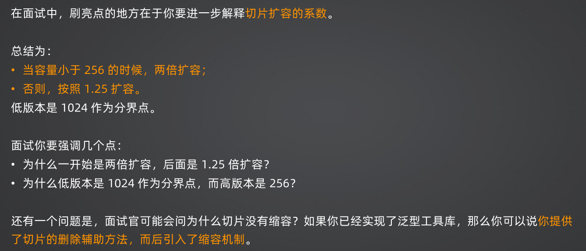

# Go八股

## Go语法

- 什么是闭包？闭包有什么缺陷？
- 什么情况下会出现栈溢出？
- 什么是不定参数？调用方法的时候，不定参数可以传入 0 个值吗？方法内部怎么使用不定参数？• 什么是 defer ？你能解释一下 defer 的运作机制吗？
- 一个方法内部 defer 能不能超过 8 个？
- defer 内部能不能修改返回值？怎么改？
- 数组和切片有什么区别？
- 切片怎么扩容的？

### defer 的作用与原理

你的回答要分成几个部分：

1. defer 的作用
2. defer  的底层实现原理。这算是你在初级工程师面试中刷亮点的地方：
   - 堆上分配与栈上分配：这个地方你要尝试引导到内存逃逸、GO 性能优化这种话题上。
   - 开放编码。

### 切片扩容

重新分配一段连续内存，而后把原本的数据拷贝过去。

