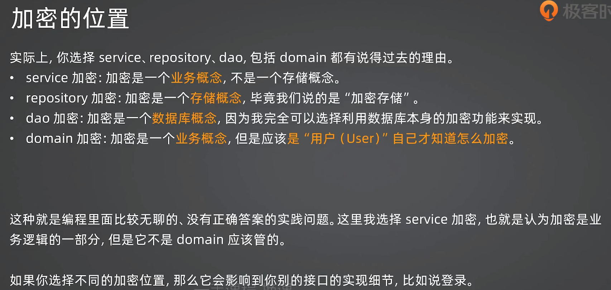
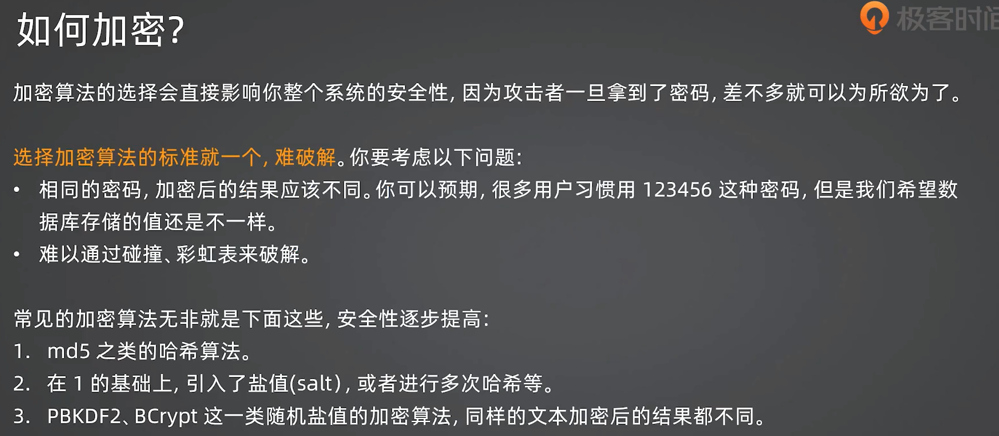
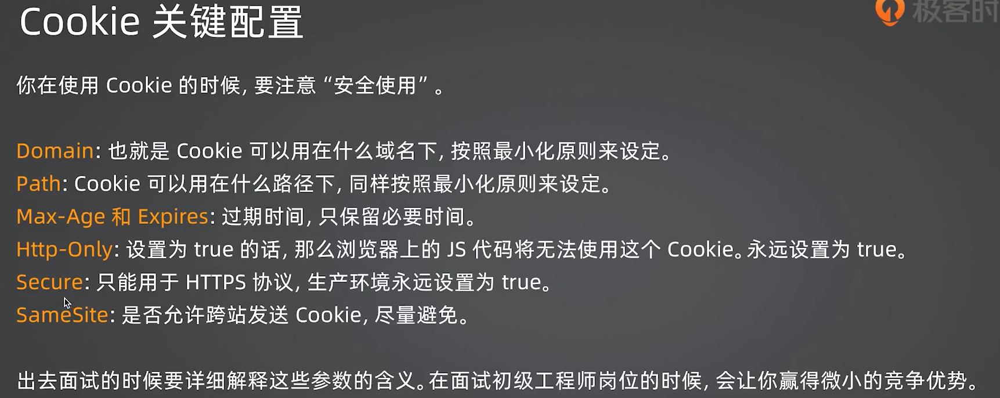

## 数据加密

### 加密位置

- domain & service 层：加密更偏向是一种业务需求，例如用户的哪些隐私信息需要加密存储，不是单纯的存储需求
- repository & dao 层：把加密看作一个存储概念，我存某些数据的时候需要加密，防止数据库被爆破后隐私信息泄露



#### 加密算法的选择原则

- 相同密码加密后结果不一样
- 加密后的**密码**不能（难以）反向破解，其他数据例如用户地址需要可以反向破解，例如我需要向用户地址邮寄订购的商品。
- 密码加密选BCrypt




# gin

## 状态管理



### 1. HTTP 的无状态性

- **概念：** HTTP 协议本身是无状态的。这意味着服务器处理完一个请求后，不会“记住”这个请求的任何信息，也不会记住发送该请求的用户。每个请求都是完全独立的。
- **优点：** 无状态性简化了服务器设计，提高了可伸缩性。服务器可以轻松地将请求分发到不同的机器处理，而无需在服务器之间共享用户状态。
- **缺点：** 无状态性使得需要用户登录、购物车等“状态保持”功能的 Web 应用程序变得复杂。

### 2. 为什么需要 Session 和 Cookie？

为了在无状态的 HTTP 协议上实现状态保持，引入了 Session 和 Cookie 机制。

- **Session：** Session 是一种在**服务器端**存储用户特定数据的方式
- **Cookie：** Cookie 是一种在**客户端**（通常是浏览器）存储少量数据的方式。Cookie 常被用来存储 Session 的标识符（Session ID），以便服务器能够找到与特定用户关联的 Session 数据。

### 3. Session 的工作原理

Session 的核心思想是：服务器为每个用户创建一个唯一的会话（Session），并将该会话的标识符（Session ID）发送给客户端。客户端在后续的请求中携带这个 Session ID，服务器通过该 ID 识别用户，从而实现状态保持。

更详细的流程：

1. **用户登录：**
   - 用户提交登录信息（用户名、密码）到服务器。
   - 服务器验证用户身份。
   - 如果验证成功，服务器创建一个新的 Session，并生成一个唯一的 Session ID。
   - 服务器将用户的登录状态和相关数据（例如用户 ID、用户名等）存储在 Session 中。
   - 服务器将 Session ID 发送给客户端（通常通过 `Set-Cookie` 响应头）。
2. **客户端存储 Session ID：**
   - 客户端（浏览器）接收到服务器的响应，解析 `Set-Cookie` 头，将 Session ID 存储在本地。
3. **后续请求：**
   - 用户访问需要登录才能访问的页面时，客户端在发送请求时，会自动将存储的 Session ID 放在请求头中的 `Cookie` 字段中。
4. **服务器验证 Session ID：**
   - 服务器接收到请求，从请求头中的 `Cookie` 字段中提取 Session ID。
   - 服务器根据 Session ID 找到对应的 Session 数据。
   - 服务器验证 Session ID 的有效性（例如，是否过期）。
   - 如果 Session ID 有效，服务器认为用户已登录，并可以访问受保护的资源。
5. **登出：**
   - 用户请求登出。
   - 服务器销毁对应的 Session 数据。
   - 服务器通知客户端删除存储的 Session ID（通常通过设置 Cookie 的过期时间为过去的时间）。

### 4. Cookie 的工作原理

- **定义：** Cookie 是一种由服务器发送到用户浏览器并存储在本地的小型文本文件。
- **作用：** Cookie 主要用于在客户端存储用户相关的信息，以便服务器在后续请求中识别用户。
- **设置 Cookie：**
  - 服务器通过在 HTTP 响应头中添加 `Set-Cookie` 字段来设置 Cookie。
  - `Set-Cookie` 字段包含 Cookie 的名称、值以及其他可选属性（例如过期时间、域、路径等）。
  - 例如：`Set-Cookie: session_id=1234567890; Max-Age=3600; Path=/; HttpOnly`
- **发送 Cookie：**
  - 当用户访问同一个网站时，浏览器会自动将该网站设置的且尚未过期的 Cookie 放在 HTTP 请求头中的 `Cookie` 字段中发送给服务器。
  - 例如：`Cookie: session_id=1234567890`
- **Cookie 的属性：**
  - `Name`：Cookie 的名称。
  - `Value`：Cookie 的值。
  - `Max-Age` 或 `Expires`：Cookie 的过期时间。`Max-Age` 指定 Cookie 的最大生存时间（单位为秒），`Expires` 指定 Cookie 的具体过期日期和时间。
  - `Domain`：指定 Cookie 所属的域名。只有该域名下的网页才能访问该 Cookie。
  - `Path`：指定 Cookie 所属的路径。只有该路径下的网页才能访问该 Cookie。
  - `Secure`：如果设置为 `true`，则 Cookie 只能在 HTTPS 连接中传输。
  - `HttpOnly`：如果设置为 `true`，则 Cookie 只能通过 HTTP(S) 协议访问，不能被 JavaScript 脚本访问。这可以防止一些跨站脚本攻击（XSS）。

### 5. Session 的存储方式

Session 数据可以存储在服务器端的多种位置：

- **内存：** 简单快速，但服务器重启后数据会丢失，不适合生产环境。
- **文件：** 可以持久化，但读写效率较低。
- **数据库：** 可靠性高，但增加了数据库的负担。
- **缓存系统（如 Redis、Memcached）：** 常用方式，读写速度快，性能好，支持分布式部署。

### 6. Cookie 和 Session 的关系

- Cookie 和 Session 都是为了解决 HTTP 的无状态性问题。
- Cookie 在客户端存储数据，Session 在服务器端存储数据。
- Cookie 通常用来存储 Session 的标识符（Session ID）。
- 服务器通过 Session ID 从存储中检索到对应的 Session 数据，从而识别用户。
- Session 依赖于 Cookie 来传递 Session ID。

### 7. Go 语言中的 Session 管理：`gin-contrib/sessions`

在 Go 的 Gin 框架中，可以使用 `gin-contrib/sessions` 中间件来方便地管理 Session。

#### 7.1 核心概念

- **`Store` (存储引擎):** `sessions` 中间件使用 `Store` 接口来定义 Session 数据的存储方式。`gin-contrib/sessions` 提供了多种 `Store` 的实现：
  - `cookie.NewStore([]byte(secret))`:  使用 Cookie 存储 Session 数据。`secret` 是用于加密和签名 Session 数据的密钥，**务必使用高强度密钥，并妥善保管，绝不能泄露。生产环境的 secret 应该从环境变量或者配置文件读取，切记不能硬编码在代码里面。**
  - `redis.NewStore(options)`:  使用 Redis 存储 Session 数据。
  - `memstore.NewStore([]byte(secret))`: 使用内存存储session数据，仅供测试。
- **`sessions.Sessions(name string, store Store)`:** 这是一个 Gin 中间件，用于启用 Session 功能。
  - `name`：Session 的名称，也就是存储 Session ID 的 Cookie 的名称。
  - `store`：Session 数据的存储引擎。
- **`sessions.Default(c *gin.Context)`:** 在路由处理函数中，使用该方法获取当前请求的 Session 对象。
- **Session 对象的方法：**
  - `Get(key string) interface{}`:  获取 Session 中指定键的值。
  - `Set(key string, value interface{})`:  设置 Session 中指定键的值。
  - `Delete(key string)`:  删除 Session 中指定键的值。
  - `Clear()`:  清空 Session 中的所有数据。
  - `Save() error`:  **将 Session 的修改保存到存储中。对于 Cookie 存储，调用此方法会将 Session 数据写入到 `Set-Cookie` 响应头中，非常重要，在所有对session的修改操作后，都要记得调用Save方法。**
  - `Options(sessions.Options)`：用来设置 Cookie 的属性，比如过期时间、路径、Domain 等，比较常用的是设置`MaxAge`。

#### 7.2 使用示例 (基于 Cookie 存储)

```go
package main

import (
	"github.com/gin-gonic/gin"
	"github.com/gin-contrib/sessions"
	"github.com/gin-contrib/sessions/cookie"
)

func main() {
	r := gin.Default()

	// 1. 创建 Cookie 存储引擎
	// 生产环境必须使用安全的密钥
	store := cookie.NewStore([]byte("your-secret-key"))

	// 设置 Cookie 的选项（例如，设置最大生存时间）
    store.Options(sessions.Options{
        MaxAge: 3600,       // 1 小时，单位秒
        Path:   "/",           // Cookie 的有效路径
        HttpOnly: true,     // 避免客户端脚本访问 Cookie
    })

	// 2. 注册 Session 中间件
	r.Use(sessions.Sessions("my_session", store))

	// 3. 在路由处理函数中使用 Session
	r.GET("/set", func(c *gin.Context) {
		session := sessions.Default(c)
		session.Set("user_id", 123)
		session.Set("username", "JohnDoe")
		session.Save() // 保存 Session 数据
		c.String(200, "Session 已设置")
	})

	r.GET("/get", func(c *gin.Context) {
		session := sessions.Default(c)
		userID := session.Get("user_id")
		username := session.Get("username")
		if userID == nil || username == nil {
			c.String(401, "Session 不存在或已过期")
			return
		}
		c.JSON(200, gin.H{
			"user_id":  userID,
			"username": username,
		})
	})

    r.GET("/delete", func(c *gin.Context) {
        session := sessions.Default(c)
        session.Delete("user_id")
        session.Clear()  //删除所有session
        session.Options(sessions.Options{
            MaxAge: -1, // 设置 Cookie 立即过期
            Path: "/",
        })
        session.Save()
        c.String(200, "Session 已删除")
    })

	r.Run(":8080")
}
```

#### 7.3  登录态保持实践

```go
package web

import (
	"net/http"
	"github.com/gin-gonic/gin"
	"github.com/gin-contrib/sessions"
	"xws/webook/internal/domain"
	"xws/webook/internal/service"
	"fmt"
)

// SessionKeyUserID 定义存储用户ID的session key
const SessionKeyUserID = "user_id"

type UserHandler struct {
	svc *service.UserService
}

func NewUserHandler(svc *service.UserService) *UserHandler{
	return &UserHandler{
		svc: svc,
	}
}

func (uh *UserHandler) Login(ctx *gin.Context) {
	//... 登录验证逻辑
	u, err := uh.svc.Login(ctx, domain.User{
		Email:    req.Email,
		Password: req.Password,
	})
	//... 错误处理

	// 登录成功后，将用户ID存储到session中
	session := sessions.Default(ctx)
	session.Set(SessionKeyUserID, u.Id)
	session.Options(sessions.Options{
        MaxAge: 3600,       // 1 小时，单位秒
        Path:   "/",
    })
	err = session.Save()
	if err != nil{
		fmt.Printf("session save err: %v", err)
		ctx.String(http.StatusInternalServerError, "system error")
		return
	}
	ctx.String(http.StatusOK, "login success")
}

// AuthMiddleware 登录态校验中间件
func AuthMiddleware() gin.HandlerFunc {
	return func(ctx *gin.Context) {
		session := sessions.Default(ctx)
		userID := session.Get(SessionKeyUserID)
		if userID == nil {
			ctx.AbortWithStatus(http.StatusUnauthorized)
			return
		}
		ctx.Next()
	}
}

func main() {
	r := gin.Default()
	//... 初始化 store
	r.Use(sessions.Sessions("my_session", store))

	// 创建需要登录才能访问的路由组
	protected := r.Group("/protected")
	protected.Use(AuthMiddleware())
	{
		protected.GET("/profile", func(ctx *gin.Context){  // 比如查看profile需要登录
			ctx.String(http.StatusOK, "hello profile")
		})
		//... 其它需要登录的路由
	}
	r.Run()
}
```

### 8. 安全性考虑

- **Session ID 的安全性：** Session ID 应该是随机、高熵的字符串，难以猜测。
- **Session 数据的安全性：**
  - **对于 Cookie 存储：** Session 数据应该加密和签名，防止被篡改或窃取。使用 `cookie.NewStore` 时，`secret` 密钥的安全性至关重要。
  - **对于后端存储：** 确保后端存储（如 Redis）的安全性，防止未经授权的访问。
- **Cookie 的安全属性：**
  - `HttpOnly`：防止客户端脚本访问 Cookie，减少 XSS 攻击的风险。
  - `Secure`：确保 Cookie 只能在 HTTPS 连接中传输，防止中间人攻击。
  - `SameSite`：控制 Cookie 在跨站请求中的发送行为，减少 CSRF 攻击的风险。
- **Session 过期时间：** 设置合理的 Session 过期时间，避免 Session 长期有效，增加安全风险。
- **防止会话固定攻击：** 在用户登录成功后，应该重新生成 Session ID，防止攻击者利用预先设置的 Session ID 进行会话固定攻击。
- **使用 HTTPS：** 对于任何涉及用户认证和敏感数据的 Web 应用程序，都应该使用 HTTPS，确保 Cookie 和 Session ID 在传输过程中的安全性。

### 9. Cookie 的大小限制

- HTTP 协议对 Cookie 的大小有限制，通常为 4KB。
- 如果 Session 数据过大，不适合使用 Cookie 存储。
- 在这种情况下，应该使用后端存储（如 Redis）来存储 Session 数据，而 Cookie 只存储 Session ID。

### 10. Session 的扩展性

- 对于大型 Web 应用程序，Session 数据通常存储在分布式缓存系统（如 Redis 集群）中，以支持水平扩展。
- 在多台服务器之间共享 Session 数据，需要考虑 Session 的一致性问题。

希望这篇笔记能够帮助你更好地理解 Go 后端开发中的 Session 和 Cookie 机制。