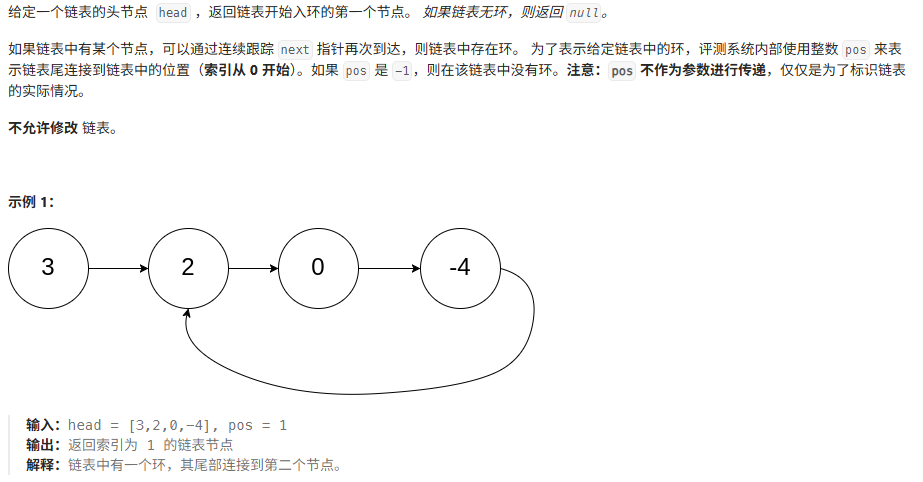
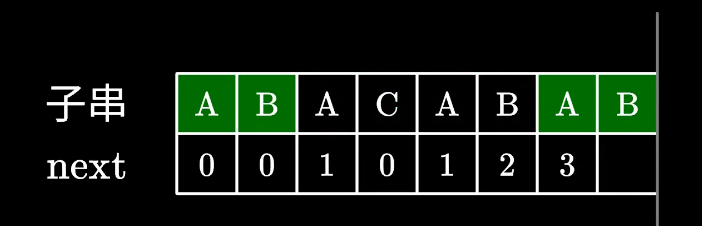
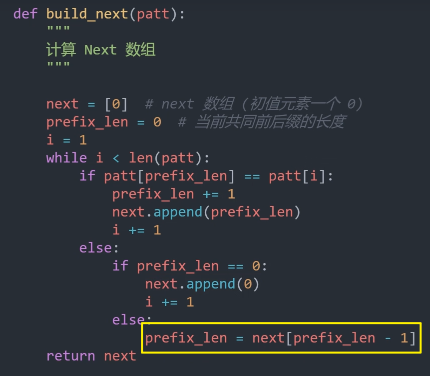
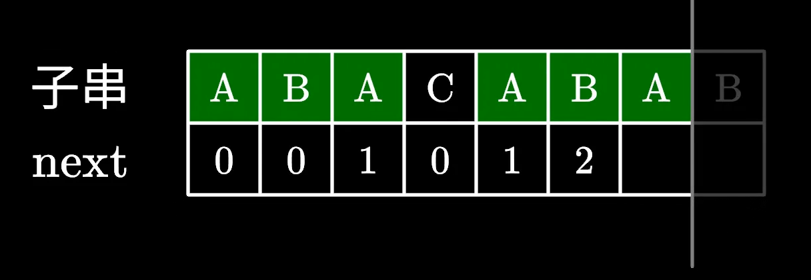
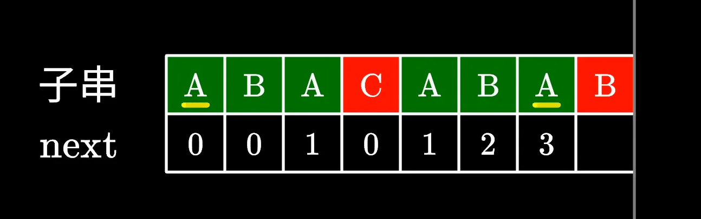
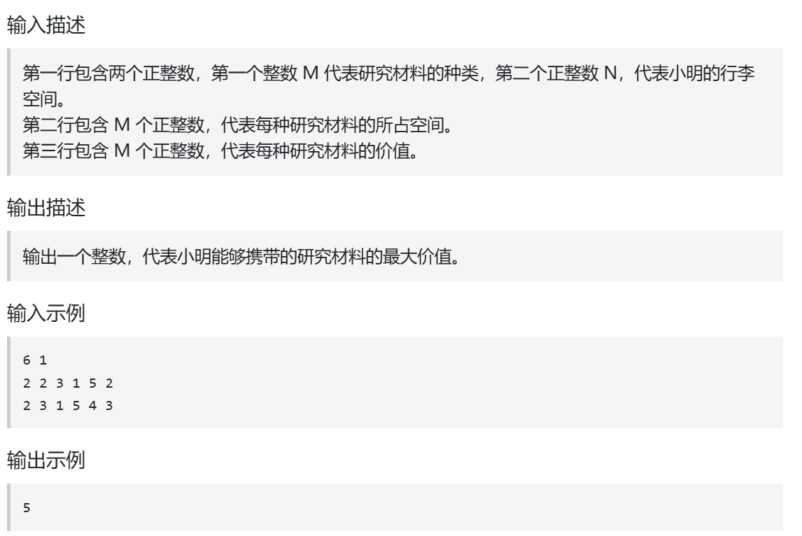

# 生成测试脚本提示词

```
请你作为一个 Go 语言算法题测试环境生成器，输出一个完整可运行的 Go 程序，要求：
1. 定义必要的数据结构（如 ListNode、TreeNode 等）。
2. 根据给定的输入字面量构造数据。
3. 调用下面的“核心函数”并打印或断言结果。
4. 可通过 go run 直接运行。

 
题目描述：  
＜在此粘贴简要题目描述，包括输入输出定义＞  

核心函数（不要改动函数签名，直接替换函数体）：  
```go

    // … 在此粘贴或替换你的算法实现 …
    
```

测试用例：  
输入： 
期望输出： 


请根据上面填写的内容生成完整的 Go 程序，包括：  
- package 和必要的 import  
- ListNode（或其他）结构体定义  
- 输入构造函数（如 buildList）  
- 打印/断言函数（如 printList）  
- main 函数中构造测试输入、调用核心函数、输出结果  
```

# 链表 & 数组

## 基本操作

> 707. 设计链表
>
> https://leetcode.cn/problems/design-linked-list/description/

实现 `MyLinkedList` 类：

- `MyLinkedList()` 初始化 `MyLinkedList` 对象。
- `int get(int index)` 获取链表中下标为 `index` 的节点的值。如果下标无效，则返回 `-1` 。
- `void addAtHead(int val)` 将一个值为 `val` 的节点插入到链表中第一个元素之前。在插入完成后，新节点会成为链表的第一个节点。
- `void addAtTail(int val)` 将一个值为 `val` 的节点追加到链表中作为链表的最后一个元素。
- `void addAtIndex(int index, int val)` 将一个值为 `val` 的节点插入到链表中下标为 `index` 的节点之前。如果 `index` 等于链表的长度，那么该节点会被追加到链表的末尾。如果 `index` 比长度更大，该节点将 **不会插入** 到链表中。
- `void deleteAtIndex(int index)` 如果下标有效，则删除链表中下标为 `index` 的节点。


## 双指针

### 快慢指针

1. 确定快指针比慢指针快多少步 == 快慢指针的距离 == 快慢指针的索引差

2. for循环，必须注意快慢指针的距离把控！！！

   ```go
   // 距离d初值为0（由快慢指针的初始位置决定）
   // 快慢指针期望距离为dist
   for d := 0; fast != slow; d, fast = d+1, fast.Next {
       if d >= dist { 
           s = s.Next
       }
   }
```

# Good Problems

## 双指针

### 快慢指针

#### 易错点：慢指针第一次移动的时机

- 在实际距离第一次到达期望距离时，慢指针第一次移动
- 因为快指针会随后在后置语句中紧跟着移动
- 这样可以确保在条件语句判断时，快慢指针都进行了本轮的移动，确保进行条件判断时快慢指针保持着期望距离

### 差速指针

> 142. 环形链表II
>
> https://leetcode.cn/problems/linked-list-cycle-ii/description/



## 哈希与map

### [两数之和](https://leetcode.cn/problems/two-sum/)

很trick的题，脑子里面要把单次循环过程理得清楚

### [四数相加 II](https://leetcode.cn/problems/4sum-ii/)

利用了这样的数学思想：通过把复杂问题转化为简单问题从而得到简化问题的效果（四数之和的问题先转换成两数之和的问题，两数之和的问题则较为简单）


## KMP

### next数组

定义：对于模式字符串 pattern，其next数组，有 next[i] 的值等于 pattern[0 : i]子数组中最大相同前后缀的长度



#### 代码实现



**循环迭代时维护两个变量：**

- `i`：pattern字符串的索引，for循环中就是依次向前遍历字符串中的每个字符，检查它是否可以
- `prefix_len`：
  - 每次循环结束时，它存的是当前子数组中最长相同前后缀的长度
  - 每次循环开始时，它存的是前一个字符对应的next数组中的值，即`next[i-1]`

**for 循环逻辑：**

每次迭代，需要检查当前字符的加入能否延长当前最长相同前后缀的长度

例如下图，遍历到 A 时，判断 A 的加入是否可以把当前长度为2的相同前后缀加长到3



如果当前字符的加入不能延长最大相同前后缀的长度，不能从 3 变到 4。

那么尝试缩短一点，看可不可以从 1 变到 2。这里 1 的由来，是 next[prefix_len-1]。（也就是代码中黄框框起来的部分）

这个死记硬背住就可以，理解了也容易忘。




# ACM输入输出

### 输入

#### **`NewScanner`** 

- 按**行**读
  1. 创建读取器：`NewScanner(os.Stdin)`
  2. 执行读操作：`Scan()`
  3. 获取读到的一行字符串：`Text() `
- 字符串转数字：`strconv.Atoi`
- 从字符串格式化提取数字：`fmt.Sscanf(line, "%d %d", &a, &b)`

```go
import (
	"bufio"
	"os"
	"strconv"
    "fmt"
    "strings"
)

func main(){
    // 创建读取器
   	scanner := bufio.NewScanner(os.Stdin)
    
    // 一行一个数字：x
    scanner.Scan()
    line := scanner.Text() 
    len, err := strconv.Atoi(line)    
    
    // 一行两个数字：x y
    scanner.Scan()
    line := scanner.Text() 
    fmt.Sscanf(line, "%d %d", &a, &b)
}
```

#### **`NewReader`** 



```go
package main

import (
	"bufio"
	"fmt"
	"os"
	"strconv"
	"strings"
)

func main() {
	reader := bufio.NewReader(os.Stdin)

	line, _ := reader.ReadString('\n')
	fields := strings.Fields(line)
	M, _ := strconv.Atoi(fields[0])
	N, _ := strconv.Atoi(fields[1])

	line, _ = reader.ReadString('\n')
	fields = strings.Fields(line)
	for i := 0; i < M; i++ {
		// ...
	}

	// ... (省略算法实现) ...

	writer := bufio.NewWriter(os.Stdout)
    fmt.Fprintf(writer, "...(最终结果)...")
	writer.Flush()  // 刷新缓冲区，确保所有内容都已写入标准输出
}
```

