# KubeEdge

### kuberetes List-Watch机制

在 Kubernetes 中，`list-watch` 机制是客户端与apiserver通信，获取集群中感兴趣的资源的最新状态信息的方法。第一次向apiserver获取感兴趣的所有资源的状态信息，然后向apiserver发起监听请求，apiserver为其设置监听器，持续向client发送资源的变动情况（当发生资源的增删改时）。

1. **List 操作**
   - 客户端首先执行一个列表（List）操作，从 API server 获取指定资源的当前状态。
   - 这个操作会返回资源的完整列表以及一个 `resourceVersion`，表示资源在这个时间点上的版本。
2. **Watch 操作**
   - 在获取了初始列表后，客户端开始执行监视（Watch）操作。
   - 监视操作会监听从上一步返回的 `resourceVersion` 开始的所有资源变化。
   - 当资源发生变化（如创建、更新、删除）时，API server 会发送事件通知给客户端。
3. **处理事件**
   - 客户端接收到事件通知后，可以根据事件的类型（添加、更新、删除）对资源进行相应的处理。
   - 这种方式使得客户端可以实时地感知资源的变化，而不需要频繁地重新执行列表操作。

#### 当发生断网时

client在上线时会发起rewatch操作，如果短线时间过长，rewatch可能失败，则需要发起relist操作，重新获取所有的资源信息。

**如果有大量的client经常性发生断网的情况**，那么当短时间大量client重新上线时会对apiserver产生较大的负担。kubernetes的设计本身考虑也是类似数据中心那种网络稳定的场景，并不擅长处理边缘计算中边缘设备会经常断连重连的场景。

## kubeedge架构

整个KubeEdge框架都是在kubernetes上做的开发，目的是针对边缘计算的场景对kubernetes做一些增强

### Cloud - 云

云上运行的是CloudCore组件，通过Watch-List机制从apiserver获取资源信息

云边通信使用的是**WebSocket**协议。Kubernetes 默认使用 HTTP 长轮询来实现 `watch` 请求，而WebSocket 是一种在单个 TCP 连接上进行全双工通信的协议，更适用于边缘计算场景。它建立在 HTTP 之上，但在连接建立后，它与 HTTP 无关。WebSocket 允许服务器主动向客户端发送消息，而不仅仅是响应客户端请求。

### Edge - 边

边上运行的是EdgeCore组件，其中包含的实际上是一个裁剪过的轻量化的kubernetes，依然能够提供kubernetes最核心最基础的容器编排、应用部署的功能。

### Device - 端

这是使用各种通信协议的边缘设备，它们是通过Mapper这个可插拔设备接入EdgeCore。

**Mapper**，边缘设备接入框架，其中集成了各个设备的驱动，主要负责边缘设备的接入

#### CRD

CRD（Custom Resource Definition，自定义资源定义）是 Kubernetes 中的一种机制，允许用户扩展 Kubernetes API，以支持用户自定义的资源类型。

KubeEdge就是使用CRD机制拓展了API，定义了Device和Device Model两种资源，用于对端的边缘设备的管理

- Device Model：同类设备的抽象。例如对空调这个设备的抽象，定义空调设备应该具有的属性。
- Device：设备实例。例如家里某台具体的空调，记录了空调的各项参数。

 

## kubedge生产实践

### kubeedge架构图

### kubeedge生产部署

- CloudCore采用容器化部署
- CloudCore实例数 >= 3，以提供稳定的服务和连接（cloudcore采用滚动更新）
- CloudCore通过负载均衡发布服务

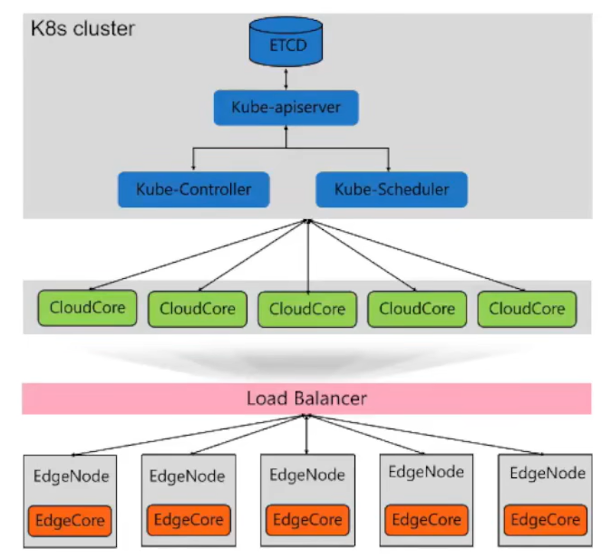

### 安全生产实践

- cloudcore和edgecore通信环境通常不够安全，因此会使用证书加密实现双向认证，保障通信安全
- 推荐企业使用可信安全的CA根证书

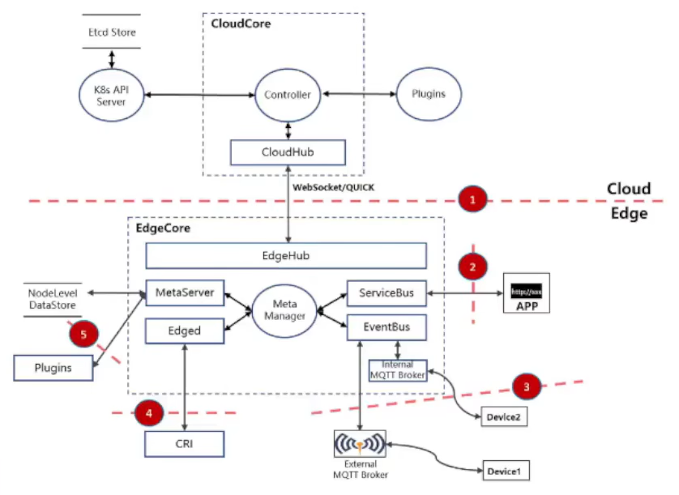

### 边缘日志收集分析系统

- fluentd：部署于需要采集日志的边缘节点，用于日志收集
  - 需要edgecore开启list-watch功能，用于获取pod的信息，以便进行日志收集
- elasticsearch：实时的、分布式的、可拓展的搜索引擎，用于收集存储由fluentd收集的日志
  - fluentd通过http发送日志数据
  - 需要暴露9200端口给边缘的fluentd，用于接收数据
- kibana，数据可视化dashboard

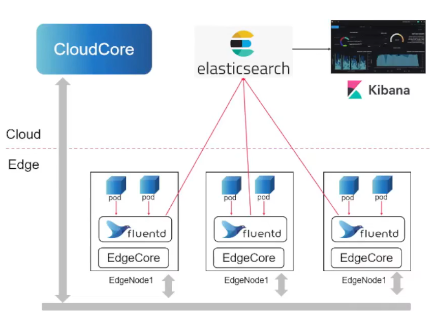

### EdgeCore的升级

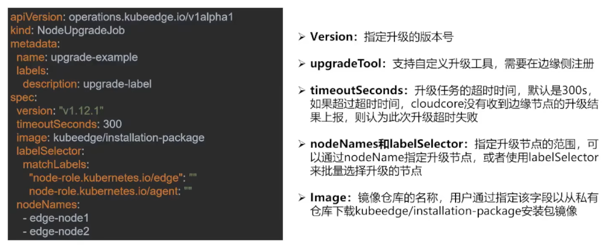

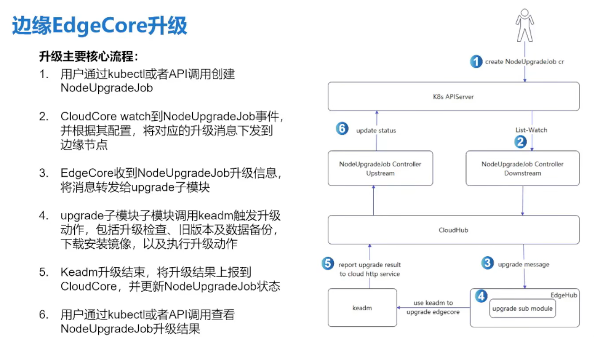

## kubeedge安装

### EdgeCore的安装

#### 安装前置检查

1. 清理干净原有的kubelet进程（如果有的话）
2. 关闭MQTT相关的管理进程，尤其注意不能占用MQTT的监听端口（1883、1884）
3. 确保EdgeCore的安装目录未被占用，默认安装位置`/etc/kubeedge`

#### 安装

- kubeedge安装包用于安装kubeedge组件
- kuadm安装包用于把边缘节点加入集群

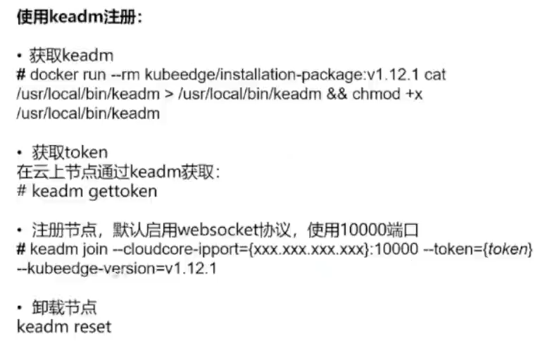

#### 安装后

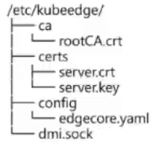

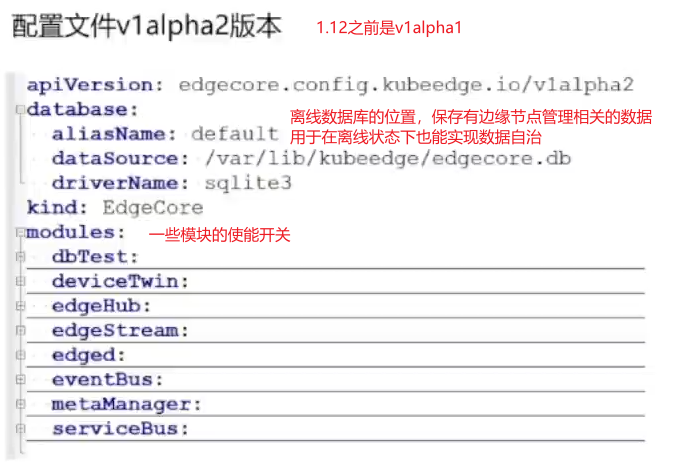

### 安装常见问题

https://www.bilibili.com/video/BV1z84y1r79h/?spm_id_from=333.1007.top_right_bar_window_history.content.click&vd_source=8205edcb8d5d68d6331e9295bb6ccde9

51‘50’‘

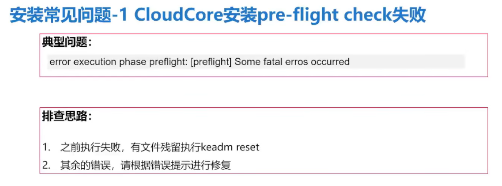

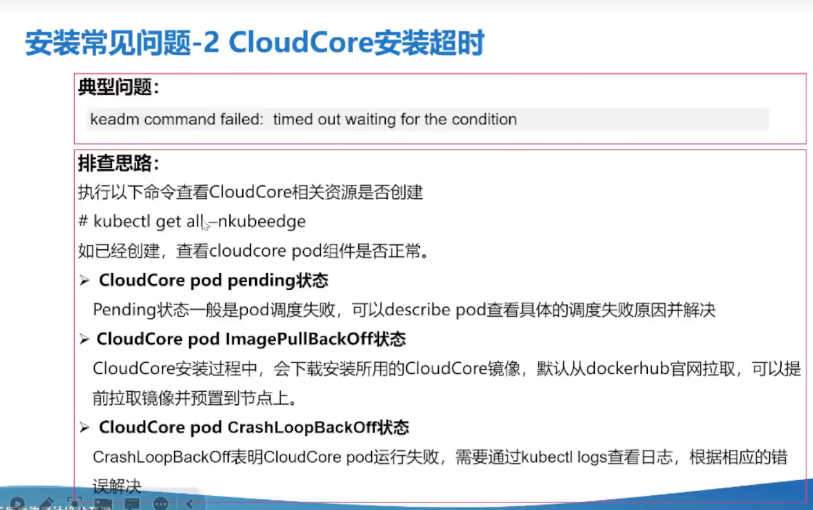

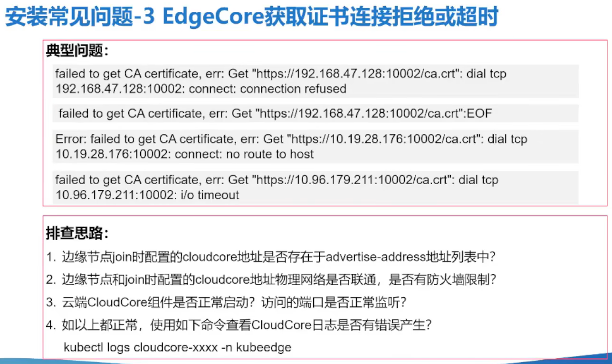

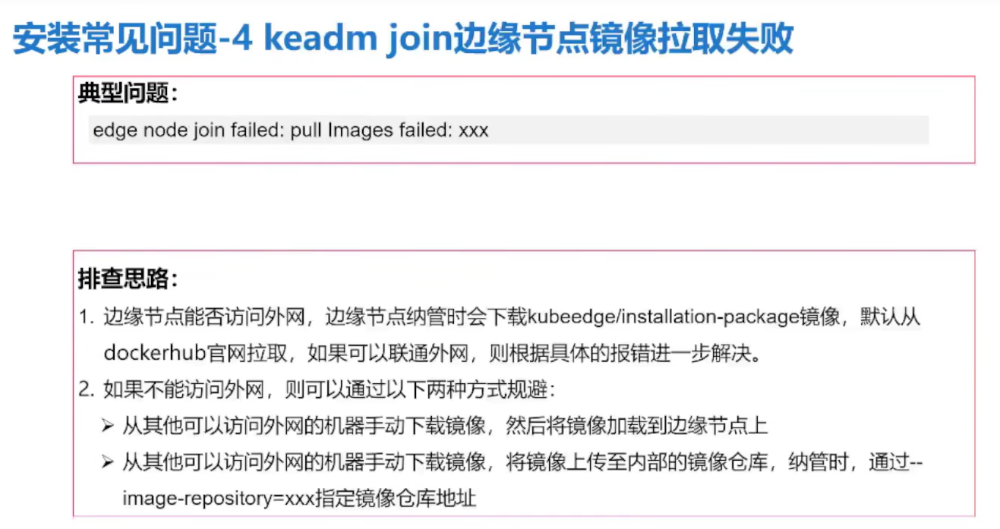

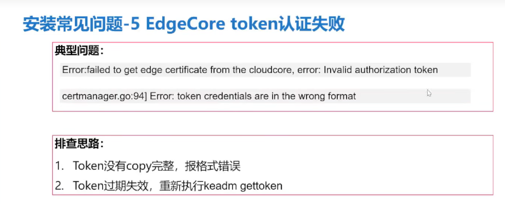

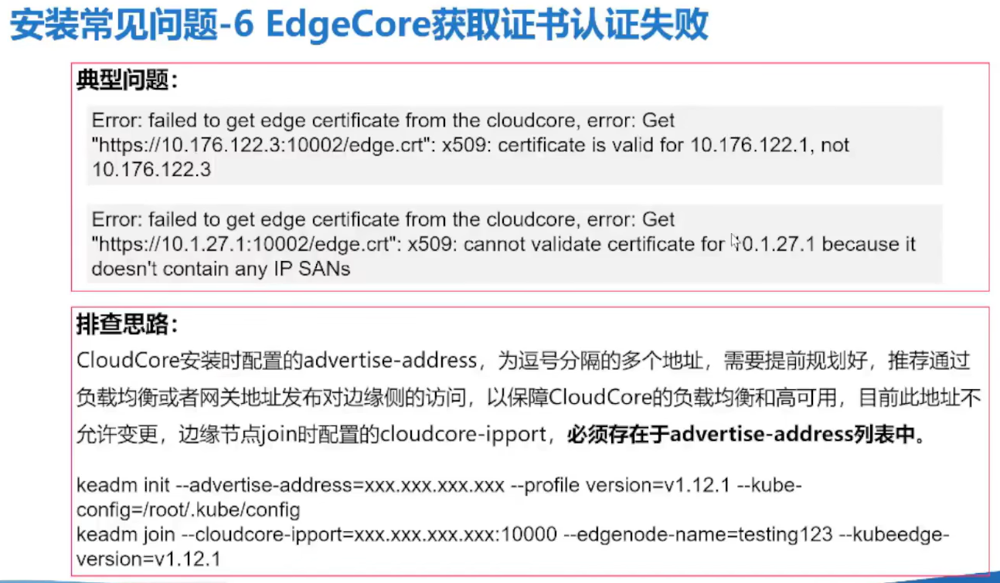

