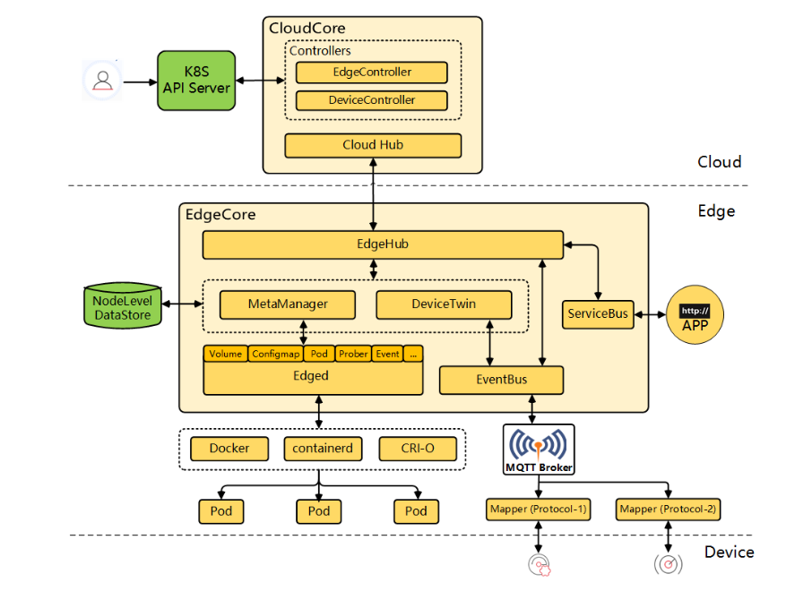
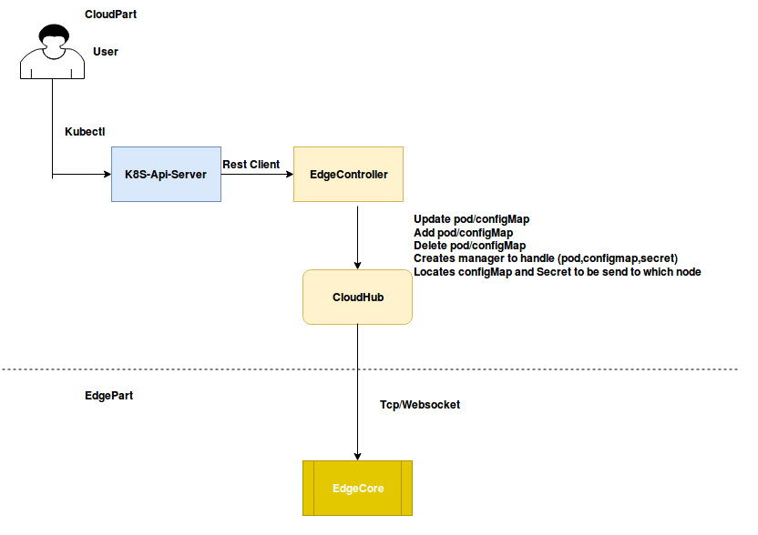
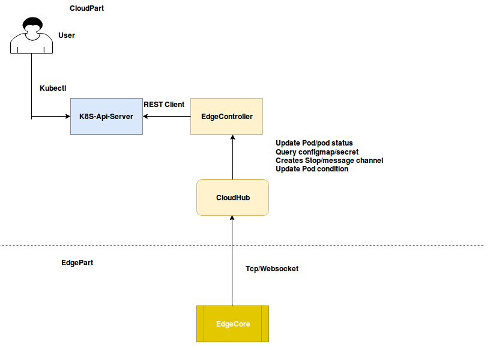
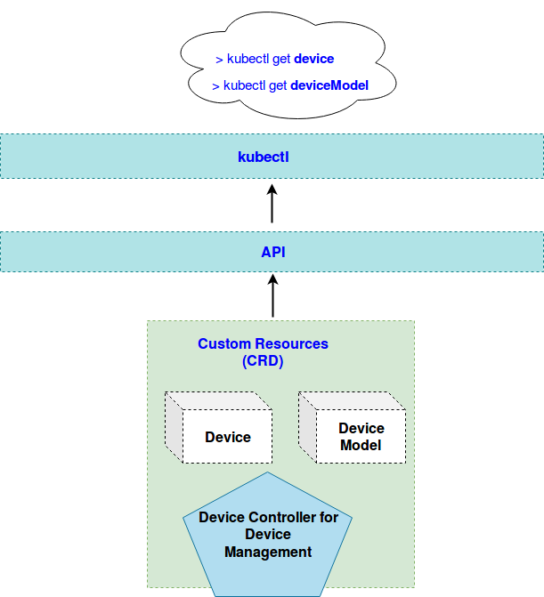
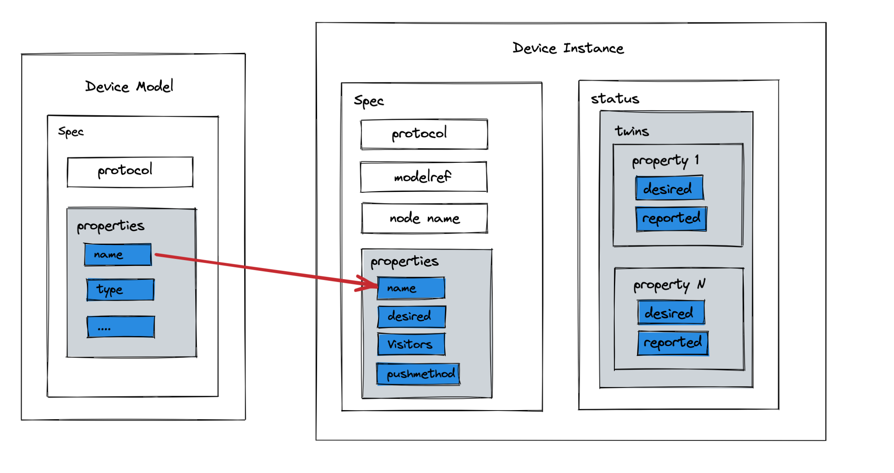
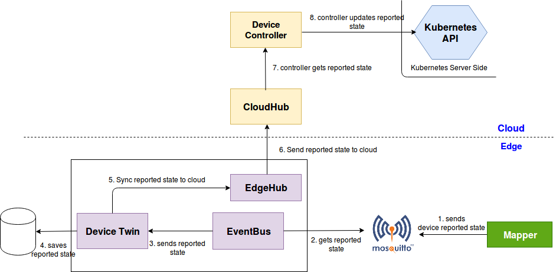
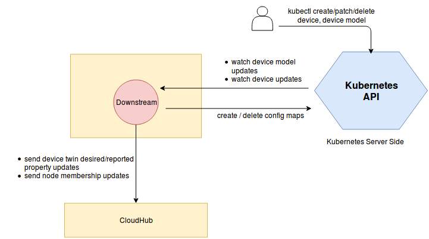
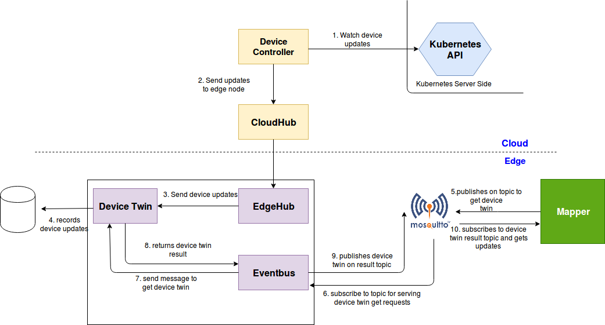

# KubeEdge架构

**云端：**

- **[CloudHub](https://release-1-17.docs.kubeedge.io/zh/docs/architecture/cloud/cloudhub):** Web 套接字服务器，负责在云端缓存信息、监视变更，并向 EdgeHub 端发送消息。
- **[EdgeController](https://release-1-17.docs.kubeedge.io/zh/docs/architecture/cloud/edge_controller):** kubernetes 的扩展控制器，用于管理边缘节点和 pod 的元数据，是EdgeCore与API Server之间的桥梁。

**边端：**

- **[Edged](https://release-1-17.docs.kubeedge.io/zh/docs/architecture/edge/edged):** 在边缘节点上运行并管理容器化应用程序的代理。
- **[EdgeHub](https://release-1-17.docs.kubeedge.io/zh/docs/architecture/edge/edgehub):** Web 套接字客户端，负责与 Cloud Service 进行交互以进行边缘计算（例如 KubeEdge 体系结构中的 Edge Controller）。这包括将云侧资源更新同步到边缘，并将边缘侧主机和设备状态变更报告给云。
- **[EventBus](https://release-1-17.docs.kubeedge.io/zh/docs/architecture/edge/eventbus):** 一个与 MQTT 服务器（mosquitto）进行交互的 MQTT 客户端，为其他组件提供发布和订阅功能。
- **[DeviceTwin](https://release-1-17.docs.kubeedge.io/zh/docs/architecture/edge/devicetwin):** 负责存储设备状态并将设备状态同步到云端。它还为应用程序提供查询接口。
- **[MetaManager](https://release-1-17.docs.kubeedge.io/zh/docs/architecture/edge/metamanager):** Edged 端和 Edgehub 端之间的消息处理器。它还负责将元数据存储到轻量级数据库（SQLite）或从轻量级数据库（SQLite）检索元数据。

## 云端

cloudcore的构成可以简单概括成：两个控制器+ 通信代理。一个controller管理边缘设备，另一个管理其他资源；cloudhub建立边缘与这两个控制器的通信，使得两个控制器可以管理到边缘的各类资源。

### EdgeController

kubernetes 的扩展控制器，用于管理边缘节点和 pod 的元数据，是EdgeCore与API Server之间的桥梁。

#### 下行数据流

在kubeedge中，当用户在云端对资源执行 创建/更新/删除 操作时，API Server会首先更新etcd中的资源数据，然后EdgeController监听到资源变化，会根据资源的变化生成指令并下发到边端，让边端执行具体的操作。这个过程中 EdgeController 会做下面这些事情：

1. 监听API Server：pod, configmap, secret add/update/delete
2. 同步资源更新事件到边端
3. 创建对应的 manager 来处理资源更新事件（生成对应指令？）
4. 确定数据该被发往哪个节点

#### 上行数据流

当边缘节点中资源发生状态变化时，会将相关信息同步到云端，而云端的EdgeController从CloudHub接收到边缘节点/资源的状态变化信息时，会将其发送给API Server，以及时更新etcd中的数据，实现云边数据一致。

##### Pod的运行状态（**PodCondition**）：

- **Ready**: PodReady means the pod is able to service requests and should be added to the load balancing pools for all matching services   

- **PodScheduled**: It represents the status of the scheduling process for this pod   
- **Unschedulable**: It means the scheduler cannot schedule the pod right now, maybe due to insufficient resources in the cluster  
- **Initialized**: It means that all Init containers in the pod have started successfully  
- **ContainersReady**: It indicates whether all containers in the pod are ready

##### Pod状态信息的构成（**PodStatus**）

- **PodPhase**: Current condition of the pod   

- **Conditions**: Details indicating why the pod is in this condition   
- **HostIP**: IP address of the host to which pod is assigned  
- **PodIp**: IP address allocated to the Pod   
- **QosClass**: Assigned to the pod based on resource requirement

### DeviceController

KubeEdge使用CRD机制拓展了API，定义了Device和Device Model两种资源，而Device Controller就是通过这两个CRD实现对边缘设备的管理：

- **Device Model**：同类设备的抽象。例如对空调这个设备的抽象，定义空调设备应该具有的属性，并且包含了**Property Visitors**，它描述了如何访问（读取）或更新（写入）空调的这些的属性
- **Device**：设备实例。例如家里某台具体的空调，记录了空调的各项参数。

[CRD的设计细节](https://github.com/kubeedge/kubeedge/blob/master/docs/proposals/device-crd-v1beta1.md)：

#### 上行数据流

Mapper检测到设备状态变化，将状态的更新信息层层传递到云端，CloudHub将数据分派给Device Controller，而Device Controller由将其同步到API Server。Device Controller处理的上行数据只有一种："Device Twin Reported State Updated"

#### 下行数据流

当云端对 device 执行 create/patch/delete 操作时：

从云端发送到边缘的主要是控制信息，分为以下几类：

| Update Type                        | Action                                                       |
| ---------------------------------- | ------------------------------------------------------------ |
| New Device Model Created           | NA                                                           |
| New Device Created                 | DeviceController根据device的yaml文件创建一个ConfigMap，这个ConfigMap首先更新到etcd中，再被EdgeController同步到边缘节点。Mapper根据ConfigMap中的信息与设备建立连接，并读写设备属性。 |
| Device Node Membership Updated     | Membership 是描述边缘设备与边缘节点的成员关系。当device被创建时，会将device与实际接入的边缘节点绑定（注册）。当设备更换接入的位置时，需要更新Membership。 |
| Device  Twin Desired State Updated | Desired State 描述设备配置的期望状态，例如希望将某台空调设置为26℃ |
| Device Deleted                     | The controller sends the device twin delete event to delete all device twins associated with the device. It also deletes config maps associated with the device and this delete event is synced to the edge. The mapper application effectively stops operating on the device. |

Device的ConfigMap中的重要字段：

- `protocol`：设备支持的通信协议，mapper使用该协议与设备建立连接
- `node name`：设备接入的节点，创建device时就会将设备注册到该节点，注册后该节点就负责管理该设备
- `properties.desired`：某个属性的期望值
- `properties.visitor`：读写某个属性的visitor

##### 当云端更新设备属性时

### CloudHub

Web 套接字服务器，负责在云端缓存信息、监视变更，并向 EdgeHub 端发送消息。打通CloudCore中两个控制器与边缘侧的通信。

#### 云边通信协议

**WebSocket**：基于TCP/HTTP，建立长连接后每条消息没有头部信息，通信开销小。适合高频率、低延时的通信。

**QUIC**：基于UDP，继承TLS加密。建立连接更快，安全性更高。

### 

## 边端

### Device Twin

DeviceTwin 包含四个子模块：

- Membership Module：负责处理边缘节点与设备之间的成员关系
  - dealMembershipGet
  - dealMembershipUpdated
  - dealMembershipDetail
- Twin Module：负责处理devicetwin消息
  - dealTwinUpdate
  - dealTwinGet
  - dealTwinSync
- Communication Module：负责处理Device Twin的各个模块向外的消息发送
  - dealSendToCloud
  - dealSendToEdge
  - dealLifeCycle
  - dealConfirm
- Device Module

#### 