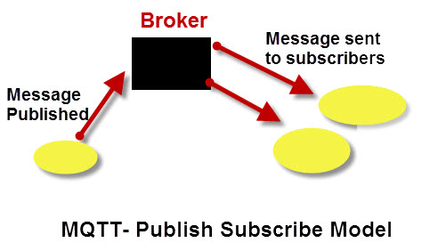
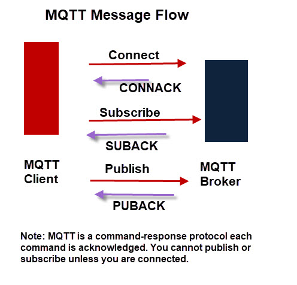
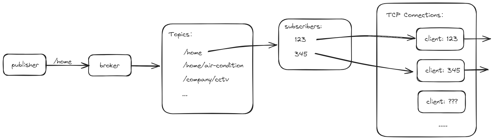

# MQTT

一个设计来用于物联网的通信协议，针对的是M2M（machine  to machine）通信。

MQTT是基于**发布/订阅模型**的通信协议，所谓发布/订阅模型也就类似于radio：

- 消息发布者只管发布消息到某个频段，不管有没有人收听
- 消息订阅者会打开收音机查看某个频段有没有广播消息，只有打开收音机并且有消息发布的时候才能收听到消息


### 分类

- MQTT：1999年设计，基于TCP/IP协议
- MQTT-SN：2013年设计，基于UDP以及其他运输层协议


### 基本概念



**发布者（Publisher）:** 发送消息的设备或应用程序。发布者将消息发送到特定的主题（Topic）。

**订阅者（Subscriber）:** 接收消息的设备或应用程序。订阅者通过订阅一个或多个主题来接收相应的消息。

**代理（Broker）:** 中央服务器，负责接收来自发布者的消息，并将其分发给相应主题的所有订阅者。代理在MQTT协议中起到了核心作用。

**主题（Topic）:** 主题是消息分类的标签，用于发布者和订阅者之间的消息路由。主题是分层结构的，类似于文件路径，例如 `home/kitchen/temperature`。


## 工作原理

### client 客户端



一个client可以既是publisher也是subscriber，客户端是在订阅还是发布是根据发送到broekr的消息头部中“消息类型”字段决定。

#### **client ID**

客户端没有地址，broker以 client ID 作为客户端的唯一标识。当client发起连接时会附带自身ID，如果该ID已被使用（已有相同ID连接到broker），那么连接会失败。类似地，如果一个客户端断开连接后，另一个客户端使用相同的 Client ID 发起连接，Broker 会认为这是同一个客户端在重新连接（可以采取措施防止冒名顶替）。

- 连接成功后，broker会将该TCP连接与报文头部中的 client ID 绑定
- 当client订阅topic时，broker会添加 topic - client ID 的映射


### client 与 broker 的连接

**长连接:** MQTT 客户端与代理之间的通信通过 TCP 长连接来保持。这个长连接在建立之后会持续存在，直到客户端主动断开连接或者网络中断。

**保活（Keep Alive）机制:** MQTT 使用一个保活机制来确保连接的活跃性。客户端会在指定的时间间隔内向代理发送一个“心跳”消息（PINGREQ），代理收到后会回应一个“心跳确认”消息（PINGRESP）。如果在保活时间内未收到心跳，代理将认为客户端已断开连接，并采取相应措施（例如，触发遗嘱消息）。

**自动重连:** 如果客户端与代理之间的连接意外中断，很多 MQTT 客户端库会提供自动重连功能，尝试重新建立连接，以恢复通信。


### broker中央服务器

broker不存储消息，如果publisher发送在某个topic的消息没有被订阅或者订阅的client并没有连接到broker，那么这个消息会立刻被丢弃（除非设置retain message将消息暂存在broker）

#### **broker 的消息分发**



#### **质量等级（QoS）**

MQTT 支持三种不同的消息传递质量服务（QoS），以应对不同的可靠性需求：

- **QoS 0:** "At most once"（至多一次） - 消息最多发送一次，不保证消息到达。（默认）
- **QoS 1:** "At least once"（至少一次） - 消息至少发送一次，可能会有重复消息。
- **QoS 2:** "Exactly once"（刚好一次） - 消息确保恰好到达一次，不会丢失也不会重复。


### 报文结构

下面是 MQTT 协议中四种关键操作的报文示例：发起连接（CONNECT）、订阅（SUBSCRIBE）、发布消息（PUBLISH）、和发布者向订阅者发送消息（PUBLISH 的另一端，作为 Broker 转发给订阅者）。

#### 1. **CONNECT 报文**
客户端向 Broker 发起连接请求。

**示例：**
```
Fixed Header: 10  (CONNECT 报文类型 0001, 标志位0000, 剩余长度10字节)
Variable Header:
  Protocol Name: "MQTT" (4字节)
  Protocol Level: 4 (MQTT 3.1.1)
  Connect Flags: 2 (Clean Session 标志位，用户标识符标志位等)
  Keep Alive: 60 (保持连接的心跳间隔为60秒)
Payload:
  Client ID: "client123" (标识符，长度9字节)
```

#### 2. **SUBSCRIBE 报文**
客户端向 Broker 订阅某个主题。

**示例：**
```
Fixed Header: 82  (SUBSCRIBE 报文类型 1000, QoS 0001, 剩余长度8字节)
Variable Header:
  Packet Identifier: 1 (用于确认订阅的标识符)
Payload:
  Topic Filter: "sensor/temperature" (要订阅的主题)
  QoS: 1 (请求的 QoS 级别)
```

#### 3. **PUBLISH 报文**
发布者向 Broker 发送消息。

**示例：**
```
Fixed Header: 30  (PUBLISH 报文类型 0011, QoS 0000, DUP 0, Retain 0, 剩余长度14字节)
Variable Header:
  Topic Name: "sensor/temperature" (消息所属的主题)
Payload:
  Message: "25.3C" (实际的消息内容)
```

#### 4. **PUBLISH 报文（Broker 向订阅者转发消息）**
Broker 向订阅者发送消息，与上面的 PUBLISH 报文类似，但会带有 QoS 和 Packet Identifier。

**示例：**
```
Fixed Header: 32  (PUBLISH 报文类型 0011, QoS 0001, DUP 0, Retain 0, 剩余长度16字节)
Variable Header:
  Topic Name: "sensor/temperature"
  Packet Identifier: 2 (用于确认接收到的标识符)
Payload:
  Message: "25.3C"
```


---


MQTT 协议的消息头部非常紧凑，设计上尽可能地减少了消息的开销。每个 MQTT 消息都由一个固定报头（Fixed Header）和可选的可变报头（Variable Header）以及有效载荷（Payload）组成。下面是 MQTT 消息头部的结构：

#### 1. **固定报头（Fixed Header）**

每个 MQTT 消息都包含一个固定报头，通常由 **2 到 5 个字节**组成。它包括以下内容：

- **第 1 字节：控制报文类型和标志**

  - **4 位报文类型（Message Type）:** 标识消息的类型，如 CONNECT、PUBLISH、SUBSCRIBE 等。每种消息类型都有一个特定的数字标识符（例如，PUBLISH 是 3）。
  - **4 位标志（Flags）:** 不同的消息类型会使用不同的标志位，例如在 PUBLISH 报文中，标志位用于指定 QoS、保留标志和 DUP 标志（消息重复传输标志）。

  例如，固定报头的第一个字节可以是 `0x30`，这意味着这是一个 PUBLISH 消息，且没有特殊标志（QoS = 0，非重复消息，未保留）。

- **剩余长度（Remaining Length）**

  - 剩余长度字段占用 **1 到 4 个字节**，表示接下来的可变报头和有效载荷的总长度。这个字段使用变长编码方式，因此可以用一个字节表示长度，也可能用多个字节来表示更大的长度。

例如，剩余长度字段值为 `0x7F` 时表示后续数据长度为 127 字节，值为 `0x82 0x01` 时表示 130 字节。

#### 2. **可变报头（Variable Header）**s

- **可选部分:** 并非所有 MQTT 报文都包含可变报头。是否包含可变报头及其内容取决于报文类型。例如，CONNECT 报文的可变报头包含协议名称、协议级别、连接标志等字段，而 PUBLISH 报文的可变报头包含主题名、消息标识符等字段。
- **协议名和版本:** 在 CONNECT 报文中，可变报头包含协议名（通常是 "MQTT"）和协议版本号（例如，4 代表 MQTT 3.1.1，5 代表 MQTT 5.0）。
- **连接标志:** 对于 CONNECT 报文，可变报头还包括连接标志字段，用于指示用户身份认证、清除会话、遗嘱消息等选项。

#### 3. **有效载荷（Payload）**

- **消息内容:** 有效载荷包含实际传输的数据内容。对于 PUBLISH 报文，有效载荷就是发布的消息内容；对于 SUBSCRIBE 报文，有效载荷包含主题过滤器列表。
- **字段多样:** 有效载荷的内容和结构取决于报文类型。比如，CONNECT 报文的有效载荷可能包含客户端标识符、遗嘱消息内容、用户名和密码等。