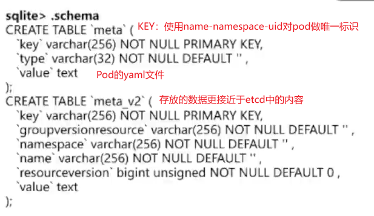
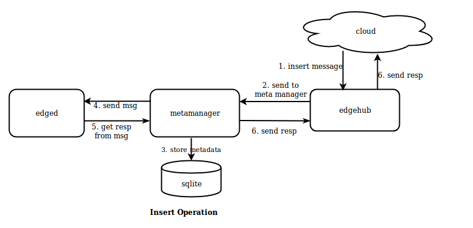
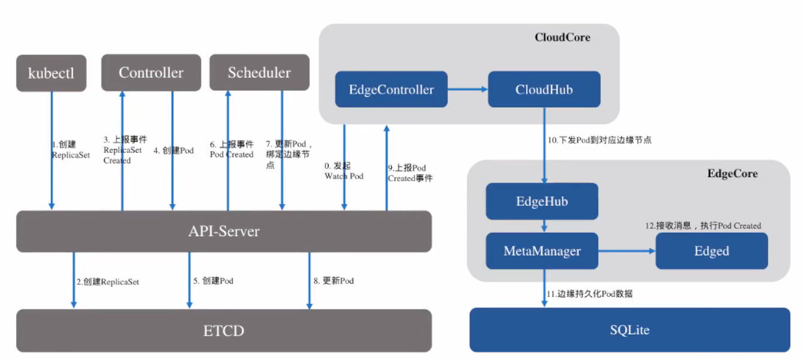
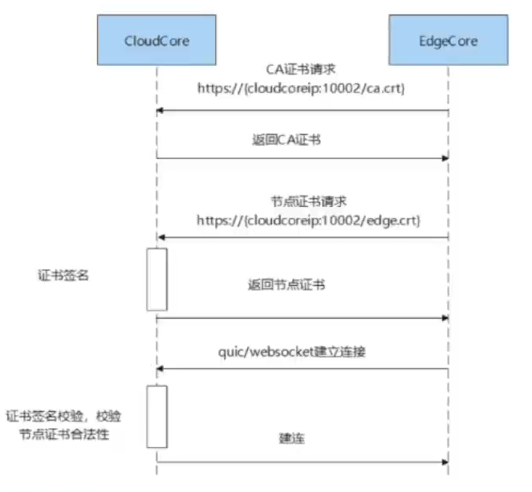
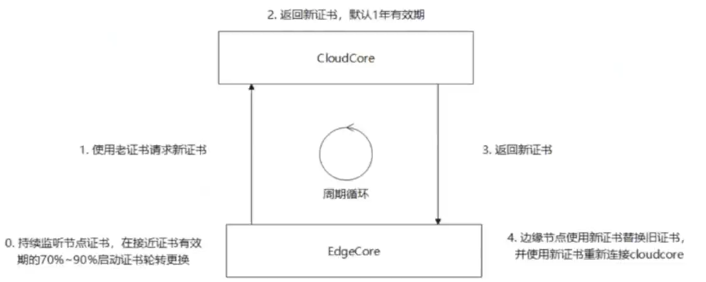

# 边缘节点管理

## 轻量数据库

默认路径：`var/lib/kubeedge/edgecore.db`

数据库引擎：sqlite3

### 存放的数据（table）

- device, device_twin：边缘设备相关数据

- meta, meta_v2：kubernetes常用资源的数据。前者主要是Pod相关数据，用于实现边缘在离线状态下的自治；后者是供边缘暴露的list-watch接口查询数据使用。两个表存放内容相近，只是用途不同。

  

- target_urls, sub_topics：云边数据相关

### 当云端下发创建资源的命令时

- edged负责创建资源
- metamanager负责处理资源的元数据
- sqlite则是数据库

## 边缘节点证书

### 证书生成流程

QUIC/Websocket协议建立连接时会进行双向认证：CA证书+节点证书+节点公钥

---

#### CloudCore的API

CloudCore启动HTTPS Server，监听10002端口，包含API：

- `/ca.crt`：请求CA证书
- `/edge.crt`：请求边缘节点的证书
- `/nodeupgreade`：节点更新

### 证书轮转机制

有效期1年，到期后使用旧证书申请新证书

#### 证书解析

当证书校验失败时，可能是证书校验的ip不是想要访问的ip，可以解析云上节点的证书，查看ip是否正确

https://www.bilibili.com/video/BV1ze4y1u7bP/?spm_id_from=333.880.my_history.page.click&vd_source=8205edcb8d5d68d6331e9295bb6ccde9

32′

#### 安全list-watch机制

40′

