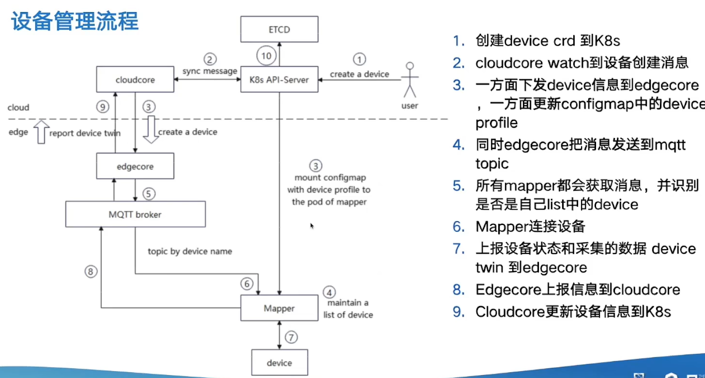
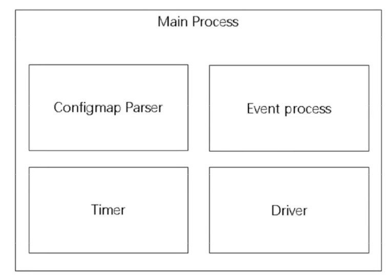
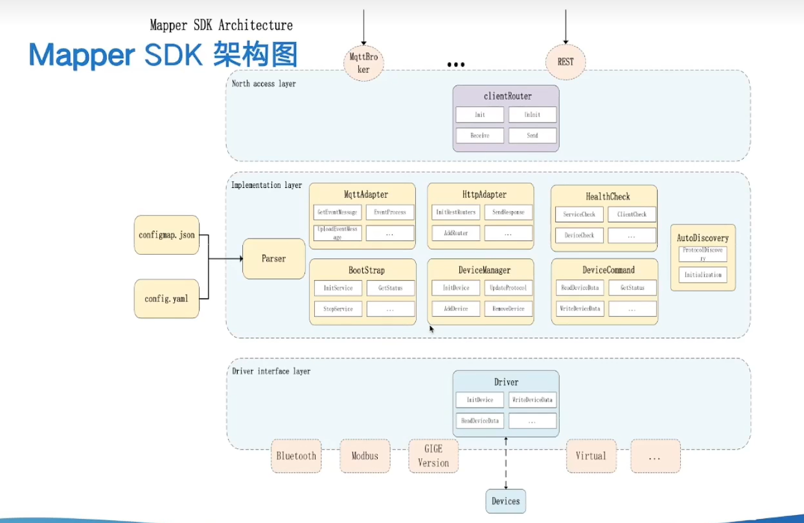

# 边缘设备管理

- device controller：位于云端，使用CRD来定义和控制设备
- device twin：位于边缘端，存储来自mapper上报的值/状态，并与device controller 和 mapper一起构成边缘设备到云端的消息传输通道

- mapper：位于边缘端，是kubeedge与设备之间的接口，可以设置/获取数据，获取/报告设备状态。一个mapper只能控制管理一类设备

流程：

1. 配置device和device model
2. 根据配置生成configmap，存储设备信息
3. mapper启动时解析configmap
4. 运行时，如果配置被更改，configmap随之更新，device twin也会收到并向云端报告更新信息

## Mapper

- Configmap Parser：解析设备信息的configmap
- Event Process：接收和处理EdgeCore下发的消息，订阅、发布MQTT
- Timer：定义调用的函数，例如周期性获取心跳、或者周期性执行的一些其他操作
- Driver：负责对设备的直接访问（初始化、读、写、状态检查）

#### Mapper的部署方式

- 作为 Pod 运行
- 作为二进制程序运行

### Mapper SDK

以前的mapper只支持有限的几种通信协议，而mapper-sdk-go继承之前的mapper功能，提供了易于使用的sdk来支持自定义协议的设备，将设备驱动与云端通信部分解耦，一遍mapper开发人员可以专注设备的控制管理

- clientRoute：解析和路由消息，把消息交给合适的组件进一步处理
- Parser：解析conigmap
- MqttAdapter：处理MQTT消息，将其转换成对应指令
- HttpAdapter：处理restful接口，提供http服务
- HealthCheck：健康检查，定期上报状态和数据
- BootStrap：初始化状态、启动和停止一些服务
- Device Manager：设备管理，初始化设备，添加、删除、更新设备
- DeviceCommand：从设备获取数据，添加设备操作命令
- Driver：设备驱动