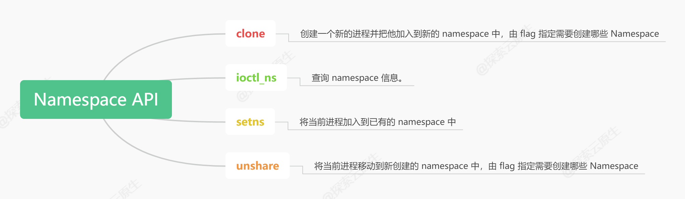
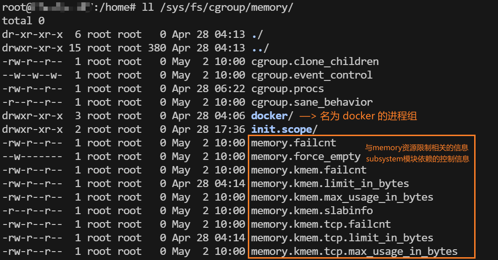
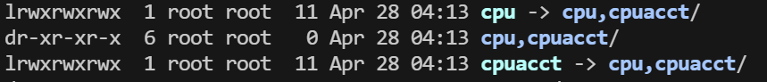
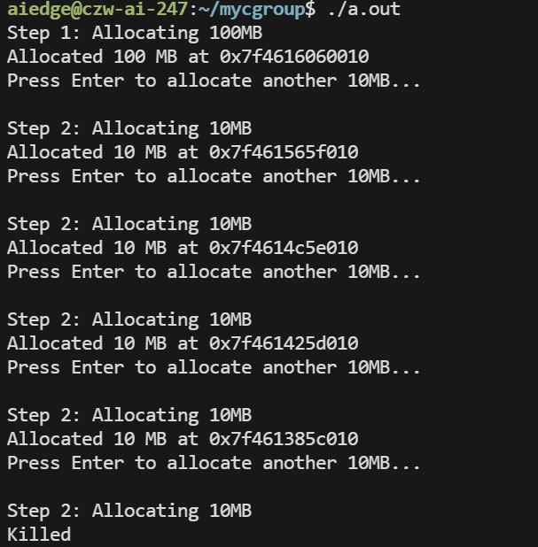
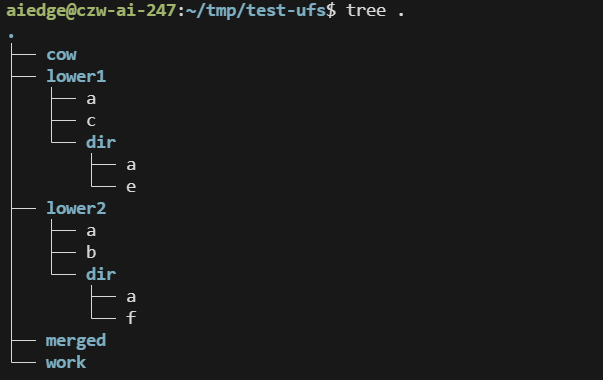
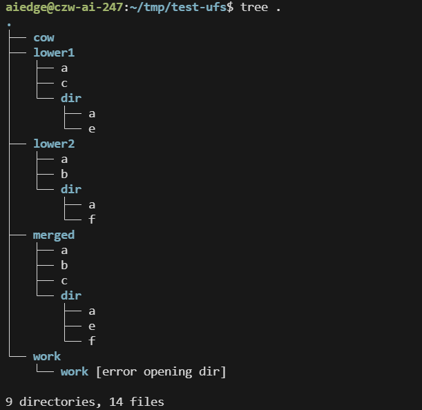
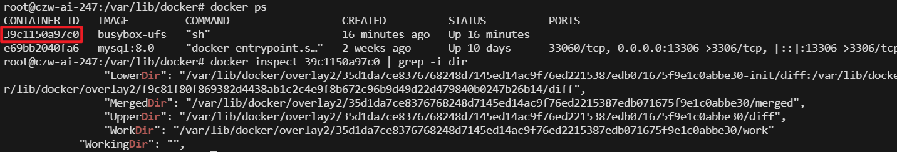

# Namespace

https://www.lixueduan.com/posts/docker/05-namespace/

## 可供隔离的系统资源

- UTS - 主机名和域名 （系统相关）

- User - 系统用户（系统相关）

- PID （进程相关）
- IPC （进程相关）
- Network （网络栈）
- Mount （文件系统）

## inode 与 namespace

```sh
root@czw-ai-247:~# ll /proc/1404/ns/
total 0
dr-x--x--x 2 systemd-coredump systemd-coredump 0 Apr 28 04:06 ./
dr-xr-xr-x 9 systemd-coredump systemd-coredump 0 Apr 28 04:06 ../
lrwxrwxrwx 1 systemd-coredump systemd-coredump 0 May  1 09:43 cgroup -> 'cgroup:[4026531835]'
lrwxrwxrwx 1 systemd-coredump systemd-coredump 0 May  1 09:43 ipc -> 'ipc:[4026532377]'
lrwxrwxrwx 1 systemd-coredump systemd-coredump 0 Apr 28 04:06 mnt -> 'mnt:[4026532375]'
lrwxrwxrwx 1 systemd-coredump systemd-coredump 0 Apr 28 04:06 net -> 'net:[4026532380]'
lrwxrwxrwx 1 systemd-coredump systemd-coredump 0 May  1 09:43 pid -> 'pid:[4026532378]'
lrwxrwxrwx 1 systemd-coredump systemd-coredump 0 May  1 11:35 pid_for_children -> 'pid:[4026532378]'
lrwxrwxrwx 1 systemd-coredump systemd-coredump 0 May  1 09:43 user -> 'user:[4026531837]'
lrwxrwxrwx 1 systemd-coredump systemd-coredump 0 May  1 09:43 uts -> 'uts:[4026532376]'
```

你看到的这些：

```
uts -> 'uts:[4026532376]'
net -> 'net:[4026532380]'
```

这些数字 `4026532376` 等，确实是 **namespace 对象的 inode 编号**。我们来解释原因：

------

### 和 inode 有什么关系

在 Linux 中，**一切皆文件**。Linux 将 namespace（如 `uts`、`net`、`pid` 等）设计成一种特殊的、**可以通过文件描述符访问和操作的内核对象**，并将其暴露在 `/proc/<pid>/ns/` 目录下的符号链接中。

这些符号链接指向的其实是一个挂载在 `procfs` （`/proc`目录）上的伪文件系统中的文件（namespace 伪文件），每个 namespace 都有唯一的 inode 编号，供内核标识、对比和引用。

#### 链接文件 & 伪文件

`/proc/<pid>/ns/`下的符号链接指向的不是真实的磁盘上的 inode，而是`procfs`上内核动态分配的虚拟 inode，内核通过这个虚拟inode来管理进程的命名空间。

**通过下面实验可以发现：**

- 链接文件的inode号与指向的inode号不同，这是符号链接（软链接/Windows快捷方式）
- 符号链接文件是空的（size = 0），也就是说它并没有存放被链接文件的路径，这是一个伪链接文件

```sh
# 获取 pid namespace 的 inode 号
root@czw-ai-247:/home/aiedge# readlink /proc/88637/ns/pid
pid:[4026531836]

# 查看 链接文件 pid 的详细信息
root@czw-ai-247:/home/aiedge# stat /proc/88637/ns/pid
  File: /proc/88637/ns/pid -> pid:[4026531836]
  Size: 0               Blocks: 0          IO Block: 1024   symbolic link
Device: 5h/5d   Inode: 200340      Links: 1
Access: (0777/lrwxrwxrwx)  Uid: (    0/    root)   Gid: (    0/    root)
Access: 2025-05-02 07:38:12.817215108 +0000
Modify: 2025-05-02 05:49:43.372230708 +0000
Change: 2025-05-02 05:49:43.372230708 +0000
 Birth: -
```

#### 为什么用伪 inode ？

- 在 Linux 中，`inode` 是 **VFS（虚拟文件系统）层面**的核心抽象。
- 哪怕文件不在磁盘上（比如 `/proc`、`/sys`、`/dev` 中的文件），内核仍会为这些“虚拟文件”分配一个 inode，以便统一处理。
- 所以 `ns:[4026532376]` 里的 `4026532376` 是这个 namespace 的 inode 号，只不过它：
  - **不是磁盘 inode**
  - 是内核内存中的一个标识号（通常由 `proc_ns` 结构生成）

| 项目                          | 说明                                                         |
| ----------------------------- | ------------------------------------------------------------ |
| `/proc/.../ns/...` 是文件吗？ | 是伪文件，不是磁盘文件                                       |
| inode 是真实的吗？            | 是“内核真实的”，但不是磁盘 inode                             |
| 为什么要用 inode 显示？       | 用于唯一标识某个 namespace，可对比两个进程是否共享同一 namespace |

------

### inode 的作用

1. **唯一标识某个 namespace 实例**
   即使两个进程的 `uts` namespace 类型相同，它们也可能属于不同的实例，通过 inode 可以判断：

   ```
   bashCopyEditls -l /proc/1404/ns/uts
   # uts:[4026532376]
   ls -l /proc/1500/ns/uts
   # uts:[4026532376] → 相同，说明共享 namespace
   ```

2. **支持 `setns()` 的文件接口**
   `setns()` 允许你传入一个打开的 namespace 文件描述符（FD），而这个 FD 正是基于这个 inode 所对应的 namespace 对象。

3. **便于用户空间判断共享情况**
   你可以用 `readlink` 或 `stat` 查看 inode，来判断两个进程是否在同一个 namespace 中。

### 附：什么是 procfs（/proc 文件系统）

- **procfs**（process file system）是 Linux 内核提供的一种**伪文件系统（pseudo-filesystem）**。
- 挂载在 `/proc` 目录下，用于**显示和提供与系统进程、内核和资源状态相关的信息**。
- 不占用磁盘空间，**数据是动态生成的**，由内核提供。

#### 📂 `/proc` 中包含了什么？

| 路径                | 说明                                                         |
| ------------------- | ------------------------------------------------------------ |
| `/proc/<pid>/`      | 每个正在运行的进程一个目录，包含其状态、打开的文件、namespace 等信息 |
| `/proc/cpuinfo`     | CPU 详细信息                                                 |
| `/proc/meminfo`     | 内存使用情况                                                 |
| `/proc/version`     | 当前内核版本                                                 |
| `/proc/cmdline`     | 内核启动参数                                                 |
| `/proc/filesystems` | 支持的文件系统列表                                           |
| `/proc/mounts`      | 当前挂载点                                                   |
| `/proc/self/`       | 当前进程自己的 `/proc/<pid>/` 别名                           |

这些内容大多是由内核在访问时动态生成的，不能直接写入。

####  `mount -t proc` 

```sh
# mount -t type device dir
mount -t proc proc /proc
```

- 它将类型为 `proc` 的特殊文件系统挂载到 `/proc` 目录上。
  - 对于普通的文件系统，第二个 proc 的位置是挂载源，通常应该是 `/dev/sda1` 这样的设备名
  - 对于 **`proc`、`tmpfs`、`sysfs`** 等**伪文件系统（pseudo filesystem）**，**它们没有实际的设备**，所以我们用一个占位名“`proc`”来表示来源
- 挂载后，`/proc` 目录就变成了一个**内核态虚拟信息的视图**。


## ns 数量限制与回收策略

linux 也限制了 namespace 的数量，不能无限制的创建 namespace，具体限制一般在 `/proc/sys/user` 目录中。具体如下：

```sh
root@czw-ai-247:~# ls /proc/sys/user
max_cgroup_namespaces  max_ipc_namespaces  max_pid_namespaces
max_inotify_instances  max_mnt_namespaces  max_user_namespaces
max_inotify_watches    max_net_namespaces  max_uts_namespaces
root@czw-ai-247:~# cat /proc/sys/user/max_cgroup_namespaces 
31640
```

**既然数量有限制，那已经创建的 namespace 什么时候会被销毁回收呢？**

规则还是比较好理解的：当一个 namespace 中的所有进程都结束或者移出该 namespace 时，该 namespace 将会被销毁。

> 这也解释了为什么没有创建 namespace 的 API，因为刚创建的 namespace 没有任何进程，立马就会被回收。

不过也有一些特殊情况，可以再没有进程的时候保留 namespace：

- 存在打开的 FD，或者对 `/proc/[pid]/ns/*` 执行了 bind mount
- 存在子 namespace
- 它是一个拥有一个或多个非用户 namespace 的 namespace。
- 它是一个 PID namespace，并且有一个进程通过 /proc/[pid]/ns/pid_for_children 符号链接引用了这个 namespace。（**unshare给未来的子进程创建新 PID namespace**）
- 它是一个 Time namespace，并且有一个进程通过 /proc/[pid]/ns/time_for_children 符号链接引用了这个 namespace。
- 它是一个 IPC namespace，并且有一个 mqueue 文件系统的 mount 引用了该 namespace
- 它是一个 PIDnamespace，并且有一个 proc 文件系统的 mount 引用了该 namespace

> 一句话描述：**当 namespace 有被（预约）使用时就不会被回收，反之则会被回收。**


## 实验

### 常用 shell 命令

#### nsenter

`nsenter` 是一个非常实用的 Linux 命令，它允许你在一个已经运行的进程的命名空间上下文中执行命令。简单来说，你可以通过 `nsenter` "进入"到容器或其他进程的某个或某些特定的命名空间中，然后就像在该命名空间内部操作一样。

**常用选项**：

- `-t <pid>` 或 `--target <pid>`：指定目标进程的 PID，你要进入这个进程所使用的命名空间。
- `-n` 或 `--net`：进入网络命名空间。
- `-p` 或 `--pid`：进入 PID 命名空间。
- `-m` 或 `--mount`：进入 Mount 命名空间。
- `-u` 或 `--uts`：进入 UTS 命名空间。
- `-i` 或 `--ipc`：进入 IPC 命名空间。
- `-U` 或 `--user`：进入 User 命名空间。
- `-a` 或 `--all`：进入进程所有的命名空间。

**使用示例**：

```sh
# 进入进程 83436 的网络命名空间
nsenter --target 83436 --net
# 退出命名空间
exit
```

### API



 `clone`、`setns`、`unshare`、`ioctl_ns` 是 Linux 中用于操作 **namespace（命名空间）** 的四个关键系统调用/接口。下面是它们的具体作用：

####  1. `clone`

- **作用**：创建一个新进程，并可以为它指定使用新的 namespace。

- **常用于**：创建具有隔离 UTS、IPC、PID、Mount、Network 等 namespace 的子进程。

- **函数签名**（Go 和 C 不同，C 为底层原型）：

  ```c
  pid_t clone(int (*fn)(void *), void *child_stack, int flags, void *arg, ...);
  ```

- 常见的 namespace 相关 flag：

  ```c
  CLONE_NEWUTS    // 新的主机名 namespace
  CLONE_NEWPID    // 新的 PID namespace
  CLONE_NEWNS     // 新的挂载点 namespace
  CLONE_NEWNET    // 新的网络 namespace
  CLONE_NEWIPC    // 新的进程间通信 namespace
  ```

------

####  2. `unshare`

- **作用**：让当前进程“脱离”某些 namespace，从而使用新的（空的）命名空间。

- **区别于 clone**：`clone` 是创建新的子进程并指定 namespace；`unshare` 是让**当前进程自己**进入新的 namespace。

- **示例**：

  ```c
  unshare(CLONE_NEWUTS | CLONE_NEWNET);
  ```

  表示当前进程不再共享 UTS 和网络 namespace，而是使用新的。

------

####  3. `setns`

- **作用**：将当前进程“加入”某个已存在的 namespace（通常是某个已有进程正在使用的）。

- **使用场景**：比如进入容器进程的网络或 UTS namespace。

- **典型用法**：

  ```c
  int fd = open("/proc/1234/ns/net", O_RDONLY);
  setns(fd, 0);
  ```

  把当前进程加入进程 1234 的网络 namespace。

------

#### 4. `ioctl_ns`（不常用）

- **作用**：是通过 `ioctl()` 系统调用与 namespace 设备进行交互的方式。

- **用途**：极少见，主要用于某些专用工具或调试 namespace（如 `nsfs`）。

- **调用形式**：

  ```c
  ioctl(fd, NS_GET_USERNS)
  ```

  等类似接口，用于获取关联的 user namespace 等。

------

####  总结对比表：

| 接口       | 作用                         | 对象         | 常用场景                   |
| ---------- | ---------------------------- | ------------ | -------------------------- |
| `clone`    | 创建新进程并进入新 namespace | 新进程       | 容器启动、init 创建进程等  |
| `unshare`  | 当前进程脱离 namespace       | 当前进程     | `unshare` 命令、手动隔离   |
| `setns`    | 加入已有 namespace           | 当前进程     | `nsenter` 命令、容器挂接   |
| `ioctl_ns` | 查询或操作 namespace 元信息  | namespace FD | 特殊用法、调试或内核层工具 |

---

### 查看进程所属 namespace

- 与进程的ns相关的信息在`proc/<pid>/ns`目录下
- 目录下的文件是指向进程 namespace 的 inode 节点的链接文件
  - 通过对比两个进程某个namespace的inode号是否一致，可以判断两个进程是否属于同一个namespace

```sh
root@czw-ai-247:/home/aiedge# ll /proc/1404/ns
total 0
dr-x--x--x 2 systemd-coredump systemd-coredump 0 Apr 28 04:06 ./
dr-xr-xr-x 9 systemd-coredump systemd-coredump 0 Apr 28 04:06 ../
lrwxrwxrwx 1 systemd-coredump systemd-coredump 0 May  1 09:43 cgroup -> 'cgroup:[4026531835]'
lrwxrwxrwx 1 systemd-coredump systemd-coredump 0 May  1 09:43 ipc -> 'ipc:[4026532377]'
lrwxrwxrwx 1 systemd-coredump systemd-coredump 0 Apr 28 04:06 mnt -> 'mnt:[4026532375]'
lrwxrwxrwx 1 systemd-coredump systemd-coredump 0 Apr 28 04:06 net -> 'net:[4026532380]'
lrwxrwxrwx 1 systemd-coredump systemd-coredump 0 May  1 09:43 pid -> 'pid:[4026532378]'
lrwxrwxrwx 1 systemd-coredump systemd-coredump 0 May  1 11:35 pid_for_children -> 'pid:[4026532378]'
lrwxrwxrwx 1 systemd-coredump systemd-coredump 0 May  1 09:43 user -> 'user:[4026531837]'
lrwxrwxrwx 1 systemd-coredump systemd-coredump 0 May  1 09:43 uts -> 'uts:[4026532376]'
```

---

### go程序实验

https://www.lixueduan.com/posts/docker/05-namespace/#uts-namespace

```go
package ns

import (
	"log"
	"os"
	"os/exec"
	"syscall"
)

func TestUTS() {
	// 1. 创建一个要执行的命令
	cmd := exec.Command("bash")

	// 2. 配置子进程的系统属性
	cmd.SysProcAttr = &syscall.SysProcAttr{
		Cloneflags: syscall.CLONE_NEWUTS,
	}

	// 3. 将标准输入、输出和错误流连接到当前进程
	cmd.Stdin = os.Stdin
	cmd.Stdout = os.Stdout
	cmd.Stderr = os.Stderr

	// 4. 运行命令并等待其完成
	if err := cmd.Run(); err != nil {
		log.Fatalln(err)
	}
}
```

#### 一个天坑

`syscall.CLONE_NEWNS | syscall.CLONE_NEWUSER`中如果或运算符`|`两边没有空格，出现奇怪报错：

```sh
root@czw-ai-247:/home/aiedge/mydocker/learning# go run main.go 
# mydocker/learning/ns
ns/mount.go:20:12: syntax error: unexpected = at end of statement
```

**ChatGPT**：Go 在处理位运算（例如 `|`）时确实**对格式很敏感**。虽然理论上语法允许没有空格，但在某些 IDE 或编译环境下（尤其是复制粘贴或中文输入法干扰时），符号前后如果存在不可见字符或奇怪换行，Go 编译器可能报出奇怪的语法错误


# cgroup

## 核心概念

`cgroup`（Control Groups）是 Linux 提供的用于**限制、记录和隔离进程资源使用**的机制。它的核心有三个关键概念：

### ✅ 1. **Hierarchy（层次结构）**

- 是由一棵 **cgroup 目录树** 组成的结构。
- 每个 hierarchy 与一个或多个 **subsystem（控制器）** 绑定。
- 用 `mount -t cgroup -o memory /sys/fs/cgroup/memory` 就是挂载一个绑定了 `memory` 控制器的 hierarchy。
- 系统可以存在多个 hierarchy，每个用于控制不同资源（或组合资源）。

**理解要点**：

> 一个 hierarchy 就是一套用于管理某些资源的“组织结构”，其内部是一棵资源管理用的树形目录结构。

### ✅ 2. **Subsystem（控制器）**

- 又叫 **controller**，用于管理某类系统资源。
- 典型的有：
  - `cpu`：限制 CPU 使用
  - `memory`：限制内存使用
  - `blkio`：限制块设备 I/O
  - `cpuset`：绑定 CPU 核心
  - `pids`：限制进程数
- 一个 subsystem 只能挂载到一个 hierarchy 上（在 cgroup v1 中）。

**理解要点**：

> subsystem 就是 “可以被限制的资源种类”。

### ✅ 3. **Cgroup（控制组/进程组）**

- 是某个 hierarchy 中的一个目录节点，表示一个进程组。
- 每个 cgroup 对应一组进程，这些进程共享该组设置的资源限制。
- 把进程加入某个 cgroup 后，它就受该 cgroup 中 subsystem 的限制和统计。
- 一个进程在一个 hierarchy 中只能出现在一个节点/进程组中。
- 一个进程 fork 出子进程时,子进程是和父进程在同一个 cgroup 中的。

**理解要点**：

> cgroup 是“资源控制单位”，你可以限制它包含的进程使用多少资源。

### 具体实例

**`/sys/fs/cgroup/memory/` 就是一个 hierarchy 的挂载点**，这个 hierarchy 只绑定了一个 subsystem：`memory`，即用来限制和监控内存资源的控制器。（这是系统启动时就自动挂载的 hierarchy ）

**也可以手动挂载**：

```sh
mount -t cgroup -o memory cgroup /sys/fs/cgroup/memory
```

这实际上是创建了一个：

- ✅ **Hierarchy**：其挂载点是 `/sys/fs/cgroup/memory`
- ✅ **Subsystem**：只挂载了 `memory` 控制器
- ✅ **cgroup 树结构**：目录层级结构，表示不同进程组的资源限制



---

**一个 hierarchy 绑定两个 subsystem**：

- cpu 和 cpuacct 两个subsystem都在一个cgroup树里面



## 进程如何关联到cgroup系统

- cgroup 一共有12种subsystem，也就是说有12种可以限制的系统资源

- 那么对于一个进程，它可能 memory 的限制在`memory` 树中，cpu的限制在`cpu,cpuacct `树中，以此类推，关于一个进程的资源控制信息可能就设计到若干个层次结构树和**进程组/节点**

- 而每个节点有自己的关于资源限制的信息，这样就会导致要记录每个进程的资源控制需要维护一张类似下面的表（不止3列）：

  

  显然：

  - PID 123 和 124 的资源限制是一模一样的。

  - 但如果我们为每个进程都维护这张表，**数据会重复大量占用内存**，也难以管理。

### 解决方案：引入 `css_set`

> cgroup_subsystem_state_set

#### 它的核心作用：

- 把“进程在每个 subsystem 中对应的 cgroup 节点”的组合抽象成一个对象。
- 也就是把一个进程相关的所有cgroup节点汇总组合成一个数据结构，也就是`css_set`

每个 `css_set` 实际上是：

```go
css_set struct {
    subsystems map[controller]*cgroup
    tasks      []*task // 所有共享这组资源限制的进程
}
```

比如上面例子里：

- PID 123 和 124 使用的是同一个 `css_set`，因为它们在 memory、cpu、blkio 上都指向相同的 cgroup。
- PID 125 则会拥有另一个 `css_set`。

------

### `css_set` 的好处

| 优点                                   | 描述                                                         |
| -------------------------------------- | ------------------------------------------------------------ |
| ✅ **减少重复数据**                     | 多个进程共用相同的资源控制组合，节省内存                     |
| ✅ **便于快速判断是否资源限制一致**     | 比较两个进程是否用同一组资源限制，只需要比较 `css_set` 指针是否相同 |
| ✅ **便于控制资源迁移**                 | 改变某个进程的资源控制时，只需更换它的 `css_set`             |
| ✅ **支持一个 cgroup 被多个控制器引用** | `css_set` 作为 mapping，可以复用已有 cgroup 节点             |

## 如何使用 Cgroups

### 1. 查看cgroup文件系统挂载点

cgroup 相关的所有操作都是基于内核中的 cgroup virtual filesystem，使用 cgroup 很简单，挂载这个文件系统就可以了。

> 一般情况下都是挂载到/sys/fs/cgroup 目录下，当然挂载到其它任何目录都没关系。

cgroups 以文件的方式提供应用接口，我们可以通过 mount 命令来查看 cgroups 默认的挂载点：

```sh
[root@iZ2zefmrr626i66omb40ryZ ~]# mount | grep cgroup
tmpfs on /sys/fs/cgroup type tmpfs (ro,nosuid,nodev,noexec,mode=755)
cgroup on /sys/fs/cgroup/systemd type cgroup (rw,nosuid,nodev,noexec,relatime,xattr,release_agent=/usr/lib/systemd/systemd-cgroups-agent,name=systemd)
cgroup on /sys/fs/cgroup/perf_event type cgroup (rw,nosuid,nodev,noexec,relatime,perf_event)
cgroup on /sys/fs/cgroup/net_cls,net_prio type cgroup (rw,nosuid,nodev,noexec,relatime,net_cls,net_prio)
cgroup on /sys/fs/cgroup/cpu,cpuacct type cgroup (rw,nosuid,nodev,noexec,relatime,cpu,cpuacct)
cgroup on /sys/fs/cgroup/pids type cgroup (rw,nosuid,nodev,noexec,relatime,pids)
cgroup on /sys/fs/cgroup/rdma type cgroup (rw,nosuid,nodev,noexec,relatime,rdma)
cgroup on /sys/fs/cgroup/memory type cgroup (rw,nosuid,nodev,noexec,relatime,memory)
cgroup on /sys/fs/cgroup/cpuset type cgroup (rw,nosuid,nodev,noexec,relatime,cpuset)
cgroup on /sys/fs/cgroup/blkio type cgroup (rw,nosuid,nodev,noexec,relatime,blkio)
cgroup on /sys/fs/cgroup/devices type cgroup (rw,nosuid,nodev,noexec,relatime,devices)
cgroup on /sys/fs/cgroup/hugetlb type cgroup (rw,nosuid,nodev,noexec,relatime,hugetlb)
cgroup on /sys/fs/cgroup/freezer type cgroup (rw,nosuid,nodev,noexec,relatime,freezer)

```

- 第一行说明`/sys/fs/cgroup`挂载点处挂载的是tmpfs虚拟文件系统
- 而挂载在`/sys/fs/cgroup`上面的 hierarchy 也是tmpfs虚拟文件系统
- 且由于`/sys/fs/cgroup`这个挂载点是只读的，所以系统不允许用户再挂载新的 hierarchy

**注意三大概念的层次：**

挂载到`/sys/fs/cgroup`下的是 **hierarchy**，而 hierarchy  通常会与一个或多个 **subsystem** 绑定，同时一个 hierarchy 下会以树状结构组织若干的 **cgroup**

### 2. 查看系统当前cgroup子系统状态

- 可以看到有哪些子系统
- 每个子系统有多少hierarchy、多少cgroup

```sh
root@czw-ai-247:/home# cat /proc/cgroups 
#subsys_name     hierarchy    num_cgroups    enabled
cpuset          12           3              1
cpu             10           101            1
cpuacct         10           101            1
blkio           9            101            1
memory          11           189            1
devices         7            101            1
freezer         4            4              1
net_cls         5            3              1
perf_event      3            3              1
net_prio        5            3              1
hugetlb         8            3              1
pids            2            109            1
rdma            6            3              1
```

### 3. cgroup的创建与删除

- 创建 cgroup 比较简单，直接在 hierarchy 或 cgroup 目录下创建子目录（mkdir）即可

- 删除则是删除对应**目录**（rmdir）
  - 注意不能通过`rm -rf`来删除，因为目录中的文件是虚拟的，递归删除时会报错
  - 也不能`rm -d`来删除，因为这是删除空目录，而cgroup的目录非空
  - 但是**可以用`rmdir`直接删除**

#### cgroup工具

- `cgdelete controllers:path`： path可以用相对路径或者绝对路径
  - 删除之前要确保其中没有进程，不然会删除失败

```sh
# 安装cgroup工具
apt-get install cgroup-tools

# 删除实验
root@czw-ai-247:/sys/fs/cgroup/memory# ll | grep mycg
drwxr-xr-x  2 root root   0 May  3 03:43 mycg/
root@czw-ai-247:/sys/fs/cgroup/memory# cgdelete memory:mycg
root@czw-ai-247:/sys/fs/cgroup/memory# ll | grep mycg
```

### 4. hierarchy 的创建与删除

```sh
# 创建一个目录用作挂载点
mkdir /path/to/dir
# 挂载 - 类型为cgroup的fs - 关联到subsystem控制器 - 子系统实例/hierarchy的名字 - fs的挂载点
mount       -t cgroup       -o <subsystem>            name             /path/to/dir
# 删除
umount /path/to/dir
```

### 5. 把进程加入 cgroup（✨核心✨）

1. 首先，Linux系统中的所有进程都必须属于每个子系统树中的某个节点
   - 因为任何进程创建时都会自动加入到其父进程所在的 cgroup
   - 所以只要 Linux 上第一个运行的进程在 cgroup 中，那么后面所有进程都在 cgroup 中
2. 其次，通常我们说的把”进程加入某个 cgroup 中“
   - 这意思不是说进程原来不受 cgroup 管理，现在要把它加入某个 cgroup 来管理的意思
   - 而是每次把进程写进`cgroup.procs/tasks`的操作，在背后都伴随着一个将进程从原 cgroup 中移除的操作
   - 其实对 cgroup 文件的读写操作，本质上也就是 cgroup 通过虚拟文件系统暴露出来的操作接口罢了
3. 另外，cgroup 是内核带有强制性的对进程资源进行管理的手段，任何进程都不能不受管理、退出 cgroup
   - 即使你想让某个进程不再受到任何 cgroup 的限制，你也需要将其移动到根 cgroup（对于每个子系统层级来说），根 cgroup 通常没有施加任何限制


## 实验

### pids

通过下面两个关键文件，可以限制进程组中的进程数目：

- pids.current: 表示当前 cgroup 及其**所有子孙 cgroup** 中现有的总的进程数量
- pids.max: 当前 cgroup 及其所有子孙 cgroup 中所允许创建的总的最大进程数量

> 重点：”子孙“两个字，数值表示的是整颗（子）树的进程数目
>
> 所以：
>
> - 子孙 cgroup 中的进程会增加祖先 cgroup 中的 pids.current 值
> - 子孙 cgroup 中的最大进程数也受到祖先 cgroup 的 pids.max 限制

#### 有没有可能 pids.current > pids.max ？

并不是所有情况下都是 pids.max >= pids.current，在下面两种情况下，会出现 pids.max < pids.current 的情况：

- 手动把 pids.max 的值修改得比 pids.current 小
- 将其他进程加入到当前 cgroup 或者子孙 cgroup 有可能会导致 pids.current > pids.max
  - 因为 pids.max 只会在当前 cgroup 中的进程 fork、clone 的时候生效，将其他进程加入到当前 cgroup 时，不会检测 pids.max，所以可能触发这种情况

---

### cpu

当你在同一个 cgroup v1 中同时设置了 `cpu.cfs_period_us` 和 `cpu.cfs_quota_us` (用于 **CFS 调度器**的带宽限制) 以及 `cpu.shares` (用于 **Shares 调度器**的相对权重) 时，**它们会一起生效，但影响进程调度的机制和优先级不同。**

> 这两个调度器都是 Linux 内核中用于负责 cpu 调度的调度器

**1. CFS调度器硬性限制**：两个文件配合起来设置CPU的使用上限，两个文件的单位都是微秒（us）：

- cfs_period_us：用来配置时间周期长度
  - 取值范围为1毫秒（ms）到1秒（s）
  - 默认值 100000，如果 cfs_quota_us  = 50000，那么就是限制最多 50% 的 cpu 占用
- cfs_quota_us：用来配置当前cgroup在设置的周期长度内所能使用的CPU时间数
  - 取值大于1ms即可
  - 默认值为 -1，表示不受cpu时间的限制。

 **2. Shares 调度器软性限制**：通过文件来设置 cpu 使用的相对份额限制，来达成相对限制（shares可以理解为股票份额，股票越多，分成越多）

- **cpu.shares** 用来设置 CPU 的相对份额，默认 1024
  - 如果 10 个进程都是 1024 且都在运行，那么每个进程最多 10%
  - 如果 5个进程运行，那么每个进程最多20%

---

### memory

> 内存这一块细节较多，详情参见 https://www.lixueduan.com/posts/docker/07-cgroups-2/#3-memory

**主要文件及解释**

```shell
 cgroup.event_control       #用于eventfd的接口
 memory.usage_in_bytes      #显示当前已用的内存
 memory.limit_in_bytes      #设置/显示当前限制的内存额度
 memory.failcnt             #显示内存使用量达到限制值的次数
 memory.max_usage_in_bytes  #历史内存最大使用量
 memory.soft_limit_in_bytes #设置/显示当前限制的内存软额度
 memory.stat                #显示当前cgroup的内存使用情况
 memory.use_hierarchy       #设置/显示是否将子cgroup的内存使用情况统计到当前cgroup里面
 memory.force_empty         #触发系统立即尽可能的回收当前cgroup中可以回收的内存
 memory.pressure_level      #设置内存压力的通知事件，配合cgroup.event_control一起使用
 memory.swappiness          #设置和显示当前的swappiness
 memory.move_charge_at_immigrate #设置当进程移动到其他cgroup中时，它所占用的内存是否也随着移动过去
 memory.oom_control         #设置/显示oom controls相关的配置
 memory.numa_stat           #显示numa相关的内存
```

#### 主要用法

- 1）`memory.limit_in_bytes` 配置进程可以使用的内存上限(hard limit)，当超过该阈值时，一般是尝试使用 swap（通常系统关闭了swap空间），如果不行则直接 kill 掉。
- 2）`memory.soft_limit_in_bytes` 配置进程可以使用的内存上行(soft limit)，当系统内存不足时，cgroups 会优先将使用量超过 soft limit 的进程进行内存回收，腾出内存。
- 3）`memory.oom_control` 参数配置内存使用量到达阈值时内核的处理行为，默认为 oom_kill。

原理：当进程使用内存超过`memory.limit_in_bytes` 之后，系统会根据 `memory.oom_control` 配置的行为进行处理，一般是尝试使用 swap，如果不行则直接 kill 掉。

#### 内存限制行为解释

- 如果一个进程在加入cgroup之前已经分配有一定的内存，那么在把它加入cgroup后，cgroup不会计算加入时进程以及占用的内存
- 只有在进程加入cgroup后，新分配的内存会被 cgroup 计算，并在超出限制后触发 OOM

**具体可见实验：**

- 限制 50M
- 进程首先分配 100 M 再加入 cgroup
- 然后每次回车分配 10M，第五次尝试分配时 OOM




# UFS - 联合文件系统

## 技术演变

## 1. AUFS（Another Union File System）

- 是较早的 UnionFS 实现；
- Docker 初期默认使用 AUFS；
- 曾不被主线内核接受（长期依赖 patch）；
- 现在已基本被淘汰。

#### 特点：

| 特性               | 描述                           |
| ------------------ | ------------------------------ |
| 多层合并           | 支持合并多个只读层和一个可写层 |
| 写时复制（CoW）    | 修改文件会拷贝到写层           |
| 支持 whiteout 文件 | 用于“删除”只读层里的文件       |
| 复杂、性能较好     | 性能比 OverlayFS 略优          |

#### 缺点：

- **不在主线内核**（要打 patch，维护成本高）；
- **兼容性差**（只有 Ubuntu 某些内核有支持）；
- Docker 早期在 Ubuntu 上默认用它，但现在已经不推荐。

------

### 2. OverlayFS（overlay2）

- 是 Linux 主线内核从 3.18 开始合并的新一代 UnionFS；
- Docker 1.10+ 默认使用 OverlayFS（特别是 overlay2 驱动）；
- 简单、性能优良、内核原生支持。

#### 组成：

OverlayFS 有两个主要层：

- `lowerdir`: 只读层（多个镜像层合并）
- `upperdir`: 可写层（容器运行时写入）
- `workdir`: 操作中间层（技术细节）

挂载命令示例：

```
bashCopyEditmount -t overlay overlay \
  -o lowerdir=/layers/image,upperdir=/container/changes,workdir=/container/work \
  /merged
```

#### 特点：

| 特性                 | 描述                                      |
| -------------------- | ----------------------------------------- |
| 原生支持（主线内核） | 无需打 patch，直接用                      |
| 支持两层合并         | 不支持多个 lowerdir（但 overlay2 弥补了） |
| 现代 Linux 支持良好  | Docker 默认支持                           |
| 写性能高，读性能优   | 避免多余拷贝                              |

---

### 🤔 AUFS 为什么被 Docker 淘汰？

#### 1. **不在主线内核（要打 patch，维护成本高）**

“主线内核”指的是由 Linux 内核官方社区维护、发布的正式版本。

- **AUFS 一直没有被合并进主线内核**。
- 这意味着 Linux 官方不维护 AUFS，想用它的操作系统必须：
  - 自己打 patch（打补丁），把 AUFS 加进内核源码；
  - 或者用别人已经打好补丁的定制内核（例如 Ubuntu 某些版本）。

#### 结果：

- **麻烦**：每次内核升级都要重新打补丁；
- **容易出问题**：AUFS 跟不上内核发展；
- **维护成本高**：这对 Docker 官方和用户都很不友好。

#### 2. **兼容性差（只有 Ubuntu 某些内核有支持）**

因为 AUFS 不在主线内核，所以并不是所有 Linux 发行版都支持它。

| 操作系统        | AUFS 支持情况         |
| --------------- | --------------------- |
| Ubuntu          | ✅ 某些版本内置了 AUFS |
| Debian / CentOS | ❌ 默认没有            |
| Arch / Fedora   | ❌ 没有支持            |

- 如果你在非 Ubuntu 系统上用 Docker，Docker 会报错：找不到 AUFS 驱动。

- AUFS 依赖于某些特定发行版的内核支持，**不能跨平台泛用**，这在容器技术里是致命的缺陷。


## overlayFS 实验

### 1. 准备环境

- 两个源目录

- 挂载点是merged目录

- cow是upperdir，可读写层，联合文件系统的写操作都以写时复制的方式发生在这一层



### 2. 执行mount命令

注意，挂载overlay文件系统时，目录路径不支持使用相对路径，只能使用绝对路径

```sh
sudo mount -t overlay overlay \
>   -o lowerdir=$(pwd)/lower1:$(pwd)/lower2,upperdir=$(pwd)/cow,workdir=$(pwd)/work \
>   $(pwd)/merged
```



#### 命令解释

 第二个 `overlay`：伪设备名（source）

这是挂载命令中的**源设备名（source）**，也就是：

```sh
mount -t fstype source target
```

OverlayFS （以及一些其他type的文件系统）不需要真实设备（不像 ext4 挂载磁盘分区），所以这里的 `source` 是个**占位符**，通常写成 `overlay`，但你其实写别的随便什么也可以，例如写`none`, `abcd`

### 3. 实验 overlayFS 的工作原理

| 目录名称     | 说明               | 特点与作用                                                   |
| ------------ | ------------------ | ------------------------------------------------------------ |
| **lowerdir** | 只读层（可以多个） | 原始的基础文件系统内容，主要用于提供联合文件系统的源数据。只读，不可修改。可以叠加多个，以冒号分隔。 |
| **upperdir** | 可写层             | 写操作都会作用在此层。用户所有的写操作（删除和修改）最终都是反映到这里。 |
| **workdir**  | 工作目录           | 内核使用的中间缓存目录，必须和 `upperdir` 同一个文件系统。用于处理写时复制等元数据。由内核创建和使用。 |
| **merged**   | 挂载点             | **用户看到的合并视图**。OverlayFS 会将 `upperdir` 内容覆盖到 `lowerdir` 上后呈现出来。 |

#### 读取：

- 从 `upperdir` 中查找文件；
- 若找不到，则向 `lowerdir` 查找。

#### 写入（写时复制）：

- 若写入的文件在 `lowerdir` 中：会复制到 `upperdir` 中后再写入（COW）；
- 若写入的文件在 `upperdir` 中：直接修改；
- 删除文件：OverlayFS 会在 `upperdir` 中创建 **whiteout 文件** 屏蔽 `lowerdir` 中的同名文件。

#### ⚠️ 注意事项

1. `upperdir` 和 `workdir` 必须在同一个文件系统中；
2. `workdir` 必须是 **空目录**，挂载时必须存在；
3. `lowerdir` 顺序决定优先级，**左边的优先级高**；
4. 不能对 `merged` 做 `chroot` 挂载（不是设计目标）；
5. 不支持将 `merged` 挂载成 `nfs` 等远程目录。


## 【实验】Docker 如何使用 OverlayFS 分层存储

### 一、实验内容与目的

- **内容**：以构建一个简单的 Docker 镜像为例，深入剖析 Docker 在后台如何利用 OverlayFS 实现镜像分层存储与写时复制（Copy-on-Write）。
- **目的**：
  1. 了解 Docker 镜像层（layer）的元数据组织方式；
  2. 掌握 DiffID、ChainID、cache-id 等关键 ID 的生成与关联流程；
  3. 理解 OverlayFS 的 four-dir（lowerdir、upperdir、workdir、merged）原理及在容器运行时的具体作用；
  4. 能够手动在 `/var/lib/docker` 下定位并验证某一镜像层的实际文件存储位置。

------

### 二、实验原理与前置知识

#### 1. `/var/lib/docker/` 下的两个关键目录

Docker 默认使用 `/var/lib/docker/` 作为其运行时的核心数据目录，其中包含了所有镜像、容器、卷、网络等组件的元数据和实际内容。本实验聚焦于以下两个子目录：

**`image/`：镜像元数据目录**

- docker 用来构建镜像的每一种 ufs 驱动都会在目录下有个子目录。现在基本都用 overlay2，因此一般会有`image/overlay2/`。

- 用于存储 Docker 镜像的“**逻辑层信息**”（***镜像元数据***），包括各层的 ID（DiffID、ChainID）、层级结构、配置文件等。
- 主要子目录包括：
  - `imagedb/content/sha256/`：镜像 JSON 元数据，按镜像 ID 存储。
  - `layerdb/sha256/`：镜像层的链式信息（ChainID → DiffID → cache-id）。
  - `distribution/`：与镜像仓库同步相关的元信息（本实验不涉及）。

这些信息用于描述“有哪些层”、“这些层如何组合成一个完整镜像”、“每层数据在哪个位置”。

**`overlay2/`：镜像和容器实际文件系统目录**

- 用于存储镜像层、容器写层的“**物理层内容**”（***镜像层的实际数据***），以 OverlayFS 的方式进行组合挂载。
- 每一层对应一个唯一的子目录，其名称为该层的 `cache-id`，包含：
  - `diff/`：该层的实际文件快照（可写或解压后的只读内容）。
  - `merged/`：OverlayFS 的挂载点（容器运行时挂载该目录作为根文件系统）。
  - `work/`：OverlayFS 的临时工作目录。
  - `lower/`：指向父层内容的引用（有时为软链接或元数据，不一定为目录）。

这部分提供了 Docker 镜像和容器运行时真正访问到的文件系统视图，是物理数据的存放地。

#### 2. Docker 镜像元数据组织

- **imagedb**
  - 路径：`/var/lib/docker/image/overlay2/imagedb/content/sha256/`
  - 每个文件名为镜像 ID 的 SHA256 校验串，内容为该镜像的 JSON 配置，包括：
    - `rootfs.diff_ids`：镜像各层的 **DiffID** 列表（每层解压后文件内容的 SHA256）。
    - 镜像创建命令、环境变量、基础镜像引用等。
- **layerdb**
  - 路径：`/var/lib/docker/image/overlay2/layerdb/sha256/`
  - 每个目录名为一层的 **ChainID**（对前 N 层 DiffID 串联后再 SHA256）的校验串。
  - 目录内文件：
    - `cache-id`：指向真实数据存储目录（`/var/lib/docker/overlay2/<cache-id>`）。
    - `diff`：本层的 DiffID（同 JSON 中的值）。
    - `size`：层的大小。

#### 3. 关键 ID 定义与作用

| ID 类型      | 定义                                                         | 作用                                               |
| ------------ | ------------------------------------------------------------ | -------------------------------------------------- |
| **DiffID**   | 单层内容压缩包解压后文件系统的 SHA256 校验值                 | 唯一标识该层“新增或修改”后的文件快照               |
| **ChainID**  | 对从最底层到本层所有 DiffID 按 `"sha256:ID1 sha256:ID2 ..."` 串联后再做 SHA256 | 唯一标识该层及其所有祖先层的组合，决定最终存储路径 |
| **cache-id** | Docker 本地为该 ChainID 分配的实际存储目录名                 | 真实存放该层内容的目录（upperdir 或 diff）         |

#### 4. OverlayFS 四个目录

| 目录         | 角色       | 路径范例                                                     |
| ------------ | ---------- | ------------------------------------------------------------ |
| **lowerdir** | 只读层集合 | `/var/lib/docker/overlay2/<cache-id>/lower`                  |
| **upperdir** | 可写层     | `/var/lib/docker/overlay2/<cache-id>/diff`                   |
| **workdir**  | 工作目录   | `/var/lib/docker/overlay2/<cache-id>/work`                   |
| **merged**   | 挂载点     | 容器运行时 Docker 在 `/var/lib/docker/overlay2/<cache-id>/merged` |

写时复制时，OverlayFS 会在 `workdir` 中临时记录元数据，将 `lowerdir` 的文件拷贝到 `upperdir`，并在 `merged` 中呈现最终视图。

------

### 三、具体实验步骤与预期输出

#### 步骤 1. 准备基础镜像并自定义构建

```sh
docker pull ubuntu:20.04
cat <<EOF > Dockerfile
FROM ubuntu:20.04
RUN echo "Hello world" > /tmp/newfile
EOF
docker build -t hello-ubuntu .
```

> **预期**：构建成功，镜像列表中出现 `hello-ubuntu:latest`，大小约 72.8MB。

#### 步骤 2. 查看镜像层历史

```sh
docker history hello-ubuntu
```

> **预期**：最顶层有一条 `echo "Hello world" > /tmp/newfile`，大小约 12B；下两层共享基础镜像。

#### 步骤 3. 定位镜像元数据（imagedb）

```sh
cd /var/lib/docker/image/overlay2/imagedb/content/sha256
# 找到新构建镜像的ID
docker images 
```

打开对应文件，查看 `"rootfs":{"type":"layers","diff_ids":[ ... ]}`，记录其两个 DiffID。

#### 步骤 4. 计算并定位 ChainID

假设从 JSON 中拿到：

> 从左到右是从下往上的一层层镜像内容的哈希值

```sh
diff_ids = ["sha256:9f54...","sha256:b3cc..."]
```

计算 ChainID 层层串联：

```sh
# 第一层 ChainID0 = DiffID0
# 第二层 ChainID1 = sha256( "sha256:9f54... sha256:b3cc..." )
echo -n ""sha256:9f54... sha256:b3cc..." | sha256sum| awk '{print $1}'
```

在 `layerdb/sha256/` 下找到名为该 ChainID1 的目录，进入查看 `cache-id`。

#### 步骤 5. 查看实际文件层（overlay2/<cache-id>）

```sh
/var/lib/docker/overlay2/$(cat layerdb/.../cache-id)
ls -R
```

- `diff/` 目录下应有 `tmp/newfile` 文件，内容为 `Hello world`。
- `lower/` 目录包含该层继承的只读文件。
- `work/` 目录为空（OverlayFS 专用，不用户操作）。
- `merged/` 目录下呈现完整合并视图，可直接 `cat merged/tmp/newfile` 输出 `Hello world`。

> **预期**：在 `merged` 路径下，查看 `/tmp/newfile` 内容为 `Hello world`。

#### 步骤6. 找到容器运行时的MergedDir与UpperDir

```sh
docker run -it --rm <image-name>
```




# TO-LEARN

chroot与moutn namespace的区别


# 一些问题

### 容器的pid

docker inspect看到容器的pid是1404

top看到1404对应的进程是mysqld：   

- `1404 systemd+  ...  mysqld --default-authentication-plugin=mysql_native_password`

#### 问题

这个mysqld算是容器的entrypoint命令，这个进程算是容器所有子进程的祖宗进程吗？

容器的启动过程是怎么样的？？？