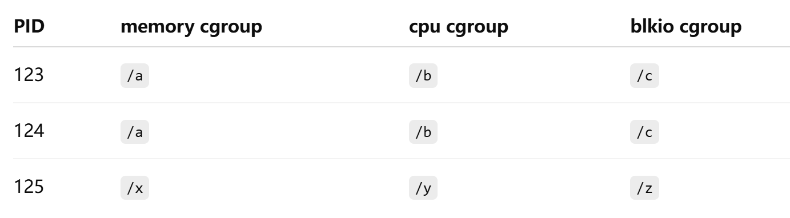

# Namespace

https://www.lixueduan.com/posts/docker/05-namespace/

## 可供隔离的系统资源

- UTS - 主机名和域名 （系统相关）

- User - 系统用户（系统相关）

- PID （进程相关）
- IPC （进程相关）
- Network （网络栈）
- Mount （文件系统）

## inode 与 namespace

```sh
root@czw-ai-247:~# ll /proc/1404/ns/
total 0
dr-x--x--x 2 systemd-coredump systemd-coredump 0 Apr 28 04:06 ./
dr-xr-xr-x 9 systemd-coredump systemd-coredump 0 Apr 28 04:06 ../
lrwxrwxrwx 1 systemd-coredump systemd-coredump 0 May  1 09:43 cgroup -> 'cgroup:[4026531835]'
lrwxrwxrwx 1 systemd-coredump systemd-coredump 0 May  1 09:43 ipc -> 'ipc:[4026532377]'
lrwxrwxrwx 1 systemd-coredump systemd-coredump 0 Apr 28 04:06 mnt -> 'mnt:[4026532375]'
lrwxrwxrwx 1 systemd-coredump systemd-coredump 0 Apr 28 04:06 net -> 'net:[4026532380]'
lrwxrwxrwx 1 systemd-coredump systemd-coredump 0 May  1 09:43 pid -> 'pid:[4026532378]'
lrwxrwxrwx 1 systemd-coredump systemd-coredump 0 May  1 11:35 pid_for_children -> 'pid:[4026532378]'
lrwxrwxrwx 1 systemd-coredump systemd-coredump 0 May  1 09:43 user -> 'user:[4026531837]'
lrwxrwxrwx 1 systemd-coredump systemd-coredump 0 May  1 09:43 uts -> 'uts:[4026532376]'
```

你看到的这些：

```
uts -> 'uts:[4026532376]'
net -> 'net:[4026532380]'
```

这些数字 `4026532376` 等，确实是 **namespace 对象的 inode 编号**。我们来解释原因：

------

### 和 inode 有什么关系

在 Linux 中，**一切皆文件**。Linux 将 namespace（如 `uts`、`net`、`pid` 等）设计成一种特殊的、**可以通过文件描述符访问和操作的内核对象**，并将其暴露在 `/proc/<pid>/ns/` 目录下的符号链接中。

这些符号链接指向的其实是一个挂载在 `procfs` （`/proc`目录）上的伪文件系统中的文件（namespace 伪文件），每个 namespace 都有唯一的 inode 编号，供内核标识、对比和引用。

#### 链接文件 & 伪文件

`/proc/<pid>/ns/`下的符号链接指向的不是真实的磁盘上的 inode，而是`procfs`上内核动态分配的虚拟 inode，内核通过这个虚拟inode来管理进程的命名空间。

**通过下面实验可以发现：**

- 链接文件的inode号与指向的inode号不同，这是符号链接（软链接/Windows快捷方式）
- 符号链接文件是空的（size = 0），也就是说它并没有存放被链接文件的路径，这是一个伪链接文件

```sh
# 获取 pid namespace 的 inode 号
root@czw-ai-247:/home/aiedge# readlink /proc/88637/ns/pid
pid:[4026531836]

# 查看 链接文件 pid 的详细信息
root@czw-ai-247:/home/aiedge# stat /proc/88637/ns/pid
  File: /proc/88637/ns/pid -> pid:[4026531836]
  Size: 0               Blocks: 0          IO Block: 1024   symbolic link
Device: 5h/5d   Inode: 200340      Links: 1
Access: (0777/lrwxrwxrwx)  Uid: (    0/    root)   Gid: (    0/    root)
Access: 2025-05-02 07:38:12.817215108 +0000
Modify: 2025-05-02 05:49:43.372230708 +0000
Change: 2025-05-02 05:49:43.372230708 +0000
 Birth: -
```

#### 为什么用伪 inode ？

- 在 Linux 中，`inode` 是 **VFS（虚拟文件系统）层面**的核心抽象。
- 哪怕文件不在磁盘上（比如 `/proc`、`/sys`、`/dev` 中的文件），内核仍会为这些“虚拟文件”分配一个 inode，以便统一处理。
- 所以 `ns:[4026532376]` 里的 `4026532376` 是这个 namespace 的 inode 号，只不过它：
  - **不是磁盘 inode**
  - 是内核内存中的一个标识号（通常由 `proc_ns` 结构生成）

| 项目                          | 说明                                                         |
| ----------------------------- | ------------------------------------------------------------ |
| `/proc/.../ns/...` 是文件吗？ | 是伪文件，不是磁盘文件                                       |
| inode 是真实的吗？            | 是“内核真实的”，但不是磁盘 inode                             |
| 为什么要用 inode 显示？       | 用于唯一标识某个 namespace，可对比两个进程是否共享同一 namespace |

------

### inode 的作用

1. **唯一标识某个 namespace 实例**
   即使两个进程的 `uts` namespace 类型相同，它们也可能属于不同的实例，通过 inode 可以判断：

   ```
   bashCopyEditls -l /proc/1404/ns/uts
   # uts:[4026532376]
   ls -l /proc/1500/ns/uts
   # uts:[4026532376] → 相同，说明共享 namespace
   ```

2. **支持 `setns()` 的文件接口**
   `setns()` 允许你传入一个打开的 namespace 文件描述符（FD），而这个 FD 正是基于这个 inode 所对应的 namespace 对象。

3. **便于用户空间判断共享情况**
   你可以用 `readlink` 或 `stat` 查看 inode，来判断两个进程是否在同一个 namespace 中。

### 附：什么是 procfs（/proc 文件系统）

- **procfs**（process file system）是 Linux 内核提供的一种**伪文件系统（pseudo-filesystem）**。
- 挂载在 `/proc` 目录下，用于**显示和提供与系统进程、内核和资源状态相关的信息**。
- 不占用磁盘空间，**数据是动态生成的**，由内核提供。

#### 📂 `/proc` 中包含了什么？

| 路径                | 说明                                                         |
| ------------------- | ------------------------------------------------------------ |
| `/proc/<pid>/`      | 每个正在运行的进程一个目录，包含其状态、打开的文件、namespace 等信息 |
| `/proc/cpuinfo`     | CPU 详细信息                                                 |
| `/proc/meminfo`     | 内存使用情况                                                 |
| `/proc/version`     | 当前内核版本                                                 |
| `/proc/cmdline`     | 内核启动参数                                                 |
| `/proc/filesystems` | 支持的文件系统列表                                           |
| `/proc/mounts`      | 当前挂载点                                                   |
| `/proc/self/`       | 当前进程自己的 `/proc/<pid>/` 别名                           |

这些内容大多是由内核在访问时动态生成的，不能直接写入。

####  `mount -t proc` 

```sh
# mount -t type device dir
mount -t proc proc /proc
```

- 它将类型为 `proc` 的特殊文件系统挂载到 `/proc` 目录上。
  - 对于普通的文件系统，第二个 proc 的位置是挂载源，通常应该是 `/dev/sda1` 这样的设备名
  - 对于 **`proc`、`tmpfs`、`sysfs`** 等**伪文件系统（pseudo filesystem）**，**它们没有实际的设备**，所以我们用一个占位名“`proc`”来表示来源
- 挂载后，`/proc` 目录就变成了一个**内核态虚拟信息的视图**。


## ns 数量限制与回收策略

linux 也限制了 namespace 的数量，不能无限制的创建 namespace，具体限制一般在 `/proc/sys/user` 目录中。具体如下：

```sh
root@czw-ai-247:~# ls /proc/sys/user
max_cgroup_namespaces  max_ipc_namespaces  max_pid_namespaces
max_inotify_instances  max_mnt_namespaces  max_user_namespaces
max_inotify_watches    max_net_namespaces  max_uts_namespaces
root@czw-ai-247:~# cat /proc/sys/user/max_cgroup_namespaces 
31640
```

**既然数量有限制，那已经创建的 namespace 什么时候会被销毁回收呢？**

规则还是比较好理解的：当一个 namespace 中的所有进程都结束或者移出该 namespace 时，该 namespace 将会被销毁。

> 这也解释了为什么没有创建 namespace 的 API，因为刚创建的 namespace 没有任何进程，立马就会被回收。

不过也有一些特殊情况，可以再没有进程的时候保留 namespace：

- 存在打开的 FD，或者对 `/proc/[pid]/ns/*` 执行了 bind mount
- 存在子 namespace
- 它是一个拥有一个或多个非用户 namespace 的 namespace。
- 它是一个 PID namespace，并且有一个进程通过 /proc/[pid]/ns/pid_for_children 符号链接引用了这个 namespace。（**unshare给未来的子进程创建新 PID namespace**）
- 它是一个 Time namespace，并且有一个进程通过 /proc/[pid]/ns/time_for_children 符号链接引用了这个 namespace。
- 它是一个 IPC namespace，并且有一个 mqueue 文件系统的 mount 引用了该 namespace
- 它是一个 PIDnamespace，并且有一个 proc 文件系统的 mount 引用了该 namespace

> 一句话描述：**当 namespace 有被（预约）使用时就不会被回收，反之则会被回收。**


## 实验

### 常用 shell 命令

#### nsenter

`nsenter` 是一个非常实用的 Linux 命令，它允许你在一个已经运行的进程的命名空间上下文中执行命令。简单来说，你可以通过 `nsenter` "进入"到容器或其他进程的某个或某些特定的命名空间中，然后就像在该命名空间内部操作一样。

**常用选项**：

- `-t <pid>` 或 `--target <pid>`：指定目标进程的 PID，你要进入这个进程所使用的命名空间。
- `-n` 或 `--net`：进入网络命名空间。
- `-p` 或 `--pid`：进入 PID 命名空间。
- `-m` 或 `--mount`：进入 Mount 命名空间。
- `-u` 或 `--uts`：进入 UTS 命名空间。
- `-i` 或 `--ipc`：进入 IPC 命名空间。
- `-U` 或 `--user`：进入 User 命名空间。
- `-a` 或 `--all`：进入进程所有的命名空间。

**使用示例**：

```sh
# 进入进程 83436 的网络命名空间
nsenter --target 83436 --net
# 退出命名空间
exit
```

### API


 `clone`、`setns`、`unshare`、`ioctl_ns` 是 Linux 中用于操作 **namespace（命名空间）** 的四个关键系统调用/接口。下面是它们的具体作用：

####  1. `clone`

- **作用**：创建一个新进程，并可以为它指定使用新的 namespace。

- **常用于**：创建具有隔离 UTS、IPC、PID、Mount、Network 等 namespace 的子进程。

- **函数签名**（Go 和 C 不同，C 为底层原型）：

  ```c
  pid_t clone(int (*fn)(void *), void *child_stack, int flags, void *arg, ...);
  ```

- 常见的 namespace 相关 flag：

  ```c
  CLONE_NEWUTS    // 新的主机名 namespace
  CLONE_NEWPID    // 新的 PID namespace
  CLONE_NEWNS     // 新的挂载点 namespace
  CLONE_NEWNET    // 新的网络 namespace
  CLONE_NEWIPC    // 新的进程间通信 namespace
  ```

------

####  2. `unshare`

- **作用**：让当前进程“脱离”某些 namespace，从而使用新的（空的）命名空间。

- **区别于 clone**：`clone` 是创建新的子进程并指定 namespace；`unshare` 是让**当前进程自己**进入新的 namespace。

- **示例**：

  ```c
  unshare(CLONE_NEWUTS | CLONE_NEWNET);
  ```

  表示当前进程不再共享 UTS 和网络 namespace，而是使用新的。

------

####  3. `setns`

- **作用**：将当前进程“加入”某个已存在的 namespace（通常是某个已有进程正在使用的）。

- **使用场景**：比如进入容器进程的网络或 UTS namespace。

- **典型用法**：

  ```c
  int fd = open("/proc/1234/ns/net", O_RDONLY);
  setns(fd, 0);
  ```

  把当前进程加入进程 1234 的网络 namespace。

------

#### 4. `ioctl_ns`（不常用）

- **作用**：是通过 `ioctl()` 系统调用与 namespace 设备进行交互的方式。

- **用途**：极少见，主要用于某些专用工具或调试 namespace（如 `nsfs`）。

- **调用形式**：

  ```c
  ioctl(fd, NS_GET_USERNS)
  ```

  等类似接口，用于获取关联的 user namespace 等。

------

####  总结对比表：

| 接口       | 作用                         | 对象         | 常用场景                   |
| ---------- | ---------------------------- | ------------ | -------------------------- |
| `clone`    | 创建新进程并进入新 namespace | 新进程       | 容器启动、init 创建进程等  |
| `unshare`  | 当前进程脱离 namespace       | 当前进程     | `unshare` 命令、手动隔离   |
| `setns`    | 加入已有 namespace           | 当前进程     | `nsenter` 命令、容器挂接   |
| `ioctl_ns` | 查询或操作 namespace 元信息  | namespace FD | 特殊用法、调试或内核层工具 |

---

### 查看进程所属 namespace

- 与进程的ns相关的信息在`proc/<pid>/ns`目录下
- 目录下的文件是指向进程 namespace 的 inode 节点的链接文件
  - 通过对比两个进程某个namespace的inode号是否一致，可以判断两个进程是否属于同一个namespace

```sh
root@czw-ai-247:/home/aiedge# ll /proc/1404/ns
total 0
dr-x--x--x 2 systemd-coredump systemd-coredump 0 Apr 28 04:06 ./
dr-xr-xr-x 9 systemd-coredump systemd-coredump 0 Apr 28 04:06 ../
lrwxrwxrwx 1 systemd-coredump systemd-coredump 0 May  1 09:43 cgroup -> 'cgroup:[4026531835]'
lrwxrwxrwx 1 systemd-coredump systemd-coredump 0 May  1 09:43 ipc -> 'ipc:[4026532377]'
lrwxrwxrwx 1 systemd-coredump systemd-coredump 0 Apr 28 04:06 mnt -> 'mnt:[4026532375]'
lrwxrwxrwx 1 systemd-coredump systemd-coredump 0 Apr 28 04:06 net -> 'net:[4026532380]'
lrwxrwxrwx 1 systemd-coredump systemd-coredump 0 May  1 09:43 pid -> 'pid:[4026532378]'
lrwxrwxrwx 1 systemd-coredump systemd-coredump 0 May  1 11:35 pid_for_children -> 'pid:[4026532378]'
lrwxrwxrwx 1 systemd-coredump systemd-coredump 0 May  1 09:43 user -> 'user:[4026531837]'
lrwxrwxrwx 1 systemd-coredump systemd-coredump 0 May  1 09:43 uts -> 'uts:[4026532376]'
```

---

### 具体实验

https://www.lixueduan.com/posts/docker/05-namespace/#uts-namespace

```go
package ns

import (
	"log"
	"os"
	"os/exec"
	"syscall"
)

func TestUTS() {
	// 1. 创建一个要执行的命令
	cmd := exec.Command("bash")

	// 2. 配置子进程的系统属性
	cmd.SysProcAttr = &syscall.SysProcAttr{
		Cloneflags: syscall.CLONE_NEWUTS,
	}

	// 3. 将标准输入、输出和错误流连接到当前进程
	cmd.Stdin = os.Stdin
	cmd.Stdout = os.Stdout
	cmd.Stderr = os.Stderr

	// 4. 运行命令并等待其完成
	if err := cmd.Run(); err != nil {
		log.Fatalln(err)
	}
}
```

#### 一个天坑

`syscall.CLONE_NEWNS | syscall.CLONE_NEWUSER`中如果或运算符`|`两边没有空格，出现奇怪报错：

```sh
root@czw-ai-247:/home/aiedge/mydocker/learning# go run main.go 
# mydocker/learning/ns
ns/mount.go:20:12: syntax error: unexpected = at end of statement
```

**ChatGPT**：Go 在处理位运算（例如 `|`）时确实**对格式很敏感**。虽然理论上语法允许没有空格，但在某些 IDE 或编译环境下（尤其是复制粘贴或中文输入法干扰时），符号前后如果存在不可见字符或奇怪换行，Go 编译器可能报出奇怪的语法错误


# cgroup

## 核心概念

`cgroup`（Control Groups）是 Linux 提供的用于**限制、记录和隔离进程资源使用**的机制。它的核心有三个关键概念：

### ✅ 1. **Hierarchy（层次结构）**

- 是由一棵 **cgroup 目录树** 组成的结构。
- 每个 hierarchy 与一个或多个 **subsystem（控制器）** 绑定。
- 用 `mount -t cgroup -o memory /sys/fs/cgroup/memory` 就是挂载一个绑定了 `memory` 控制器的 hierarchy。
- 系统可以存在多个 hierarchy，每个用于控制不同资源（或组合资源）。

**理解要点**：

> 一个 hierarchy 就是一套用于管理某些资源的“组织结构”，其内部是一棵资源管理用的树形目录结构。

### ✅ 2. **Subsystem（控制器）**

- 又叫 **controller**，用于管理某类系统资源。
- 典型的有：
  - `cpu`：限制 CPU 使用
  - `memory`：限制内存使用
  - `blkio`：限制块设备 I/O
  - `cpuset`：绑定 CPU 核心
  - `pids`：限制进程数
- 一个 subsystem 只能挂载到一个 hierarchy 上（在 cgroup v1 中）。

**理解要点**：

> subsystem 就是 “可以被限制的资源种类”。

### ✅ 3. **Cgroup（控制组/进程组）**

- 是某个 hierarchy 中的一个目录节点，表示一个进程组。
- 每个 cgroup 对应一组进程，这些进程共享该组设置的资源限制。
- 把进程加入某个 cgroup 后，它就受该 cgroup 中 subsystem 的限制和统计。
- 一个进程在一个 hierarchy 中只能出现在一个节点/进程组中。
- 一个进程 fork 出子进程时,子进程是和父进程在同一个 cgroup 中的。

**理解要点**：

> cgroup 是“资源控制单位”，你可以限制它包含的进程使用多少资源。

### 具体实例

**`/sys/fs/cgroup/memory/` 就是一个 hierarchy 的挂载点**，这个 hierarchy 只绑定了一个 subsystem：`memory`，即用来限制和监控内存资源的控制器。（这是系统启动时就自动挂载的 hierarchy ）

**也可以手动挂载**：

```sh
mount -t cgroup -o memory cgroup /sys/fs/cgroup/memory
```

这实际上是创建了一个：

- ✅ **Hierarchy**：其挂载点是 `/sys/fs/cgroup/memory`
- ✅ **Subsystem**：只挂载了 `memory` 控制器
- ✅ **cgroup 树结构**：目录层级结构，表示不同进程组的资源限制


---

**一个 hierarchy 绑定两个 subsystem**：

- cpu 和 cpuacct 两个subsystem都在一个cgroup树里面


## 内核如何知道进程有哪些资源限制？

- cgroup 一共有12种subsystem，也就是说有12种可以限制的系统资源

- 那么对于一个进程，它可能 memory 的限制在`memory` 树中，cpu的限制在`cpu,cpuacct `树中，以此类推，关于一个进程的资源控制信息可能就设计到若干个层次结构树和**进程组/节点**

- 而每个节点有自己的关于资源限制的信息，这样就会导致要记录每个进程的资源控制需要维护一张类似下面的表（不止3列）：

  

  显然：

  - PID 123 和 124 的资源限制是一模一样的。

  - 但如果我们为每个进程都维护这张表，**数据会重复大量占用内存**，也难以管理。

### 解决方案：引入 `css_set`

> cgroup_subsystem_state_set

#### 它的核心作用：

- 把“进程在每个 subsystem 中对应的 cgroup 节点”的组合抽象成一个对象。
- 也就是把一个进程相关的所有cgroup节点汇总组合成一个数据结构，也就是`css_set`

每个 `css_set` 实际上是：

```go
css_set struct {
    subsystems map[controller]*cgroup
    tasks      []*task // 所有共享这组资源限制的进程
}
```

比如上面例子里：

- PID 123 和 124 使用的是同一个 `css_set`，因为它们在 memory、cpu、blkio 上都指向相同的 cgroup。
- PID 125 则会拥有另一个 `css_set`。

------

### `css_set` 的好处

| 优点                                   | 描述                                                         |
| -------------------------------------- | ------------------------------------------------------------ |
| ✅ **减少重复数据**                     | 多个进程共用相同的资源控制组合，节省内存                     |
| ✅ **便于快速判断是否资源限制一致**     | 比较两个进程是否用同一组资源限制，只需要比较 `css_set` 指针是否相同 |
| ✅ **便于控制资源迁移**                 | 改变某个进程的资源控制时，只需更换它的 `css_set`             |
| ✅ **支持一个 cgroup 被多个控制器引用** | `css_set` 作为 mapping，可以复用已有 cgroup 节点             |

## 如何使用 Cgroups

### 查看cgroup文件系统挂载点

cgroup 相关的所有操作都是基于内核中的 cgroup virtual filesystem，使用 cgroup 很简单，挂载这个文件系统就可以了。

> 一般情况下都是挂载到/sys/fs/cgroup 目录下，当然挂载到其它任何目录都没关系。

cgroups 以文件的方式提供应用接口，我们可以通过 mount 命令来查看 cgroups 默认的挂载点：

```sh
[root@iZ2zefmrr626i66omb40ryZ ~]# mount | grep cgroup
tmpfs on /sys/fs/cgroup type tmpfs (ro,nosuid,nodev,noexec,mode=755)
cgroup on /sys/fs/cgroup/systemd type cgroup (rw,nosuid,nodev,noexec,relatime,xattr,release_agent=/usr/lib/systemd/systemd-cgroups-agent,name=systemd)
cgroup on /sys/fs/cgroup/perf_event type cgroup (rw,nosuid,nodev,noexec,relatime,perf_event)
cgroup on /sys/fs/cgroup/net_cls,net_prio type cgroup (rw,nosuid,nodev,noexec,relatime,net_cls,net_prio)
cgroup on /sys/fs/cgroup/cpu,cpuacct type cgroup (rw,nosuid,nodev,noexec,relatime,cpu,cpuacct)
cgroup on /sys/fs/cgroup/pids type cgroup (rw,nosuid,nodev,noexec,relatime,pids)
cgroup on /sys/fs/cgroup/rdma type cgroup (rw,nosuid,nodev,noexec,relatime,rdma)
cgroup on /sys/fs/cgroup/memory type cgroup (rw,nosuid,nodev,noexec,relatime,memory)
cgroup on /sys/fs/cgroup/cpuset type cgroup (rw,nosuid,nodev,noexec,relatime,cpuset)
cgroup on /sys/fs/cgroup/blkio type cgroup (rw,nosuid,nodev,noexec,relatime,blkio)
cgroup on /sys/fs/cgroup/devices type cgroup (rw,nosuid,nodev,noexec,relatime,devices)
cgroup on /sys/fs/cgroup/hugetlb type cgroup (rw,nosuid,nodev,noexec,relatime,hugetlb)
cgroup on /sys/fs/cgroup/freezer type cgroup (rw,nosuid,nodev,noexec,relatime,freezer)

```

- 第一行说明`/sys/fs/cgroup`挂载点处挂载的是tmpfs虚拟文件系统
- 而挂载在`/sys/fs/cgroup`上面的 hierarchy 也是tmpfs虚拟文件系统
- 且由于`/sys/fs/cgroup`这个挂载点是只读的，所以系统不允许用户再挂载新的 hierarchy

**注意三大概念的层次：**

挂载到`/sys/fs/cgroup`下的是 **hierarchy**，而 hierarchy  通常会与一个或多个 **subsystem** 绑定，同时一个 hierarchy 下会以树状结构组织若干的 **cgroup**

### 查看系统当前cgroup子系统状态

```sh
root@czw-ai-247:/home# cat /proc/cgroups 
#subsys_name     hierarchy    num_cgroups    enabled
cpuset          12           3              1
cpu             10           101            1
cpuacct         10           101            1
blkio           9            101            1
memory          11           189            1
devices         7            101            1
freezer         4            4              1
net_cls         5            3              1
perf_event      3            3              1
net_prio        5            3              1
hugetlb         8            3              1
pids            2            109            1
rdma            6            3              1
```

# TO-LEARN

chroot与moutn namespace的区别


# 一些问题

### 容器的pid

docker inspect看到容器的pid是1404

top看到1404对应的进程是mysqld：   

- `1404 systemd+  ...  mysqld --default-authentication-plugin=mysql_native_password`

#### 问题

这个mysqld算是容器的entrypoint命令，这个进程算是容器所有子进程的祖宗进程吗？

容器的启动过程是怎么样的？？？