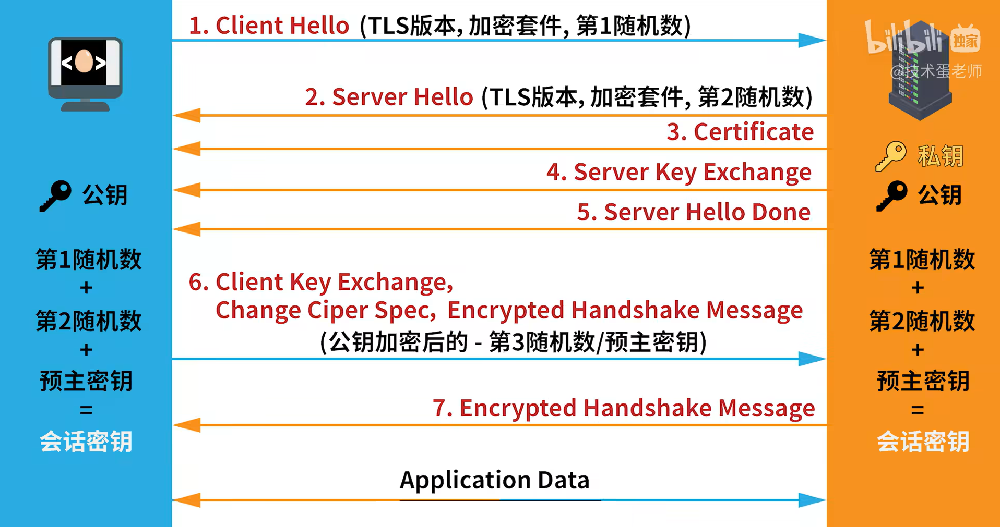
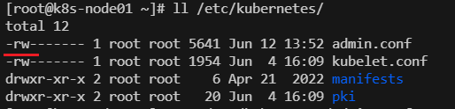
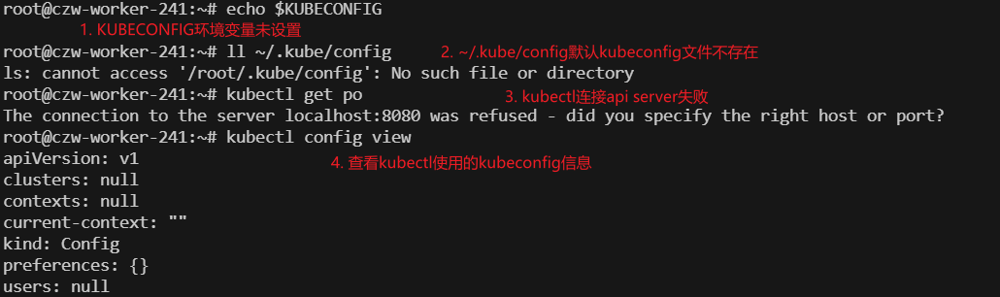
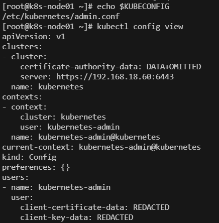

## 加密通信的方法

### 对称加密

通信双方使用相同的密钥进行加密解密。

**对称加密的基本过程：**

1. **密钥生成**：通信双方预先共享一个密钥，这个密钥必须保密。（安全共享密钥的会是一个麻烦的事情）
2. **加密**：发送方使用密钥将明文加密为密文。（加密可以理解为一个数学运算的过程）
3. **传输**：密文通过网络传输到接收方。
4. **解密**：接收方使用相同的密钥将密文解密为明文。

**对称加密的优缺点：**

- **优点**：加密和解密速度快，适合大数据量加密。
- **缺点**：密钥管理比较复杂，双方必须安全地共享密钥；如果密钥被泄露，通信的安全性就会受到威胁。

**会话密钥**：

为了提升安全性，可以让每一次的会话都使用一个新的密钥。这样的密钥叫做会话密钥。

### 非对称加密

公钥加密，私钥解密

私钥加密，公钥解密

**非对称加密的优缺点：**

- **优点**：
  - **密钥管理简单**：接收方只需公开公钥，发送方不需要知道接收方的私钥。
  - **安全性高**：即使公钥被公开，也无法轻易推算出私钥，从而保护了数据的安全。
- **缺点**：
  - **速度较慢**：与对称加密相比，非对称加密的加密和解密速度较慢，不适合大量数据的加密。
  - **计算资源消耗大**：非对称加密的算法通常比对称加密的算法复杂，计算开销更大。

#### 安全问题 - 中间人攻击

存在某个中间人劫持了A发送向B的公钥，并且自己创建一对公私钥，使用自己的公钥伪装为A的公钥发送给B。

这样中间人可以解密B发送给A的信息，并且在修改内容后用A的公钥加密再发送给A

于是，中间人使用A的密钥与A通信，使用自己创建的伪装的密钥与B通信 

**问题的关键（公钥的信任问题）**：不能保证数据包的完整，即不能确保数据是未经修改的，导致中间人可以劫持并修改公钥信息

### 数字证书

为了解决非对称通信中公钥的信任问题，我们引入了一个第三方机构，也就是CA机构。

1. 选定CA机构：通信双方协商好使用某一个CA机构

2. 生成数字证书：发送方将公钥以及公钥持有者信息发送给CA机构，CA据此生成数字证书

   - **公钥**：证书持有者的公钥，用于加密和验证签名。

   - **持有者信息**：包括持有者的姓名、电子邮件地址、组织名称等信息。

   - **证书颁发机构信息**：签发该证书的CA的名称和信息。

   - **有效期**：证书的有效开始和结束日期。

   - **证书序列号**：CA为每个证书分配的唯一编号，用于管理和撤销证书。

3. 生成数字签名

   	1. CA对数字证书进行哈希运算，得到长度固定的信息摘要。数字证书中如果发生了任何修改，得到的哈希值都会不一样。
	
   	1. CA使用自己的私钥对哈希值进行加密，得到数字签名。通信方可以使用CA的公钥解密该签名。

4. 使用数字证书：
   1. CA将数字证书和数字签名发送给发送方。
   2. 当发送方需要发送公钥或者验证自身时，将证书和签名一并发送给接收方。
   3. 接收方使用CA的公钥解密数字签名得到数字证书的信息摘要（哈希值），同时对数字证书进行同样的哈希运算得到另一个信息摘要。如果两个信息摘要相同，说明这个数字证书是未经篡改的，发送方是被CA认证过的真实发送方。

#### CA的公钥哪来的：

**预安装的根证书**：

- 在操作系统、浏览器和其他软件中，常常会预先安装一些受信任的根证书。这些根证书中包含了相应CA的公钥。接收方可以直接从这些预安装的根证书中获取CA的公钥，用于验证CA证书的签名。

**可信任的证书存储**：

- 许多操作系统和应用程序维护一个受信任的根证书存储库，里面包含多个知名CA的根证书和公钥。当接收方需要验证某个CA证书时，可以查阅这个存储库来找到相应的CA公钥。

**证书链中的根证书**：

- 如果接收方收到的证书链包含了根证书（在某些情况下可能是这样），接收方可以从证书链中提取根证书及其公钥，进而进行验证。

**CA的官方网站**：

- 如果接收方无法在本地找到所需的根证书，可以访问CA的官方网站下载最新的根证书。在这种情况下，接收方需要确保所下载的证书是来自官方渠道，以避免中间人攻击或伪造证书的风险。

#### 证书链

CA证书的存在是为了确保公钥是值得信任的，但是认证的过程需要使用到CA的公钥，这时候也需要确保CA的公钥是值得信任的。于是CA机构需要更高以及的CA机构颁发的CA证书，来证明自己是自己，证明自己颁发的证书是自己颁发的。

这个证书链的终止，就是来源于存在于本地的CA根证书，或者比较权威的CA机构的证书。

### https双向认证

HTTPS双向认证（也称为双向SSL/TLS认证或双向握手）是在客户端和服务器之间的通信中，双方都需要验证对方的身份。这种认证方式进一步增强了通信的安全性，适用于对安全性要求较高的应用场景，如银行交易、企业内部系统等。

1. **客户端发起连接**：
   - 客户端向服务器发起HTTPS连接请求。
2. **服务器发送证书**：
   - 服务器响应请求并发送其数字证书给客户端。这个证书通常由受信任的证书颁发机构（CA）签发，包含服务器的公钥。
3. **客户端验证服务器证书**：
   - 客户端使用预先安装的根证书（或从可信的CA列表中找到的根证书）来验证服务器证书的有效性。如果验证通过，客户端信任服务器并继续连接；如果验证失败，连接将终止。
4. **客户端发送证书**：
   - 在验证服务器身份后，客户端需要向服务器发送自己的数字证书。这个证书也是由CA签发的，包含客户端的公钥。
5. **服务器验证客户端证书**：
   - 服务器使用它信任的CA的根证书来验证客户端的证书。如果验证通过，服务器确认客户端的身份并继续连接；如果验证失败，连接将终止。
6. **会话密钥生成和共享**：
   - 双方通过协商生成一个对称加密的会话密钥。这个密钥用于加密接下来的所有通信内容。协商过程通常使用非对称加密方法（如RSA），会话密钥的生成和交换确保了密钥的保密性。
7. **加密通信**：
   - 一旦会话密钥被确认，客户端和服务器开始使用该密钥进行对称加密通信。由于双方已经相互认证，并且使用了强加密，整个通信过程非常安全。

## 认证

apiServer是一切功能的核心，因此所谓的认证是发生在客户与apiServer之间的。认证有三种常见用法，由于HTTP是明文通信的，因此基于HTTP的认证不够安全，一般只在用户获取CA证书之前使用：

- HTTP Token认证：用户通过一个token（长且复杂的字符串）来标识自己，API Server在**文件**中存放有客户与token的对应关系。当客户发起http请求时在header中附上自己的token。
- HTTP Base认证：用户在首次和API Server通信时，在http头部中带上base64加密后的用户名和密码，API Server收到后解码获得用户名和密码。
- HTTPS双向认证

#### 不同用户的认证

- scheduler 和 controller manager 和 API Server在同一台机器上，相互通信一般通过回环接口`127.0.0.1`
- kubectl、kubelet、kube-proxy 则需要HTTPS加密认证

#### 证书颁发

在 Kubernetes 集群中，集群本身会生成一个 CA（证书颁发机构）根证书，这个根证书使得集群能够充当自己的 CA 机构。通过这个 CA 机构，集群可以完成以下任务：

1. **颁发证书**：集群的 CA 通过其根证书和私钥，可以为集群中的各个组件（如 API Server、Kubelet、Controller Manager、Scheduler、Etcd 等）颁发证书。这些组件的证书是通过生成证书签名请求（CSR），然后由集群的 CA 对其签名后生成的。
2. **验证身份**：因为所有组件的证书都是由同一个 CA 签发的，集群内的组件在相互通信时，可以使用这个 CA 根证书来验证对方的证书是否有效和可信。这种验证机制确保了集群内的所有通信都是安全的。
3. **确保通信加密**：组件间的通信使用这些证书进行加密，从而确保数据在传输过程中的保密性和完整性。

<u>集群CA根证书的生成以及组件证书的颁发都是发生在**集群初始化**，即`kubeadm init`时</u>

#### kubeconfig文件

路径`/root/.kube/config`，存放了集群以及认证相关的信息：

- 集群参数：集群的CA证书、API Server地址
- 客户端参数：客户端的CA证书、私钥
- 集群context信息：集群名称、用户名

**kubernetes组件在启动时通过指定不同的kubeconfig参数可以连接到不同的kubernetes集群**

### kubernetes集群中的通信实体

1. **用户（User）**：
   - 这是指集群外部的实际人类用户，通常是系统管理员、开发人员或其他有权限访问 Kubernetes 集群的个人。
   - 用户通常通过 `kubectl` 等工具与 API Server 通信，使用自己的 `kubeconfig` 文件进行身份验证。
2. **服务账户（Service Account）**：
   - 服务账户是一种专门为 Pods 或应用程序设计的身份认证方式，用于允许集群内的工作负载与 API Server 通信。
   - 当应用程序或 Pod 需要与 API Server 通信时，会使用与其关联的服务账户进行认证。
   - 服务账户通常有一个与之相关联的 `Token`，用于认证过程。
3. **Kubernetes 组件（Kubernetes Components）**：
   - Kubernetes 集群内部的各个核心组件，如 `kubelet`、`kube-controller-manager`、`kube-scheduler`、`kube-proxy` 等，它们在集群内部协同工作，并需要与 API Server 通信。
   - 这些组件通常也通过 `kubeconfig` 文件中的用户凭据（用户和密钥）进行认证。

除此之外，还有一些特殊的通信实体或情况：

1. **集群外部服务（External Services）**：
   - 某些情况下，集群外部的服务或工具（如 CI/CD 系统、监控系统等）可能需要与 API Server 通信。
   - 这些服务通常被配置为特定的用户或服务账户，使用相应的认证凭据与 API Server 交互。
2. **Webhook 服务（Webhook Services）**：
   - Webhook 是一种用于自定义认证、授权或审计的机制。Webhook 服务本身可能与 API Server 通信，执行特定的逻辑，并对请求进行处理。

#### User用户

`user` 代表的是人类用户在与 Kubernetes 集群交互时的身份。通过 `kubectl` 工具与 API Server 进行通信时，`user` 是用于身份验证的关键标识。每个 `user` 都有特定的权限范围，能够访问或操作 Kubernetes 资源。

对于 `user` 创建的资源，一旦创建完成，它们就变成了集群的一部分，不再与创建它们的 `user` 紧密关联。其他有适当权限的用户或服务账户也可以访问和操作这些资源。这种设计确保了资源的管理和操作基于权限控制，而不是基于特定用户的所有权。

### 为什么root可以与api server通信

Kubernetes 的 `user` 并不是直接与节点机器的linux系统用户绑定的。让ChatGPT来详细说明：

#### 1. **Kubernetes `user` 与节点用户的关系**

- Kubernetes 中的 `user` 是集群级别的身份，通常用于认证和授权。它并不与节点操作系统上的用户账户（如 Linux 系统中的 `root` 用户）直接绑定。
- 当你在某个节点上使用 `kubectl` 与 API Server 通信时，是否能够以特定身份（如 `kubernetes-admin`）操作，取决于你使用的 `kubeconfig` 文件。

#### 2. **为什么 `root` 用户可以使用 `kubectl`？**

- 在集群初始化过程中，`kubeconfig` 文件会被创建并保存到默认路径（通常是 `/etc/kubernetes/admin.conf` 或者 `/root/.kube/config`）。这个 `kubeconfig` 文件中包含了 `kubernetes-admin` 的认证信息，包括客户端证书和私钥。
- 因为 `kubeconfig` 文件的默认位置通常在 `root` 用户的目录中（如 `/root/.kube/config`），所以 `root` 用户可以直接使用 `kubectl`，并以 `kubernetes-admin` 的身份与 API Server 通信。

#### 3. **是否与节点用户绑定？**

- 实际上，`kubernetes-admin` 并不是与节点上的 `root` 用户绑定的，而是与使用的 `kubeconfig` 文件绑定的。任何能够访问包含 `kubernetes-admin` 认证信息的 `kubeconfig` 文件的用户，都可以使用 `kubectl` 以 `kubernetes-admin` 的身份进行操作。
- 这意味着，如果你将 `kubeconfig` 文件复制到另一个用户（无论是在同一台机器上还是在不同的机器上）的主目录中，那么这个用户也可以使用 `kubectl` 以 `kubernetes-admin` 的身份进行操作。

#### 4. **如何防止滥用？**

- 如果你不希望所有节点上的 `root` 用户都能够以 `kubernetes-admin` 的身份访问集群，可以采取措施，如限制 `kubeconfig` 文件的访问权限，或为不同的用户创建不同的 `kubeconfig` 文件。

---

下图是node的kubeconfig文件，可以看到文件的权限是只有root可以读写，也就是说只有root可以使用这个kubernetes的user信息来与api server通信：

#### 环境变量`KUBECONFIG`

指定了kubectl采用的`kubeconfig`文件路径，如果不设置这个环境变量，会默认从`~/.kube/config`读入配置信息

**没有正确读入kubeconfig配置：**

**正常情况：**

## 鉴权

### 1. **Service Account**

- **定义**: Service Account 是 Kubernetes 中的一种特殊账户类型，主要用于让 Pod 里面的进程与 API Server 进行交互时提供认证信息。
- **用途**: 当你的应用程序在 Kubernetes 集群中运行时，如果它需要调用 Kubernetes API 来查询状态或进行其他操作，它将使用一个 Service Account 进行身份认证。
- **默认行为**: 如果你没有为 Pod 指定一个 Service Account，Kubernetes 会自动为该 Pod 分配默认的 Service Account，通常是 `default` Service Account。
- **认证方式**: Service Account 通常通过与 Pod 一起挂载的令牌（Token）进行身份认证，这个令牌是 Kubernetes API Server 为该 Service Account 签发的。

### 2. **RBAC (Role-Based Access Control)**

- **定义**: RBAC 是 Kubernetes 中用于管理和控制对集群资源的访问权限的一种机制。它通过定义角色（Roles）和角色绑定（RoleBindings），确保不同的用户、服务账户或其他实体只能访问它们被授予权限的资源。
- **主要概念**:
  - **Role**: 定义了一组权限，用来描述可以对某些资源执行的操作。`Role` 是在命名空间内生效的，仅限于对命名空间资源进行控制。
  - **ClusterRole**: 类似于 `Role`，但作用域是整个集群，可以控制集群级别的资源。
  - **RoleBinding**: 将 `Role` 绑定到一个或多个用户、Service Account 或组，使得这些主体拥有 `Role` 中定义的权限。`RoleBinding` 仅在特定命名空间内生效。
  - **ClusterRoleBinding**: 将 `ClusterRole` 绑定到一个或多个用户、Service Account 或组，适用于整个集群。
- **工作原理**:
  1. **创建角色**: 管理员定义 `Role` 或 `ClusterRole`，描述可以执行的操作（如读取或修改某些资源）。
  2. **绑定角色**: 管理员使用 `RoleBinding` 或 `ClusterRoleBinding` 将这些角色与特定的主体（如用户或 Service Account）绑定。
  3. **访问控制**: 当某个用户或服务账户尝试对某资源执行操作时，Kubernetes 会检查该用户或服务账户是否有相应的角色绑定，以及这些角色是否允许该操作。

### 3. **Service Account 和 RBAC 的关系**

- 在 Kubernetes 中，Service Account 通过 RBAC 授予特定权限。例如，你可以为某个 Service Account 创建一个 `Role` 或 `ClusterRole`，然后通过 `RoleBinding` 或 `ClusterRoleBinding` 将其绑定到这个 Service Account。这样，当 Pod 使用这个 Service Account 与 Kubernetes API Server 交互时，它将只能执行被授予的操作。

---

简单说，授权鉴权的方案有很多种，而**RBAC**是目前使用最广泛最方便的一种。其中的Role和ClusterRole就是在定义一组权限，规定可以对哪些资源执行哪些操作。而RoleBinding和ClusterRoleBinding就是在绑定权限（Role/ClusterRole）与实体（User/Group/Service Account）。

在没有**Service Account**时，一个应用/Pod如果需要一些资源的访问权限，就需要向申请证书以用于认证。但是如果Pod数目很大，就需要签发很多证书，而这些证书在Pod终止时就被废弃，这会消耗很多系统资源（证书的签发需要很多的计算）。如果很多Pod需要的资源权限相同，就可以统一申请一个服务账户，这个服务账户拥有这些资源的访问权限，而所有的Pod都绑定到这个服务账户，通过服务账户来获取权限。