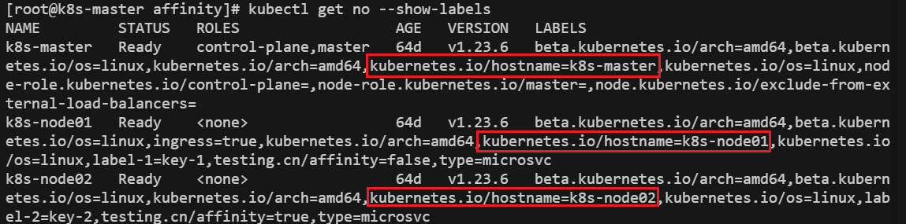

# 高级调度

## 污点和容忍

### 污点

给node打上污点的作用是让（某些不能容忍该污点的）pod不能在该node上运行

#### 使用场景

- **专用节点**：我们希望让某些node只分配给某些用户使用，只专用于处理某些特定的任务。例如master就是专用节点，只负责处理集群资源的调度管理。
- **配备特殊硬件的节点**：不同的节点的硬件配置不同，适用于处理不同类型的任务，因此我们希望任务能够调度到具有自己所需硬件的node上运行。例如，某些node上配备了功能强劲的GPU，那么这些node希望运行的是AI应用，如果运行其他任务则会造成GPU资源的占用和浪费。


#### 污点的类型/影响

##### NoExecute

影响的是**正在节点上运行**的pods：

- 如果 Pod 不能容忍这类污点，会马上被驱逐。
- 如果 Pod 能够容忍这类污点，但是在容忍度定义中没有指定 `tolerationSeconds`， 则 Pod 还会一直在这个节点上运行。
- 如果 Pod 能够容忍这类污点，而且指定了 `tolerationSeconds`， 则 Pod 还能在这个节点上继续运行这个指定的时间长度。 这段时间过去后，节点生命周期控制器从节点驱除这些 Pod。

##### **NoSchedule**

影响的是**正在调度**的pods，不会影响到已经在node上运行的pods。如果pod没有相应的容忍，就不会被调度到相应节点。

##### **PreferNoSchedule**

相当于弱化的NoSchedule，控制平面将**尝试**避免将不能容忍污点的 Pod 调度到相应的节点上，但不能保证完全避免。


#### 自动添加的内置污点

当某种条件为真时，节点控制器会自动给节点添加一个污点。当前内置的污点包括：

- `node.kubernetes.io/not-ready`：节点未准备好。这相当于节点状况 `Ready` 的值为 "`False`"。
- `node.kubernetes.io/unreachable`：节点控制器访问不到节点. 这相当于节点状况 `Ready` 的值为 "`Unknown`"。
- `node.kubernetes.io/memory-pressure`：节点存在内存压力。
- `node.kubernetes.io/disk-pressure`：节点存在磁盘压力。
- `node.kubernetes.io/pid-pressure`：节点的 PID 压力。
- `node.kubernetes.io/network-unavailable`：节点网络不可用。
- `node.kubernetes.io/unschedulable`：节点不可调度。
- `node.cloudprovider.kubernetes.io/uninitialized`：如果 kubelet 启动时指定了一个“外部”云平台驱动， 它将给当前节点添加一个污点将其标志为不可用。在 cloud-controller-manager 的一个控制器初始化这个节点后，kubelet 将删除这个污点。


#### kubectl taint

##### 打污点

```sh
kubectl taint node <node-name> key=value:effect
kubectl taint no <node-name> key/value:effect

kubectl taint no k8s-master node-role.kubernetes.io/master:NoExecute
```

##### 污点

```sh
kubectl taint no k8s-master node-role.kubernetes.io/master:NoSchedule-
```


### 容忍

容忍写在pod的配置文件中，与`containers`同一级

```yaml
tolerations:
- key: "key1"
  operator: "Equal"
  value: "value1"
  effect: "NoSchedule"
- key: "key2"
  operator: "Exists"
  effect: NoExecute
  tolerationSeconds: 20  # 在存在key2:NoExecute污点的节点上可以运行20s
```

一个pod可以配置多个容忍，容忍有两种类型：

- **Equal**：匹配key-value-effect都相同的污点
- **Exists**：匹配key-effect相同的污点，不管value，配置文件中也不能有value字段

#### tolerationSeconds

**完全容忍**：对于存在`NoExecute`污点的node，如果pod对其的容忍没有设置`tolerationSeconds`，那么pod可以一直在node上运行

**限定时间内容忍**：对于存在`NoExecute`污点的node，如果pod对其的容忍设置了`tolerationSeconds`属性，那么pod只会被容忍在node上运行`tolerationSeconds`指定的时间（单位是秒）


# 调度pod到匹配的节点

## nodeSelector

节点选择器，将node调度到具有指定标签节点

```yaml
# pod的配置文件
...
spec:
  nodeSelector: # 和containers同级
    label1: value1
    label2: value2
  containers:
...
```

## nodeName

最直接的指定节点的方法，并且优先级最高，如果设置了该属性，会忽略nodeSelector和亲和力设置

```yaml
...
spec:
  containers:
  - name: nginx
    image: nginx
  nodeName: kube-01 # 和containers同级
 ...

```


## 亲和性

- 节点亲和性 - `NodeAffinity`：调度pod到标签符合一定规则的节点上
- pod亲和性 - `PodAffinity`：调度pod到具有某个标签key的节点上，如果节点上运行有标签符合一定规则的pod
- pod反亲和性 - `PodAntiAffinity`：**避免**调度pod到具有某个标签key的节点上，如果节点上运行有标签符合一定规则的pod

> 亲和力对于节点/pod的筛选都是通过标签来进行的

### 两种匹配策略

- 硬亲和性 - `RequiredDuringSchedulingIgnoredDuringExecution`：规则必须要匹配才能调度，相当于具有更丰富语义的`nodeSelector`
- 软亲和性 - `PrefferedDuringSchedulingIgnoredDuringExecution`：尽量调度到规则匹配的节点，如果没有匹配的节点kubernetes会按自己规则调度

### 节点亲和性

```
node-role.kubernetes.io/master:NoSchedule
```

```yaml
# 官方示例
apiVersion: v1
kind: Pod
metadata:
  name: with-affinity-preferred-weight
spec:
  affinity:
    nodeAffinity:
      requiredDuringSchedulingIgnoredDuringExecution: # 硬亲和性
        nodeSelectorTerms: # 选择器
        - matchExpressions:
          - key: kubernetes.io/os
            operator: In
            values:
            - linux
      preferredDuringSchedulingIgnoredDuringExecution: # 软亲和性
      - weight: 1
        preference: # 偏好
          matchExpressions:
          - key: label-1
            operator: In
            values:
            - key-1
      - weight: 50
        preference:
          matchExpressions:
          - key: label-2
            operator: In
            values:
            - key-2
  containers:
  - name: with-node-affinity
    image: registry.k8s.io/pause:2.0
```

#### 软亲和性的权重`weight`

- 这是`preferredDuringSchedulingIgnoredDuringExecution`**必须设置**的属性

- pod设置的软亲和性规则可能匹配到多个节点，这时会把**pod调度到权重最高的节点**

**节点权重分数计算规则：**

一个节点可能匹配多条软亲和性规则，那么节点的权重分数就是这些规则的权重总和


### pod亲和性与反亲和性

当在部署应用时可能会出现这些情况：

- 两个应用因为需要合作实现某种功能，相互之间有紧密联系，可能会频繁通信。因此我们希望把这两个应用部署在一个节点上
- 某个pod可能是某个服务器的备用服务器，当主服务器宕机时希望备用服务器起作用。这是我们希望这两个pod部署在不同的节点上

这时我们希望让pod亲近/远离存在某些pod的节点，就可以设置pod亲和性/反亲和性。

```yaml
# 官方示例
apiVersion: v1
kind: Pod
metadata:
  name: with-pod-affinity
spec:
  affinity:
    podAffinity:
      requiredDuringSchedulingIgnoredDuringExecution:
      - labelSelector:
          matchExpressions:
          - key: security
            operator: In
            values:
            - S1
        topologyKey: topology.kubernetes.io/zone  # 拓扑域的级别是Zone不是node
    podAntiAffinity:
      preferredDuringSchedulingIgnoredDuringExecution:
      - weight: 100
        podAffinityTerm:
          labelSelector:
            matchExpressions:
            - key: security
              operator: In
              values:
              - S2
          topologyKey: topology.kubernetes.io/zone # 拓扑域的级别是Zone不是node
  containers:
  - name: with-pod-affinity
    image: registry.k8s.io/pause:2.0
```

#### `topologyKey`拓扑域

- `topology.kubernetes.io/zone `：如果一个Zone中存在匹配的pod，说明那么这个Zone符合亲和性规则，可以调度pod到这个Zone中的任意一个节点上
- `topology.kubernetes.io/hostname`：只有节点中存在匹配的pod，那么这个节点才符合亲和性规则


## 拓扑域

在 Kubernetes 中，拓扑域（Topology Domain）是一个概念，用于描述集群中的不同层级或不同类别的资源区域。这些域可以表示节点、可用区、区域等不同的地理或逻辑分布，帮助用户在调度策略中更好地控制 Pod 的部署位置。

### 拓扑域的常见类型

1. **节点（Node）**：

   - 最小的拓扑域。每个节点都是一个独立的计算资源单元，可以被指定为一个独立的拓扑域。

   - 官方推荐标签：`kubernetes.io/hostname`（kubectl get no --show-labels可以看到每个节点都有这个标签，标签值则是节点的主机名）

     

2. **可用区（Zone）**：

   - 中等粒度的拓扑域。通常一个数据中心或者一排物理机架就可以划分为一个Zone，通过将应用部署到不同的Zone可以防备单个地点的机器故障。
   - 官方推荐标签：`topology.kubernetes.io/zone`

3. **区域（Region）**：

   - 最大的拓扑域。表示地理上的大范围分布，例如把一个国家或者一大片的地区的数据中心化作一个Region。把应用部署在一个Region可以防范小规模的灾难容错能力，但是难以抵抗地震、洪水等严重自然灾害或者大规模断电等极端情况。
   - 官方推荐标签：`topology.kubernetes.io/region`

#### Zone和Region的更详细的区别

> 将应用跨Zone和跨Region部署都是为了实现高可用和容灾

**地理位置和物理隔离**:

- **Region**: 一个 Region 通常代表一个特定的地理区域，例如一个国家或一个特定的地理位置。Region 内的多个数据中心在物理上是隔离的，以提供容灾能力。
- **Zone**: Zone 是 Region 内的子区域，通常代表同一地理位置内的不同数据中心或数据中心的不同部分。Zone 之间也有一定的物理隔离，但隔离程度不如 Region。

**故障隔离**:

- **Region**: 整个 Region 可能会遭遇自然灾害或大规模断电等极端事件。将应用部署在多个 Region 可以提高跨区域的灾难恢复能力。
- **Zone**: Zone 主要用来防范单个数据中心级别的故障。例如，某个数据中心发生硬件故障或网络问题，其他 Zone 不会受影响。

**网络延迟**:

- **Region**: 不同 Region 之间的网络延迟较高，因为它们通常分布在不同的地理位置。
- **Zone**: 同一个 Region 内的不同 Zone 之间网络延迟较低，因为它们位于同一地理区域内。

**成本**:

- 部署在多个 Region 通常比部署在单个 Region 内的多个 Zone 成本更高，因为需要考虑跨区域的数据传输和管理成本。

### 拓扑域的标识

```sh
# 使用标签
kubectl label nodes node1 topology.kubernetes.io/zone=us-west-1a
kubectl label nodes node2 topology.kubernetes.io/zone=us-west-1b
kubectl label nodes node3 topology.kubernetes.io/zone=us-west-1c

kubectl label nodes node1 topology.kubernetes.io/region=us-west-1
kubectl label nodes node2 topology.kubernetes.io/region=us-west-1
kubectl label nodes node3 topology.kubernetes.io/region=us-west-1
```

`topology.kubernetes.io/zone` 和 `topology.kubernetes.io/region` 是 Kubernetes 官方推荐的标准标签，用于标识节点所属的区域和区域内的可用区。这些标准标签由 Kubernetes 和云提供商（如 GCP、AWS、Azure 等）广泛使用，以实现跨区域和跨可用区的资源分配和高可用性。