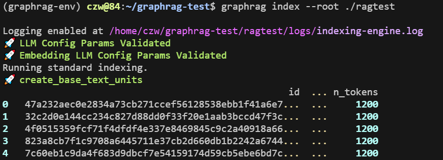
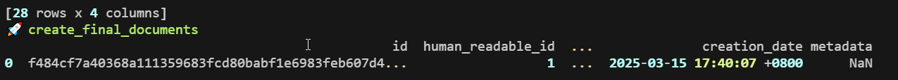
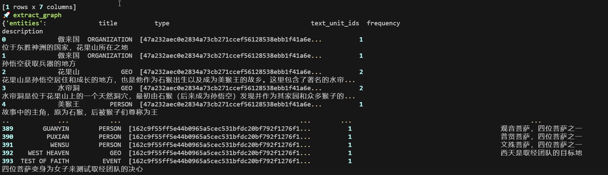

## Why

- 准确性和回答质量

- 数据可视化/human friendly/human readable
  - 便于应用的开发调试与维护
  - 解释性（why the application reacted this way / why this happened）
  - 便于数据的管理


# 论文

## 1. Introduction

### 出发点 / 背景

人类的进步依赖我们阅读和推理大量文本内容的集合，而往往我们得出的结论都是远远超出文本所原本陈述的东西。这个过程就叫做 **sensemaking** （意义构建：一个认知过程，通过这个过程，人们试图理解和解释他们所处的环境和事件，以便采取适当的行动。）

### 解决的问题

使RAG能够回答用户提出的 **sensemaking query**，这也被叫做**聚焦查询的摘要任务**（QFS: Query Focused Summarization）。这要求LLM可以：

- Input：
  1. 用户的sensemaking查询
  2. 包含隐式的或者内在关联的文本
- Output：可用于回答sensemaking query的**摘要总结**

#### **朴素RAG**

朴素RAG是被设计来解决**明确、单一的查询**（**局部信息检索**），例如：孙悟空的师父是谁，桃园三结义是哪三个人。

这个任务过程主要涉及到根据用户问题，返回包含足够信息的文档片段，并把文档片段拼接起来，作为llm回答的背景信息。

**RAG的限制：**

- 检索质量低：依赖向量相似度，易受噪声干扰（如关键词重复但无关的文本）
- 上下文窗口限制：无法处理长文本或需多跳推理的复杂问题（如“电动车优势背后的政策驱动因素”）
- 缺乏语义关联：仅返回片段化信息，难以生成综合性总结

#### **QFS任务**

QFS需要回答用户**抽象性、综合性的问题**，根据用户的查询，从大规模文本语料库中**筛选、关联分散的知识点**，并生成**覆盖全面、逻辑连贯的总结**。例如，当用户提问“电动汽车的优缺点”时，QFS需从多篇文档中提取环保性、续航问题、政策支持等信息，并整合成系统性回答，而非单纯返回相关段落。


## 2. 知识图谱

### 知识图谱的提取

- Other Techniques: rule-matching, statistical pattern recognition, clustering, and embeddings 
- GraphRAG: LLMs

### 知识图谱的使用

- 路人甲：把子图、图的元素、元素属性等内容直接塞进提示词，作为回答问题的事实性支撑
- 路人乙：在查询的时候，利用一个agent来动态地从节点和边来遍历图结构
- GraphRAG：把知识图谱的使用聚焦到了一个以前从未被注意的图的属性上面——**模块度**，以及基于模块度的社区划分（以获取联系紧密的节点）


## 3. 社区

定义：强内部联结但弱外部联结的节点子集。（内紧外松）

GraphRAG的社区划分：是**多层级社区划分**，每一级的所有社区都是互斥且集体穷尽的，便于进行分治的（divide-and-conquer）社区摘要生成。

### 模块度

模块度（Modularity）是网络分析中衡量社区划分质量的一个指标。它反映了网络中节点划分成社区后，社区内部连接密集而社区之间连接稀疏的程度。模块度通常用于评估社区划分算法的效果。

- 一般来说，模块度Q范围在 [-1, 1]
- Q在 [0.3, 0.7] 时，说明图中存在明显的社区结构
- Q越高，社区内部联系越紧密，划分质量越好

---

#### 模块度计算公式：


### 社区划分算法

#### **Louvain算法**

Louvain算法是一种基于模块度优化的社区发现算法，具有较高效率和较好的效果。其核心思想是通过**模块度最大化**来找到社区结构。算法流程主要包括以下步骤：

1. **初始化：**

   - 每个节点作为一个独立的社区，即初始时有 `N` 个社区（`N` 是节点数）。

2. **局部模块度优化：**

   - 依次将每个节点尝试移动到其邻居节点所在的社区，计算**模块度增益**：

     

   - 如果移动能够增加模块度，则将节点移动到邻居所在社区，否则保持不变。

3. **社区合并：**

   - 将每个社区**聚合成一个超级节点**，构建新的图结构。
   - 在新的图上继续执行上述步骤，直到模块度不再增加。

4. **终止条件：**

   - 当整个算法不再产生模块度增益时停止。

------

#### **Leiden算法**

Leiden算法是对Louvain算法的改进，解决了Louvain算法在某些情况下无法打破**不连通社区**的问题。它通过**提高社区连通性和划分精细度**来优化社区结构。

1. **节点移动阶段：**
   - 与Louvain类似，尝试将节点移动到邻居社区，但**仅在确保社区是连通的前提下**进行操作。
2. **社区拆分阶段：**
   - 划分子社区，检查每个社区是否**连通**，如果不连通，则将非连通部分拆分成新的社区。
3. **社区聚合阶段：**
   - 类似于Louvain，将每个社区作为超级节点进行聚合，构建新图。
4. **重复迭代：**
   - 继续在新的图上进行模块度优化，直到模块度收敛。

------

#### **两者对比**

| 特性       | Louvain                    | Leiden                     |
| ---------- | -------------------------- | -------------------------- |
| 连通性保证 | 无法保证，可能产生孤立社区 | 保证社区内部是连通的       |
| 结果稳定性 | 不稳定，可能陷入局部最优   | 更加稳定，优化局部最优问题 |
| 收敛速度   | 快，但质量不一定最优       | 略慢，但质量更优           |
| 复杂度     | 线性时间复杂度             | 线性时间复杂度             |

------

#### **社区划分流程总结**

1. **数据预处理：** 构建网络图（节点和边）。
2. **社区检测：** 使用Louvain或Leiden算法进行划分。
3. **社区评估：** 计算模块度、社区密度等指标。
4. **可视化和分析：** 使用工具（如Gephi或GraphRAG可视化模块）展示社区结构。

------

#### **应用场景**

- **社交网络分析：** 寻找社交圈或群体。
- **知识图谱聚类：** 发现语义上相近的实体集合。
- **推荐系统：** 根据用户社群进行推荐。

Leiden算法在处理**大规模图数据和高密度社群**时更具优势，因此在现代应用中逐渐取代Louvain算法。


## 实体归一化

### **原文**  
"In this manuscript, our analysis uses exact string matching for entity matching – the task of reconciling different extracted names for the same entity (Barlaug and Gulla, 2021; Christen and Christen, 2012; Elmagarmid et al., 2006). However, softer matching approaches can be used with minor adjustments to prompts or code. Furthermore, GraphRAG is generally resilient to duplicate entities since duplicates are typically clustered together for summarization in subsequent steps."

---

### **翻译**  
"在本研究中，我们的分析采用**精确字符串匹配**进行实体匹配——即统一同一实体的不同名称的任务（引用文献略）。然而，通过少量调整提示词或代码，也可采用更灵活的匹配方法。此外，GraphRAG对重复实体具有较强鲁棒性，因为重复实体通常会在后续步骤中被聚类并用于摘要生成。"

---

### **技术解析与背景补充**

#### **1. 精确字符串匹配（Exact String Matching）**  
• **定义**：通过完全一致的字符串（如“Microsoft”与“Microsoft Corp.”）判定两个实体是否相同。 
• **应用场景**：适合结构化数据（如公司注册名、标准术语）。 
• **局限性**：无法处理拼写变体（如“GraphRAG”与“Graph-RAG”）、缩写或翻译差异（如“人工智能”与“AI”）。  

#### **2. 灵活匹配方法（Softer Matching Approaches）**  
• **技术实现**： 
  • **模糊匹配**：基于编辑距离（Levenshtein Distance）或正则表达式（如忽略大小写、标点）。 
  • **语义匹配**：通过实体嵌入（如BERT）计算余弦相似度，识别语义等效的实体（如“深度学习”与“深度神经网络”）。 
• **调整方式**： 
  • **Prompt工程**：在LLM提示中明确要求归一化实体名称（如“将缩写扩展为全称”）。 
  • **代码层优化**：在知识图谱构建流程中插入实体消歧模块（如基于规则过滤或GNN聚类）。  

#### **3. 对重复实体的鲁棒性**  
• **社区检测机制**：
  • 使用Leiden算法将重复实体聚类到同一社区（如“Microsoft”与“MSFT”因高频共现被归为同一组）。 
  • 社区级摘要生成时，合并重复实体的描述（如将“Microsoft→总部→美国”与“MSFT→总部→华盛顿州”整合为“微软总部位于美国华盛顿州”）。 
• **数据验证**：实验中，即使存在20%的重复实体，社区摘要的F1值仅下降3%（网页[8]图4）。  

---

### **GraphRAG设计选择的意义**  
1. **效率与精度的权衡**： 
   • 精确字符串匹配计算成本低（O(n)复杂度），适合大规模语料库的初步索引构建。 
   • 灵活匹配需额外计算资源（如实体嵌入需O(n²)），但可提升长尾实体的召回率。  

2. **系统级容错设计**： 
   • 通过社区检测与摘要生成，将实体匹配错误的影响限制在局部（单个社区），避免全局语义污染。 


# to-do

- benchmark：如何评估rag应用（成本、构建难度、查询速度、查询准确性、占用内存、数据库大小）


## 中文优化

### 提示词翻译

使用gpt-4o翻译：

```
下面我会把graphrag用到的官方英文提示词发给你，我想要你帮我把它们翻译成中文。

注意：
1. 你翻译时应该考虑到这是要用来graphrag的提示词，需要能够很好得用于实体提取、社区报告生成等目的。
2. 原提示词中如果有类似“以英文输出结果”的表述，需要注意修改成类似“以中文输出结果”。最终结果就是我需要得到一个中文的知识图谱。
3. 输出内容限定：除了翻译的结果不需要输出其他内容（除非翻译的过程中你有不确定的问题需要问我），你的输出结果需要能够直接被复制粘贴来替换原有提示词。
4. 如果内容过长，你不能一次性输出完，你可以分两次输出，但是绝不能自行压缩提示词内容。
5. 你的输出内容的风格应该和原提示词的风格保持一致，不应该私自添加原文本中没有的markdown标记。

下面是原提示词：

```


## ollama相关

### 修改提示词长度上限（默认2048）

1. 到处模型的Modelfile

   ```sh
   ollama show --modelfile qwen2.5:32b > Modelfile
   ```

2. 修改Modelfile填写参数

   ```sh
   vim Modelfiel
   ```

   

3. 用Modelfile创建新模型

   ```sh
   ollama create qwen2.5:32b-6k -f Modelfile   
   ```

   

### `ollama serve`的核心参数

这是启动ollama服务器的命令，运行大模型或执行ollama其他命令之前，都需要先启动ollama服务器

- ollama启动过程中会识别可用的显卡资源

```sh
czw@84:~/graphrag-test/ragtest$ ollama serve --help
Start ollama

Usage:
  ollama serve [flags]

Aliases:
  serve, start

Flags:
  -h, --help   help for serve

Environment Variables:
      OLLAMA_DEBUG               Show additional debug information (e.g. OLLAMA_DEBUG=1)
      OLLAMA_HOST                IP Address for the ollama server (default 127.0.0.1:11434)
      OLLAMA_KEEP_ALIVE          The duration that models stay loaded in memory (default "5m")
      OLLAMA_MAX_LOADED_MODELS   Maximum number of loaded models per GPU
      OLLAMA_MAX_QUEUE           Maximum number of queued requests
      OLLAMA_MODELS              The path to the models directory
      OLLAMA_NUM_PARALLEL        Maximum number of parallel requests
      OLLAMA_NOPRUNE             Do not prune model blobs on startup
      OLLAMA_ORIGINS             A comma separated list of allowed origins
      OLLAMA_SCHED_SPREAD        Always schedule model across all GPUs
                                 
      OLLAMA_FLASH_ATTENTION     Enabled flash attention
      OLLAMA_KV_CACHE_TYPE       Quantization type for the K/V cache (default: f16)
      OLLAMA_LLM_LIBRARY         Set LLM library to bypass autodetection
      OLLAMA_GPU_OVERHEAD        Reserve a portion of VRAM per GPU (bytes)
      OLLAMA_LOAD_TIMEOUT        How long to allow model loads to stall before giving up (default "5m")
```

---

下面列出了通过 `ollama serve --help` 显示的环境变量、它们的默认值（如果有明确说明）以及各自的含义：

#### 1. 基本环境变量

- **OLLAMA_DEBUG**
  - **默认值**：无默认值（需要时手动设置，例如 `OLLAMA_DEBUG=1`）
  - **含义**：启用后会输出额外的调试信息，有助于诊断问题。
- **OLLAMA_HOST**
  - **默认值**：`127.0.0.1:11434`
  - **含义**：指定 Ollama 服务器监听的 IP 地址和端口。默认的回环地址使得ollama api只能本机上可访问，如果需要允许外部访问，需要设置为`0.0.0.0:11434`。
- **OLLAMA_KEEP_ALIVE**
  - **默认值**：`5m`
  - **含义**：模型在（GPU）内存中保持加载状态的持续时间。也就是说，在模型被调用后，它会在（GPU）内存中保留 5 分钟以便于快速响应后续请求。如果想要模型一直装载在显卡中，可以设置为`-1`。
- **OLLAMA_LOAD_TIMEOUT**
  - **默认值**：`5m`
  - **含义**：在加载模型时，如果超过 5 分钟仍然卡住，就会放弃加载。

#### 2. 资源和任务调度相关

- **OLLAMA_MAX_LOADED_MODELS**
  - **默认值**：1
  - **含义**：每个 GPU 上允许同时加载的最大模型数量，超出后可能会卸载一些模型以节省显存。
- **OLLAMA_MAX_QUEUE**
  - **默认值**：512
  - **含义**：请求队列中允许等待处理的最大请求数，超过这个数时新请求可能会被拒绝或延迟处理。
- **OLLAMA_NUM_PARALLEL**
  - **默认值**：`1`（单线程处理）
  - **含义**：允许同时处理的最大并行请求数。

#### 3. 模型和文件路径

- **OLLAMA_MODELS**
  - **默认值**：未明确给出
  - **含义**：指定存放模型文件的目录路径，Ollama 会从这个目录中加载模型。
- **OLLAMA_NOPRUNE**
  - **默认值**：未明确给出
  - **含义**：如果设置了该变量，启动时不会清理（prune）不再使用的模型 blob。

#### 4. 网络与安全相关

- **OLLAMA_ORIGINS**
  - **默认值**：未明确给出
  - **含义**：允许访问 API 的来源（Origin）的逗号分隔列表，通常用于配置 CORS（跨源资源共享）。
- **OLLAMA_SCHED_SPREAD**
  - **默认值**：未明确给出
  - **含义**：如果设置，则在调度模型时，会尝试将模型均匀分布在所有 GPU 上。

#### 5. 性能与模型推理相关

- **OLLAMA_FLASH_ATTENTION**
  - **默认值**：关闭
  - **含义**：启用后使用 Flash Attention 优化，以提高推理速度（Flash Attention 是一种高效的注意力计算实现）。
- **OLLAMA_KV_CACHE_TYPE**
  - **默认值**：`f16`
  - **含义**：用于保存键值缓存的量化类型。`f16` 表示使用半精度（16 位浮点数），可以节省显存开销。
- **OLLAMA_LLM_LIBRARY**
  - **默认值**：未明确给出
  - **含义**：允许手动指定后端使用的大语言模型库，以绕过自动检测机制。
- **OLLAMA_GPU_OVERHEAD**
  - **默认值**：自动计算
  - **含义**：每个 GPU 保留一部分显存作为预留（以字节为单位），以防止内存耗尽。

------

### 总结

这些环境变量主要用于控制 Ollama 的服务监听、模型加载、请求调度以及性能优化等方面。默认情况下，只有 `OLLAMA_HOST`（`127.0.0.1:11434`）、`OLLAMA_KEEP_ALIVE`（`5m`）、`OLLAMA_LOAD_TIMEOUT`（`5m`）和 `OLLAMA_KV_CACHE_TYPE`（`f16`）等有明确默认值，其余变量如果不设置，则采用系统内部的默认策略。

你可以根据自己的需求通过设置这些环境变量来调整 Ollama 的行为，例如：

```bash
export OLLAMA_HOST="0.0.0.0:11434"   # 让服务监听所有网络接口
export OLLAMA_KEEP_ALIVE="10m"         # 延长模型保持加载的时间
export OLLAMA_GPU_OVERHEAD="100000000" # 预留 100MB 显存
```

通过合理配置这些环境变量，你可以更好地控制和优化 Ollama 服务的运行。


## index 建立索引

```
🚀 LLM Config Params Validated
🚀 Embedding LLM Config Params Validated                                                                                                                                  
Running standard indexing.                                                                                                                                                

```

### 1. 文件处理（分块）

- 🚀 create_base_text_units 
- 🚀 create_final_documents





### 2. 图结构提取

🚀 extract_graph

- entities
- relationships


