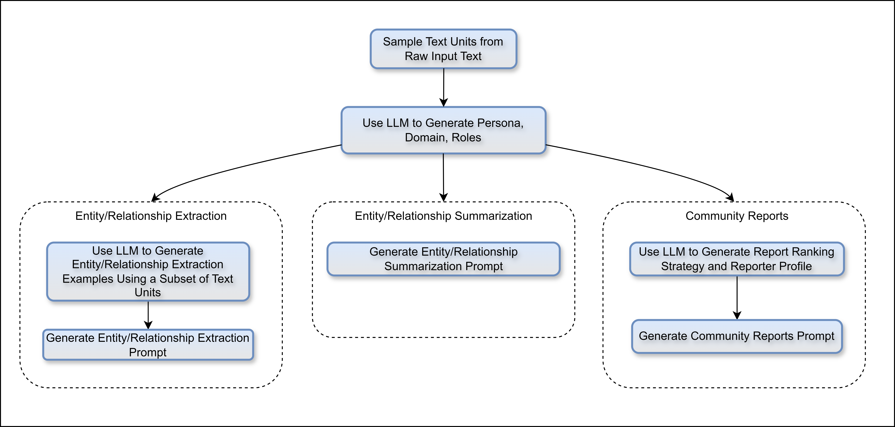

# 论文

## Introduction

### 出发点 / 背景

人类的进步依赖我们阅读和推理大量文本内容的集合，而往往我们得出的结论都是远远超出文本所原本陈述的东西。这个过程就叫做 **sensemaking** （意义构建：一个认知过程，通过这个过程，人们试图理解和解释他们所处的环境和事件，以便采取适当的行动。）


### 解决的问题

使RAG能够回答用户提出的 **sensemaking query**，这也被叫做**聚焦查询的摘要任务**（QFS: Query Focused Summarization）。这要求LLM可以：

- Input：
  1. 用户的sensemaking查询
  2. 包含隐式的或者内在关联的文本
- Output：可用于回答sensemaking query的**摘要总结**

#### **朴素RAG**

朴素RAG是被设计来解决**明确、单一的查询**（**局部信息检索**），例如：孙悟空的师父是谁，桃园三结义是哪三个人。

这个任务过程主要涉及到根据用户问题，返回包含足够信息的文档片段，并把文档片段拼接起来，作为llm回答的背景信息。

**RAG的限制：**

- 检索质量低：依赖向量相似度，易受噪声干扰（如关键词重复但无关的文本）
- 上下文窗口限制：无法处理长文本或需多跳推理的复杂问题（如“电动车优势背后的政策驱动因素”）
- 缺乏语义关联：仅返回片段化信息，难以生成综合性总结

#### **QFS任务**

QFS需要回答用户**抽象性、综合性的问题**，根据用户的查询，从大规模文本语料库中**筛选、关联分散的知识点**，并生成**覆盖全面、逻辑连贯的总结**。例如，当用户提问“电动汽车的优缺点”时，QFS需从多篇文档中提取环保性、续航问题、政策支持等信息，并整合成系统性回答，而非单纯返回相关段落。


### GraphRAG的核心：知识图谱

#### 知识图谱的提取

- Other Techniques: rule-matching, statistical pattern recognition, clustering, and embeddings 
- GraphRAG: LLMs

#### 知识图谱的使用

- 路人甲：把子图、图的元素、元素属性等内容直接塞进提示词，作为回答问题的事实性支撑
- 路人乙：在查询的时候，利用一个agent来动态地从节点和边来遍历图结构
- GraphRAG：把知识图谱的使用聚焦到了一个以前从未被注意的图的属性上面——**模块度**，以及基于模块度的社区划分（以获取联系紧密的节点）


## 补充知识：社区

定义：强内部联结但弱外部联结的节点子集。（内紧外松）

GraphRAG的社区划分：是**多层级社区划分**，每一级的所有社区都是互斥且集体穷尽的，便于进行分治的（divide-and-conquer）社区摘要生成。

### 模块度

模块度（Modularity）是网络分析中衡量社区划分质量的一个指标。它反映了网络中节点划分成社区后，社区内部连接密集而社区之间连接稀疏的程度。模块度通常用于评估社区划分算法的效果。

- 一般来说，模块度Q范围在 [-1, 1]
- Q在 [0.3, 0.7] 时，说明图中存在明显的社区结构
- Q越高，社区内部联系越紧密，划分质量越好

---

#### 模块度计算公式：


### 社区划分算法

#### **Louvain算法**

> 鲁汶

Louvain算法是一种基于模块度优化的社区发现算法，具有较高效率和较好的效果。其核心思想是通过**模块度最大化**来找到社区结构。算法流程主要包括以下步骤：

1. **初始化：**

   - 每个节点作为一个独立的社区，即初始时有 `N` 个社区（`N` 是节点数）。

2. **局部模块度优化：**

   - 依次将每个节点尝试移动到其邻居节点所在的社区，计算**模块度增益**：

     

   - 如果移动能够增加模块度，则将节点移动到邻居所在社区，否则保持不变。

3. **社区合并：**

   - 将每个社区**聚合成一个超级节点**，构建新的图结构。
   - 在新的图上继续执行上述步骤，直到模块度不再增加。

4. **终止条件：**

   - 当整个算法不再产生模块度增益时停止。

------

#### **Leiden算法**

> 莱顿

Leiden算法是对Louvain算法的改进，解决了Louvain算法在某些情况下无法打破**不连通社区**的问题。它通过**提高社区连通性和划分精细度**来优化社区结构。

1. **节点移动阶段：**
   - 与Louvain类似，尝试将节点移动到邻居社区，但**仅在确保社区是连通的前提下**进行操作。
2. **社区拆分阶段：**
   - 划分子社区，检查每个社区是否**连通**，如果不连通，则将非连通部分拆分成新的社区。
3. **社区聚合阶段：**
   - 类似于Louvain，将每个社区作为超级节点进行聚合，构建新图。
4. **重复迭代：**
   - 继续在新的图上进行模块度优化，直到模块度收敛。

------

#### **两者对比**

| 特性       | Louvain                    | Leiden                     |
| ---------- | -------------------------- | -------------------------- |
| 连通性保证 | 无法保证，可能产生孤立社区 | 保证社区内部是连通的       |
| 结果稳定性 | 不稳定，可能陷入局部最优   | 更加稳定，优化局部最优问题 |
| 收敛速度   | 快，但质量不一定最优       | 略慢，但质量更优           |
| 复杂度     | 线性时间复杂度             | 线性时间复杂度             |

------

#### **社区划分流程总结**

1. **数据预处理：** 构建网络图（节点和边）。
2. **社区检测：** 使用Louvain或Leiden算法进行划分。
3. **社区评估：** 计算模块度、社区密度等指标。
4. **可视化和分析：** 使用工具（如Gephi或GraphRAG可视化模块）展示社区结构。

------

#### **应用场景**

- **社交网络分析：** 寻找社交圈或群体。
- **知识图谱聚类：** 发现语义上相近的实体集合。
- **推荐系统：** 根据用户社群进行推荐。

Leiden算法在处理**大规模图数据和高密度社群**时更具优势，因此在现代应用中逐渐取代Louvain算法。


## GraphRAG流程图


## Index 阶段

### 1. Source Documents → Text Chunks

**关键：chunk大小**

- chunk 越大，发起LLM调用的次数越少，token消耗越少
- chunk 越小，信息召回率越高，图提取的遗漏越少、准确性越高

### 2. Text Chunks → Entities & Relationships

#### 主要工作：

1. 利用 LLM 从每个 chunk 中提取重要的实体和关系
2. 同时 LLM 会为每个实体和关系生成个简短描述

#### 提示词（节选）：

**1. extract_graph.py (extrac_entity.txt) : **

```markdown
1. 识别所有实体。对于每个已识别的实体，提取以下信息:
- entity_name: 实体名称
- entity_type: 以下类型之一: [{entity_types}]
- entity_description: 实体属性和活动的综合描述
将每个实体格式化为 ("entity"{tuple_delimiter} <entity_name>{tuple_delimiter} <entity_type>{tuple_delimiter} <entity_description>)

2. 从步骤 1 中识别的实体中，识别所有 *明显相关* 的 (source_entity, target_entity) 对。
对于每对相关实体，提取以下信息:
- source_entity: 源实体的名称，如步骤 1 中所述
- target_entity: 目标实体的名称，如步骤 1 中所述
- relationship_description: 解释您认为源实体和目标实体相互关联的原因
- relationship_strength: 表示源实体和目标实体之间关系强度的数字分数
将每个关系格式化为 ("relationship"{tuple_delimiter}<source_entity>{tuple_delimiter}<target_entity>{tuple_delimiter}<relationship_description>{tuple_delimiter}<relationship_strength>)
```

> 关系的 `relationship_strength`字段，提示词并没有说明评分范围，猜测是 1~10

---

**2. extract_claims.py (claim_extraction.txt) :**

```markdown
-步骤-
1. 提取与预定义实体规范匹配的所有命名实体。实体规范可以是实体名称列表或实体类型列表。
2. 对于步骤 1 中确定的每个实体，提取与该实体相关的所有声明。声明需要与指定的声明描述匹配，并且实体应该是声明的主体。
对于每个声明，提取以下信息:
- 主体:声明主体的实体名称。主体实体是实施声明中描述的操作的实体。主体必须是步骤 1 中确定的命名实体之一。
- 客体:声明客体的实体名称。对象实体是报告/处理或受声明中描述的操作影响的对象实体。如果对象实体未知，请使用**NONE**。
- 声明类型:声明的总体类别。以可以在多个文本输入中重复的方式命名，以便类似的声明共享相同的声明类型
- 声明状态:**TRUE**, **FALSE**或**SUSPECTED**。TRUE 表示声明已确认，FALSE 表示声明被发现为虚假，SUSPECTED 表示声明未经核实。
- 声明说明:详细说明声明背后的原因，以及所有相关证据和参考资料。
- 声明日期:声明的期间(start_date，end_date)。start_date 和 end_date 都应采用 ISO-8601 格式。如果声明是在单个日期而不是日期范围内提出的，请为 start_date 和 end_date 设置相同的日期。如果日期未知，则返回**NONE**。
- 声明要求来源文本:原文中与声明要求相关的**所有**引文的列表。

将每个声明要求的格式设置为 (<subject_entity>{tuple_delimiter} <object_entity>{tuple_delimiter} <claim_type>{tuple_delimiter} <claim_status>{tuple_delimiter} <claim_start_date>{tuple_delimiter} <claim_end_date>{tuple_delimiter} <claim_description>{tuple_delimiter} <claim_source>)

3. 返回列表，其中包含步骤 1 和 2 中确定的所有声明要求。使用 **{record_delimiter}** 作为列表分隔符。

4. 完成后，输出 {completion_delimiter}
```

### 3. Entities & Relationships → Knowledge Graph

**这一步就是知识图谱的构建 —— 即图元素与协变量的汇总**。前一步对于实体/关系以及其他协变量的提取是逐块进行的，而如果一个实体/关系在多个块中出现，在处理整个文档时，就会被提取多次。而知识图谱生成需要把提取到的：

- 同一个**实体**汇总成一个 **node**
- 同一个**关系**汇总成一条 **edge**，而关系出现的次数则作为 edge 的权重
- 实体和关系的**描述**合并总结成最终的描述
- **声明**合并总结成最终的声明

**实体的识别**：精确字符串匹配，即”孙悟空”和“齐天大圣”会被识别为两个实体。但是在聚类的时候会自动聚集到一起，自带鲁棒性。

### 4. Knowledge Graph → Graph Communities

这个阶段使用 leiden（莱顿）社区发现算法进行社区划分，但GraphRAG会通过控制粒度的递归，实现多层级社区的划分：

1. 首次运行（粗粒度）：对整个知识图谱应用Leiden算法，通过设定较高的分辨率参数（resolution parameter），使算法倾向于生成较大的社区（即顶级社区，如“人工智能技术”或“医疗风险”）。此时社区数量较少，覆盖全局节点。
2. 递归调用（细粒度）：对每个顶级社区单独再次运行Leiden算法，并逐步降低分辨率参数。这相当于在子图上细化划分，生成更小的子社区。重复此过程直到满足终止条件（如社区无法进一步分割或达到预设层级深度）。


### 5. Graph Communities → Community Summaries

这一步对多层级社区逐层生成**社区摘要**：

- 作为一个独立有效的信息来源，可以在全局层面上帮助理解数据集的结构和语义
- 用于回答 global queries
- 使用场景：用户从上往下逐层查看社区摘要，看到某个感兴趣的社区时，进入到这个社区的下层查看其子社区的摘要。从而从多层级社区中获取足够用于回答 global queries 的信息。

#### 如何逐层摘要

**GraphRAG通过将各类元素摘要（节点、边及相关声明）填充到社区摘要模板中生成社区摘要：**

- **叶子级社区**：
  - 对社区中的关系排序，从前往后依次将 **边描述、源节点描述、目标节点描述、及相关声明** 添加到LLM上下文窗口，直到达到Token上限。
  - 边的排序规则：按边的整体重要性降序排列，整体重要性即边的源节点与目标节点的度数之和
- **更高级社区**：
  - 若所有元素摘要未超出Token限制，则按叶子级社区方式处理；
  - 若超出限制，则按子社区摘要的Token量降序排列，逐步用子社区摘要（较短）替换其关联的元素摘要（较长），直到适配Token容量。

#### 提示词（节选）

**community_report.py：**

````markdown
报告应包括以下部分:

- title: 代表其关键实体的社区名称，标题应简短但具体。如果可能，请在标题中包含代表性命名实体。
- summary: 社区整体结构的执行摘要，其实体如何相互关联，以及与其实体相关的重要信息。
- rating: 0-10 之间的浮动分数，表示社区内实体造成的影响的严重程度。影响是社区的重要性得分。
- rating_explanation: 用一句话解释影响严重程度评级。
- findings: 列出 5-10 个关于社区的关键见解。每个见解都应有一个简短的摘要，然后根据以下基本规则附上多段解释性文字。内容要全面。

将输出返回为格式正确的 JSON 格式字符串，格式如下:
```json
{{
    "title": <report_title>,
    "summary": <executive_summary>,
    "rating": <impact_severity_rating>,
    "rating_explanation": <rating_explanation>,
    "findings": [
        {{
            "summary":<insight_1_summary>,
            "explanation": <insight_1_explanation>
        }},
        {{
            "summary":<insight_2_summary>,
            "explanation": <insight_2_explanation>
        }}
    ]
}}
```
````


## Query 阶段

### 1. 确定社区层级

GraphRAG会直接利用社区摘要来回答用户的全局查询，而这就首先涉及到确定一个社区的层级。社区层级越高，社区涵盖的内容就越广，回答可能就更全面。而社区层级越低，社区中包含的细节信息就更多，回答则更具体。

### 2. 社区摘要准备

随机打乱社区摘要，对打乱后的所有的社区摘要进行文本分块操作（按照预设大小）

（This ensures relevant information is distributed across chunks, rather than concentrated (and potentially lost) in a single context window.）

### 3. Map

把每个社区摘要块填入 LLM 提示词中，让 LLM 分别以每个社区摘要块作为背景信息来回答一次用户问题。同时让 LLM 对每个回答的有用程度给出一个评分。（0分回答会被过滤掉）

#### 提示词（节选）

**global_search_map_system_prompt.py：**

````markdown
---目标---

生成一个回答，其中包含响应用户问题的关键点列表，总结输入数据表中的所有相关信息，至少生成5个关键点。
您应该使用下面数据表中提供的数据作为生成回答的主要上下文。
如果您不知道答案，或者输入数据表没有包含足够的信息来提供答案，请直接说不知道。不要编造任何东西。
回答中的每个关键点都应包含以下元素:
- 描述: 对该点的全面描述。
- 重要性分数: 0-100 之间的整数分数，表示该点在回答用户问题方面的重要性。"我不知道" 类型的回答得分为 0。

回答应采用 JSON 格式，如下所示:
```json
{{
    "points": [
        {{"description": "要点 1 的描述 [数据: 报告(报告 ID)]", "score": score_value}},
        {{"description": "要点 2 的描述 [数据: 报告(报告 ID)]", "score": score_value}}
    ]
}}
```
````

### 4. Reduce

对上一步获得回答按照评分降序排列，在不超过LLM上下文长度的情况下，选取尽量多的回答填入 LLM 提示词。被选取到的回答就作为用于生成最终回答的上下文信息。

#### 提示词（节选）

**global_search_reduce_system_prompt.py：**

```markdown
---角色---

您是一位智能助手，通过综合多位分析师的观点来回答有关数据集合的问题。

---目标---

生成目标长度和格式的回答，以响应用户的问题，总结多位分析师对数据集合不同部分的所有报告。
请注意，下面提供的分析师报告按 **重要性降序排列** 。
如果您不知道答案，或者提供的报告不包含足够的信息来提供答案，请直接说不知道。不要编造任何东西。
最终的回答应从分析师的报告中删除所有不相关的信息，并将清理后的信息合并为一个全面的答案，该答案提供适合回答长度和格式的所有关键点和含义的解释。


...略...


---目标回答长度和格式---

{response_type}

---分析师报告---

{report_data}
```

### 

## 提示词微调（index 阶段）

为了提升 index 阶段提示词的效果，非常建议在原有提示词中添加一些与输入语料相关的 few shot 例子，这对于提升 LLM 提取知识图谱的质量非常有帮助。

- Auto Tuning：https://microsoft.github.io/graphrag/prompt_tuning/auto_prompt_tuning/
- Manual Tuning： 手动指定提示词替换原提示词，只需要符合提示词模板格式即可




## 实体归一化

### **原文**  
"In this manuscript, our analysis uses exact string matching for entity matching – the task of reconciling different extracted names for the same entity (Barlaug and Gulla, 2021; Christen and Christen, 2012; Elmagarmid et al., 2006). However, softer matching approaches can be used with minor adjustments to prompts or code. Furthermore, GraphRAG is generally resilient to duplicate entities since duplicates are typically clustered together for summarization in subsequent steps."

---

### **翻译**  
"在本研究中，我们的分析采用**精确字符串匹配**进行实体匹配——即统一同一实体的不同名称的任务。然而，通过少量调整提示词或代码，也可采用更灵活的匹配方法。此外，GraphRAG对重复实体具有较强鲁棒性，因为重复实体通常会在后续步骤中被聚类并用于摘要生成。"

---

### **技术解析与背景补充**

#### **1. 精确字符串匹配（Exact String Matching）**  
• **定义**：通过完全一致的字符串（如“Microsoft”与“Microsoft Corp.”）判定两个实体是否相同。 
• **应用场景**：适合结构化数据（如公司注册名、标准术语）。 
• **局限性**：无法处理拼写变体（如“GraphRAG”与“Graph-RAG”）、缩写或翻译差异（如“人工智能”与“AI”）。  

#### **2. 灵活匹配方法（Softer Matching Approaches）**  
• **技术实现**： 
  • **模糊匹配**：基于编辑距离（Levenshtein Distance）或正则表达式（如忽略大小写、标点）。 
  • **语义匹配**：通过实体嵌入（如BERT）计算余弦相似度，识别语义等效的实体（如“深度学习”与“深度神经网络”）。 
• **调整方式**： 
  • **Prompt工程**：在LLM提示中明确要求归一化实体名称（如“将缩写扩展为全称”）。 
  • **代码层优化**：在知识图谱构建流程中插入实体消歧模块（如基于规则过滤或GNN聚类）。  

#### **3. 对重复实体的鲁棒性**  
• **社区检测机制**：
  • 使用Leiden算法将重复实体聚类到同一社区（如“Microsoft”与“MSFT”因高频共现被归为同一组）。 
  • 社区级摘要生成时，合并重复实体的描述（如将“Microsoft→总部→美国”与“MSFT→总部→华盛顿州”整合为“微软总部位于美国华盛顿州”）。 
• **数据验证**：实验中，即使存在20%的重复实体，社区摘要的F1值仅下降3%（网页[8]图4）。  

---

### **GraphRAG设计选择的意义**  
1. **效率与精度的权衡**： 
   • 精确字符串匹配计算成本低（O(n)复杂度），适合大规模语料库的初步索引构建。 
   • 灵活匹配需额外计算资源（如实体嵌入需O(n²)），但可提升长尾实体的召回率。  

2. **系统级容错设计**： 
   • 通过社区检测与摘要生成，将实体匹配错误的影响限制在局部（单个社区），避免全局语义污染。 


## 评估

目前没有比较好的用于测试RAG系统回答 global queries 的能力的方法。GraphRAG的思路就是让 LLM 自己生成 global queries，然后再从多个维度来评估 RAG 系统的回答质量。

### 问题的生成

要求 LLM 针对输入的语料识别 K ( = 5 ) 个潜在用户，每个用户  N ( = 5 )  个任务，为了完成任务需要提出 M ( = 5 ) 个问题。

因此，对于一个数据集，需要 LLM 提出 125 个全局问题，并评估 RAG 系统的回答质量。

### 数据集

Chunk Size : 600 - 100overlap


### 实验条件（conditions）

1. C0. Uses root-level community summaries (fewest in number) to answer user queries.
2. C1. Uses high-level community summaries to answer queries. These are sub-communities of C0, if present, otherwise C0 communities projected downwards.
3. C2. Uses intermediate-level community summaries to answer queries. These are sub-communities of C1, if present, otherwise C1 communities projected downwards.
4. C3. Uses low-level community summaries (greatest in number) to answer queries. Theseare sub-communities of C2, if present, otherwise C2 communities projected downwards.
5. TS. The same method as in Section 3.1.6, except source texts (rather than community summaries) are shuffled and chunked for the map-reduce summarization stages.
6. SS. An implementation of vector RAG in which text chunks are retrieved and added to theavailable context window until the specified token limit is reached.

### 评价指标（Metrics)

**Comprehensiveness**：衡量答案对查询相关主题的覆盖广度，即是否包含所有关键信息点，避免遗漏重要细节。通过每个回答中平均可以提取到的 claim 数量衡量。

**Diversity**：评估答案的丰富性和多角度性，避免重复或单一视角的陈述。通过每个回答中的 claims 聚类的数量衡量。

**Empowerment**：反映答案对用户决策的实际支持能力，即是否提供可操作建议或深度洞见。通过用户调查或任务完成率（如基于答案能否指导正确操作）衡量。

**Directness**：衡量答案与查询意图的匹配精度，避免冗余或偏离主题的内容。这个指标主要是为了突出朴素RAG对于GraphRAG具有更高的直接性。

### 实验方式

针对某个指标，为 LLM 提供问题和（来自不同condition的）一对答案，让 LLM 评价哪个 condition 的答案更好。为避免 LLM 的随机性，此过程进行 5 次取平均值。问完所有问题后，得到某个指标下的某个 condition 对另一个 condition 的胜率。

### 实验结果

总体而言：

- Comprehensiveness 和 Diversity ：GraphRAG压倒性胜过朴素RAG
- Directness ：朴素RAG 优于 GraphRAG
- Empowerment：互有胜负（provide specific examples, quotes, and citations was judged to be key to helping users reach an informed understanding. Tuning element extraction prompts may help to retain more of these details in the GraphRAG index.）


#### token消耗


#### 上下文长度的选择

上下文窗口长度对特定任务的影响尚不明确，尤其是对于像GPT-4 Turbo（支持128k Token长上下文）这类大模型。由于长上下文可能导致信息“在中间位置丢失”（Kuratov et al., 2024; Liu et al., 2023），我们尝试探索不同上下文窗口长度对数据集、问题和评估指标的影响。具体目标是确定基线条件（SS）的最优窗口长度，并将其统一用于所有查询阶段的LLM调用。为此，我们测试了四种窗口长度：8k、16k、32k和64k。

**关键发现**：

- **全面性（Comprehensiveness）**：最小的8k窗口在全面性指标上表现最佳（平均胜率58.1%）。
- **多样性（Diversity）与授权性（Empowerment）**：8k窗口与更大窗口表现相当（平均胜率分别为52.4%和51.3%）。
  最终选择固定8k窗口进行最终评估，以优先保障答案的全面性与多样性。


### 实体提取时的Self-Reflection（一个提示词工程技术）


# ollama相关

### 修改提示词长度上限（默认2048）

1. 到处模型的Modelfile

   ```sh
   ollama show --modelfile qwen2.5:32b > Modelfile
   ```

2. 修改Modelfile填写参数

   ```sh
   vim Modelfiel
   ```

   

3. 用Modelfile创建新模型

   ```sh
   ollama create qwen2.5:32b-6k -f Modelfile   
   ```

   

### `ollama serve`的核心参数

这是启动ollama服务器的命令，运行大模型或执行ollama其他命令之前，都需要先启动ollama服务器

- ollama启动过程中会识别可用的显卡资源

```sh
czw@84:~/graphrag-test/ragtest$ ollama serve --help
Start ollama

Usage:
  ollama serve [flags]

Aliases:
  serve, start

Flags:
  -h, --help   help for serve

Environment Variables:
      OLLAMA_DEBUG               Show additional debug information (e.g. OLLAMA_DEBUG=1)
      OLLAMA_HOST                IP Address for the ollama server (default 127.0.0.1:11434)
      OLLAMA_KEEP_ALIVE          The duration that models stay loaded in memory (default "5m")
      OLLAMA_MAX_LOADED_MODELS   Maximum number of loaded models per GPU
      OLLAMA_MAX_QUEUE           Maximum number of queued requests
      OLLAMA_MODELS              The path to the models directory
      OLLAMA_NUM_PARALLEL        Maximum number of parallel requests
      OLLAMA_NOPRUNE             Do not prune model blobs on startup
      OLLAMA_ORIGINS             A comma separated list of allowed origins
      OLLAMA_SCHED_SPREAD        Always schedule model across all GPUs
                                 
      OLLAMA_FLASH_ATTENTION     Enabled flash attention
      OLLAMA_KV_CACHE_TYPE       Quantization type for the K/V cache (default: f16)
      OLLAMA_LLM_LIBRARY         Set LLM library to bypass autodetection
      OLLAMA_GPU_OVERHEAD        Reserve a portion of VRAM per GPU (bytes)
      OLLAMA_LOAD_TIMEOUT        How long to allow model loads to stall before giving up (default "5m")
```

---

下面列出了通过 `ollama serve --help` 显示的环境变量、它们的默认值（如果有明确说明）以及各自的含义：

#### 1. 基本环境变量

- **OLLAMA_DEBUG**
  - **默认值**：无默认值（需要时手动设置，例如 `OLLAMA_DEBUG=1`）
  - **含义**：启用后会输出额外的调试信息，有助于诊断问题。
- **OLLAMA_HOST**
  - **默认值**：`127.0.0.1:11434`
  - **含义**：指定 Ollama 服务器监听的 IP 地址和端口。默认的回环地址使得ollama api只能本机上可访问，如果需要允许外部访问，需要设置为`0.0.0.0:11434`。
- **OLLAMA_KEEP_ALIVE**
  - **默认值**：`5m`
  - **含义**：模型在（GPU）内存中保持加载状态的持续时间。也就是说，在模型被调用后，它会在（GPU）内存中保留 5 分钟以便于快速响应后续请求。如果想要模型一直装载在显卡中，可以设置为`-1`。
- **OLLAMA_LOAD_TIMEOUT**
  - **默认值**：`5m`
  - **含义**：在加载模型时，如果超过 5 分钟仍然卡住，就会放弃加载。

#### 2. 资源和任务调度相关

- **OLLAMA_MAX_LOADED_MODELS**
  - **默认值**：1
  - **含义**：每个 GPU 上允许同时加载的最大模型数量，超出后可能会卸载一些模型以节省显存。
- **OLLAMA_MAX_QUEUE**
  - **默认值**：512
  - **含义**：请求队列中允许等待处理的最大请求数，超过这个数时新请求可能会被拒绝或延迟处理。
- **OLLAMA_NUM_PARALLEL**
  - **默认值**：`1`（单线程处理）
  - **含义**：允许同时处理的最大并行请求数。

#### 3. 模型和文件路径

- **OLLAMA_MODELS**
  - **默认值**：未明确给出
  - **含义**：指定存放模型文件的目录路径，Ollama 会从这个目录中加载模型。
- **OLLAMA_NOPRUNE**
  - **默认值**：未明确给出
  - **含义**：如果设置了该变量，启动时不会清理（prune）不再使用的模型 blob。

#### 4. 网络与安全相关

- **OLLAMA_ORIGINS**
  - **默认值**：未明确给出
  - **含义**：允许访问 API 的来源（Origin）的逗号分隔列表，通常用于配置 CORS（跨源资源共享）。
- **OLLAMA_SCHED_SPREAD**
  - **默认值**：未明确给出
  - **含义**：如果设置，则在调度模型时，会尝试将模型均匀分布在所有 GPU 上。

#### 5. 性能与模型推理相关

- **OLLAMA_FLASH_ATTENTION**
  - **默认值**：关闭
  - **含义**：启用后使用 Flash Attention 优化，以提高推理速度（Flash Attention 是一种高效的注意力计算实现）。
- **OLLAMA_KV_CACHE_TYPE**
  - **默认值**：`f16`
  - **含义**：用于保存键值缓存的量化类型。`f16` 表示使用半精度（16 位浮点数），可以节省显存开销。
- **OLLAMA_LLM_LIBRARY**
  - **默认值**：未明确给出
  - **含义**：允许手动指定后端使用的大语言模型库，以绕过自动检测机制。
- **OLLAMA_GPU_OVERHEAD**
  - **默认值**：自动计算
  - **含义**：每个 GPU 保留一部分显存作为预留（以字节为单位），以防止内存耗尽。

------

### 总结

这些环境变量主要用于控制 Ollama 的服务监听、模型加载、请求调度以及性能优化等方面。默认情况下，只有 `OLLAMA_HOST`（`127.0.0.1:11434`）、`OLLAMA_KEEP_ALIVE`（`5m`）、`OLLAMA_LOAD_TIMEOUT`（`5m`）和 `OLLAMA_KV_CACHE_TYPE`（`f16`）等有明确默认值，其余变量如果不设置，则采用系统内部的默认策略。

你可以根据自己的需求通过设置这些环境变量来调整 Ollama 的行为，例如：

```bash
export OLLAMA_HOST="0.0.0.0:11434"   # 让服务监听所有网络接口
export OLLAMA_KEEP_ALIVE="10m"         # 延长模型保持加载的时间
export OLLAMA_GPU_OVERHEAD="100000000" # 预留 100MB 显存
```

通过合理配置这些环境变量，你可以更好地控制和优化 Ollama 服务的运行。

