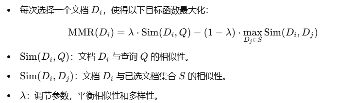

# langchian RAG笔记

## 三种文档整合方法

### **1. Stuff 方法**

#### 特点

- 将所有文档内容直接拼接成一个字符串，一次性传递给 LLM。
- 简单高效，适合小规模文档集。
- 当文档内容较大时，可能会超出模型的上下文窗口。

#### 对应函数

- **`create_stuff_documents_chain`**

#### 使用场景

- 文档数量少且内容较短，能确保总字符数在模型的上下文窗口内。

#### 工作流程

1. 所有文档被拼接为一个完整的字符串。
2. 拼接后的字符串被填充到 Prompt 的占位符（如 `{context}`）中。
3. LLM 一次性处理所有拼接的文档。

------

### **2. MapReduce 方法**

#### 特点

- **Map 阶段**：将每个文档单独传递给 LLM，并生成初步结果。
- **Reduce 阶段**：将初步结果整合起来，再次传递给 LLM，生成最终结果。
- 分布式处理能力更强，适合大规模文档集。

#### 对应函数

- **`create_map_reduce_documents_chain`**

#### 使用场景

- 文档数量较多或内容较长，无法一次性处理。
- 需要对每个文档进行独立的处理后再整合结果。

#### 工作流程

1. **Map 阶段**：每个文档被单独处理，生成初步答案或摘要。
2. **Reduce 阶段**：将所有初步答案整合为一个输入，再传递给 LLM，生成最终答案。

------

### **3. Refine 方法**

#### 特点

- 逐步改进的方式：
  - 先处理第一份文档，生成初步答案。
  - 后续每一份文档都与当前答案一起传递给 LLM，用于进一步完善答案。
- 适合需要增量改进答案的场景。

#### 对应函数

- **`create_refine_documents_chain`**

#### 使用场景

- 需要逐步引入文档内容，并根据新文档调整和完善答案。
- 答案的准确性和关联性需要不断提高。

#### 工作流程

1. 初始阶段：第一个文档生成初步答案。
2. 后续阶段：每个新文档与当前答案一起传递给 LLM，生成改进后的答案。
3. 最终输出：整合所有文档后生成的完善答案。

------

### **总结**

| 方法          | 对应函数                            | 优势                         | 劣势                     | 适用场景                         |
| ------------- | ----------------------------------- | ---------------------------- | ------------------------ | -------------------------------- |
| **Stuff**     | `create_stuff_documents_chain`      | 简单直接，速度快             | 容易超出上下文窗口       | 小规模文档，内容较短             |
| **MapReduce** | `create_map_reduce_documents_chain` | 支持大规模文档，分布式能力强 | 效率较低，可能丢失上下文 | 大规模文档，需要多步聚合         |
| **Refine**    | `create_refine_documents_chain`     | 增量改进，答案更精确         | 时间复杂度高             | 需要逐步完善答案，文档间强相关性 |

选择哪种方法取决于应用场景的需求和文档内容的规模。你可以根据链的设计和目标动态选择这些方法。


## 阿里云百炼平台embedding模型的3种用法

### **方法 1：兼容 OpenAI 接口的 API 调用**

**特点**：

- 使用的是 OpenAI SDK 的兼容模式调用阿里的 DashScope 服务。
- 阿里提供了兼容 OpenAI 的接口（`/compatible-mode/v1`），因此可以通过 OpenAI 的 SDK 调用 DashScope 的服务。

**适用场景**：

- 已经熟悉并使用 OpenAI 的 SDK，希望快速集成 DashScope。
- 项目中已有 OpenAI 的代码，迁移成本低。

**优点**：

- 开发者无需额外学习新的 SDK，只需更换 `base_url` 和 `api_key`。
- 保留了 OpenAI SDK 的功能接口一致性。

**缺点**：

- 功能上可能不完全覆盖 DashScope 的全部特性（如特定模型参数或高级功能）。

#### 代码示例

```python
import os
from openai import OpenAI

client = OpenAI(
    api_key=os.getenv("DASHSCOPE_API_KEY"),  # 如果您没有配置环境变量，请在此处用您的API Key进行替换
    base_url="https://dashscope.aliyuncs.com/compatible-mode/v1"  # 填写百炼服务的base_url
)

completion = client.embeddings.create(
    model="text-embedding-v3",
    input='The clothes are of good quality and look good, definitely worth the wait. I love them.',
    dimensions=1024,
    encoding_format="float"
)

print(completion.model_dump_json())
```

------

### **方法 2：使用阿里提供的 DashScope SDK**

**特点**：

- 使用 DashScope 提供的官方 SDK，直接调用阿里 API。
- SDK 支持了 DashScope 提供的所有功能，包括嵌入、生成等。

**适用场景**：

- 需要完整使用 DashScope 提供的全部功能。
- 对 DashScope 的独有特性有需求（如高级参数设置）。

**优点**：

- 支持全面，功能覆盖完整。
- 专为 DashScope 设计，可能有更好的调用体验和性能优化。

**缺点**：

- 学习成本较高（尤其是对已经熟悉 OpenAI SDK 的用户）。
- 代码可能和其他平台 SDK 不兼容，切换成本较高。

#### 代码示例

```python
import dashscope
from http import HTTPStatus

resp = dashscope.TextEmbedding.call(
    model=dashscope.TextEmbedding.Models.text_embedding_v3,
    input='风急天高猿啸哀, 渚清沙白鸟飞回, 无边落木萧萧下, 不尽长江滚滚来',
    dimension=1024,
    output_type="dense&sparse"
)

print(resp) if resp.status_code == HTTPStatus.OK else print(resp)
```

------

### **方法 3：使用 LangChain 集成的 DashScopeEmbeddings**

**特点**：

- 使用社区贡献的 LangChain 集成模块，通过 LangChain 接口调用 DashScope 的嵌入功能。

**适用场景**：

- 项目使用 LangChain 框架，并希望快速集成 DashScope。
- 需要将 DashScope 嵌入功能与 LangChain 的其他工具（如检索增强生成 RAG）结合使用。

**优点**：

- 与 LangChain 的其他模块（如向量存储、链式调用）无缝集成。
- 简化了复杂流程，仅需配置 API Key。
- 代码通用性高，切换其他模型时更灵活。

**缺点**：

- 仅支持嵌入功能，暂时无法直接使用 DashScope 的其他功能（如文本生成）。
- 依赖 LangChain 社区模块，更新频率可能低于官方 SDK。

#### 代码示例

```python
import os
os.environ["DASHSCOPE_API_KEY"] = "your DashScope API KEY"

from langchain_community.embeddings.dashscope import DashScopeEmbeddings
embeddings = DashScopeEmbeddings(
    model="text-embedding-v1",
)
text = "This is a test query."
query_result = embeddings.embed_query(text)
```


## 向量数据库 search_type

### **1. `similarity`**

- **定义**：基于向量的余弦相似度（或其他度量）进行排序，返回最相似的文档。
- 特点
  - 按相似度从高到低排序。
  - 没有过滤机制：即使相似度较低的文档，也可能被返回（只要它们是最接近的）。
- 适用场景
  - 用户需要一定数量的结果（`k` 个文档），即使它们的相似性较低。

### **2. `similarity_score_threshold`**

- **定义**：基于向量的余弦相似度，同时引入一个最低分数阈值 (`score_threshold`)。
- 特点
  - 文档必须满足相似度高于 `score_threshold` 的条件才能返回。
  - 如果没有满足条件的文档，可以返回空结果。
- 适用场景
  - 用户希望结果具有较高的相似性，**不需要低质量的匹配**。

### 3. **MMR（最大边际相关性，Maximum Marginal Relevance）**

#### **核心理念**

- 兼顾相似性与多样性。
- 在检索过程中，不仅选择与查询最相似的文档，还避免结果中过度重复的内容。

#### **算法原理**

1. **目标函数**：

   

2. **步骤**：

   - 初始时，选择与查询 Q 最相似的文档加入结果集 S。
   - 每次迭代，从候选文档中选择一个文档 Di，使得目标函数最大化。
   - 重复直到选出所需的文档数量或候选集耗尽。

------

#### **MMR的参数**

- `fetch_k`：初始筛选出的候选文档数量。
- `lambda_mult` 平衡参数：
  - λ=1：完全基于相似性，结果可能过于相似。
  - λ=0：完全基于多样性，可能牺牲相似性。

#### **适用场景**

- 用户希望避免重复答案（例如推荐系统、搜索引擎）。
- 检索结果需要丰富多样的内容，而不仅仅是相似的

### extra：基于metadata的搜索

#### filter参数的利用

```python
retriever = vectorstore.as_retriever(
    search_type="similarity",
    search_kwargs={"k": 5, "filter": {"source": "dataset1"}}
)
```

