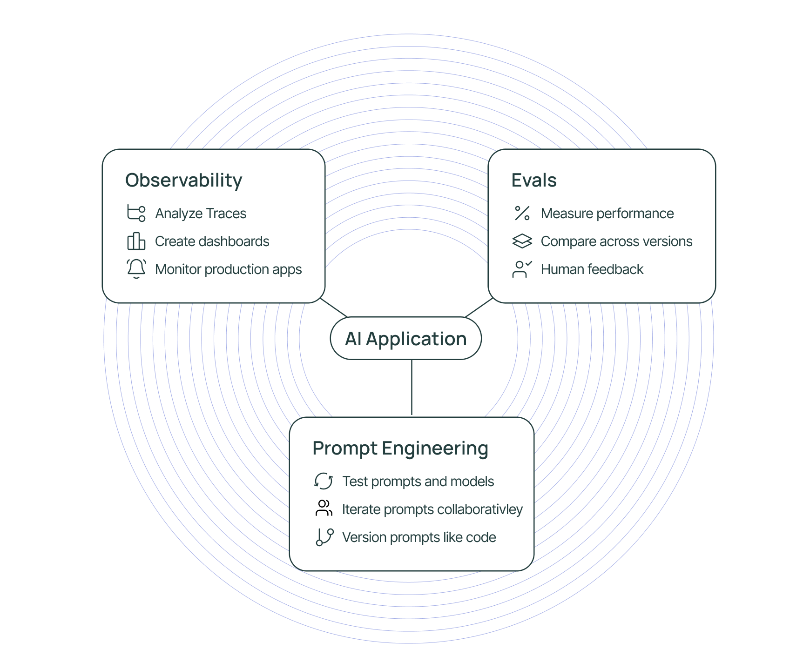

# LangSmith

## 监控（Observation）

LangSmith与LangChain/LangGraph无缝集成，不需要额外设置就可以自动监控LangChain 和 LangGraph 应用，而对于 **非 LangChain/LangGraph 框架的应用**，需要手动设置监控的内容。

### LangChain

核心监控对象是所有可以 `.invoke()` 或 `.run()` 的对象：

- **LLM**（`ChatOpenAI` 等）：输入输出、token消耗、请求延时
- **链（Chain）**（`LLMChain`、`AgentExecutor` 等）
- **工具（Tool）**
- **Agent（ReAct Agent 等）**

### LangGraph

核心监控对象主要集中在DAG结构上，追踪的是图的执行流程：

- **节点（Node）**：记录输入、输出、执行时间
- **边（Edge）**：记录执行路径，跟踪节点之间的数据流
- **可调用对象**：同样可以自动监控`.invoke()` 或 `.run()`的执行

### 非 LangChain/LangGraph 应用

-  **手动用 `@traceable` 标记** 需要监控的函数
- 对于openai（其他llm不支持），可以使用langsmith的包裹函数`llm = wrap_openai(openai.Client())`，这样可以自动追踪llm的输入输出、token消耗、请求延时

