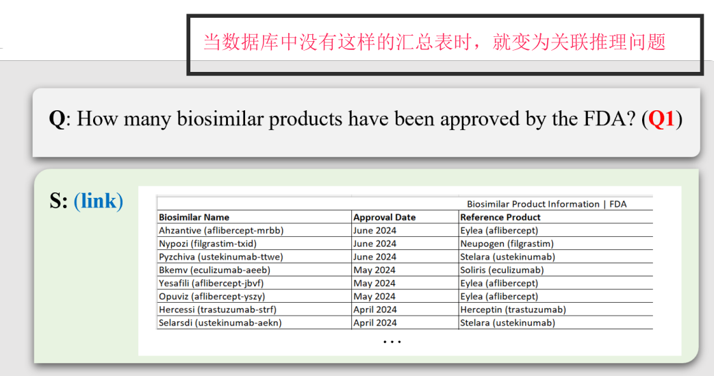
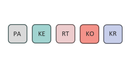
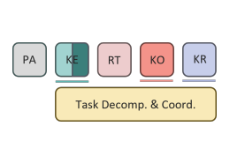
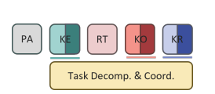
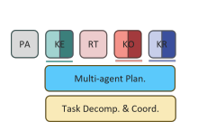
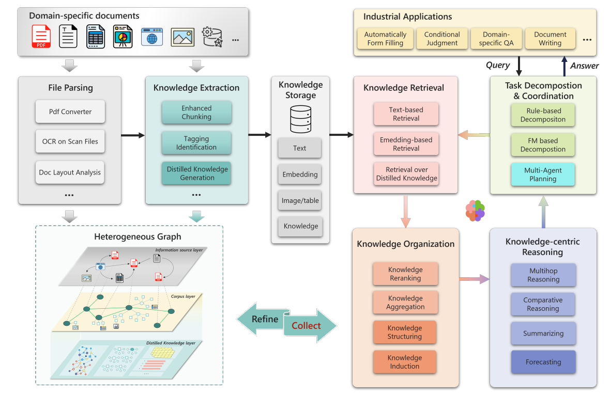
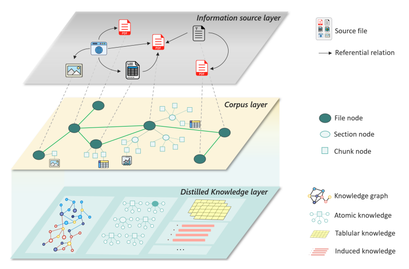

##  Task classification（问题分类）

> Page 5

1. **事实性问题 (Factual Questions)**
   - **定义**：这类问题要求获取原始语料中明确呈现的具体信息。答案往往直接可从数据中检索到。
   - **特点**：文本中有明确的事实陈述，利用文本的原文片段即可得到答案，无需跨文档推理。
   - **举例**：查询某产品的发布日期、某公司总部的位置等。

2. **链接推理问题 (Linkable-Reasoning Questions)**
   - **定义**：这类问题需要从多个来源中提取相关信息或经过多步推理才能得出答案。答案可能在不同文档中隐含分布，需要整合多部分信息。
   - **子分类**：
     - **桥接问题 (Bridging Questions)**：通过依次“桥接”多个实体来形成答案（跨多个实体的联系）。
     - **比较问题 (Comparative Questions)**：关注对两个或多个实体的指定属性进行比较。
     - **定量问题 (Quantitative Questions)**：需要对检索到的数据进行统计分析，如数量总和、平均值等。
     - **摘要问题 (Summarizing Questions)**：要求从多个文本或信息源中提取并综合出一个简明、连贯的摘要。
   - **特点**：解决这类问题通常需要中间处理步骤（如统计聚合或信息整合），使得查询不仅仅依赖单一文本源。

3. **预测问题 (Predictive Questions)**
   - **定义**：这类问题的答案不直接存在于原始文本中，而是需要基于已有事实进行归纳和预测。预测问题要求模型能够从数据中提取模式，并据此推测未来可能的趋势或结果。
   - **特点**：答案通常具有不唯一性，反映了预测任务本身的不确定性；需要组织和结构化相关数据（例如生成时间序列）以便进行预测。
   - **举例**：预测未来某一产品的市场走势或某项政策对经济的影响。

4. **创造性问题 (Creative Questions)**
   - **定义**：创造性问题要求从专业知识库中挖掘出有价值的、领域特定的逻辑，并引入创新的视角来改善现有解决方案。回答此类问题不仅依赖于事实信息，也要求具备创造性思维。
   - **特点**：回答的目标是启发LLM产生新的见解，而不是给出现成的解决方案；通常需要组织和整合多个阶段的信息，并评估可能的影响和结果。
   - **举例**：在特定技术领域中提出改进建议，或创新性地整合跨领域知识以开辟新的应用场景。

### **分类动态性**

问题的分类可能会随着知识库的变化而发生变化。例如，原本看似相似的问题可能因具体支持信息的不同而分别归类为事实性、可链接推理或预测问题。  

## RAG System Level

- 基于这种问题分类，PIKE-RAG框架将RAG系统能力分为四个等级(L1-L4)，每个等级对应处理不同类型问题的能力
- 四个等级之前还有一个L0层，表示知识库的构建
- **RAG系统迭代开发的方法论：**这种分层方法有助于RAG系统的阶段性开发，通过模块的迭代优化和算法改进逐步增强能力。我们的框架旨在提供一种标准化、客观的方法论，以有效满足各类行业场景的专业需求。
- 这种阶段性开发方法的一个重要特点是，**高级系统可以继承低级系统的模块**，并添加新模块来增强系统能力。

| Level | Capability                                           | Challeges                                                    | Proposed Framework                                           |
| ----- | ---------------------------------------------------- | ------------------------------------------------------------ | ------------------------------------------------------------ |
| L0    | 构建知识库/**多层异构图**                            | 多种格式文档的知识提取 原始异构数据的知识组织与集成      |  |
| L1    | 能够准确回答事实型问题                               | 不当分块导致的语义破坏 专业术语和别名对齐问题            |  |
| L2    | 能够处理事实型和关联推理型问题                       | 对知识的高质量/精准抽取 知识感知的任务分解与推理路径规划 |  |
| L3    | 在L2基础上，能够对预测型问题给出合理预测             | 知识的收集与组织 LLM在专有领域逻辑推理的缺陷             |  |
| L4    | 在L3基础上，能够为创新型问题提出合理的计划或解决方案 | 复杂知识库上进行连贯的推理（多样性） 开放性问题的答案难以评估 |  |

> - "PA" for file parsing, "KE" for knowledge extraction, "RT" for knowledge retrieval, "KO" for knowledge organization, and "KR" for knowledge-centric reasoning.
> - 深色表示组件中添加了更高级的模块，对应系统架构图中的深色部分

### 系统架构图

# 实现细节

## L0

