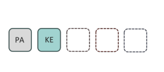
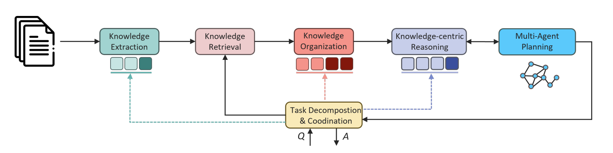
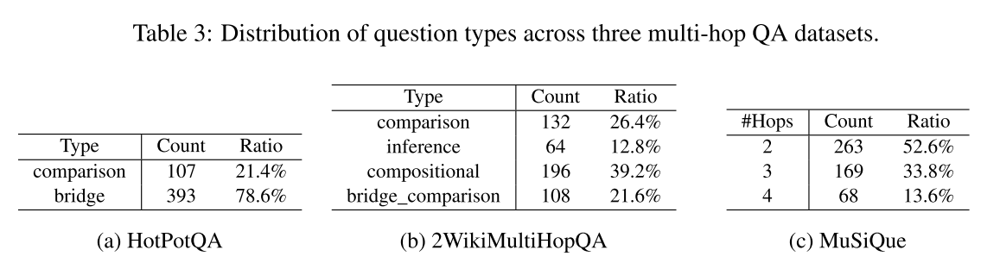
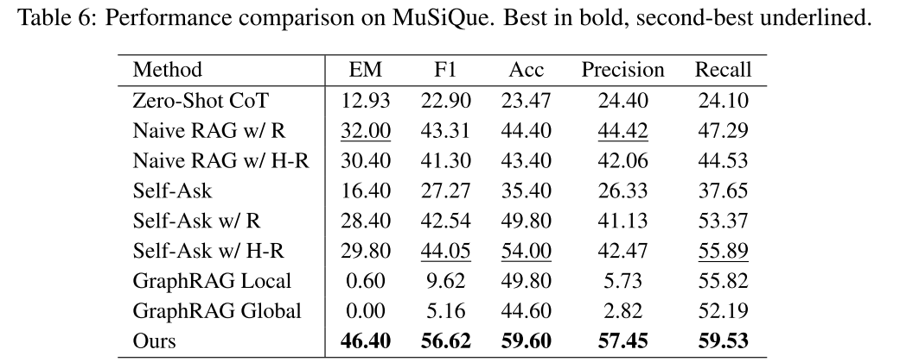

# Introduction

## PIKE-RAG

s**P**ec**I**alized **K**nowledg**E** and **R**ationale **A**ugmented **G**eneration

**专业知识与逻辑增强生成**


## RAG 系统面临的挑战

### Knowledge source diversity

- 工业场景下RAG系统需要处理的数据会涉及到多种格式：like scanned images, digital text files, and web data, sometimes accompanied by special-ized databases
- 现有的测试数据集则是较为简单的、结构化的语料，不能反应现实世界中数据的复杂性
- 现存RAG方法也许在这些测试集上表现良好，但是也不能在工业场景下高效地提取专业知识、进行深层次的推理

### Domain specialization deficit（专业性缺陷）

- 在工业应用中，RAG系统本应充分利用专业领域的知识体系和逻辑依据。
- 然而，这些专业知识通常由领域专有术语、专家经验及独特的逻辑框架构成，是其功能实现的核心要素。
- 由于LLM在提取、理解和组织领域特定知识及逻辑关系方面存在显著不足，因此很难基于这样复杂的专业数据库进行复杂推理。

### One-size-fits-all

- 不同的工业应用中，需求不同，对**RAG系统的能力**要求不同
- 甚至同一个应用中在不同场景下**用户问题的难度与聚焦的重点**也在变化
- 现存 RAG 方法采用一套方法来应对所有问题，使得 RAG 不能保证任何时候回答的准确性都足够高（因为 RAG 系统的能力有偏重）


## 核心贡献/核心技术点

> Existing research mainly concentrates on algorithmic enhancements to improve the performance of RAG systems. However, there is limited effort in providing a comprehensive and systematic discussion of the RAG framework. In this work, we conceptualize the RAG framework from three key perspectives: knowledge base, task classification, and system development. 

PIKE-RAG 以一种系统性的视角来审视 RAG 框架，并且从下面三部分提出了自己的创新：

### 知识库

PIKE-RAG认为拥有一个全面的知识库是在构建良好工业 RAG 应用的基础，而且知识库的架构和质量直接影响到 RAG 检索的效果。

1. 论文提出了一种**多层异构图**，采用了新的方式来提取、组织和理解知识。
2. 论文引入了**知识原子化**（Knowledge Atomizing）技术，这是一种将复杂知识分解为可组合的原子单元的方法。传统RAG系统通常将文档分块后直接按语义进行检索，但是语义近的块往往不一定能够回答用户问题，而语义远的块也不一样顶不能回答用户问题。也就是说 RAG 系统其实没有办法感知每个块中到底包含哪些知识。知识原子化技术通过自动生成与每个文档块相关的原子问题标签，使系统能够更精确地定位所需信息。这就像是将一本厚重的法律教科书拆分成一张张知识卡片，卡片的正面是**问题**，背面是**包含解答问题所需信息的文本段落**。


### 任务分类

1. 论文提出了一种**问题分类体系**，将问题按照难度和复杂性分为四类：事实型问题、关联推理型问题、预测型问题和创新型问题。这种分类方法使得系统可以针对不同类型的问题采用不同的处理策略，而不是"一刀切"地应用相同的检索和生成方法。
2. 论文提出了**知识感知任务分解**（Knowledge-Aware Task Decomposition）机制，该机制能够根据知识库中可用的信息动态地将复杂问题分解为一系列子问题。与传统的任务分解方法不同，PIKE-RAG的分解过程会考虑知识库中已有的信息，避免生成无法回答的子问题。这就像是一个经验丰富的研究员，他不仅知道如何拆分复杂问题，还清楚哪些资源是可用的，从而制定出最有效的研究路径。
3. 论文还提出了一种**可训练的知识感知分解器**，通过收集基于推理的数据并创建多样化的交互轨迹，将领域特定的推理逻辑融入到任务分解和结果寻找过程中。这使得系统能够学习并适应不同领域的推理模式。

### 系统开发

论文设计了一个新的系统框架，根据回答不同难度问题所需的能力差异，把 RAG 系统分为了四个 level，让我们可以一步步优化和提升 RAG 系统的能力。


# Methodology

##  Task classification（问题分类）

### 问题分类的依据

- **Relevance and Completeness of Knowledge**: The extent to which the necessary information is present within the knowledge base and how comprehensively it covers the topic.
- **Complexity of Knowledge Extraction**: The difficulty in accurately identifying and retrieving all relevant pieces of knowledge, especially when scattered across multiple sources or implicitly embedded in the text.
- **Depth of Understanding and Reasoning**: The level of cognitive and inferential processing required to comprehend the retrieved information, establish connections, and perform multi-step reasoning.
- **Effectiveness of Knowledge Utilization**: The sophistication involved in applying the extracted knowledge to formulate responses, including synthesizing, organizing, and generating insights or predictions.

### 四种问题类型

| 问题类型                                        | 定义                                                         | 所需能力                              | 示例问题                                       | 推理路径                   |
| ----------------------------------------------- | ------------------------------------------------------------ | ------------------------------------- | ---------------------------------------------- | -------------------------- |
| **事实性问题 (Factual Questions)**              | 这类问题要求获取原始语料中明确呈现的具体信息。答案往往直接可从数据中检索到。 | 直接从文档中提取明确信息。            | 苹果公司第一款 iPhone 的发布日期是什么？       | 检索单条信息               |
| **链接推理问题 (Linkable‑Reasoning Questions)** | 这类问题需要从多个来源中提取相关信息或经过多步推理才能得出答案。答案可能在不同文档中隐含分布，需要整合多部分信息。 | 跨文档检索、信息整合、多步推理。      | 比较特斯拉和丰田在 2022 年的全球销量哪个更高？ | 检索多条信息+比较分析      |
| **预测问题 (Predictive Questions)**             | 这类问题的答案不直接存在于原始文本中，而是需要基于已有事实进行归纳和预测。预测问题要求模型能够从数据中提取模式，并据此推测未来可能的趋势或结果。 | 归纳推理、数据分析、预测。            | 预计未来三年全球电动汽车保有量将增长多少？     | 检索多条信息+统计分析+预测 |
| **创造性问题 (Creative Questions)**             | 创造性问题要求从专业知识库中挖掘出有价值的、领域特定的逻辑，并引入创新的视角来改善现有解决方案。回答此类问题不仅依赖于事实信息，也要求具备创造性思维。 | LLM多角度创造性思考、综合多阶段信息。 | 如何设计一种低成本、家用且零碳排放的暖气系统？ | 多agent+复杂检索+复杂推理  |

#### 关联推理问题子分类

​     **桥接问题 (Bridging Questions)**：通过依次“桥接”多个实体来形成答案（跨多个实体的联系）。

​     **比较问题 (Comparative Questions)**：关注对两个或多个实体的指定属性进行比较。

​     **数量问题 (Quantitative Questions)**：需要对检索到的数据进行统计分析，如数量总和、平均值等。

​     **摘要问题 (Summarizing Questions)**：要求从多个文本或信息源中提取并综合出一个简明、连贯的摘要。


### **分类动态性**

问题的分类可能会随着知识库的变化而发生变化。例如，原本看似相似的问题可能因具体支持信息的不同而分别归类为事实性、可链接推理或预测问题。  


## RAG System Level / Phased System Development

- 基于上述问题分类，PIKE-RAG框架将RAG系统能力分为四个等级(L1-L4)，每个等级对应处理不同类型问题的能力
- 四个等级之前还有一个L0层，表示知识库的构建
- **RAG系统迭代开发的方法论：**这种分层方法有助于RAG系统的阶段性开发，通过模块的迭代优化和算法改进逐步增强能力。我们的框架旨在提供一种标准化、客观的方法论，以有效满足各类行业场景的专业需求。
- 这种阶段性开发方法的一个重要特点是，**高级系统可以继承低级系统的模块**，并添加新模块来增强系统能力。

### 分层系统架构

- "PA" for file parsing, "KE" for knowledge extraction, "RT" for knowledge retrieval, "KO" for knowledge organization, and "KR" for knowledge-centric reasoning.
- 深色表示组件中添加了更高级的模块，对应系统架构图中的深色部分

| Level | Capability                                           | Challeges                                                    | Proposed Framework                                           |
| ----- | ---------------------------------------------------- | ------------------------------------------------------------ | ------------------------------------------------------------ |
| L0    | 构建知识库/**多层异构图**                            | 多种格式文档的知识提取<br/>原始异构数据的知识组织与集成      |  |
| L1    | 能够准确回答事实型问题                               | 不当分块导致的语义破坏<br/>专业术语和别名对齐问题            |  |
| L2    | 能够处理事实型和关联推理型问题                       | 对知识的高质量/精准抽取<br/>知识感知的任务分解与推理路径规划 |  |
| L3    | 在L2基础上，能够对预测型问题给出合理预测             | 知识的收集与组织<br/>LLM在专有领域逻辑推理的缺陷             |  |
| L4    | 在L3基础上，能够为创新型问题提出合理的计划或解决方案 | 复杂知识库上进行连贯的推理（多样性）<br/>开放性问题的答案难以评估 |  |

### 划分多层级系统的好处

<strong style="color: rgb(0, 150, 136);"><span leaf="">风险管理</span></strong><span leaf="">：可以先实现基础功能，验证系统的可行性，然后再逐步添加更复杂的功能，降低开发风险。</span>

<strong style="color: rgb(0, 150, 136);"><span leaf="">资源优化</span></strong><span leaf="">：可以根据实际需求和资源情况，决定系统开发到哪个等级，避免资源浪费。</span>

<strong style="color: rgb(0, 150, 136);"><span leaf="">迭代优化</span></strong><span leaf="">：每个阶段都可以进行充分的测试和优化，确保系统的稳定性和性能。</span>

<strong style="color: rgb(0, 150, 136);"><span leaf="">灵活适配</span></strong><span leaf="">：不同的应用场景可能需要不同等级的系统能力，这种分级方法可以灵活适配各种需求。</span>

### 系统架构图


# 实现细节

## L0


### 1. 文件解析

- LangChain的 NLP工具
- 基于深度学习的工具和一些云端的商用API，对扫描文档OCR识别
- VLM进行图片内容提取
- **布局分析 & 结构保留**：对文档进行布局分析，在最终chunk中保留文档结构信息（例如一级标题、二级标题、图片描述等）。对多模态信息保留独立、完整的信息，例如图片信息会作为单独的chunk保存，不会填充回原图片所在位置（如上图语料层所示）。这些都是为了对原文档进行精准的语义分割。

---

#### langchain的NER

LangChain 提供了一个简洁的 `ner()` 方法，可以直接对文本进行实体识别。例如：

```python
from langchain import LangChain

lc = LangChain()
text = "Microsoft is acquiring Nuance Communications for $19.7 billion."
entities = lc.ner(text)
print(entities)
```

该方法会返回一个包含实体及其类别的列表，如：

```python
[('Microsoft', 'ORG'), ('Nuance Communications', 'ORG'), ('$19.7 billion', 'MONEY')]
```

### 2. 知识组织

PIKE-RAG框架提出了一种**多层异构图**结构来组织知识库，这种结构就像一个精心设计的图书馆系统，不仅有书架和书籍，还有专门的知识卡片索引。具体来说，这个知识库分为三个层次：

1. **信息源层(Information Resource Layer)** - 存储原始文档及其引用关系。这一层捕捉了多样化的信息源（文档、表格、图片、视频、网页、数据库），将它们作为源节点，边表示它们之间的引用关系。这种结构有助于交叉引用和上下文化知识，为依赖多个来源的推理建立基础。
2. **语料层(Corpus Layer)** - 将解析后的信息组织成章节和块，同时保留文档的原始层次结构（工业化场景中涉及的信息源数目巨大，因此信息源之间的关系结构变得相当重要）。这一层支持不同粒度的知识提取，实现准确的语义分块和跨多种内容类型的检索。
3. **知识提炼层(Distilled Knowledge Layer)** - 相当于知识库的知识卡片系统，将语料进一步提炼为结构化的知识形式（如知识图谱、原子知识和表格知识）。这个过程由命名实体识别(NER)和关系提取等技术驱动，确保提炼的知识捕捉关键的逻辑关系和实体，支持高级推理过程。

#### 知识提炼层的三种粒度

- **Knowledge graph**: Entities and their relationships are extracted from the corpus text using LLMs, generating knowledge units in form of "node-edge-node" structure, where nodes represent entities and edges represent the relationships between them. All knowledge units are then integrated to construct a graph.
- **Atomic knowledge**: The corpus text is partitioned into a set of atomic statements, which are considered as knowledge units. By combining these atomic statements with the relationships between corpus nodes, atomic knowledge is generated.（**原子陈述**这里应该是**原子问题**）
- **Tabular knowledge**: Entity pairs with specified types and relationships are extracted from corpus text. These entity pairs are treated as knowledge units and can be combined to construct tabular knowledge.


## L1 - 事实性问题


The primary challenges at this level are semantic alignment and chunking. The abundance of professional terminology and aliases can affect the accuracy of chunk retrieval, and unreasonable chunking can disrupt semantic coherence and introduce noise interference.

### Enhanced chunking

In our system, each chunk serves dual purposes: 

- (i) it becomes **a unit of information** that is vectorized and stored in a database for retrieval
- (ii) it acts as a **source** for further knowledge extraction and information summarization. 

**Improper chunking** not only fails to ensures that text vectors encapsulate the necessary semantic information, but also hinders knowledge extraction based on complete context.  


- chunk摘要会和chunk一起存放
- 算法会动态地根据文本的内容和结构调整chunk的大小


### Auto-tagging

在专业领域的场景中，语料通常都是正式的、专业的、有严谨表述的内容，但是用户的问题通常都是偏口语化。

For instance, in medical question-answering (medQA) tasks ,
symptoms of diseases described in the questions are generally phrased in simple, conversational
terms. In contrast, the corresponding medical knowledge within the corpus is often expressed using
specialized professional terminology. This discrepancy introduces a **domain gap** that adversely affects
the accuracy of chunk retrieval, especially given the limitations of the embedding models employed for this purpose.

自动标签技术主要解决的就是这个 **domain gap** 也就是**query口语表达到知识库专业表达的对齐**。


### Multi-Granularity Retrieval

- For each layer of the graph, both queries Q and graph node are transformed into **high-dimensional vector embeddings** for similarity evaluation.

- The final chunk similarity score S is obtained by **aggregating the scores from other layers and nodes**.

#### 检索流程（I guess）

1. 用户输入问题 Q
2. 信息源层检索相关的 top-k 信息源
3. 语料层检索每个信息源中相关的 top-k‘ 语料块
4. 通过上面两步可以初步筛选出对于问题 Q 可能有用的语料块，然后再进行基于多层异构图的打分操作


## L2 - 关联推理型问题


### Knowledge Atomizing

- **背景**：Recent studies have focused on extracting triple knowledge units from chunked text and constructing knowledge graphs to facilitate efficient information retrieval (GraphRAG). However, the construction of knowledge graphs is **costly**, and the inherent knowledge may **not always be fully explored**. To better present the knowledge embedded the documents, we propose atomizing the original documents in Knowledge Extraction phase, a process we refer as Knowledge Atomizing. 

- 知识原子化流程：1）把文档块输入给 LLM， 让其生成尽可能多的这个文档块能回答的问题，也就是原子问题；2）原子问题和文档块存放在一起，检索时用户可以方便地根据原子问题找到关联的 chunk

> Page 17  Figure 10(c)

#### 两种提取知识的方法


### Knowledge-Aware Task Decomposition

> Page 17   Figure 10(d)

- **背景**：Industrial tasks often necessitate multiple pieces of knowledge, implicitly requiring the capability to decompose the original question into several sequential or parallel atomic questions. We refer to this operation as Task Decomposition.

-  In our experiment, we use cosine similarity of their corresponding embeddings to retrieve all top-K atomic questions, provided their similarity to a proposed atomic question is **greater than or equal to a given threshold δ**. （threshold的设置意味着，如果没有足够相似的原子问题，则知识库中没有能够用来回答问题的知识）


---

### **可训练的知识感知分解器**

更进一步，PIKE-RAG还提出了一种**可训练的知识感知分解器**。这个分解器可以通过学习来直接建议原子查询，从而减少推理时间和计算成本。训练过程包括：

1. **数据收集**：通过采样上下文和创建多样化的交互轨迹收集数据
2. **轨迹评估**：评估每个分解轨迹产生的答案质量
3. **分解器训练**：使用成功的分解轨迹训练分解器


## L3 - 预测型问题


## L4 - 创新型问题



L4 系统的实现特点在于整合了多代理系统，以促进多视角思考。

- **功能需求**：应对创造性问题需要基于事实信息以及对底层原理和规则的理解进行创造性思考。
- **主要挑战**：从检索到的知识中提取连贯的逻辑推理、应对涉及众多影响因素的复杂推理过程，以及评估对创造性、开放性问题回答的质量。
- **具体实现**：系统通过协调多个代理，每个代理贡献独特的见解和推理策略。这些代理并行运行，综合各自的思维过程以生成全面且连贯的解决方案。
- **实现效果**：多个代理的协调输出不仅丰富了推理过程，同时为用户提供了全面的视角，促进了创造性思考，并激发出解决复杂问题的新颖方案。


# 测评

## 测试集

以下是 HotpotQA、2WikiMultihopQA 和 MuSiQue 三个多跳问答（Multi-hop QA）测试集的对比表格，涵盖其数据来源、主要特点以及在 RAG 系统评估中的侧重点：

| 测试集名称          | 数据来源与构建方式                                           | 主要特点                                                     | 测评侧重的 RAG 能力                                          |
| ------------------- | ------------------------------------------------------------ | ------------------------------------------------------------ | ------------------------------------------------------------ |
| **HotpotQA**        | 基于英文维基百科，包含约 113K 个由众包工人构建的问题，每个问题关联两个需要联合推理的段落，并提供句级支持事实。 | 问题多样，涵盖桥接推理（bridge）和比较推理（comparison）等类型；提供句级支持事实，便于模型进行可解释性训练；设有“干扰段落”模式，增加检索难度。 | 评估模型的多跳推理能力、信息整合能力以及对支持事实的识别与利用能力。 |
| **2WikiMultihopQA** | 结合维基百科和维基数据，利用逻辑规则和模板生成问题，确保需要多跳推理；每个问题配有完整的推理路径作为证据信息。 | 问题设计严格，确保真正需要多跳推理；提供详细的推理路径，便于评估模型的推理过程；减少了通过捷径解题的可能性，提高了评估的严谨性。 | 评估模型的系统性推理能力、对复杂推理路径的理解与执行能力，以及在减少信息泄露情况下的检索与生成能力。 |
| **MuSiQue**         | 通过组合单跳问题生成多跳问题，确保每个推理步骤之间有紧密的逻辑关联；引入不可回答的问题以增加挑战性。 | 问题涵盖 2 至 4 跳推理，设计上防止通过捷径解题；每个问题配有 20 个段落，包含大量干扰信息，增加检索难度；引入不可回答的问题，考察模型的判断能力。 | 评估模型在复杂、多跳推理场景下的检索准确性、推理连贯性以及对不可回答问题的识别与处理能力。 |

这些测试集各有侧重，HotpotQA 强调多样性和可解释性，2WikiMultihopQA 注重系统性和推理路径的完整性，MuSiQue 则在复杂性和挑战性上更进一步，特别适合评估 RAG 系统在真实世界复杂问答场景中的表现。


## 测试指标

在评估 Retrieval-Augmented Generation（RAG）系统的性能时，常用以下五个指标来衡量其回答质量和检索效果：

------

### 1. EM（Exact Match，精确匹配）

- **定义**：EM 衡量模型生成的答案是否与参考答案完全一致。
- **适用场景**：适用于答案具有唯一标准的任务，如问答系统中的事实性问题。
- **示例**：如果参考答案是“Seattle”，而模型生成的是“Seattle”，则 EM = 1；如果生成的是“Seattle, WA”，则 EM = 0。

------

### 2. F1 Score（F1 分数）

- **定义**：F1 分数是精确率（Precision）和召回率（Recall）的调和平均值，公式为：

  F1 = 2 × (Precision × Recall) / (Precision + Recall)

- **适用场景**：适用于答案可能有多个正确表达的任务，如开放式问答。

- **示例**：如果参考答案是“Barack Obama”，模型生成的是“Obama”，则可能部分匹配，F1 分数介于 0 和 1 之间，具体取决于重叠的词汇。

------

### 3. Accuracy（准确率）

- **定义**：Accuracy 衡量模型预测正确的样本数占总样本数的比例，公式为：

  Accuracy = (TP + TN) / (TP + TN + FP + FN)

  其中，TP：真正例，TN：真反例，FP：假正例，FN：假反例。

- **适用场景**：适用于分类任务，如判断答案是否正确。

- **示例**：如果模型在 100 个问题中正确回答了 85 个问题，则 Accuracy = 85%。

------

### 4. Precision（精确率）

- **定义**：Precision 衡量模型预测为正类的样本中实际为正类的比例，公式为：

  Precision = TP / (TP + FP)

- **适用场景**：适用于对错误预测代价较高的任务，如医疗诊断。

- **示例**：如果模型预测有 50 个答案为正确，其中实际正确的有 40 个，则 Precision = 80%。

------

### 5. Recall（召回率）

- **定义**：Recall 衡量实际为正类的样本中被模型正确预测为正类的比例，公式为：

  Recall = TP / (TP + FN)

- **适用场景**：适用于对漏检代价较高的任务，如安全监控。

- **示例**：如果实际有 60 个正确答案，模型正确预测了其中的 45 个，则 Recall = 75%。

## 测试结果




