# 神经网络：全连接网络

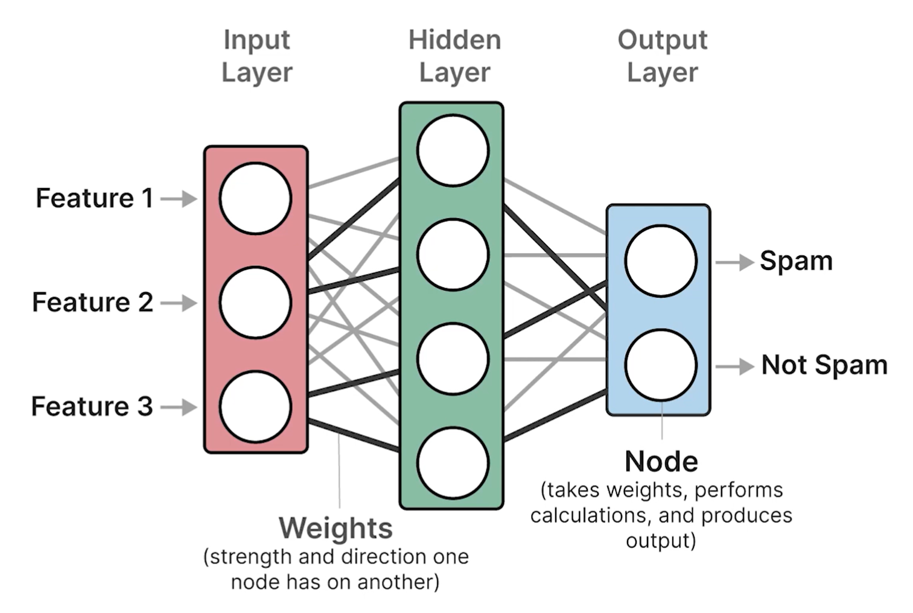

## 工作原理

神经网络工作的底层原理，其实就两个过程：

1. **前向传播 (Forward Propagation):** 也就是 **“推理”** (Inference)。数据从左进去，经过计算，从右边出来。
2. **反向传播 (Back Propagation):** 也就是 **“训练”** (Training)。根据结果对不对，反过来修改中间的参数。

我们重点看图里发生了什么（也就是 **前向传播**），只要看懂**一个节点（Node）**是怎么工作的，整个网络你就懂了。

------

### 1. 核心逻辑：一个节点内部发生了什么？

请盯着中间绿色那一列（Hidden Layer）最上面的那个圆圈（Node）。

数据从左边红色的层传给它。

作为一个程序员，你可以把这个**圆圈**看作一个**函数 `f(x)`**。它只做两件极简单的事：

#### 第一步：加权求和 (Weighted Sum)

这是线性的部分。

假设左边的输入是 $x$（Feature 1, 2, 3），连线上的权重是 $w$。

这个圆圈首先执行这行代码：

```Python
# 这是一个点积运算
sum_value = (Feature1 * Weight1) + (Feature2 * Weight2) + (Feature3 * Weight3) + Bias
```

- **直觉理解：** 这就是在**打分**。
  - Weight（权重）大，说明对应的 Feature（特征）说话分量重。
  - Weight 是负的，说明对应的 Feature 是起反作用的。
  - 这一步算出的是一个总得分。

#### 第二步：激活函数 (Activation Function) —— 关键！

> [激活函数详解与种类介绍](https://www.bilibili.com/video/BV1Jy4y187Ez?spm_id_from=333.788.videopod.sections&vd_source=8205edcb8d5d68d6331e9295bb6ccde9)

这是非线性的部分。

刚才算出的 sum_value 可能是一个范围很大的数字（比如 -5000 到 +5000）。

圆圈里还有一个机制，叫激活函数（图上没画，但它就在圆圈里）。最常见的是 Sigmoid 或 ReLU。

你可以把它理解为一个**过滤器**或**开关**：

```Python
# 伪代码：激活函数
def activation(sum_value):
    # 如果总分小于0，直接归零（不激活）；如果大于0，保持原样。
    # (这是 ReLU 函数的逻辑，也是现在最常用的)
    if sum_value < 0:
        return 0
    else:
        return sum_value

output_of_node = activation(sum_value)
```

- **直觉理解：** 就像大脑神经元，刺激不够就不放电。或者像写代码里的 `if` 逻辑。
- **为什么这一步至关重要？** 如果没有这个非线性的“开关”，无论你堆多少层网络，本质上都只是一次简单的线性乘法。有了这个开关，神经网络才能处理复杂的任务（比如理解“虽然……但是……”这种转折逻辑）。

**总结：** 图中绿色的每一个圆圈，都在疯狂地做这件事：**收数据 -> 加权求和 -> 激活(过滤) -> 发给下一层**。

------

### 2. 宏观视角：整个网络怎么协作？

现在把视野拉远。

1. **Input Layer (红):** 接收原始数据（比如 [1, 0, 1]）。
2. **Hidden Layer (绿):**
   - 这一层的4个圆圈，每一个都有一组自己独立的 **Weights**（虽然连线看起来乱，但每根线都有自己的编号）。
   - 这意味着：**每个圆圈都在从不同的角度“审视”输入数据。**
   - *圆圈1* 可能学会了关注“是否有折扣”；*圆圈2* 可能学会了关注“是否是VIP”。
   - 它们并行计算，输出4个处理后的新数字。
3. **Output Layer (蓝):**
   - 接收绿色层吐出来的4个数字。
   - 再次进行 **加权求和 + 激活**。
   - 最终输出两个概率值（比如 Spam: 0.8, Not Spam: 0.2）。

------

### 3. 所谓的“训练”是在干什么？

> [神经网络反向传播讲解](https://www.bilibili.com/video/BV12b4y1X7Wv?spm_id_from=333.788.videopod.sections&vd_source=8205edcb8d5d68d6331e9295bb6ccde9)

你作为 CS 研究生，肯定写过有很多 `const` 常量或配置项的代码。

- 初始状态：

  一开始，图里所有的黑线（Weights），也就是那些参数，是随机生成的数字。

  也就是说，模型一开始是个傻子，它是乱猜的。

- **训练循环 (The Loop)：**

  1. **Forward:** 把数据扔进去，它瞎算了一个结果（比如本来是垃圾邮件，它说是正常邮件）。
  2. **Loss (误差):** 算一下如果不改，我们错得有多离谱（Loss Function）。
  3. **Backward (反向传播):** 这是数学上的“链式法则”（Chain Rule），但逻辑很简单——**谁锅大，谁整改。**
     - 计算机会从右往左算：为了减少这个误差，哪根线的权重需要变大一点？哪根需要变小一点？
     - 然后微调所有的权重。

- 收敛：

  这个循环跑上亿次（Epochs），直到所有的权重（Weight）都调整到了一个完美的状态，无论扔什么数据进去，它都能算出正确结果。

## 线性 - [激活函数] -> 非线性

### 1. 核心定义：什么是线性变换？

在线性代数中，一个变换 $T$ 必须同时满足以下两个性质，才能被称为**线性变换 (Linear Transformation)**：

1. **齐次性 (Homogeneity):** $T(ax) = aT(x)$
2. **可加性 (Additivity):** $T(x + y) = T(x) + T(y)$

---

### 2. 为什么单层线性网络本质是“矩阵乘法”？

回看刚才那张图，左边 Input Layer 有 3 个圆圈（特征），中间 Hidden Layer 有 4 个圆圈。由于是“全连接”，这就意味着有 $3 \times 4 = 12$ 根连线。

如果你写代码（Go 或 Python）来算这个过程，最笨的方法是写双重循环：

```python
# 笨办法：手动算每根线
inputs = [x1, x2, x3]
hidden_nodes = [0, 0, 0, 0]
weights = [[w11, w12, w13, w14], [w21...], [w31...]] # 一个 3x4 的二维数组

for i in range(3):      # 遍历输入
    for j in range(4):  # 遍历输出节点
        hidden_nodes[j] += inputs[i] * weights[i][j]
```

但在数学上，这完全等价于：

$$[1 \times 3]向量 \cdot [3 \times 4]矩阵 = [1 \times 4]向量$$

**为什么说本质是矩阵乘法？**

1. **表示效率：** 图中那些乱七八糟的连线（权重），存成数据结构就是一个**矩阵（二维数组）**。
2. **并行计算（GPU）：** CPU 擅长逻辑控制（Loop），但 GPU 擅长一件事——**一次性把这几千个乘法加法全做完**。它不跑 Loop，它直接做矩阵运算。

所以，

1. **神经网络的“层”，在数学形式上就是一个大矩阵。**
2. 同时计算发现，神经网络中单纯的“权重矩阵乘法” **$y = xW$ 完全满足*可加性和齐次性*，因此它是一个纯粹的线性变换**。

---

### 3. 问题的提出：多层线性网络的“塌缩”现象

假设我们搭建一个 $n$ 层的神经网络，且**不使用**激活函数。

设输入向量 $x$ 的维度为 $[1 \times D_{in}]$。

每一层的权重矩阵为 $W_i$。

- 第一层计算：

  $$h_1 = x \cdot W_1$$

- 第二层计算：

  $$h_2 = h_1 \cdot W_2 = (x \cdot W_1) \cdot W_2$$

- **...**

- 第 $n$ 层计算：

  $$y = x \cdot W_1 \cdot W_2 \cdot \dots \cdot W_n$$

根据矩阵乘法的结合律，我们可以预先计算所有权重矩阵的乘积：

$$W_{total} = W_1 \cdot W_2 \cdot \dots \cdot W_n$$

于是，整个网络等价于：

$$y = x \cdot W_{total}$$

> 推导结论：
>
> 无论中间堆叠了多少层线性隐层，在数学上它们都可以被合并（Collapse）为一个单一的线性变换矩阵 $W_{total}$。
>
> 这意味着：没有激活函数的深层网络，其表达能力等同于单层感知机（Single Layer Perceptron），无法发挥“深度”的特征提取能力。

---

### 4. 解决方案：激活函数引入非线性

激活函数（记作 $\sigma$）的作用，是对线性变换的结果进行一个非线性的映射。

此时，每一层的计算不再是单纯的矩阵相乘，而是变成了**复合函数**。

- 第一层输出：

  $$h_1 = \sigma(x \cdot W_1)$$

  (注：这里的 $\sigma$ 是 Element-wise 操作，即对向量中的每个元素单独应用函数)

- 第二层输出：

  $$h_2 = \sigma(h_1 \cdot W_2) = \sigma(\sigma(x \cdot W_1) \cdot W_2)$$

关键点解析：

由于 $\sigma$ 是非线性函数（如 ReLU, Sigmoid），它破坏了矩阵乘法的结合律。即：

$$\sigma(x \cdot W_1) \cdot W_2 \neq x \cdot (W_1 \cdot W_2)$$

---

### 5. 总结

1. **线性变换的局限：** 多个线性变换的叠加仍然是线性变换。这导致模型无法拟合非线性关系（如逻辑异或 XOR、复杂的语言逻辑边界）。
2. **激活函数的本质：** 它在每一层之间插入了一个非线性“扭曲”或“折叠”。
3. **深度的意义：** 正是因为有了激活函数，层与层之间才不能合并。每一层都在前一层扭曲的基础上继续变换空间，从而让神经网络能够逼近任意复杂的函数（万能逼近定理）。


## 模型训练：反向传播参数调整法

**反向传播 (Back Propagation, BP)** 本质上就是**微积分中的“链式法则” (Chain Rule)** 在计算图上的递归应用。

它的核心目的只有一个：**算出损失函数 $L$ 对每一个参数 $W$ 的偏导数（即梯度）**。有了梯度，我们也就知道该把参数往哪个方向调，以及调多少。

我们用一个最简化的神经网络模型（单层、单神经元）来推导这个过程。

------

### 1. 场景设定 (Setup)

假设我们有一个极简的神经网络路径：

$$x \xrightarrow{w, b} z \xrightarrow{\sigma} a \xrightarrow{Loss} L$$

**变量定义：**

- $x$: 输入值 (Input)
- $w$: 权重 (Weight, **这是我们要调整的参数**)
- $b$: 偏置 (Bias, **这也是我们要调整的参数**)
- $z$: 线性计算结果 ($z = w \cdot x + b$)
- $\sigma$: 激活函数 (例如 Sigmoid 或 ReLU)
- $a$: 激活后的输出 ($a = \sigma(z)$)
- $y$: 真实标签 (Ground Truth)
- $L$: 损失函数 (Loss Function, 例如均方误差 MSE)

------

### 2. 第一阶段：前向传播 (Forward Pass)

**算出当前的预测结果和误差。**

1. 线性运算：

   $$z = w \cdot x + b$$

2. 激活运算：

   $$a = \sigma(z)$$

3. 计算损失 (MSE)：

   $$L = \frac{1}{2}(a - y)^2$$

此时，我们得到了 $L$（比如 0.5）。我们的目标是调节 $w$ 和 $b$ 让 $L$ 变小。

------

### 3. 第二阶段：反向传播 (Backward Pass)

**核心：利用链式法则计算梯度。**

我们要问的问题是：如果 $w$ 稍微变大一点点 ($\partial w$)，Loss 会变大还是变小？变多少？

即求：$\frac{\partial L}{\partial w}$

由于 $L$ 是 $a$ 的函数，$a$ 是 $z$ 的函数，$z$ 是 $w$ 的函数，根据链式法则：

$$\frac{\partial L}{\partial w} = \frac{\partial L}{\partial a} \cdot \frac{\partial a}{\partial z} \cdot \frac{\partial z}{\partial w}$$

我们需要像剥洋葱一样，从后往前把这一串乘积算出来。

#### **Step 1: 损失对输出的导数 ($\frac{\partial L}{\partial a}$)**

对 $L = \frac{1}{2}(a - y)^2$ 求导：

$$\frac{\partial L}{\partial a} = 2 \cdot \frac{1}{2}(a - y) \cdot 1 = (a - y)$$

(这一项通常被称为 "Error Term" 或残差)

#### **Step 2: 输出对中间值的导数 ($\frac{\partial a}{\partial z}$)**

对激活函数 $a = \sigma(z)$ 求导。

假设 $\sigma$ 是 Sigmoid 函数，其导数性质为 $\sigma'(z) = \sigma(z)(1-\sigma(z))$。

$$\frac{\partial a}{\partial z} = \sigma'(z)$$

#### **Step 3: 中间值对权重的导数 ($\frac{\partial z}{\partial w}$)**

对 $z = w \cdot x + b$ 求关于 $w$ 的偏导：

$$\frac{\partial z}{\partial w} = x$$

#### **汇总：权重的梯度**

将上面三项乘起来，我们就得到了 $w$ 的梯度：

$$\nabla_w = \frac{\partial L}{\partial w} = \underbrace{(a - y)}_{\text{误差}} \cdot \underbrace{\sigma'(z)}_{\text{激活导数}} \cdot \underbrace{x}_{\text{输入}}$$

*(同理，对于偏置 $b$，因为 $\frac{\partial z}{\partial b} = 1$，所以它的梯度是 $\nabla_b = (a-y) \cdot \sigma'(z) \cdot 1$)*

------

### 4. 第三阶段：参数更新 (Parameter Update)

**核心：梯度下降 (Gradient Descent)。**

现在我们手里有了梯度 $\nabla_w$。

- 如果 $\nabla_w$ 是**正数**：说明 $w$ 变大，$L$ 也会变大。为了减小 Loss，我们需要**减小** $w$。
- 如果 $\nabla_w$ 是**负数**：说明 $w$ 变大，$L$ 会变小。为了减小 Loss，我们需要**增大** $w$。

数学公式如下：

$$w_{new} = w_{old} - \eta \cdot \frac{\partial L}{\partial w}$$

$$b_{new} = b_{old} - \eta \cdot \frac{\partial L}{\partial b}$$

- **$\eta$ (Eta)**: **学习率 (Learning Rate)**。这是一个超参数（比如 0.001）。它控制了我们步子迈多大。步子太大容易扯着蛋（震荡不收敛），步子太小走得太慢。
- **减号 ($-$)**:这就是**“反向”**的物理意义——沿着梯度的**反方向**走，才能下山（最小化 Loss）。

------

### 5. 扩展到矩阵 (Vectorized Form)

上面的推导是基于标量（单个数字）的。在实际的 Transformer 或神经网络中，我们操作的是**矩阵**。

假设：

- $X$ 是输入向量 (形状 $[1 \times d_{in}]$)
- $W$ 是权重矩阵 (形状 $[d_{in} \times d_{out}]$)
- $Y$ 是输出向量 (形状 $[1 \times d_{out}]$)

公式 $Y = XW$ 的反向传播梯度公式为：

$$\frac{\partial L}{\partial W} = X^T \cdot \delta$$

其中：

- $\delta$ (Delta) 是后面传回来的误差项（包含 $\frac{\partial L}{\partial Y}$ 和激活函数的导数）。
- $X^T$ 是输入的转置。

**总结给 CS 研究生的你：**

1. **Forward:** 代码里的 `y = model(x)`。
2. **Loss:** 代码里的 `loss = criterion(y, true_label)`。
3. **Backward:** 代码里的 `loss.backward()`。这一步PyTorch 引擎会自动构建计算图，执行链式法则，算出每个 $W$ 的 `.grad` 属性。
4. **Optimizer:** 代码里的 `optimizer.step()`。这一步执行 $W = W - lr * W.grad$。

这就是神经网络“学习”的数学本质。


# 词嵌入模型的底层机制


## 1. 神经网络的物理架构

我们将 Word2Vec 这类嵌入模型看作一个简单的神经网络（Shallow Neural Network）：

- **节点 (Node/Neuron)**：存储数据的容器。
  - **Input Layer**：输入层，代表原始单词（One-Hot形式）。
  - **Hidden Layer**：隐藏层，其内部的参数即为我们要训练的“语义”。
  - **Output Layer**：输出层，用于预测概率（如预测下一个词），但在提取 Embedding 时通常忽略。
- **权重 (Weight)**：连接节点之间的连线。
  - **本质**：模型的参数（Parameters）。
  - **作用**：调节信号强度的“旋钮”。
  - **目标**：训练过程就是通过反向传播（Back Propagation）不断调整这些权重值，直到损失函数最小化。
- **核心结论**：**训练好的 Hidden Layer 的权重矩阵，就是我们要的 Embedding 向量表。**

## 2. Embedding 的生成机制：矩阵查表

### 2.1 输入数据的形态

- **词表 (Vocabulary)**：假设大小为 $V$（例如 10,000 个词）。
- **输入向量**：每一个词被表示为一个长度为 $V$ 的 **One-Hot 向量**（<u>**One-Hot Encoding —— 独热编码**</u>）
  - 例如 "Apple" 是第 3 个词，向量为 `[0, 0, 1, 0, ..., 0]`。

### 2.2 权重矩阵的形态

- **维度 (Dimension)**：假设我们需要 $D$ 维的词向量（例如 300 维）。
- **矩阵形状**：行数 = 词表大小 ($V$)，列数 = 向量维度 ($D$)。
  - 也就是一个 $[V \times D]$ 的大表格。

### 2.3 运算过程（数学 vs 工程）

当输入 "Apple" 的 One-Hot 向量与权重矩阵相乘时：

$$[1 \times V] \cdot [V \times D] = [1 \times D]$$

- **数学本质**：矩阵乘法。One-Hot 向量中只有一个 `1`，其余全为 `0`，运算结果等于**保留矩阵的某一行，其余行清零**。
- **工程实现**：**查表（Lookup Table）**。因为做大量的零乘法浪费资源，计算机实际上是直接根据单词的索引（Index），去内存中读取矩阵对应的**那一行**。
- **结果**：取出的一行包含 $D$ 个数值，这 $D$ 个数值组成的**向量**，就是该单词的 Embedding。

## 3. 关键参数法则 (Rule of Thumb)

对于标准的全连接层或 Embedding 层：

1. **Input Layer 的宽度（节点数）** = 词表大小 ($V$)。
2. **Hidden Layer 的宽度（节点数）** = Embedding 向量的维度 ($D$)。
3. **模型参数量** = $V \times D$（即大矩阵的面积）。
4. **并行计算**：虽然我们在逻辑上谈论“取某一行”，但在计算时，隐藏层的 $D$ 个节点是**并行**工作的，一次性产出整个向量。


# RNN（循环神经网络）

我们知道前面的 Word2Vec 模型，可以处理单个的token/单词。但是对于文本序列（例如句子、文档），如果还是用词嵌入模型来嵌入文本序列，会难以理解序列中token顺序性和整体语义。所以引入 RNN - 循环神经网络，一种带循环的神经网络。

## RNN工作原理

RNN 的本质是一个带有循环（Loop）的函数，**RNN 每次循环 理解/生成 一个token**，而为了使每次轮的处理不脱离整体语境（上下文）而凭空进行，就需要依赖RNN引入的关键变量：隐藏状态 (Hidden State, $h$​)。

- ”隐藏状态“这个词不够直接。说白了，”隐藏状态“在处理过程中就是”先前记忆“，因为它保留了先前每一轮循环的处理痕迹；在处理完所有输出后，最终得到的”隐藏状态“就是”上下文向量“，代表的是RNN模型对于原始输入的语义理解。


#### 数学定义

对于时间步 $t$，RNN 的计算逻辑如下：

$$h_t = \tanh(W_x \cdot x_t + W_h \cdot h_{t-1} + b)$$

- $x_t$：当前时刻的输入词向量（Embedding）。
- $h_{t-1}$：上一时刻的隐藏状态（即“记忆”）。
- $h_t$：当前时刻更新后的隐藏状态。
- $W_x, W_h$：共享的权重矩阵（整个序列处理过程中参数不变，这就是为什么叫 Recurrent）。

#### 代码视角的理解

它本质上就是一次**遍历（Iteration）**，并在遍历过程中维护一个变量 `hidden_state`。

```Python
hidden_state = initial_zeros
for word_vector in sentence_vectors:
    # 当前状态 = 激活函数(当前输入权重 + 上一步状态权重)
    hidden_state = activation(dot(x, Wx) + dot(hidden_state, Wh))
    # 输出层（可选）
    output = dot(hidden_state, Wy)
```

## RNN 模型的种类/用法

### 双RNN（Encoder-Decoder）

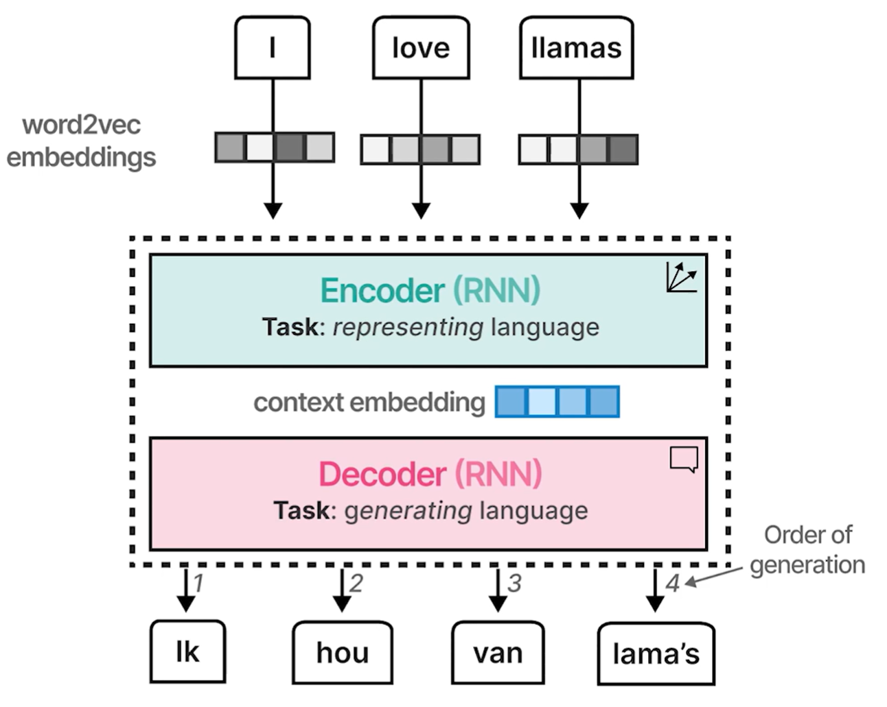

**场景：序列生成 (Seq2Seq, Many-to-Many)**

RNN的“经典用法”。当你需要把一个序列转换成另一个**长度不同、甚至语言不同**的序列时，必须用两个 RNN。

- **典型任务：**
  - 机器翻译（中文 -> 英文）
  - 对话机器人（问句 -> 回复）
  - 文本摘要（长文 -> 短文）
- **架构：** RNN (Encoder) + RNN (Decoder)。

### 单RNN

#### 1. Encoder-Only

**特点：** 只有编码器。很多时候，我们不需要生成新文本，只需要**理解**这段文本。这时候，我们只需要一个充当Encoder 的 RNN。

**用途：** 它是专门用来做**理解**任务的（分类、搜索、提取），它不擅长说话（生成）。

**场景A. 文本分类 (Many-to-One)**

- **任务：** 情感分析（输入一段影评，输出：正面/负面）。
- **流程：**
  1. 输入序列给 RNN。
  2. RNN 读完最后一个词，吐出 Context Vector。
  3. **直接**接一个全连接层（分类器），输出 0 或 1。
- **结论：** 这里只有一个 RNN，没有 Decoder。

**场景B. 序列标注 (Synced Many-to-Many)**

- **任务：** 词性标注（POS Tagging）、命名实体识别（NER）。
  - 输入：`我 爱 北京`
  - 输出：`代词 动词 名词`
- **流程：**
  - 输入和输出长度严格一致（N 对 N）。
  - RNN 每读一个词，马上就吐出一个标签，不需要等到读完整个句子，也不需要 Decoder 自回归。
- **结论：** 这里也通常只用一个 RNN（或者双向 Bi-LSTM）。

#### 2. Decoder-Only

**特点：** 只有解码器（自回归）。

**用途：** 它是专门用来**生成**的（你给前文，它续写后文）。


## 📝 RNN Encoder-Decoder 架构详解

Encoder-Decoder（编码器-解码器）架构是为了解决 **Seq2Seq（序列到序列）** 问题而诞生的。它巧妙地将变长的输入序列映射为变长的输出序列（如机器翻译：$N$个单词的中文 $\rightarrow$ $M$个单词的英文）。

### 1. Encoder（编码器）：语义压缩机

- **流程拆解**：

  1. **输入分词**：原始文本被拆解为 Token 序列 $X = \{x_1, x_2, ..., x_n\}$，并转化为 Word Embeddings。

  2. **迭代循环**：RNN 按时间步依次读取 Token。

  3. **状态更新**：

     - 在时刻 $t$，RNN 接收两个输入：
       1. 当前时刻的单词向量 $x_t$。
       2. 上一时刻的隐藏状态 $h_{t-1}$（这里面存储了 $x_1$ 到 $x_{t-1}$ 的记忆）。
     - 计算出当前新的状态 $h_t$。

  4. 最终产出：

     当最后一个 Token $x_n$ 被处理完后，得到的最终隐藏状态 $h_n$。

- **关键结论**：这个 $h_n$ 被称为 **Context Vector（上下文向量）**。它是一个固定长度的向量，理论上“浓缩”了整个输入句子的全部语义信息。

### 2. Decoder（解码器）：自回归生成器

在标准 RNN 模型（无 Attention）中，Decoder **不能**再看原始输入文本了（书已经合上了），它只能靠“记忆”和“上一个词”来生成。

- 初始化（传递接力棒）：

  Decoder 的初始隐藏状态 $s_0$ 直接赋值为 Encoder 的输出 $h_n$（Context Vector）。

  - *这意味着：Decoder 开始工作时，脑子里装满了 Encoder 读完书后的读后感。*

- 自回归循环 (Autoregressive Loop)：

  假设我们要生成翻译结果。

  - **Step 1:**
    - 输入：起始符 `<SOS>`。
    - 状态：$s_0$ (即 Context Vector)。
    - 输出：预测第一个词 $y_1$（例如 "Hello"）。
  - **Step 2:**
    - 输入：**上一步生成的词** $y_1$ ("Hello")。 **(注意：这里不再输入原始中文句子)**
    - 状态：$s_1$（由 $s_0$ 更新而来）。
    - 输出：预测第二个词 $y_2$。
  - **Step ...:**
    - 不断重复：拿自己刚刚生成的词，作为下一步的输入。
  - **终止**：
    - 直到预测出了结束符 `<EOS>`，循环结束。

### 3. 总结与对比

| **模块**    | **核心任务**           | **输入内容**                                          | **状态流向**                                                 |
| ----------- | ---------------------- | ----------------------------------------------------- | ------------------------------------------------------------ |
| **Encoder** | **读**：把文本变成向量 | 原始 Token 序列 ($x_t$) + 上一步记忆 ($h_{t-1}$)      | $h_0 \rightarrow h_1 \rightarrow \dots \rightarrow h_n$ (Context Vector) |
| **Decoder** | **写**：把向量变成文本 | 上一步生成的 Token ($y_{t-1}$) + 当前记忆 ($s_{t-1}$) | $s_0 (\text{from } h_n) \rightarrow s_1 \rightarrow s_2 \dots$ |

------

### 为什么后来需要 Attention？

看上面的笔记你会发现一个**巨大的隐患**：

在 Decoder 生成第 10 个词甚至第 20 个词的时候，它依然只能依赖最开始传进来的那个 $s_0$ (Context Vector) 的残存记忆。

随着生成序列变长，Decoder 会“遗忘”最开始的输入信息。

这就是为什么需要 Attention： 让 Decoder 在生成的每一步，都能回过头去重新看一遍 Encoder 的原始状态序列，而不是死守着一个固定的 $s_0$。


## Attention 机制

### 1. 引入背景：Seq2Seq 模型的两大痛点

在标准的 Encoder-Decoder（Seq2Seq）架构中，Encoder 将变长的输入序列压缩成一个**固定长度**的上下文向量 (Context Vector, $h_n$) 传递给 Decoder。这种设计带来了两个致命缺陷：

#### A. 信息瓶颈 (Information Bottleneck)

- **现象**：无论输入句子的长度是 5 个词还是 100 个词，Encoder 都必须将其强制压缩到一个**固定维度**（由 Hidden Size 决定，如 512 维）的向量中。
- **后果**：试图用有限的“容器”去装载无限可能的语义细节，必然导致**有损压缩**，大量输入句子的细节信息在编码过程中丢失。

#### B. 长距离遗忘 (Long-term Forgetting)

- **现象**：由于 RNN 的链式结构和梯度消失 (Vanishing Gradient) 问题，Encoder 在读到序列末尾时，往往已经“忘记”了序列开头的词。
- **后果**：传递给 Decoder 的上下文向量 $h_n$​ 本身就是**残缺**的（通常只记住了最后几个词）。Decoder 基于这个残缺的向量进行解码，导致长句子的翻译或生成效果极差。

**长距离遗忘到底发生在哪？**

“长距离遗忘”最致命的地方发生在 Encoder 阶段，但祸害延续到了 Decoder。

我们来看案发现场：

- Encoder 阶段（遗忘的主要发生地）：

  RNN 是按顺序读的：$x_1 \to x_2 \to ... \to x_{100}$。

  由于数学上的梯度消失 (Vanishing Gradient) 问题，或者是信息的不断覆盖，当 RNN 读到第 100 个词 $x_{100}$ 时，它脑子里的 $h_{100}$ 主要记住的是最近几个词（$x_{98}, x_{99}, x_{100}$）。

  它把开头第 1 个词 $x_1$ 几乎忘光了！

  于是，传递给 Decoder 的那个 $h_n$ (Context Vector) 本身就是一个**“记性不好”**的版本。

- Decoder 阶段（受害者）：

  Decoder 拿到这个本身就不完整的 $h_n$，自然就翻译不准开头的词。

  同时，Decoder 自己也是个 RNN，随着生成的词越来越多，它也会逐渐忘记最开始拿到的那个 $h_n$ 是什么。

**结论：** 遗忘始于 Encoder（读不全），恶化于 Decoder（记不住）。

---

### 2. 核心思想：从“静态单点”到“动态全局”

Attention 机制的引入，根本上改变了 Decoder 获取信息的方式：

- **传统 RNN**：Decoder 全程只看**一个**静态的上下文向量 $h_n$。
- **Attention RNN**：Decoder 在生成的**每一步 (Step $t$)**，都有权限直接访问 Encoder 的**所有历史隐藏状态** ($H = \{h_1, h_2, ..., h_n\}$)。
- **本质**：它让 Decoder 不再依赖“记忆压缩”，而是拥有了对源数据的**“随机访问权” (Random Access)**。

----

### 3. Attention 计算原理 (三步走算法)

假设 Decoder 当前处于生成第 $t$ 个词的时间步，当前状态为 $s_{t-1}$。Encoder 的历史状态库为 $H$。

#### 第一步：打分 (Alignment / Score)

计算 Decoder 当前需求与 Encoder 每个历史词的相关性。

$$e_{t,i} = \text{score}(s_{t-1}, h_i)$$

- **物理含义**：查询（Query）与 键（Key）的匹配程度。
- **计算方式**：通常为点积 (Dot Product) 或通过一个小型的神经网络层计算。

#### 第二步：归一化 (Softmax)

将分数转化为概率分布（权重），确保所有权重之和为 1。

$$\alpha_{t,i} = \text{Softmax}(e_{t,i})$$

- **结果**：得到 **Attention Weights**（注意力权重）。例如 `[0.1, 0.8, 0.1]` 表示当前时刻模型 80% 的注意力聚焦在第 2 个输入词上。

#### 第三步：加权求和 (Weighted Sum)

利用计算出的权重，从 Encoder 的状态中提取信息，生成当前时刻专属的上下文向量 $c_t$。

$$c_t = \sum_{i=1}^{n} \alpha_{t,i} \cdot h_i$$

- **结果**：Decoder 将这个 $c_t$ 与自身输入拼接，用于预测下一个词。

----

### 4. 程序员视角的抽象：Q, K, V 模型

这是理解 Transformer 的关键前置概念。RNN 中的 Attention 实际上是**信息检索 (Information Retrieval)** 逻辑的体现：

- **Query (查询 Q)** $\rightarrow$ **Decoder 当前的状态 ($s_{t-1}$)**
  - 含义：我（Decoder）现在处于什么状态？我要查什么？
- **Key (索引 K)** $\rightarrow$ **Encoder 的所有隐藏状态 ($h_1...h_n$)**
  - 含义：你（Encoder）有哪些内容可以供我匹配分数？
- **Value (内容 V)** $\rightarrow$ **Encoder 的所有隐藏状态 ($h_1...h_n$)**
  - 含义：如果匹配上了，我该提取什么具体的数值？（注：在 RNN Attention 中，Key 和 Value 通常是同一个向量）。

**Attention 本质公式**：

$$Attention(Q, K, V) = \text{Softmax}(Score(Q, K)) \cdot V$$

---

### 5. 总结

- **架构位置**：Attention 模块通常“挂载”在 **Decoder** 上，因为只有在生成时才需要“查询”。
- **解决痛点**：通过**动态计算**上下文向量，打破了固定维度的**信息瓶颈**；通过直接连接 Encoder 的所有状态，缩短了信息路径，解决了**长距离遗忘**。

---

### 拓展：相关性计算的常用算法

这里主要有三种经典算法，它们对应了 Attention 发展的不同阶段。了解这个对你理解 Transformer 里的 *Scaled Dot-Product* 至关重要。

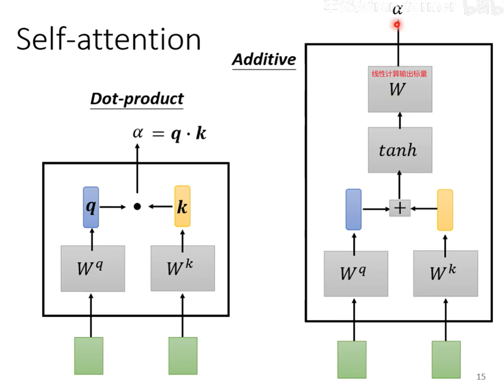

#### 1. Dot-Product Attention (点积注意力)

这是最简单、计算最快的一种。也就是刚才讲的。

$$score(s, h) = s^T h$$

- **前提：** Decoder 向量 $s$ 和 Encoder 向量 $h$ 的**维度必须完全相同**（否则没法点乘）。
- **应用场景：** 当 Encoder 和 Decoder 的 Hidden Size 一样，且追求计算速度时。
- **Transformer 的伏笔：** Transformer 用的就是这个，但加了一个小补丁（除以 $\sqrt{d}$），后面会讲。

#### 2. General Attention (双线性/Bilinear)

如果 $s$ 和 $h$ 的维度不一样怎么办？或者虽然维度一样，但它们处于不同的语义空间（比如 $s$ 是英文语义，$h$ 是中文语义），直接点乘不合理怎么办？

这时我们引入一个权重矩阵 $W$ 来做“翻译”。

$$score(s, h) = s^T W h$$

- **原理：**
  - 先算 $W h$：把 Encoder 的向量 $h$ 进行一次线性变换（旋转/缩放），让它“对齐”到 Decoder 的空间。
  - 再点乘 $s^T$：计算相似度。
- **优点：** 模型可以通过训练 $W$ 矩阵，学习到更复杂的匹配逻辑（不仅仅是方向一致）。

#### 3. Additive / Bahdanau Attention (加性注意力)

这是 Attention 机制最早被提出时的形态（由 Bahdanau 在 2014 年提出）。当时还没有用简单的点积，而是用了一个小型的神经网络来算分数。

$$score(s, h) = v^T \tanh(W [s; h])$$

- **步骤：**
  1. $[s; h]$：把 Decoder 状态和 Encoder 状态**拼接**起来。
  2. $W$：通过一个线性层（全连接层）。
  3. $\tanh$：过一个激活函数（引入非线性）。
  4. $v^T$：再通过一个线性层输出一个标量数值（Score）。
- **特点：**
  - **最精准**：因为它是一个神经网络，拟合能力最强，能捕捉极其复杂的非线性关系。
  - **最慢**：点积只是矩阵运算，GPU 极其擅长；而这个要跑一个前向传播网络，计算量大。

> Jchan Say：加性注意力的理解，其本质是在算两个向量的相关性的。点积算相关性很好理解，但是向量相加如何体现相关性的强弱？状态向量的每个维度本质上是代表的某种特征，而当两个向量的某个特征都很强，那么相加过后这个特征维度的值就会较高；若是一强一弱，那么特征和值就会较低。如果对于向量相加的结果用激活函数处理，维度特征值较高的会被凸显，低于某个阈值的会被弱化，那么结果向量就能很好反应出两个相加向量的相似性。


# Self-Attention

## 专属上下文的计算过程

Attention层的作用，就是把为序列输入中的每一个输入，生成定制的专属上下文。

- 这个上下文中既包含了输入的具体内容，也包含了与输入内容紧密相关的上下文。
- 从图中的连线可以看出，每一个专属上下文的生成，都参考了输入序列中的每一个输入。

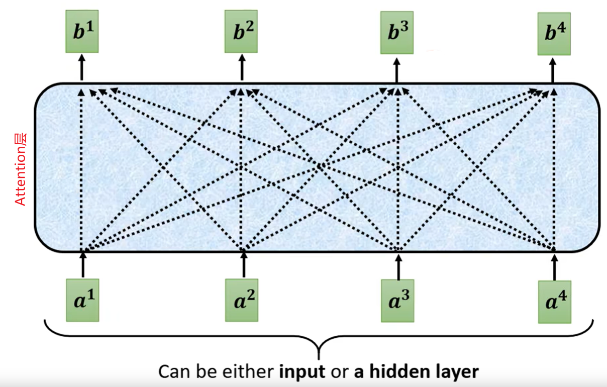

1. **生成查询q、索引k向量**

   

2. **计算 q-k 相关性分数，以及 查询q 与自身的相关性分数**

   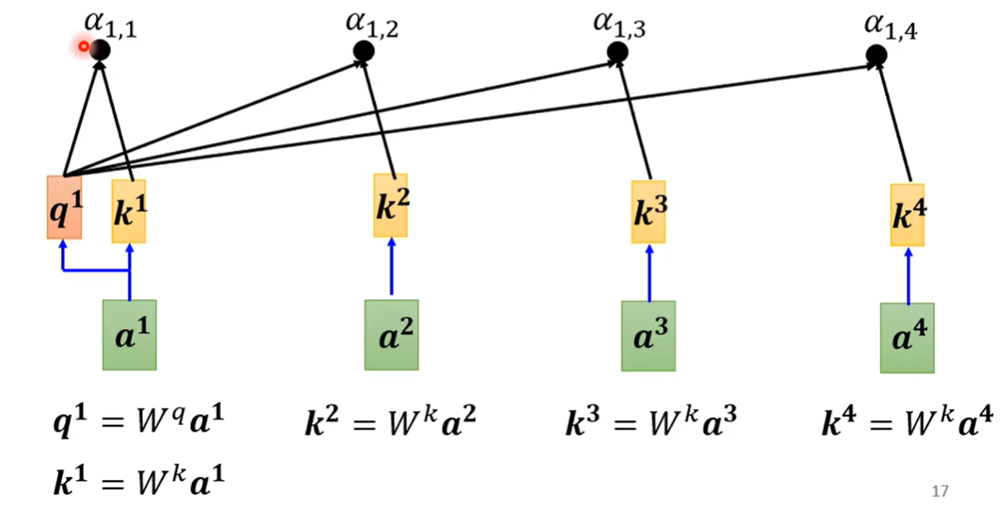

3. **归一化计算（这一步不一定用softmax，某些情况下其他方法甚至效果更好）**

   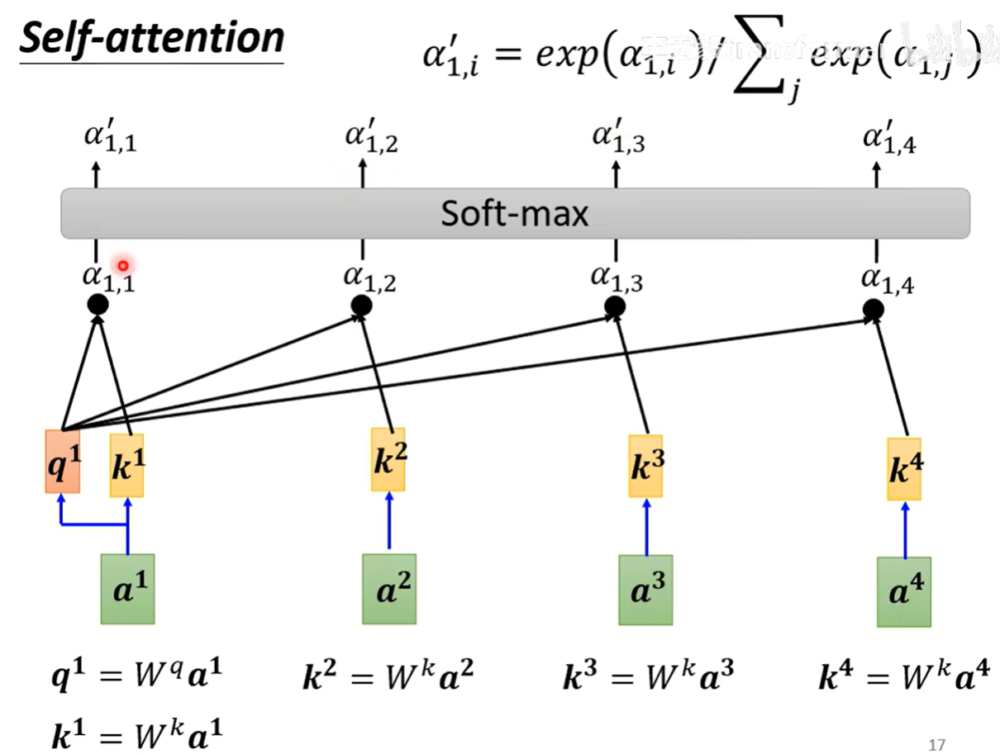

4. **基于相关性分数（attention分数）从输入序列中抽取合并上下文**，至此，输入a^1^的self-attention定制上下文转换完毕。

   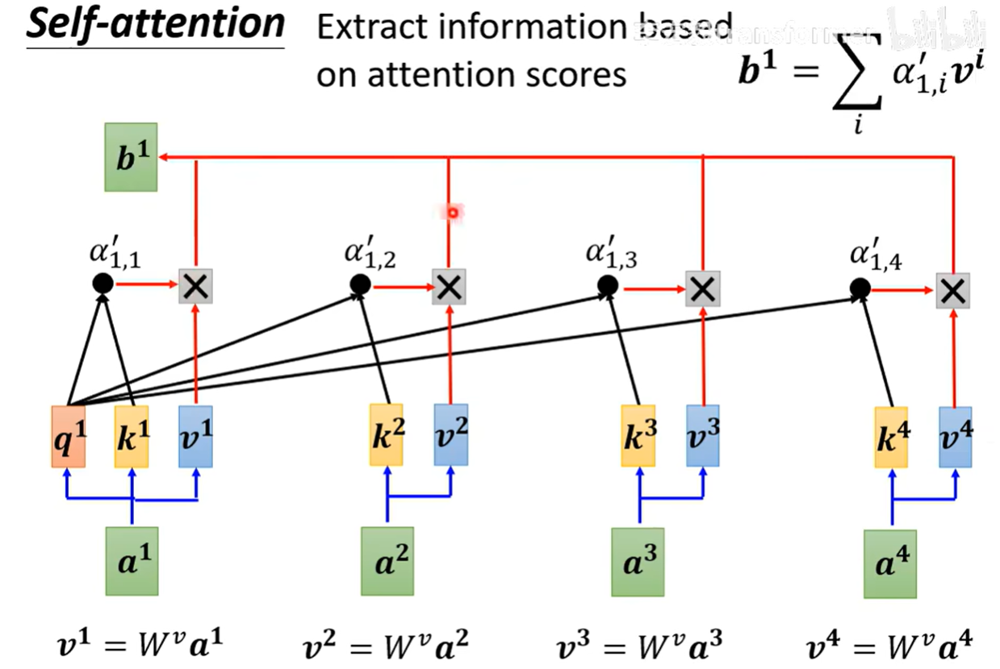

## self-attention的并行计算

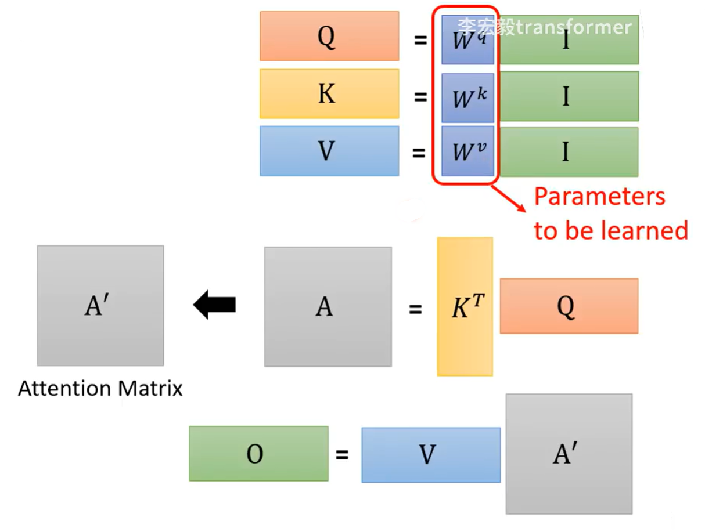

### 1. Q, K, V 的矩阵并行计算

通过观察可以看出，每个输入的查询计算，都是 **`权重矩阵 · 输入向量`**

而输入向量可以合并成一个矩阵，矩阵的每一列代表一个输入

这样所有输入的查询计算，就可以合并为 **`权重矩阵 · 输入矩阵`**

所有输入查询计算就变成了一次查询矩阵计算，索引K 和内容V 同理

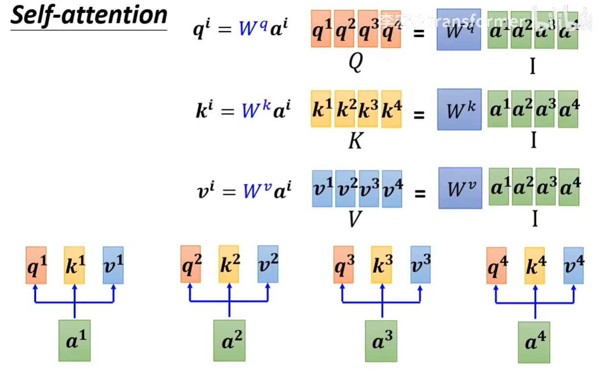

### 2. 相关性分数的矩阵并行计算

- K^T^ 中的每一行代表对应输入的索引向量k
- Q 中的每一列代表对应输入的查询向量q

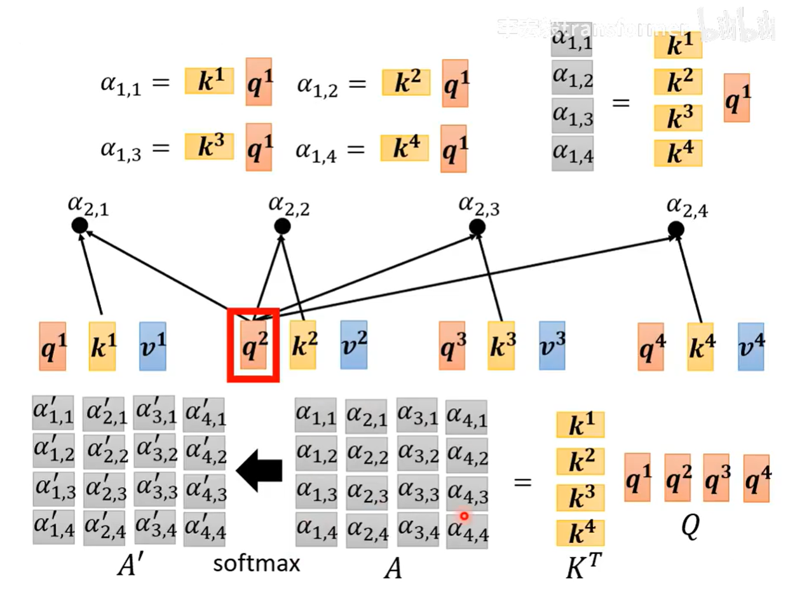

### 3. 注意力上下文的矩阵并行计算

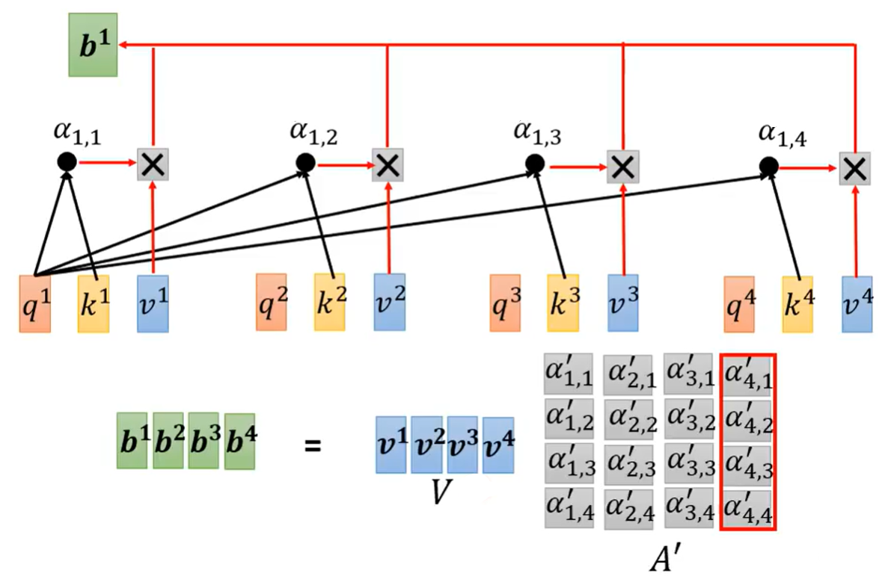

## Transformer 中的权重矩阵 ($W$) 与 Q, K, V 投影

### 1. 核心定义：权重矩阵 $W$ 的物理意义

在深度学习中，全连接层或 Attention 层中的权重矩阵 $W$ (Linear Layer Weights) 不仅仅是一堆参数，它在数学和物理上扮演着**“空间变换器”**的角色。

#### 1.1 维度对齐与基底变换 (Change of Basis)

假设输入向量 $x$ 和目标向量 $y$ 处于两个特征定义完全不同的“语义坐标系”中：

- **坐标系 A (Input):** 定义“欺骗”特征主要分布在第 100 维。
- **坐标系 B (Target):** 定义“欺骗”特征由“虚假”(第 50 维) 和 “恶意”(第 60 维) 组合而成。

权重矩阵 $W$ 的作用就是通过**线性变换 (Linear Transformation)**，将坐标系 A 中的特征精准投射到坐标系 B 中。

#### 1.2 特征重组 (Feature Reconstruction)

$W$ 通过**线性组合 (Linear Combination)** 来重构语义。它不仅仅是简单的“连线”，而是对原始信息进行加权混合：

$$Feature_{Target} = w_1 \cdot Feature_{Source\_1} + w_2 \cdot Feature_{Source\_2} + \dots$$

- **直观理解**：$W$ 负责把输入中零散的、分布式的特征碎片（Distributed Representation），拼凑、重组为下游任务此刻真正需要的具体语义概念。

---

### 2. Transformer 的进化：引入 $W^Q, W^K, W^V$

在 Transformer 中，为了让注意力机制更加精细，模型不再直接使用原始输入向量做点积，而是引入了**三个独立的权重矩阵**，将输入向量投影到三个不同的语义空间中。

#### 2.1 为什么要三个矩阵？(语义解耦)

同一个单词（Token）在 Attention 机制中通常扮演三种不同的角色，需要不同的特征表达：

1. **$W^Q$ (Query Projection Matrix):**
   - **作用**：将输入向量 $x$ 投影为 **Query 向量** ($Q = x \cdot W^Q$)。
   - **语义目标**：*“我当前处于什么状态？我**想找**什么样的信息？”*
   - **例子**：如果 $x$ 是“我”，$W^Q$ 可能会提取出它作为“主语”的特征，去寻找对应的“谓语”。
2. **$W^K$ (Key Projection Matrix):**
   - **作用**：将输入向量 $x$ 投影为 **Key 向量** ($K = x \cdot W^K$)。
   - **语义目标**：*“我包含什么特征？我能用来**被匹配**的标签是什么？”*
   - **例子**：如果 $x$ 是“苹果”，$W^K$ 可能会突出它“水果”或“科技公司”的属性标签，等待 Query 来匹配。
3. **$W^V$ (Value Projection Matrix):**
   - **作用**：将输入向量 $x$ 投影为 **Value 向量** ($V = x \cdot W^V$)。
   - **语义目标**：*“如果我被选中了，我要**贡献**什么具体的内容信息？”*
   - **例子**：保留单词原本的语义内容（Word Embedding 的语义精华），用于最终的加权求和。

#### 2.2 共同的数学目的

$W^Q$ 和 $W^K$ 有一个共同的硬性指标：它们必须把不同的输入，投影到同一个维度的“公共特征空间” (Attention Space) 中。

只有在同一个空间里，点积 ($Q \cdot K^T$) 才有数学意义（也就是计算相似度）。

------

### 3. 训练机制：$W$ 是如何“学会”对齐的？

权重矩阵 $W$ 中的数值不是人为设定的，而是通过**反向传播 (Backpropagation)** 训练出来的。

- 初始状态 (Initialization)：

  $W$ 被初始化为随机噪声（通常服从正态分布）。此时，模型是“瞎对齐”的，Q 和 K 的匹配完全是乱的。

- 前向传播 (Forward)：

  输入经过 $W$ 变换，计算 Attention，得出输出，最后算出 Loss（与真实标签的误差）。

- 反向修正 (Backward)：

  梯度下降算法会根据 Loss 回传梯度信息。

  - *逻辑直觉*：“刚才把‘疑似欺骗’(100维) 映射到了‘开心’(20维) 上，导致情感分类错了！请把 $W$ 中连接这两维的权重调小，把连接‘不信任’维度的权重调大！”

- 最终结果：

  经过亿万次训练，$W$ 变成了一个固化的、经验丰富的“语义翻译词典”。它能自动将输入特征精准地“扭转”和“投射”到正确的语义维度上。

------

### 4. 总结

| **概念**            | **核心作用**                                                 | **CS/工程类比**                                              |
| ------------------- | ------------------------------------------------------------ | ------------------------------------------------------------ |
| **权重矩阵 $W$**    | **线性投影**：特征空间的基底变换与重组。                     | **适配器 (Adapter)**：把一种接口的数据格式转换成另一种接口所需的格式。 |
| **$W^Q, W^K, W^V$** | **语义分工**：将同一个 Token 分解为“查询者”、“被查者”和“内容贡献者”三种角色。 | **数据库视图**：源数据是同一行记录，但索引视图(K)、查询视图(Q)和结果视图(V)展示不同的列。 |
| **训练过程**        | **参数修正**：通过梯度下降优化矩阵数值，以最小化预测误差。   | **单元测试与Debug**：发现输出Bug（Loss高），反向追踪并修改代码逻辑（权重参数）。 |


## 多头注意力（multi-head self-attention）

### 1. 核心定义

多头注意力机制是指在 Transformer 架构中，将模型的嵌入维度（Embedding Dimension, $d_{model}$）拆分为 $h$ 个独立的**子空间 (Subspaces)**。每个子空间拥有独立的一组投影矩阵 ($W^Q_i, W^K_i, W^V_i$)，分别计算注意力，最后将所有“头”的输出拼接并融合。

其数学表达为：

$$MultiHead(Q, K, V) = Concat(head_1, ..., head_h)W^O$$   （concat - 拼接）

其中每个头 $head_i$ 的计算为：

$$head_i = Attention(QW_i^Q, KW_i^K, VW_i^V)$$​

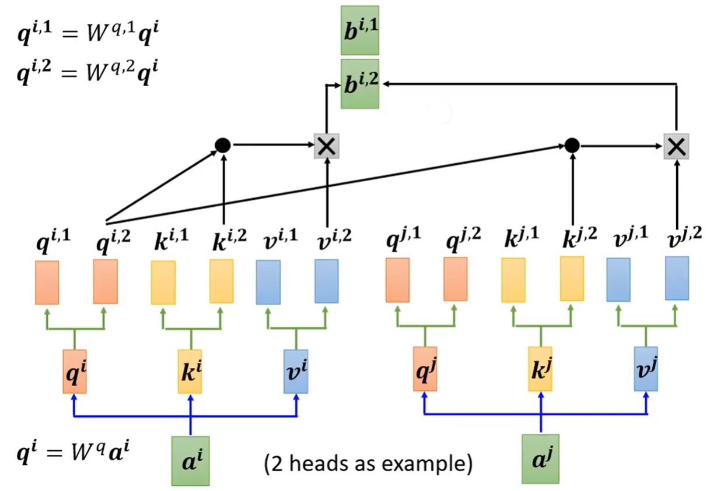

------

### 2. 为什么需要多头查询 (Multi-Head Query)？

**——解决“特征中和”与“单一视角局限”问题**

单头注意力 (Single-Head Attention) 本质上是对上下文信息的一次加权平均。如果只使用一组 Q, K, V，模型不得不将所有的语义信息（语法、指代、逻辑、情感等）压缩在一次计算中。

- **局限性**：不同类型的特征往往相互冲突。例如，在处理单词 "it" 时，语法上需要关注 "is"（动词），指代上需要关注 "apple"（名词）。单头注意力只能得出一个折中的、模糊的权重分布。
- **多头的作用**：将查询 $Q$ 投影到不同的子空间，允许模型提出不同的“问题”。
  - Head 1 的 $Q$ 关注：*“它的句法主语是谁？”*
  - Head 2 的 $Q$ 关注：*“它的指代对象是谁？”*
  - Head 3 的 $Q$ 关注：*“它的上下文情感是什么？”*

------

### 3. 为什么 K 和 V 也必须是多头的？

**——基于“子空间投影”与“特征解耦”的底层原理**

仅有多头 Query 是不够的。为了保证计算的数学意义和信息提取的纯度，Key 和 Value 必须与 Query 进行**配套的线性投影**。

#### 3.1 K (Key) 多头的必要性：语义空间对齐

注意力分数计算公式为 $Score = Q \cdot K^T$（点积）。

- **点积的几何前提**：两个向量必须位于同一个**语义特征空间**，点积所代表的“相似度”才有意义。
- **投影逻辑**：
  - 当 Head $i$ 的 $Q_i$ 被投影到“颜色特征子空间”时，对应的 $K_i$ 也必须通过 $W^K_i$ 投影到同样的“颜色特征子空间”。
  - 如果 $K$ 保持全局不变（包含颜色、形状、大小等混合信息），那么 $Q_i$（纯颜色）与 $K_{global}$（混合）的点积会引入大量噪音，导致匹配精度下降。

#### 3.2 V (Value) 多头的必要性：精准信息提取

注意力机制不仅包含“查找”（计算 Score），更包含“提取”（加权求和 V）。

- **信息解耦**：原始的输入嵌入是高度纠缠的（Entangled）。
- **提取逻辑**：
  - $W^V_i$ 的作用是**特征过滤**。它负责从原始向量中剥离出当前 Head 所关注的那一类特定信息。
  - 例如，Head $i$ 负责关注“时态信息”。那么 $W^V_i$ 会将输入向量映射为仅包含时态特征的 $V_i$。
  - **结果**：当 Head $i$ 匹配成功后，它抓取回来的就是纯净的“时态特征”，而不是夹杂了语义内容的混合向量。这为后续层的信息处理提供了清晰的输入。

------

### 4. 多头注意力的核心优势

1. 表征能力的增强 (Representation Diversity)：

   模型可以同时捕捉输入序列中不同位置的多种依赖关系（例如：同时捕捉短距离的语法依赖和长距离的语义依赖）。

2. 避免信息平均化：

   防止了单一注意力分布导致的信息模糊。多个锐利的注意力分布组合，远优于一个平滑的注意力分布。

3. 计算并行性：

   虽然逻辑上分为多个头，但在工程实现上，多个头的矩阵运算是并行进行的，并没有显著增加训练时间（总参数量 $d_{model} \times d_{model}$ 与单头保持一致，只是拆分了维度）。

------

### 5. 常见应用场景体现

在训练好的 Transformer 模型（如 BERT）中，研究发现不同的“头”往往会自动分化出特定的功能角色：

- **句法头 (Syntactic Heads)**：专门关注特定的语法关系，如动宾关系、主谓关系。
- **位置头 (Positional Heads)**：专门关注相邻的词（Local Context）。
- **指代头 (Coreference Heads)**：在处理代词时，会有特定的头专门去寻找前面出现的名词实体。
- **稀有词头**：专门关注句子中出现频率较低的关键实词。

通过最后输出层的线性变换 $W^O$，这些来自不同视角的碎片化信息被重新整合，形成了对当前 Token 的全方位、深层次的上下文理解（Contextualized Representation）。


# 位置编码

## 1. 引入背景：解决置换不变性 (Permutation Invariance)

Transformer 的核心组件 **Self-Attention** 在数学本质上是一个集合（Set）操作而非序列（Sequence）操作。对于任意输入序列 $X = \{x_1, x_2, \dots, x_n\}$，Attention 机制计算的权重分布仅取决于向量间的点积相似度，与 $x_i$ 在序列中的位置索引无关。

若不引入位置信息，模型将无法区分词序（例如无法区分 "狗咬人" 与 "人咬狗"）。因此，必须在输入端显式注入位置信号。

### 解决方案：相加注入 (Addition)

位置信息是在输入层注入的。

$$x_{input} = x_{embedding} + x_{position}$$

- **$x_{embedding}$**: 也就是 Word Embedding，包含**语义信息**。
- **$x_{position}$**: 也就是 Positional Encoding，包含**位置/时序信息**。
- 两者维度必须相同（例如 $d_{model} = 512$），直接**元素级相加**。

## 2. 正弦位置编码 (Sinusoidal Formulation)

原始 Transformer 论文 (Attention Is All You Need) 采用不同频率的正弦和余弦函数来生成固定位置向量。对于位置 $pos$ 和维度索引 $2j$ / $2j+1$：

$$P_{(pos, 2j)} = \sin\left(\frac{pos}{10000^{2j/d_{model}}}\right)$$

$$P_{(pos, 2j+1)} = \cos\left(\frac{pos}{10000^{2j/d_{model}}}\right)$$

**核心优势**：

1. **唯一性**：每个位置 $pos$ 都有唯一的编码向量。
2. **有界性**：数值始终在 $[-1, 1]$ 之间，易于模型处理。
3. **相对位置感知 (关键)**：通过三角函数公式，模型可以线性地推断出 $pos+k$ 与 $pos$ 的关系。这让模型能够理解“相邻”、“距离”等相对概念，且能外推到比训练语料更长的句子上。

### 2.1 相对位置的线性表达性质

该设计最核心的数学动机在于：**它允许模型通过简单的线性运算（点积）来捕捉相对位置关系。**

推导证明：

考虑两个位置 $t$ 和 $s$ 在某一对维度 $(2j, 2j+1)$ 上的点积贡献：

设 $\omega_j = \frac{1}{10000^{2j/d_{model}}}$，则对应的分量为 $(\sin(\omega_j t), \cos(\omega_j t))$ 和 $(\sin(\omega_j s), \cos(\omega_j s))$。

它们的点积为：

$$\begin{aligned} Score_{partial} &= \sin(\omega_j t)\sin(\omega_j s) + \cos(\omega_j t)\cos(\omega_j s) \\ &= \cos(\omega_j t - \omega_j s) \quad \text{(余弦差角公式)} \\ &= \cos(\omega_j (t - s)) \end{aligned}$$

**结论：**

- 位置向量的点积结果 $P_t \cdot P_s$ 仅与相对距离 $k = t-s$ 有关，而与绝对位置 $t$ 或 $s$ 无关。
- 这一性质要求位置编码的维度必须成对出现（正余弦配对），使得 Attention 机制天然具备捕捉相对距离的能力（如关注“前一个词”或“后三个词”）。

## 3. 加法融合的机制解析：为何不破坏语义？

将位置向量 $P$ 直接加到语义向量 $E$ 上，形成复合输入 $X = E + P$。这一操作并非简单的“混合”，而是利用高维向量空间的特性实现了信息的**复合表征**。

### 3.1 线性变换的分配律 (Distributivity)

模型确实永远无法看到原始的 $E$ 或 $P$，它看到的永远是 $X = E + P$。但是，模型之所以能分别利用语义和位置信息，根本原因在于 Transformer 内部运算的线性性质（Linearity）。

Transformer 的核心操作是 $Q, K, V$ 的投影。也就是输入向量 $X$ 乘以权重矩阵 $W$。

$$Q = X \cdot W^Q = (E + P) \cdot W^Q$$

根据矩阵乘法的分配律：

$$Q = E \cdot W^Q + P \cdot W^Q$$

这意味着：

尽管输入是混合的 $X$，但经过 $W^Q$ 投影后的结果 $Q$，数学上严格等价于“语义部分的投影”加上“位置部分的投影”。

- $W^Q$ 同时作用于 $E$ 和 $P$。
- $W^Q$ 可以被训练成这样一种矩阵：它能将 $E$ 所在的子空间映射到输出空间的一个方向，同时将 $P$ 所在的子空间映射到输出空间的另一个方向（或者重叠，取决于任务需求）。

**结论：** 模型不需要在输入端把 $E$ 和 $P$ 拆出来。模型利用的是线性变换的特性，使得混合输入在经过投影后，依然保留了 $E$ 和 $P$ 各自独立贡献的分量。

### 3.2 对输入向量的隐式分解

经过充分训练后的Attention模型，需要能够从原始输入（“处于位置i的单词x”）中理解出“位置i”和“单词x”这两个语义。在 Transformer 中，这种“分解”并不是把向量还原回去，而是体现在 **Self-Attention 的点积计算**中。

我们把 Attention Score 的公式展开：

$$Score(i, j) = Q_i \cdot K_j^T \approx (E_i + P_i) \cdot (E_j + P_j)^T$$

展开该式可得到四项具有明确物理含义的交互项：

1. **$E_q \cdot E_k$ (语义-语义):**
   - *“‘Apple’ 和 ‘Eat’ 关系大吗？”*
   - 这是纯粹的内容匹配，**跟位置无关**。
2. **$E_q \cdot P_k$ (语义-位置):**
   - *“‘Apple’ 经常出现在句首吗？”*
   - 这捕捉了**内容对特定位置的偏好**。
3. **$P_q \cdot E_k$ (位置-语义):**
   - *“第 5 个位置通常是动词吗？”*
   - 这捕捉了**特定位置对内容的偏好**。
4. **$P_q \cdot P_k$ (位置-位置) :**
   - *“第 $i$ 个位置和第 $j$ 个位置关系大吗？”*
   - 这纯粹是在计算**相对距离**。

**严谨的解释：** 模型并不需要在物理上把 $E$ 和 $P$ 拆开存到两个变量里。 模型通过训练 $W^Q$ 和 $W^K$，使得当它需要关注“语义”时，它会让 $E \cdot E$ 这一项的值占主导；当它需要关注“距离”时，它会让 $P \cdot P$ 这一项占主导。 **这种通过点积产生的交叉项，就是你所说的“分解”和“相互理解”的数学本质。**

### 3.3 训练中的自适应性

- **位置向量 $P$**：通常是固定不变的（Fixed Prior）。
- **语义向量 $E$**：是可学习参数。在训练过程中，模型会调整 $E$ 的数值分布，使其适应 $P$ 的存在。最终学习到的词嵌入 $E$​ 实际上是“在这个特定位置编码体系下”的词义表达。
- **结果：** 训练好的词向量里，不仅仅包含语义，还包含了一种“能和位置向量发生反应”的潜在特征。这是被反向传播“逼”出来的。


# Transformer 


## 交叉注意力

在decoder生成序列token的过程中，它不仅需要参考decoder阶段的 **查询Q（masked上下文）**，它还需要参考 **encoder阶段对于输入序列的理解**


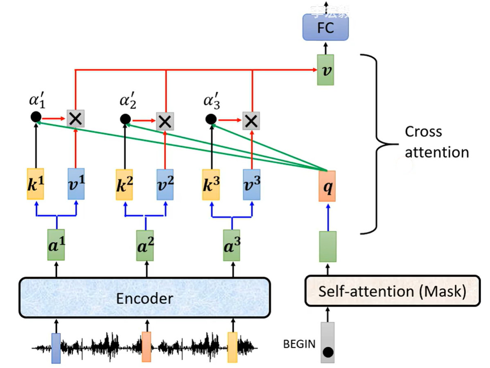


## 残差连接与归一化

### 第一部分：为什么残差连接 (Add) 能解决梯度消失？

核心原因只有一句话：**它把梯度的“连乘”变成了“连加”。**

#### 1. 传统的深层网络（没有残差）

假设一个只有 3 层的简单网络（每层是一个函数 $f$）：

$$y = f_3(f_2(f_1(x)))$$

当我们反向传播算梯度时，根据链式法则 (Chain Rule)，梯度是连乘的：

$$\frac{\partial Loss}{\partial x} = \frac{\partial Loss}{\partial y} \cdot \color{red}{\frac{\partial f_3}{\partial f_2} \cdot \frac{\partial f_2}{\partial f_1} \cdot \frac{\partial f_1}{\partial x}}$$

- **问题所在：** 在深度网络中，$\frac{\partial f}{\partial x}$（层导数）通常是小于 1 的小数（或者是正态分布中很多接近 0 的数）。
- **后果：** $0.9 \times 0.9 \times \dots \times 0.9$ (乘 100 次) $\approx 0$。
- **梯度消失：** 信号传到前面几层时，已经微弱到几乎为 0 了。前面的层根本收不到“修改建议”，所以学不动。

#### 2. 残差网络（有 Add）

现在的结构是 $y = x + f(x)$。

假设还是那个位置，但现在每一层变成了残差块：

$$x_{l+1} = x_l + f(x_l)$$

现在我们对 $x_l$ 求导：

$$\frac{\partial x_{l+1}}{\partial x_l} = \frac{\partial (x_l + f(x_l))}{\partial x_l} = \mathbf{1} + \frac{\partial f(x_l)}{\partial x_l}$$

注意到了吗？**多了一个常数 1。**

当我们把这个新公式代入链式法则回传梯度时：

$$\text{总梯度} = \text{上层梯度} \cdot (1 + \frac{\partial f}{\partial x})$$

这个公式展开后，梯度被分成了两部分：

1. **$\text{上层梯度} \cdot 1$** $\rightarrow$ **直接复制粘贴传下去！**
2. **$\text{上层梯度} \cdot \frac{\partial f}{\partial x}$** $\rightarrow$ 经过变换的梯度。

结论：

那个 “+1” 就像一条高速公路（Information Highway）。

即使 $f(x)$ 这一层彻底死掉了（导数为 0），梯度依然可以通过那个 1，无损地传到更前面的层。

这保证了最前面的输入层永远能收到来自最后一层的反馈信号，不会半路失踪。

------

### 第二部分：为什么要归一化 (Norm)？

要理解 Norm，你得把自己想象成那个正在努力学习的**神经网络**。

#### 1. 痛苦的“追逐游戏” (Internal Covariate Shift)

想象你在训练一个 100 层的网络：

- **第 1 层** 更新了参数（Weights 变了）。
- **后果：** 第 1 层输出的数据分布这就变了（比如本来输出都在 0~1 之间，更新后变成了 -5~5）。
- **第 2 层懵了：** 第 2 层的参数是适应 0~1 的输入的，现在突然来了个 -5~5，原来的参数完全失效了。第 2 层必须赶紧调整参数去适应新的分布。
- **第 3 层更懵：** 第 2 层在拼命调整，导致第 2 层的输出分布也在剧烈抖动，第 3 层也得跟着跑。

这就是 Internal Covariate Shift（内部协变量偏移）。

如果每层的输入分布都在乱跳，每一层都无法安心学习特征，只能把大部分精力花在“适应上一层的变化”上。这导致训练极慢，甚至不收敛。

#### 2. Layer Norm 的作用：强行“统一度量衡”

归一化 ($x_{new} = \frac{x - \mu}{\sigma}$) 做了一件什么事？

它强行把每一层的输入拉回到同一个起跑线上：均值为 0，方差为 1。

不管第 1 层怎么瞎改参数，不管它输出的数值变成了几千还是几万，经过 LayerNorm 一刀切之后，**传给第 2 层的数据永远是标准正态分布（Standard Normal Distribution）。**

- **第 2 层很开心：** “这一层的输入总是很稳定，我可以专心提取特征，不用担心数据范围乱飘了。”

#### 3. 优化地形 (Loss Landscape) 的视角

- 没有 Norm：

  损失函数的地形像是一个狭窄的山谷（Ravine）。

  有的方向（维度）特别陡峭（数值大），有的方向特别平缓（数值小）。

  梯度下降时，还没走到谷底，就在陡峭的壁上反复震荡，学习率稍微大一点就飞出去了。

- 有 Norm：

  损失函数的地形变成了一个圆润的碗（Bowl）。

  各个维度的尺度差不多，梯度下降可以很顺滑地直冲谷底（最优解）。

  这意味着你可以使用更大的学习率，模型收敛速度飞快。

------

### 🎓 总结笔记

1. **Add (残差)**：解决的是**深度**问题。
   - 原理：将乘法链式法则转化为加法。
   - 作用：保留了梯度的“保底通道”（那个 $+1$），让梯度能无损流向浅层，防止梯度消失。
2. **Norm (归一化)**：解决的是**训练速度和稳定性**问题。
   - 原理：消除层与层之间的分布偏移 (Covariate Shift)。
   - 作用：让每一层看到的输入都是稳定的（$\mu=0, \sigma=1$），把崎岖的优化地形修成平滑的大道，让模型学得快、不震荡。

## FFN —— 模型的“知识仓库”

你回顾一下，我们花了大量精力讲 **Self-Attention**。

- Self-Attention 的作用是 **“路由” (Routing)** 和 **“聚合” (Aggregation)**。它负责把相关的信息凑在一起。
- **但是，模型把信息凑在一起之后，它在哪进行“思考”和“消化”呢？**

答案是 FFN (Feed-Forward Networks —— 前馈神经网络)。

在 Transformer 的每一层中，Self-Attention 后面都紧跟着一个 FFN。

- 结构： 这是一个非常简单的两层全连接网络（MLP）。

  $$FFN(x) = \text{ReLU}(xW_1 + b_1)W_2 + b_2$$

- **维度变化：** 这是一个“宽进窄出”的过程。通常会先把维度放大 4 倍（比如 512 $\to$ 2048），然后再缩回去（2048 $\to$ 512）。

- **地位：** **它占据了模型 2/3 的参数量！**

  - Attention 层的参数很少（只有几个 $W$ 矩阵）。
  - FFN 层因为维度放大，参数量巨大。

- **最新学术观点：** 现在很多研究认为，**Attention 负责“理解上下文关系”，而 FFN 才是真正存储“世界知识（事实）”的地方。** (Key-Value Memories)。

  - *比如：“法国的首都是巴黎”。这个知识点可能就储存在 FFN 的权重里。Attention 负责注意到“法国”和“首都”，然后去 FFN 里把“巴黎”提取出来。*

### FFN 为什么是“宽入窄出”（准确说是“窄-宽-窄”）？

首先纠正一个小细节：FFN 的标准结构其实是 **“窄 $\to$ 宽 $\to$ 窄”**（Bottleneck Structure 的反向）。

- **输入：** $d_{model}$ (例如 512)
- **中间层：** $4 \times d_{model}$ (例如 2048) —— **这里变宽了！**
- **输出：** $d_{model}$ (例如 512) —— **这里又缩回去了。**

**为什么要先变宽？**

这涉及到一个数学原理：**高维空间的线性可分性（Cover's Theorem）。**

1. 低维的纠缠：

   想象你手里把一团揉皱的纸（数据）。在低维空间（512维）里，很多特征是挤在一起、折叠在一起的，很难用简单的一刀（线性变换）把它们切开分类。

2. 高维的展开：

   FFN 的第一层把数据投影到更高的维度（2048维）。这就好比把你那团揉皱的纸展开铺平。

   在展开的高维空间里，原本挤在一起的特征点（比如“苹果”和“手机”）就被拉开了距离。

3. ReLU 的切割：

   在高维空间里，激活函数（ReLU）可以更从容地把这些特征切分、筛选。

4. 存回记忆：

   处理完后，再压缩回 512 维，传给下一层。

**总结：** FFN 把维度变宽，是为了**提供足够广阔的“操作台”**，让模型能把复杂的语义解开、揉碎、理解清楚，然后再打包送走。


## 训练

这是一个将**架构 (Architecture)** 转化为 **模型 (Model)** 的关键过程。

你已经理解了 Transformer 的内部构造（Attention, FFN, Residual, Norm）以及通用的反向传播原理。现在，我们需要把这些组件组装起来，看看在一个**自回归语言模型（如 GPT）** 或 **Seq2Seq 模型（如机器翻译）** 的训练中，具体发生了什么。

训练 Transformer 的核心逻辑可以概括为：**Teacher Forcing（教师强制）** + **Masked Self-Attention（掩码自注意力）** + **Next Token Prediction（下一个词预测）**。

我们分步骤来拆解这个过程。

------

### 1. 训练目标：它到底在学什么？(Objective)

以目前最主流的 **Decoder-Only (GPT)** 架构为例（Encoder-Decoder 逻辑类似），训练的任务被称为 **自回归语言建模 (Autoregressive Language Modeling)**。

- **输入：** $w_1, w_2, ..., w_{t-1}$
- **目标：** 最大化预测 $w_t$ 的概率 $P(w_t | w_1, ..., w_{t-1})$。

简单来说，就是做一道海量的**填空题**：给了你上文，请你猜下一个字是什么。

------

### 2. 数据构建：Teacher Forcing (最重要的概念)

在**推理（Inference/Generation）**阶段，模型是“这就生成一个词，把这个词加到输入里，再生成下一个词”，是串行的，很慢。

但在**训练（Training）**阶段，我们拥有**上帝视角**（也就是完整的训练语料）。我们不需要等模型一个个猜，我们可以**并行训练**。这里用到了**Teacher Forcing** 技术。

假设我们要训练句子：**`<SOS>` I love AI `<EOS>`**

我们构造两份数据：

1. 输入序列 (Input Sequence): 给模型看的。

   [<SOS>, I, love, AI]

2. 目标序列 (Target Sequence): 模型应该预测出来的（其实就是输入序列向左移一位）。

   [I, love, AI, <EOS>]

训练逻辑：

我们一次性把 输入序列 扔给 Transformer。

- 在位置 0 (`<SOS>`)，我们要它预测 `I`。

- 在位置 1 (`I`)，我们要它预测 `love`。

- 在位置 2 (`love`)，我们要它预测 `AI`。

- ...

  这就实现了并行计算：我们在一次前向传播中，同时计算了整个句子的所有预测误差。

------

### 3. 核心约束：Causal Masking (因果掩码)

你可能会问：*“等一下，如果我把整个句子 `[<SOS>, I, love, AI]` 都扔进 Self-Attention，那模型在预测 `I` 的时候，Attention 机制岂不是能看见后面的 `love` 和 `AI`？这不是作弊吗？”*

是的，如果没有任何限制，就是作弊（偷看未来）。

为了防止作弊，Transformer 在 Decoder 的 Attention 层中引入了一个 Causal Mask (因果掩码 / 下三角掩码)。

**Mask 矩阵长这样（0表示可见，-inf表示不可见）：**

| **Query \ Key**  | **<SOS>** | **I**    | **love** | **AI**   |
| ---------------- | --------- | -------- | -------- | -------- |
| **Pos 0 (SOS)**  | 0         | **-inf** | **-inf** | **-inf** |
| **Pos 1 (I)**    | 0         | 0        | **-inf** | **-inf** |
| **Pos 2 (love)** | 0         | 0        | 0        | **-inf** |
| **Pos 3 (AI)**   | 0         | 0        | 0        | 0        |

- **Attention Score 计算前：** $Score = Q \cdot K^T$。
- **Mask 操作：** $Score = Score + Mask$。那些被填了 `-inf` 的位置，经过 Softmax 后概率变成 0。
- **物理意义：**
  - 当模型站在位置 0 预测时，它只能看见位置 0。
  - 当模型站在位置 1 预测时，它只能看见位置 0 和 1。
  - **强行切断了通往“未来”的连接。**

------

### 4. 损失计算：Cross-Entropy Loss (交叉熵)

Transformer 的最后一层通常是一个 **Linear 层（投影层）**，把 Hidden Size（比如 512维）映射回 **Vocab Size（词表大小，比如 50,000维）**。

假设在位置 1（输入是 `I`，目标是 `love`）：

1. **模型输出 (Logits):** 一个 50,000 维的向量，代表每个词的得分。

2. **概率分布 (Softmax):** 归一化成概率。

   - 比如：`{"apple": 0.01, "love": 0.4, "hate": 0.1, ...}`

3. **真实标签 (One-Hot):**

   - `love` 对应的索引是 1，其他是 0。

4. 计算 Loss:

   

   $$Loss = - \log(P(\text{"love"}))$$

   - 模型预测 "love" 的概率越高，Loss 越小。
   - 如果模型预测 "love" 的概率是 1.0，Loss 就是 0。

**总 Loss** 就是整个 Batch 中所有序列、所有位置的 Loss 的平均值。

------

### 5. 训练循环 (The Training Loop)

结合我们之前讲的反向传播，现在的完整流程是：

1. **Batching:** 从语料库挖一大勺数据（比如 B=64 个句子），补齐长度（Padding）。
2. **Masking:** 准备好 Causal Mask（防止偷看）和 Padding Mask（忽略补齐的 0）。
3. **Forward Pass (前向传播):**
   - Input $\to$ Embedding + Pos $\to$ Transformer Layers $\to$ Logits.
   - 一次性算出 B 个句子的所有位置的预测结果。
4. **Loss Calculation:** 拿 Logits 和 Target（移位后的输入）算交叉熵。
5. **Backward Pass (反向传播):**
   - `loss.backward()`
   - 通过链式法则算出所有 $W^Q, W^K, W^V, W_{FFN}$ 的梯度。
6. **Optimizer Step:**
   - `optimizer.step()` (比如 AdamW)。
   - 更新参数。
7. **Scheduler:** 更新学习率（通常是用 Warmup：先从 0 慢慢升上来，再慢慢降下去。这是为了防止一开始参数随机时梯度太大把模型搞崩）。

---

### 6. encoder的训练

1. **作为 Seq2Seq 的一部分（如翻译）：** Encoder 不独立计算 Loss。它通过 **Cross-Attention** 接收来自 Decoder 的梯度信号，与 Decoder 联合训练。
2. **独立作为理解模型（如 BERT）：** 采用 **MLM (掩码语言模型)** 任务。无因果掩码（全向注意力），通过“完形填空”来学习语义。

---

### 总结：训练 Transformer 的独特之处

相比于传统的神经网络，Transformer 训练的关键点在于：

1. **并行性 (Parallelism):** 虽然是处理序列，但训练时不是像 RNN 那样一个词一个词跑的，而是**整个句子作为一个矩阵**扔进去算的。
2. **Teacher Forcing:** 永远给模型看“正确答案的上一部分”，不管它之前预测对没对。
3. **Causal Masking:** 在 Attention 内部人为制造“时间遮挡”，确保因果律不被破坏。

这就是为什么 Transformer 训练极快（可以用 GPU 并行），而且能在大规模数据上通过“预测下一个词”学会理解世界的逻辑。


# 语言模型的发展历史

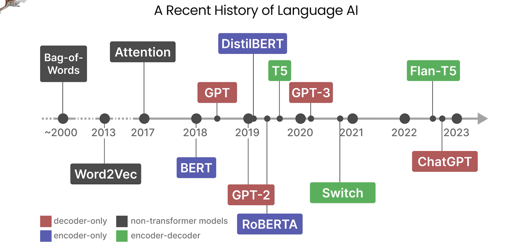

## 语言模型（LM）

可以理解人类自然语言的模型，并且可以执行与自然语言相关的任务，下图是LM典型的三种任务应用。

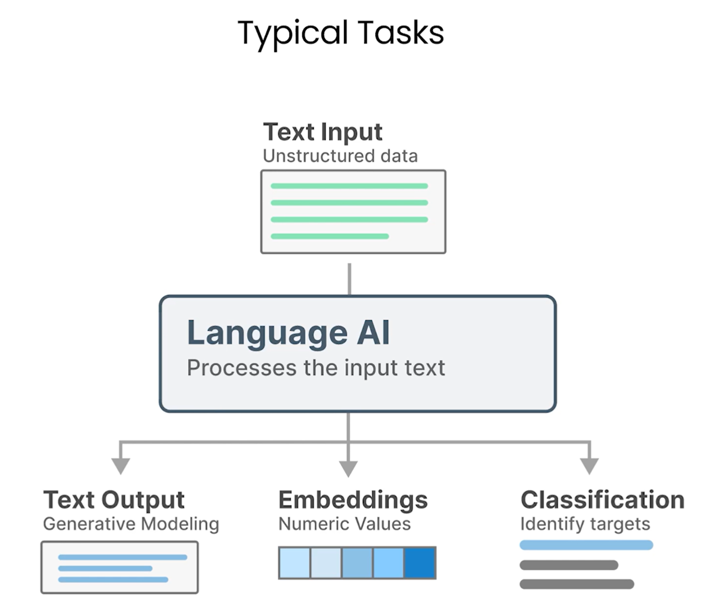

**LM的核心诉求**：寻求一种把自然语言在计算机中结构化表示的方式，同时要求这样的结构化表示需要尽可能避免语义丢失。说白了，这就是要**让计算机理解自然语言的语义**。因为，LM首先要能够理解语言，它才能完成上图中语言相关的任务。


## 1. Bag of Words

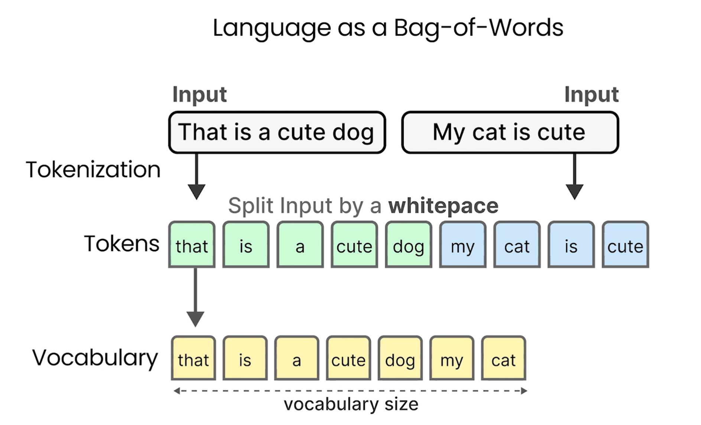

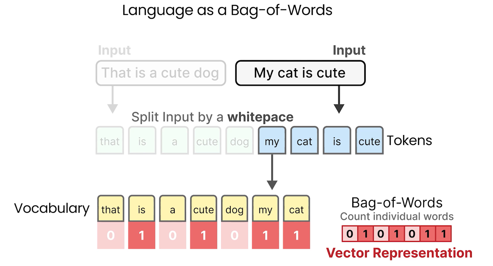

## 2. Word2Vec

**词嵌入：**

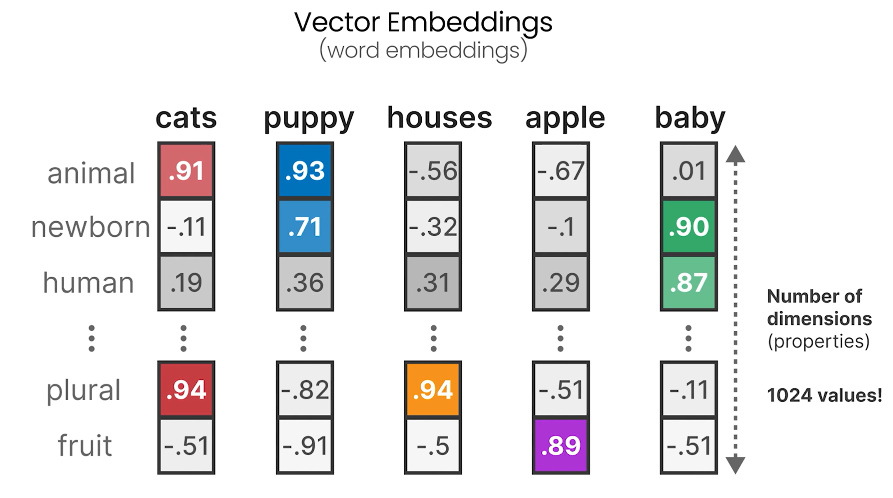

**三种嵌入类型**：

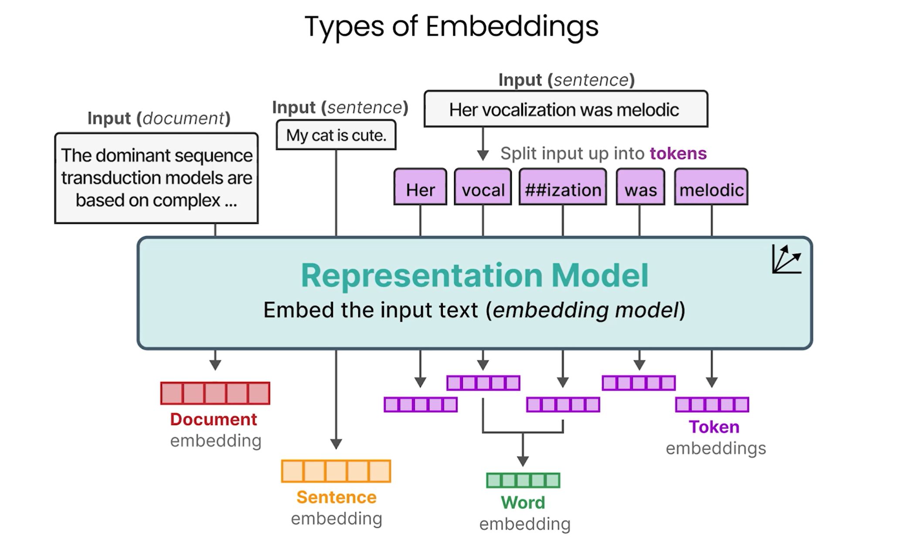

## 3. Transformers

**The magic of llm comes from two parts**:

1. The Architecture of **Transformers**
2. **Data** used to train certain model


## 现代主流模型体系

### GPT vs ChatGPT？

- **GPT (Generative Pre-trained Transformer):** 这是一个**架构**，或者说是一个**模型家族**（GPT-1, GPT-2, GPT-3, GPT-4）。它指的是这种“Decoder-only + Next Token Prediction”的技术路线。
- **ChatGPT:** 这是一个**产品**。它是在 GPT-3.5 或 GPT-4 这个**底座模型 (Base Model)** 之上，经过了 **SFT (指令微调)** 和 **RLHF (人类反馈强化学习)** 训练出来的，专门用来对话的应用程序。

### 现在的聊天机器人（Qwen, DeepSeek 等）有 Encoder 吗？

这是一个非常深刻的直觉问题！你的逻辑是：

> “Encoder 负责理解，Decoder 负责生成。既然聊天机器人理解能力这么强，它肚子里肯定藏着一个 Encoder 吧？”

**答案是：No。绝大多数现代主流大模型（GPT-4, Llama 3, Qwen, DeepSeek, Claude）都是纯粹的 Decoder-only 架构！**

这就引出了一个反直觉的结论：**Decoder 本身就具备极强的“理解”能力。**

#### 1. 为什么 Decoder 也能“理解”？

让我们回到 **Self-Attention** 的机制。

- **Encoder 的 Attention：** 能看左边，也能看右边（全向）。
- **Decoder 的 Attention：** 只能看左边（单向/因果）。

你可能会觉得：“只能看左边，岂不是瞎了一半？怎么理解整句话？”

**请注意“Prompt（提示词）”是如何输入的：** 当你问 Qwen：“**法国的首都是哪里？**” 这句话是作为一个**序列的前缀 (Prefix)** 一次性喂给 Decoder 的。

虽然 Decoder 有 Mask，但在处理这个 Prompt 的时候：

- 处理“都”字时，它能看见“法国的首”；
- 处理“？”时，它能看见“法国的首都是哪里”。

**发现了吗？** 当 Decoder 读到 Prompt 的**最后一个 Token** 时，它的 Self-Attention 已经把前面的所有词都“看”了一遍，并聚合了整句话的信息。 **这个时刻的 Context Vector，就包含了对整个问题的“理解”！**

所以，Decoder 不仅仅是“生成器”，它在生成第一个字之前，必须先充当“阅读器”。**“理解”本质上就是“能够利用上文信息预测下文”，这两者在数学上是统一的。**

#### 2. 为什么工业界抛弃了 Encoder-Decoder (如 T5, Bart)？

其实早几年（2019-2020），Google 的 T5 就是标准的 Encoder-Decoder 架构。但为什么现在大家都变节去搞 GPT（Decoder-only）了？

主要有三个原因：

1. **参数效率 (Parameter Efficiency):**
   - Encoder-Decoder 实际上是两个模型。要达到同样的效果，参数量可能较大。
   - Decoder-only 只有一个模型，参数全都用来做生成，更纯粹。
2. **KV Cache (推理加速):**
   - Decoder-only 在推理时有一个巨大的优势：它可以缓存之前的计算结果（KV Cache）。你每生成一个新词，不需要重新算前面的词。
   - 这让聊天机器人的响应速度极快。
3. **涌现能力 (Emergent Ability):**
   - 实验发现，当参数量大到一定程度（百亿级），Decoder-only 模型突然“涌现”出了极强的 Zero-shot（零样本）能力。虽然理论上 Encoder-Decoder 理解得更细，但在海量数据暴力美学面前，Decoder-only 的上限似乎更高。

现在的模型之争，已经不再是“颠覆性架构”之争，而是**“微架构调优 (Micro-Architecture Tweaks)”** 和 **“数据工程 (Data Engineering)”** 之争。

作为 CS 研究生，你现在看这些模型，不需要看热闹，而要看门道。我为你梳理了一份**当前主流大模型架构图谱**，以及它们在标准 Transformer 基础上的关键改动。

### 1. 总体格局：Decoder-Only 统领天下

目前市面上 99% 的顶流模型（GPT系列, Llama系列, Qwen, Claude, Mistral）本质上都是 Decoder-only Transformer。

它们的目标函数只有一个：Next Token Prediction (NTP)。

所以你不需要再去学什么新奇特的网络拓扑结构，你只需要关注它们在**具体组件**上做了哪些“魔改”。

------

### 2. 标准答案 vs. 现代魔改 (The Modern Standard)

标准 Transformer（论文版）和现在用的 Llama 3（工业版），在组件上有以下 **4 个主要区别**。你看懂这 4 点，就看懂了所有模型。

| **组件**      | **原始 Transformer (2017)** | **现代主流 (Llama 3/Qwen 等)** | **为什么改？(你的知识点)**                                   |
| ------------- | --------------------------- | ------------------------------ | ------------------------------------------------------------ |
| **位置编码**  | Sinusoidal (相加)           | **RoPE (旋转位置编码)**        | RoPE 不是加在输入，而是**转在 Attention 内部**。它让相对位置感知能力极强，且支持超长上下文（Long Context）。 |
| **归一化**    | LayerNorm                   | **RMSNorm**                    | 去掉了均值计算，只算方差。**计算更快**，效果持平或更好。     |
| **激活函数**  | ReLU                        | **SwiGLU**                     | FFN 变体。引入了 Gated (门控) 机制，比 ReLU 更平滑，能让模型学得更细致。 |
| **Attention** | Multi-Head (MHA)            | **GQA (分组查询注意力)**       | 为了推理加速。**减少 KV Cache 的显存占用**，让推理速度提升几倍。 |

------

### 3. 主流模型流派与特点 (The Model Zoo)

基于你现在的知识，我们可以把市面上的模型分为三类来看看：

#### 第一类：稳健的“工业标准”派 (Llama 系列)

- **代表：** **Llama 3 (Meta)**, **Baichuan (百川)**, **Yi (零一万物)**
- **架构特点：**
  - **最纯正的 Decoder-only Transformer。**
  - 几乎完全采用了上面提到的“现代魔改四件套” (RoPE + RMSNorm + SwiGLU + GQA)。
  - **你的优势：** 你去看 Llama 的源码，会发现每一行代码你都认识。它是现在开源界的“Linux”，架构最标准，生态最好。

#### 第二类：激进的“效率至上”派 (MoE 架构)

- **代表：** **GPT-4 (推测)**, **Mixtral (Mistral)**, **DeepSeek (深度求索)**
- **架构特点：** **Mixture of Experts (混合专家模型)**。
  - **核心改动：** 把那个巨大的 **FFN 层** 切碎了！
  - **原理：**
    - 标准 FFN 是一个大胖子（参数巨大）。
    - MoE 把 FFN 拆成了 8 个或 16 个“小专家” (Small FFNs)。
    - 对于每一个 Token，**只激活其中 2 个专家**来计算。
  - **好处：** **参数量巨大（比如总参数 100B），但推理计算量很小（激活参数可能只有 10B）。** 实现了“不仅懂得多，而且算得快”。
  - *注：DeepSeek 在此基础上还魔改了 Attention (MLA)，进一步压缩了显存。*

#### 第三类：全能的“原生多模态”派

- **代表：** **Gemini 1.5 Pro (Google)**, **GPT-4o**
- **架构特点：**
  - 不再仅仅是 Text Embedding。
  - 它们把图片 (Image Patches)、音频 (Audio Frames) 都通过各自的 Encoder 变成了 **Token**。
  - 然后把这些 Token 和文本 Token 混在一起，扔进同一个巨大的 Transformer Decoder 里训练。
  - **本质：** 万物皆 Token，万物皆 Attention。

### 总结：大模型的奥义

大模型的智慧，一方面来自于Transformer架构，一方面来自于**海量训练数据**！

只要你读过的书（上文）足够多，理解得足够深，预测下一个字（生成）的行为，本身就包含了最高的智慧。