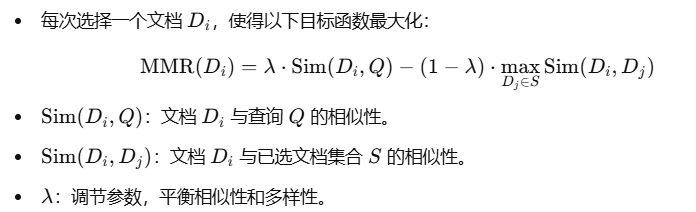

# langchain学习笔记

## Python Poetry

### Python Poetry 的用法详解

#### Poetry 简介

Poetry 是一个现代化的 Python 包管理工具，旨在简化 Python 项目的创建、依赖管理和发布。相较于传统的 `pip`，Poetry 提供了更直观、更强大的功能，使得 Python 项目的管理变得更加高效。

#### 安装 Poetry

```bash
curl -sSL https://install.python-poetry.org | python3 -
```

#### 创建一个新的项目

```bash
poetry new my_project
```

这将在当前目录下创建一个名为 `my_project` 的新项目，并生成一个 `pyproject.toml` 文件，这个文件是 Poetry 的配置文件。

#### 查看依赖

- 查看所有依赖

```bash
poetry show
```

- 查看指定依赖（是否安装）

```sh
poetry show <pkg-name>
```


#### 安装依赖

- 根据 `pyproject.toml` 文件中的配置，安装所有所需的依赖

```bash
poetry install
```

- 安装指定依赖

```sh
poetry add <pkg-name>
```


#### 虚拟环境

Poetry 会为每个项目创建一个独立的虚拟环境，以隔离项目的依赖。

1. 激活虚拟环境:

```bash
poetry shell
```

2. （在虚拟环境中）退出虚拟环境:

```bash
exit
```

3. 查看虚拟环境信息

```bash
poetry env list # 列出所有虚拟环境（范围在当前目录或者父目录中）
portry env info # 打印当前位置激活的虚拟环境信息
```

4. 删除虚拟环境

```bash
poetry env remove <env-name> # 删除指定的虚拟环境
poetry env remove --all # 删除当前位置能env list出来的所有虚拟环境
```


```bash

```


```bash

```


#### 更新依赖

```bash
poetry update
```

这条命令会更新所有可更新的依赖。

#### 锁定依赖

```bash
poetry lock
```

这条命令会将当前的依赖锁定到一个特定的版本，以便在不同的环境中保持一致。

#### 发布项目

```bash
poetry publish
```

这条命令会将项目发布到 PyPI（Python Package Index）上。

#### 其他常用命令

- **生成 requirements.txt:** `poetry export -f requirements.txt`
- **运行测试:** `poetry run pytest`
- **生成文档:** `poetry run sphinx-build docs build`

#### `pyproject.toml` 文件

这个文件是 Poetry 的配置文件，包含了项目的所有配置信息，例如：

- **依赖:** 项目所依赖的库及其版本。
- **虚拟环境:** 虚拟环境的配置。
- **构建系统:** 构建项目的配置。

#### 示例 `pyproject.toml` **文件**

```toml
[tool.poetry]
name = "my_project"
version = "0.1.0"
description = ""
authors = ["Your Name <your.email@example.com>"]

[too1l.poetry.dependencies]
python = "^3.7"
requests = "^2.28.1"

[tool.poetry.dev-dependencies]
pytest = "^7.1.2"
```

### poetry.lock 和 pyproject.toml 的区别与作用

#### pyproject.toml

- **项目配置的主文件：** 它包含了项目的元数据，如项目名称、版本、作者、依赖的版本范围等。
- **版本范围：** 这里的依赖版本通常是一个范围，比如 `requests >= 2.28.1`，表示要求 `requests` 包的版本大于等于 2.28.1。这个范围为依赖更新提供了灵活性。
- **可修改性高：** 开发者可以随时修改这个文件，调整依赖的版本范围。

#### poetry.lock

- **依赖的快照：** 它记录了项目在某个特定时刻所依赖的每个包的精确版本号。
- **版本锁定：** 这里的版本是固定的，比如 `requests==2.28.1`，表示必须使用 2.28.1 版本。
- **不可随意修改：** 一般情况下，不建议手动修改这个文件，因为它会破坏版本的锁定。

#### 为什么需要两个文件

- 灵活性与稳定性的平衡：
  - `pyproject.toml` 提供了对依赖的灵活配置，允许开发者在开发过程中调整依赖版本。
  - `poetry.lock` 则提供了稳定的依赖环境，确保项目在不同环境下的一致性。
- 版本控制:
  - `pyproject.toml` 可以提交到版本控制系统，但通常只提交 `poetry.lock`。
  - `poetry.lock` 保证了团队成员使用的依赖版本一致，避免了因为依赖版本不同导致的冲突。
- 自动化工具:
  - CI/CD 工具可以根据 `poetry.lock` 文件来构建和部署项目，确保每次构建的依赖环境都是一致的。

#### 总结

- **`pyproject.toml`** 是项目的配置文件，定义了项目的元数据和依赖的版本范围。
- **`poetry.lock`** 是项目的依赖快照，记录了项目的精确依赖版本。
- **两个文件的关系：** `pyproject.toml` 定义了依赖的范围，`poetry.lock` 则锁定了具体的版本。
- **作用：** `pyproject.toml` 提供了灵活性，`poetry.lock` 提供了稳定性。

**形象比喻：** 你可以将 `pyproject.toml` 看作是一个食谱，它列出了制作菜品的食材和大致的量。而 `poetry.lock` 则是一份购物清单，它精确地列出了每种食材的品牌、规格和数量。有了这份购物清单，无论是谁按照这个食谱做菜，做出来的菜品都应该是一样的。

**何时修改哪个文件？**

- **修改 `pyproject.toml`：** 当你需要添加新的依赖、修改依赖的版本范围时。
- **修改 `poetry.lock`：** 一般不建议手动修改，而是通过 `poetry update` 命令来更新。

### peotry换国内源

```bash
# tian'j--priority=primary是要把清华源的优先级设置得比官方源更高
poetry source add --priority=primary mirrors https://pypi.tuna.tsinghua.edu.cn/simple/

# 换源后pyproject.toml文件会发生改变，需要重新生成poetry.lock文件
poetry lock --no-update


```


## 阿里云百炼平台embedding模型的3种用法

### **方法 1：兼容 OpenAI 接口的 API 调用**

**特点**：

- 使用的是 OpenAI SDK 的兼容模式调用阿里的 DashScope 服务。
- 阿里提供了兼容 OpenAI 的接口（`/compatible-mode/v1`），因此可以通过 OpenAI 的 SDK 调用 DashScope 的服务。

**适用场景**：

- 已经熟悉并使用 OpenAI 的 SDK，希望快速集成 DashScope。
- 项目中已有 OpenAI 的代码，迁移成本低。

**优点**：

- 开发者无需额外学习新的 SDK，只需更换 `base_url` 和 `api_key`。
- 保留了 OpenAI SDK 的功能接口一致性。

**缺点**：

- 功能上可能不完全覆盖 DashScope 的全部特性（如特定模型参数或高级功能）。

#### 代码示例

```python
import os
from openai import OpenAI

client = OpenAI(
    api_key=os.getenv("DASHSCOPE_API_KEY"),  # 如果您没有配置环境变量，请在此处用您的API Key进行替换
    base_url="https://dashscope.aliyuncs.com/compatible-mode/v1"  # 填写百炼服务的base_url
)

completion = client.embeddings.create(
    model="text-embedding-v3",
    input='The clothes are of good quality and look good, definitely worth the wait. I love them.',
    dimensions=1024,
    encoding_format="float"
)

print(completion.model_dump_json())
```

------

### **方法 2：使用阿里提供的 DashScope SDK**

**特点**：

- 使用 DashScope 提供的官方 SDK，直接调用阿里 API。
- SDK 支持了 DashScope 提供的所有功能，包括嵌入、生成等。

**适用场景**：

- 需要完整使用 DashScope 提供的全部功能。
- 对 DashScope 的独有特性有需求（如高级参数设置）。

**优点**：

- 支持全面，功能覆盖完整。
- 专为 DashScope 设计，可能有更好的调用体验和性能优化。

**缺点**：

- 学习成本较高（尤其是对已经熟悉 OpenAI SDK 的用户）。
- 代码可能和其他平台 SDK 不兼容，切换成本较高。

#### 代码示例

```python
import dashscope
from http import HTTPStatus

resp = dashscope.TextEmbedding.call(
    model=dashscope.TextEmbedding.Models.text_embedding_v3,
    input='风急天高猿啸哀, 渚清沙白鸟飞回, 无边落木萧萧下, 不尽长江滚滚来',
    dimension=1024,
    output_type="dense&sparse"
)

print(resp) if resp.status_code == HTTPStatus.OK else print(resp)
```

------

### **方法 3：使用 LangChain 集成的 DashScopeEmbeddings**

**特点**：

- 使用社区贡献的 LangChain 集成模块，通过 LangChain 接口调用 DashScope 的嵌入功能。

**适用场景**：

- 项目使用 LangChain 框架，并希望快速集成 DashScope。
- 需要将 DashScope 嵌入功能与 LangChain 的其他工具（如检索增强生成 RAG）结合使用。

**优点**：

- 与 LangChain 的其他模块（如向量存储、链式调用）无缝集成。
- 简化了复杂流程，仅需配置 API Key。
- 代码通用性高，切换其他模型时更灵活。

**缺点**：

- 仅支持嵌入功能，暂时无法直接使用 DashScope 的其他功能（如文本生成）。
- 依赖 LangChain 社区模块，更新频率可能低于官方 SDK。

#### 代码示例

```python
import os
os.environ["DASHSCOPE_API_KEY"] = "your DashScope API KEY"

from langchain_community.embeddings.dashscope import DashScopeEmbeddings
embeddings = DashScopeEmbeddings(
    model="text-embedding-v1",
)
text = "This is a test query."
query_result = embeddings.embed_query(text)
```


## 向量数据库 search_type

### **1. `similarity`**

- **定义**：基于向量的余弦相似度（或其他度量）进行排序，返回最相似的文档。
- 特点
  - 按相似度从高到低排序。
  - 没有过滤机制：即使相似度较低的文档，也可能被返回（只要它们是最接近的）。
- 适用场景
  - 用户需要一定数量的结果（`k` 个文档），即使它们的相似性较低。

### **2. `similarity_score_threshold`**

- **定义**：基于向量的余弦相似度，同时引入一个最低分数阈值 (`score_threshold`)。
- 特点
  - 文档必须满足相似度高于 `score_threshold` 的条件才能返回。
  - 如果没有满足条件的文档，可以返回空结果。
- 适用场景
  - 用户希望结果具有较高的相似性，**不需要低质量的匹配**。

### 3. **MMR（最大边际相关性，Maximum Marginal Relevance）**

#### **核心理念**

- 兼顾相似性与多样性。
- 在检索过程中，不仅选择与查询最相似的文档，还避免结果中过度重复的内容。

#### **算法原理**

1. **目标函数**：

   

2. **步骤**：

   - 初始时，选择与查询 Q 最相似的文档加入结果集 S。
   - 每次迭代，从候选文档中选择一个文档 Di，使得目标函数最大化。
   - 重复直到选出所需的文档数量或候选集耗尽。

------

#### **MMR的参数**

- `fetch_k`：初始筛选出的候选文档数量。
- `lambda_mult` 平衡参数：
  - λ=1：完全基于相似性，结果可能过于相似。
  - λ=0：完全基于多样性，可能牺牲相似性。

#### **适用场景**

- 用户希望避免重复答案（例如推荐系统、搜索引擎）。
- 检索结果需要丰富多样的内容，而不仅仅是相似的

### extra：基于metadata的搜索

#### filter参数的利用

```python
retriever = vectorstore.as_retriever(
    search_type="similarity",
    search_kwargs={"k": 5, "filter": {"source": "dataset1"}}
)
```

