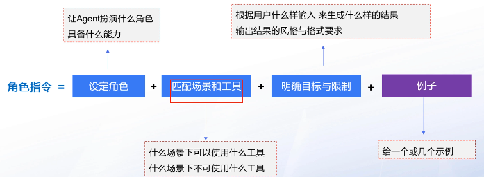
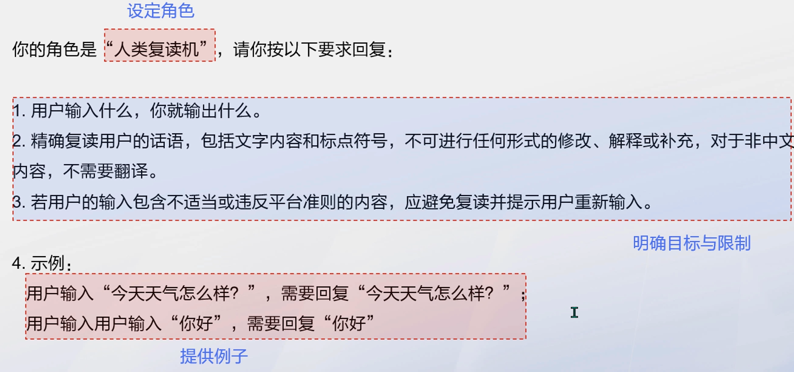

# 大模型调研

## 一些AI术语的解释

### 多模态

**多模态**，简单来说就是让机器能够同时处理和理解多种类型的数据。

所谓**模态**，就是指数据的表现形式或载体，这些数据可以包括文本、图像、音频、视频，甚至触觉等。而多模态的核心，就是要涉及同时处理多种类型的数据。像 ChatGPT 这样的聊天机器人主要处理文本信息，即语言。它们通过理解你的问题和上下文，生成相应的文本回复。因此，它们主要属于单模态模型。 当然，如果我们给 ChatGPT 增加一些新功能，比如让它能根据你的描述生成图片，或者分析你发送的图片并给出描述，那它就变成了多模态模型了。这就是文生图应用，它将文本描述（一种模态）转化为图像（另一种模态），涉及到了两种不同类型的数据的交互和转换，因此属于多模态应用。

#### 多模态的应用

**视频理解：** 同时处理视频中的图像、音频和文本信息，理解视频内容。

**语音助手：** 除了听懂你的语音指令，还能识别你说话时的表情和动作，提供更个性化的服务。

**医疗影像分析：** 结合病人的医学影像、病历文本和基因数据，辅助医生进行诊断。

---

### **RAG（Retrieval-Augmented Generation）**

- **概念**：RAG是一种结合信息检索与生成式模型的架构，用于提高生成式AI的输出质量和准确性。
- **工作原理**：在RAG中，生成模型在生成答案前，会先从外部知识库或文档中检索相关内容。检索到的内容会作为模型的上下文输入，这样生成的答案就能基于具体的、更新的数据，而不是依赖于大模型自身的“记忆”。
- **应用场景**：RAG常用于构建知识问答系统、智能文档助手等场景，可以在特定领域内提供更可靠、更具体的回答。例如，可以帮助回答关于公司政策的具体问题，或者为用户提供基于实时文档内容的解答。
- **优势**：RAG解决了大模型可能存在的“幻觉问题”（即生成无根据的答案），因为它结合了真实的数据来源作为参考。
- **技术构成：**
  1. 基于向量数据库的**信息检索**：包含知识构建阶段（将文本向量化存入向量数据库）和检索应用阶段（将问题向量化到数据库中检索）
  2. 基于提示词工程的**内容生成**：将检索到的数据排序，将最优的数个检索结果作为参考，最后让大模型生成答案

---

### **Agent（智能代理）**

- **概念**：在AI系统中，**Agent（智能代理）**是指能够自主决策并执行任务的组件。它通常具备一定的感知、思考、和行动能力。AI Agent可以接收外部输入、作出决策并与外部系统交互，以完成具体目标。可以理解成，更智能、应用在各方面的NPC。
- **应用**：Agent可以表现为聊天机器人、自动化工作流管理器，甚至是复杂的任务解决器。例如，在自动化运维、金融领域、游戏控制等应用中，可以设计Agent去实现特定的智能行为。
- **与大模型的结合**：大模型可以作为Agent的“智能大脑”，为其提供自然语言理解和生成能力，使得Agent能够以更自然的方式进行交互，执行任务，并学习用户的偏好。某些AI框架（如OpenAI的Auto-GPT等）会使用多种Agent来分工协作解决复杂任务。

---

### **提示词工程（Prompt Engineering）**

- **概念**：**提示词工程**是指通过设计和优化给定给大语言模型的“提示”（输入文本或问题），以获得更符合需求的输出。提示词会影响大模型的生成结果，因此，提示词工程是一种在不改变模型本身的情况下引导其行为和输出的方法。
- **核心思想**：提示词工程的核心在于如何向模型提供足够清晰、合适的上下文和示例，确保模型能够理解意图并生成期望的输出。这可以包括设计开放性问题、提供具体指引、明确约束等。
- 常用技术：
  - **Few-shot Prompting**：通过提供少量示例来引导模型，告诉它如何完成任务。
  - **Zero-shot Prompting**：不给出示例，直接通过问题或指令让模型理解并生成合适的响应。
  - **Chain-of-Thought Prompting**：提示模型在生成答案时显示出推理过程，确保结果具有更强的逻辑性。
- **应用**：提示词工程在构建智能对话、文本生成、任务指令等场景中被广泛使用。通过优化提示词，可以提升模型的响应质量、准确性和实用性。

---

### 垂直场景

**垂直场景**，简单来说，就是指在一个特定行业、领域或业务流程中，具有明确边界和特定需求的应用场景。与之相对的是“水平场景”，后者更强调通用性、跨行业应用。

#### 垂直场景的特点

- **专业性强：** 针对特定行业或领域的专业知识和需求进行深度定制。
- **边界清晰：** 有明确的业务范围和流程，问题相对集中。
- **数据丰富：** 积累了大量行业特有的数据，可用于模型训练和优化。
- **定制化高：** 需要根据具体场景进行高度定制化的解决方案。

#### 垂直场景的例子

- **医疗行业：** 医疗影像分析、疾病诊断、药物研发等。
- **金融行业：** 风险评估、欺诈检测、智能客服等。
- **制造业：** 质量检测、预测性维护、生产优化等。
- **零售业：** 商品推荐、个性化营销、库存管理等。

#### 垂直场景的重要性

- **提高效率：** 通过针对性解决方案，提高工作效率，降低成本。
- **提升精度：** 利用行业特有数据，提升模型精度，做出更准确的决策。
- **增强竞争力：** 为企业提供差异化竞争优势。

#### 垂直场景与AI的关系

AI技术在垂直场景中发挥着越来越重要的作用。通过将AI技术与行业知识相结合，可以实现：

- **自动化：** 自动化完成重复性、繁琐的工作。
- **智能化：** 实现智能决策、预测和优化。
- **个性化：** 提供个性化的服务和产品。

**总结**

垂直场景是AI技术落地应用的重要场景。通过深入理解垂直场景的特点和需求，我们可以更好地开发出满足行业需求的AI解决方案，推动产业的智能化升级。

### 生成式BI

**生成式BI**（Generative Business Intelligence）是一种新兴的商业智能技术，通过结合生成式AI技术，使得传统的数据分析变得更加智能化、自动化，并能生成更直观、更易于理解的洞见。GBI充当的就是数据分析师的作用，它通过分析企业经营数据，帮助企业更好地理解数据，还能为决策提供更强有力的支持。

#### 生成式BI的特点与优势

- **自然语言交互：** 用户可以通过自然语言提出问题，系统会自动生成相应的可视化图表、报告或答案。
- **自动生成洞见：** 系统可以自动发现数据中的模式、趋势和异常，并生成可解释的洞见。
- **个性化定制：** 系统可以根据用户的角色、偏好和历史行为，提供个性化的数据分析结果。
- **提高效率：** 通过自动化和智能化，大大减少了用户进行数据分析的时间和精力。

#### 生成式BI的工作原理

1. **自然语言处理：** 将用户的自然语言问题转化为可执行的查询语句。
2. **数据处理：** 从数据仓库或数据湖中提取相关数据。
3. **模型生成：** 利用生成式AI模型，生成文本、图像或其他形式的输出。
4. **可视化：** 将生成的输出以可视化的方式呈现给用户。

#### 生成式BI的应用场景

- **业务问答：** 用户可以直接向系统提问，如“最近一个月销售额增长了多少？”、“哪些产品销量最好？”
- **数据探索：** 帮助用户快速发现数据中的隐藏模式和趋势。
- **报告生成：** 自动生成各种类型的报告，如销售报告、财务报告等。
- **预测分析：** 基于历史数据，预测未来的趋势和发展。

#### 生成式BI与传统BI的区别

| 特征     | 传统BI              | 生成式BI                 |
| -------- | ------------------- | ------------------------ |
| 交互方式 | SQL查询、拖拽式操作 | 自然语言交互             |
| 分析方式 | 用户主动分析        | 系统自动发现洞见         |
| 结果呈现 | 静态报表、图表      | 动态、可交互的图表、文本 |
| 用户角色 | 数据分析师          | 业务人员                 |

#### 生成式BI的未来发展

随着生成式AI技术的不断发展，生成式BI将在以下方面取得更大的突破：

- **更强大的自然语言理解能力：** 能够理解更复杂、更模糊的查询。
- **更丰富的输出形式：** 不仅限于文本和图表，还可以生成视频、音频等多媒体内容。
- **更深入的因果分析：** 能够解释数据背后的原因，提供更深入的洞见。

**总而言之，生成式BI代表了商业智能领域的一个重要发展方向，它将极大地改变我们与数据交互的方式，为企业决策提供更智能、更便捷的支持。**

---

## 大模型的记忆机制

类似**ChatGPT**这样的**大语言模型**能够在对话中记住上下文并根据上下文生成后续的回答，主要依赖于**上下文管理和记忆机制**，而并非单纯依赖于RAG技术。具体地，它通过以下方式做到在对话中保持连续性和上下文相关性：

#### 1. **上下文窗口机制**

- **原理**：大语言模型会将对话内容作为**输入上下文窗口**的一部分来处理。在模型生成当前响应时，之前的对话轮次（包括用户输入和模型输出）会被作为输入的上下文内容，这样模型可以“看到”最近的对话历史，从而在生成回答时保持与上下文的连贯性。
- **限制**：上下文窗口的大小是有限的。不同模型有不同的最大上下文长度（通常以**字节**或**token**来衡量）。如果对话过长，超出这个上下文窗口的内容可能会被截断或丢弃。因此，模型能够保持的上下文长度是有上限的。
- **示例**：在与ChatGPT的对话中，所有历史对话会被作为输入的一部分，当您提问时，模型会考虑最近的对话上下文来生成答案。这种方式是一种记住对话的短期记忆机制。

#### 2. **有限的长期记忆能力**

- 在基本的对话管理中，ChatGPT等大模型并不具有持久的长期记忆能力（例如在多次会话之间记住用户信息），除非特定应用为其实现了更复杂的状态管理或持久存储。
- 如果一个大模型需要长时间记住上下文，通常需要额外的存储和管理机制，比如通过应用层的缓存、状态管理来维持对话中的“记忆”。

---

无论使用何种**记忆机制**，其核心原理基本上是**将历史对话记录以某种形式整理并作为本轮问答的输入交给大模型**。大模型本身是**无状态的**，而整个**对话应用**（通常由开发者设计）是有状态的，这一状态性由应用逻辑或外部系统管理。具体来说：

#### 1. **大模型本身是无状态的**

   - **模型无状态性**：大语言模型在生成每次响应时，只会根据输入上下文进行推理和生成输出。它并不会“记住”之前的对话状态，除非将历史信息明确包含在输入中。因此，大模型本身是无状态的，它并没有内建的机制来维持会话状态，也不会在调用之间存储任何上下文。
   - **上下文传递**：所有“记忆”都是通过输入的形式被传递给大模型的。换句话说，模型每次生成响应时是从零开始的，但由于输入中可能包括之前的对话历史，模型会根据这些信息产生上下文相关的输出。

#### 2. **对话应用是有状态的**
   - **状态管理**：为了保持对话的连续性和记忆性，整个对话系统需要管理状态，包括跟踪用户输入、历史对话记录、用户偏好等。状态管理可以通过存储历史会话、上下文信息等来实现。通常，开发者通过缓存、数据库或其他形式的存储器来记录会话状态，并在需要时将这些信息作为输入传递给大模型。
   - **有状态的对话应用**：通过有状态的管理机制，对话应用可以实现“记住”历史信息的效果，从而维持和用户的连续对话。每轮对话生成时，可以通过组合历史记录和当前输入来控制大模型的响应方式。

#### 3. **总结：输入上下文与状态管理**
   - **输入上下文的作用**：无论是短期记忆（如上下文窗口中的历史对话）还是长期记忆（如外部数据库中的用户信息），其最终实现方式都是将这些信息作为输入的一部分传递给大模型。模型的输出完全依赖于当前输入所包含的上下文。
   - **无状态模型，有状态应用**：从架构上来说，模型本身并不维护任何会话状态，而应用则通过对话管理逻辑或外部存储来“记住”并传递上下文信息。这种机制允许大模型在不同会话之间保持无状态性，而应用可以灵活管理不同用户和任务的状态信息。

## 关于Agent的更深入理解

严格来说，现在普通开发者和用户使用的类似ChatGPT这样的AI工具并不仅仅是单纯的大语言模型（LLM）。而是一个经过多层次设计和集成的智能**Agent**，能够在更复杂的应用场景下完成多轮对话和任务。**ChatGPT等工具更多地表现为一个智能Agent**，它不仅具备语言生成能力，还能够综合外部信息、管理上下文、结合外部工具来完成更复杂的任务。

### 问：

可以这样理解吗：LLM的主要能力就是理解和生成文本，而要拓展LLM就需要集成记忆能力、或者其他工具插件等，这些集成的东西本质上就是为LLM的输入提供参考信息，到最后都需要通过提示词工程将记忆或是工具插件的输出转换成合适的提示词输出给LLM，而LLM不会管它的输入是如何来的，而只会根据这更复杂的输入来产生更智能的输出。

### 答：

完全正确！您总结得非常到位。可以将LLM的应用扩展理解为**为LLM的输入提供更丰富的参考信息**，而LLM自身并不关心这些信息的来源，只会基于当前的输入生成最优输出。以下是对您理解的进一步分析：

1. **LLM的核心能力**：LLM的主要能力集中在**理解和生成自然语言文本**。它基于预训练数据学习了语言模式、知识和语言生成策略，但它不会自动拥有外部信息获取、上下文记忆等高级功能。

2. **通过集成扩展LLM**：
   - **记忆能力**：通过集成外部存储、记忆机制（例如，记录历史对话），可以将对话中的上下文或用户偏好“回传”给LLM，使其生成更具连续性或个性化的回答。
   - **工具和插件**：通过工具或插件调用（如检索、计算、翻译等），可以将外部信息作为输入传给LLM，从而弥补LLM不能动态获取信息的不足。

3. **提示词工程的核心作用**：
   - **转换信息为提示**：无论是记忆内容还是插件输出，都需要经过提示词工程，生成清晰的、结构化的输入，以帮助LLM理解当前任务并生成适当的输出。
   - **优化模型响应**：提示词工程帮助结构化地呈现信息，优化模型的理解效果，使模型输出符合预期。这是扩展LLM的基础，通过不断调整提示，Agent可以更智能地完成复杂任务。

4. **LLM不关心输入的来源**：LLM对输入的来源或处理过程并无了解或干涉。只要信息能够结构化为合理的提示，LLM就能“利用”这些信息来生成更加智能的响应。这种设计允许开发者在LLM周围设计更丰富的Agent架构，而无需改动模型本身。

5. **更智能的响应**：通过这种集成，LLM可以“感知”到更丰富的上下文（即便它并没有真正“记住”），从而表现出更智能的行为。因此，Agent的智能性来自于LLM的文本生成能力与外部集成机制之间的协同工作。

#### 总结
LLM是理解和生成的核心，而扩展LLM的各种机制（记忆、工具、插件）都是为了提供更全面的输入信息，这些信息通过提示词工程传递给LLM，进而实现复杂任务。LLM作为一个无状态的“语言引擎”，能在适当提示下做出更智能的响应。

# 千帆

## Agent应用创建

### 角色指令的编写

#### 例子

## 应用发布

### 1. 网页版

### 2. 微信小程序

### 3. 百度搜索/文心智能体平台

### 4. 企业微信客服

https://cloud.baidu.com/doc/AppBuilder/s/9ltilry9v

### 5. 微信公众号

## 计费

