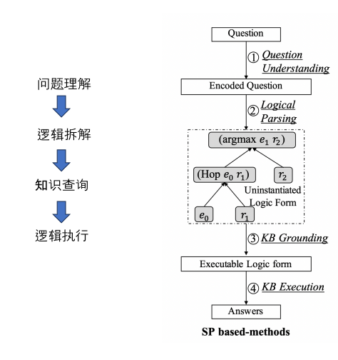
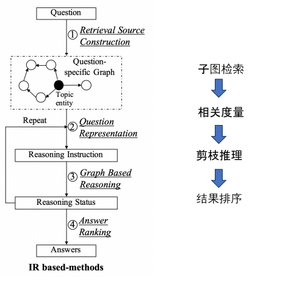
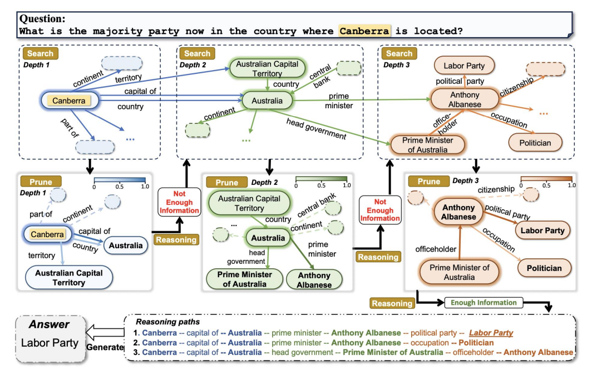
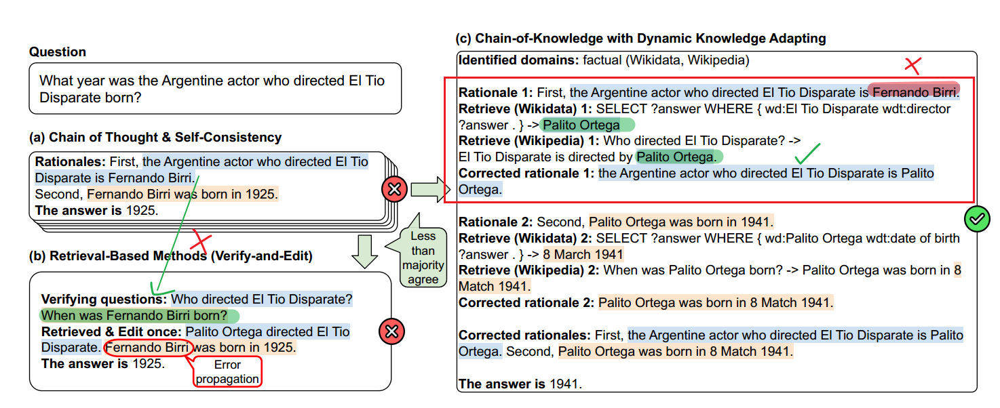
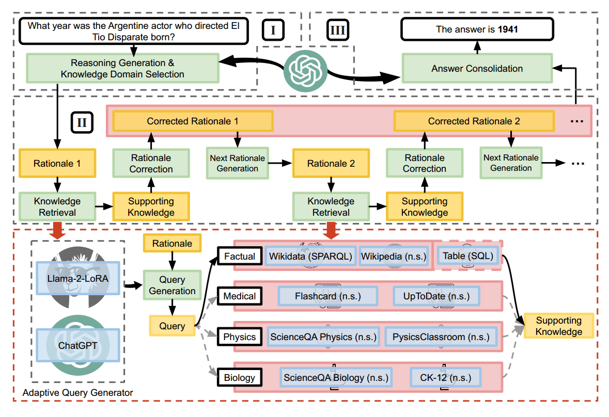
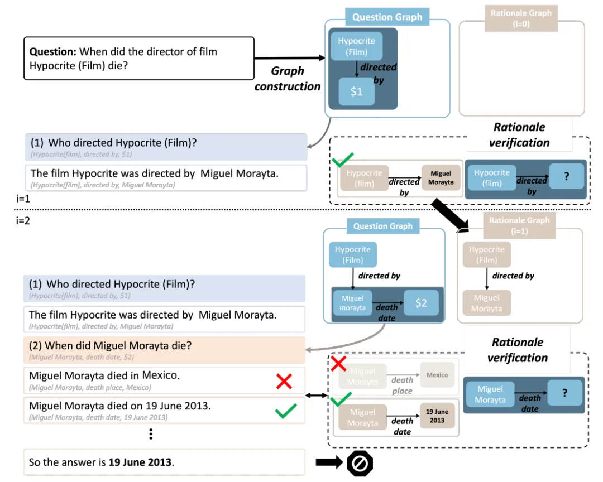
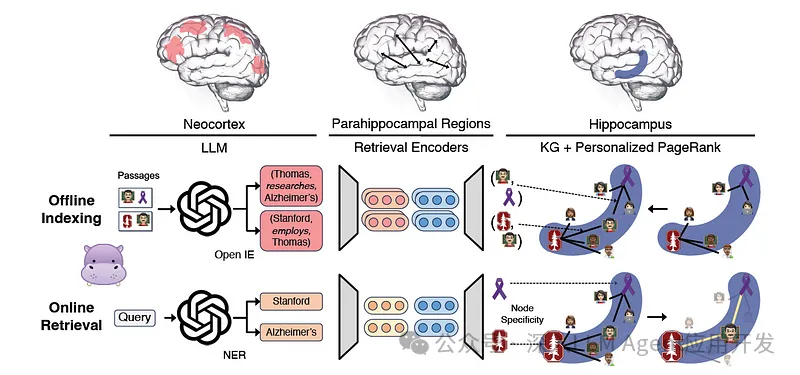
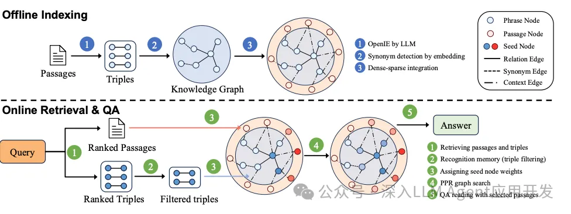
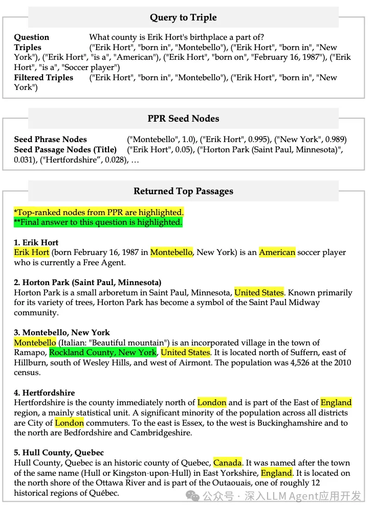

# LLM-Based KG

用大模型的能力去从语料中抽取三元组，构建知识图谱

- OpenSPG


# KG-Based RAG

## 1. 对 Query 的语义解析



### 传统方法（Pre-LLM）

直接将自然语言问题解析为**逻辑表达式**，在知识图谱（KG）中查询。

一般步骤是将 Query 解析成中间表示，再将中间表示向知识库映射，获得最终的逻辑表示（语义解析）。

#### 语义解析

1. **短语检测**：通过NLP的方法识别 Query 中的实体和关系（分词、词性标注、命名实体识别，依赖关系分析构造短语依存图）
2. **资源映射**：通过实体链接、概念匹配、关系分类/关系抽取等方法，将从 Query 中抽取的短语与其在知识图谱中的本体匹配。
3. **语义组合**：句法分析等步骤生成最终逻辑表达式。

#### **逻辑表达式**：

- Lambda-Calculus：支持实体、函数、存在量词（\exists, \forall）等。
- Lambda-DCS：支持基本实体、关系、Join/Intersection 操作。
- CCG（组合范畴语法）：包含解析规则、解析算法、模型训练。

#### **语义解析器训练**：

目标是通过大规模知识库上的问题/答案对集合训练 Parser，用在**语义组合**阶段。

以词法、语法、对齐、桥接、实体链接、关系识别为特征，以候选逻辑表达式为目标。


### LLM-Based 方法

**核心思路**：

- 增加一条与向量数据库平行的 KG 检索路径。
- 依靠 LLM 的 NL2X（自然语言到查询）能力，将 Query 解析为图查询语言（如 Cypher），直接查询知识图谱。
- 查询结果转换为文本片段供 LLM 生成答案。


## 2. 对知识图谱内容的检索排序



### 传统方法（Pre-LLM）

**核心思路**：

- **实体抽取**：以NLP方法从 Query 中识别实体，作为 KG 采样的种子节点。
- **子图转换**：从种子节点出发在 KG 中抽取子图，然后将子图转换为文本片段。
- **检索排序**：
  - **基于特征的排序**：利用疑问词、谓词、上下文特征排序。
  - **基于子图匹配**：通过子图相似度计算答案排序。
  - **基于向量化的排序**：计算 Query 和候选答案的向量相似度。
  - **基于记忆网络的排序**：如 Key-Value Memory Network。

**主要难点**：

- **实体链接**：识别文本中的 KG 实体并消歧。
- **跨语言问题**：多语言环境下的实体对齐。

### LLM-Based 方法

**核心思路**：

1. **中心实体抽取**：LLM 识别 Query 关键实体。
2. **子图检索**：
   - 通过实体查询相关知识。
   - 转换为自然语言文本。
3. **排序策略**：
   - 计算 Query 与候选答案的向量相似度。


## 3. 相关技术

### KAPING（基于三元组的提示词增强）

**核心思路**：

- 从 KG 中提取相关的事实三元组（实体-关系-实体）。
- 通过 Prompt Engineering 方式将其注入 LLM 进行回答。

**步骤**：

1. **知识获取**：使用实体链接方法从 KG 中抽取与 Query 相关的若干三元组，选取与 Query 最相关的K个三元组。

2. **知识表达**：将候选三元组转换为自然语言文本。

3. **知识注入**：

   - 构造 Prompt，如：

   ```
   Below are facts in the form of triples meaningful to answer the question: [...]
   ```

### Think on Graph（ToG）



具体来说，该算法为一个可循环的迭代过程，每次循环需先后完成**搜索剪枝**、**推理决策**两个任务

- 搜索剪枝用于找出最有希望成为正确答案的推理路径
- 推理决策任务则通过LLM来判断已有的候选推理路径是否足以回答问题，如果判断结果为否，则继续迭代到下个循环。

#### **具体步骤**

1. **主题实体提取**：使用 LLM 识别问题涉及的核心实体。
2. **子图查询**：
   - 先查询实体相关关系。
   - 再扩展查询相关实体。
3. **路径裁剪**：使用 LLM 评分（关系和实体），保留最有价值的推理路径。
4. **相关度判断**：判断当前路径是否足以回答问题（或者当前查询路径深度是否已经达到设定的最大深度），如果还不足以回答问题，则重复步骤 2~4。
5. **答案生成**：最终将得到的 KG 路径注入 Prompt 让 LLM 生成答案。

#### **变种：ToG-R**：

- 省去 LLM 进行实体修剪，只留下关系修剪，对 KG 的探索集中在关系上。ToG-R在每次迭代中按顺序执行关系搜索、关系修剪和实体搜索。
- ToG-R 更侧重于利用知识图谱中关系的字面信息，当中间实体的描述不完整或不为 LLM 熟悉时，这种方法可以减少因抽象表达引发的误导，确保推理路径更为可靠。


# KG-Enhanced LLM

### 1. 利用KG训练LLM

- ERNIE
- KnowBert
- KBERT

### 2. 利用KG微调LLM

- KoPA


# KG-Enhanced Prompt Engineering

这里的两个例子都是在 CoT 思维链中加入知识图谱，利用知识图谱来引导思维链的推导过程，并**验证中间推导过程的准确性**。

1. **CoK** 把每一步的中间思考过程表示为三元组，并通过**查询知识图谱验证**三元组的真实性
2. **Graph-Guided Reasoning** 把每一步的中间思考过程表示为图结构，并**自我反思**判断每一步的思考结果是否有效

## CoK —— 知识链

核心就是利用知识库来验证思维链推理的正确性。旨在解决CoT中间出现错误推导的问题，方法是诱导LLM生成结构三元组的显式知识证据，并引入F2-Verification方法，从事实性和忠实性两个方面来评估推理链的可靠性。对于不可靠的回答，可以指出错误的证据，促使LLM重新思考。





## Graph-Guided Reasoning —— 图引导的推理

核心是把思考路径和思考的中间结果表示成图结构（以显式地表示和检查中间问题和中间结果的语义结构）并对每一步的思考结果进行图验证。从而提高思考的有效性和准确性。本文的方法的整体流程如下图所示：



---

1. **问题图构建**：利用大型语言模型从问题中提取知识三元组，并将其表示为一个图结构。

2. **中间问题生成**：根据问题图中的三元组，生成一个与初始问题相关的子问题，以获取回答问题所需的信息。

3. **中间答案生成**：利用大型语言模型回答中间问题，并生成一个作为推理步骤的中间答案。在开放领域的设置中，还可以利用检索增强的方法，根据中间问题作为查询，从外部知识库中检索相关的段落，以辅助中间答案的生成。

4. **理由验证**：将生成的中间答案转换为三元组的形式，并与问题图进行匹配，以验证其是否有效和有用。如果中间答案被拒绝，就返回到中间问题生成的步骤。

**这个过程重复进行，直到生成的理由图与问题图匹配，或者达到重复的限制。然后，大型语言模型根据所有的中间答案，生成最终的答案**。


# Hippo RAG

## Hippo RAG 1

HippoRAG 1 通过模拟人脑记忆系统的三个关键组件（新皮层、海马旁回区域和海马体）来实现类脑的知识整合与检索功能。以下是具体对应关系及技术实现原理：

### 人脑三部分的功能与HippoRAG 1的模仿机制

#### 1. 新皮层（Neocortex）
- **人脑作用**：负责高阶认知功能（如语言处理、知识存储）和感官信息的抽象表征。
- **HippoRAG 1模仿**：
  - 由大型语言模型（LLM，如GPT-3.5）扮演，负责从文本中提取知识并构建开放知识图谱（Open KG）。
  - 类似大脑皮层处理感官输入的过程，LLM将非结构化文本转化为结构化三元组（如"爱因斯坦→出生于→德国"）。

#### 2. 海马旁回区域（Parahippocampal regions, PHR）
- **人脑作用**：在记忆编码和检索中提供上下文信息，协助海马体完成模式分离（区分不同记忆）。
- **HippoRAG 1模仿**：
  - 通过**检索编码器（Retrieval Encoders）**实现，将用户查询中的关键概念与知识图谱节点关联。
  - 例如：识别"斯坦福教授"对应图谱中的"大学→教职工"节点，避免与同名实体混淆。

#### 3. 海马体（Hippocampus）
- **人脑作用**：作为记忆索引中枢，通过关联线索快速检索分散的记忆片段（模式补全）。
- **HippoRAG 1模仿**：
  - 由**个性化PageRank（PPR）算法**驱动，在知识图谱中激活多跳关联路径。
  - 例如：查询"斯坦福教授托马斯进行阿尔茨海默症研究"时，PPR算法自动关联"斯坦福→托马斯·聚德霍夫→APOE基因"等节点。



### 协同工作流程示例

1. **问题输入**：用户提问"托马斯·聚德霍夫的研究领域是什么？"
2. **LLM处理**：提取实体"托马斯·聚德霍夫"和关系"研究领域"。
3. **检索编码器**：将实体链接到图谱中的"人物"节点，并识别"研究领域"为待查询关系。
4. **PPR算法**：从该节点出发，沿"教授→斯坦福→神经科学→阿尔茨海默症"路径扩散激活信号，筛选高权重答案。

### 技术优势与生物学启发性

- **模式分离**：通过节点特异性设计（如唯一ID）区分相似实体（如不同"托马斯"教授）。
- **模式补全**：PPR算法模拟海马体的联想检索，单次遍历即可整合多源知识（成本降低20倍）。

## Hippo RAG 2







# 数据集测试

## 测试结果对比

| RAG       | HotpotQA | 2Wiki | MuSiQue |
| :-------- | :------- | :---- | :------ |
| RAPTOR    | 69.5     | 52.1  | 28.9    |
| GraphRAG  | 68.6     | 58.6  | 38.5    |
| LightRAG  | 2.4      | 11.6  | 1.6     |
| HippoRAG  | 63.5     | 71.8  | 35.1    |
| KAG       | 76.2     | 76.2  | 48.7    |
| PIKE-RAG  | 76.26    | 75.19 | 56.62   |
| HippoRAG2 | 75.5     | 71.0  | 48.6    |

> [数据来源](https://mp.weixin.qq.com/s/rsPmi4IZGjp6eGnGmCrP8A)：来源于不同的论文，测试所用模型不同

## 数据集解释

https://blog.csdn.net/DEVELOPERAA/article/details/145302836

衡量RAG（检索增强生成）效果的三个指标 **HotpotQA**、**2WikiMultihopQA** 和 **MuSiQue** 是三个专门用于评估多跳推理能力的问答数据集，它们分别针对不同的复杂推理场景设计。以下是它们的详细解释：

---

### 1. **HotpotQA**  
• **核心特点**：  
  • **多跳推理**：要求模型在多个文档中串联信息进行推理（如“Rand Paul竞选酒店所在的河流”需先定位酒店再关联河流）。  
  • **支持事实标注**：提供答案的佐证证据（Supporting Facts），评估模型的可解释性。  
  • **干扰项赛道**：提供10个备选篇章，测试模型抗噪声能力。  

• **评估指标**：  
  • **联合F1（Joint F1）**：综合答案和支持事实的模糊匹配率，反映整体推理准确性（如讯飞模型Joint F1达72.73）。  

---

### 2. **2WikiMultihopQA**  
• **核心特点**：  
  • **跨维基百科推理**：问题需关联多个维基百科页面的信息（如比较两个实体的属性）。  
  • **动态知识需求**：测试模型对分散知识的整合能力，尤其适合评估RAG的检索-推理协同性能。  

• **评估场景**：  
  • 在Google DeepMind的对比实验中，长上下文模型（如Gemini 1.5）在此类任务上表现优于传统RAG，但RAG成本更低。  

---

### 3. **MuSiQue**  
• **核心特点**：  
  • **严格多跳设计**：每个问题需至少2次推理跳跃，且排除单跳可解的简化问题。  
  • **答案多样性**：包含事实型、比较型等多种问题类型，测试模型的泛化能力。  

• **应用案例**：  
  • 在强化学习框架R1-Searcher中，MuSiQue被用于验证模型的多轮检索-推理能力（性能提升10%-26%）。  

---

### 三者的联系与区别  
| 维度         | HotpotQA            | 2WikiMultihopQA        | MuSiQue             |
| ------------ | ------------------- | ---------------------- | ------------------- |
| **核心目标** | 抗噪声推理+可解释性 | 跨文档知识整合         | 严格多跳泛化性      |
| **数据来源** | 精选10篇干扰文档    | 全维基百科关联页面     | 人工筛选多跳问题    |
| **典型应用** | 讯飞C2F Reader模型  | Gemini 1.5长上下文测试 | R1-Searcher强化学习 |

**总结**：这三个数据集共同推动RAG系统在**复杂推理**、**知识整合**和**抗干扰性**上的进步，但侧重点不同：HotpotQA强调可解释性，2Wiki测试跨文档能力，MuSiQue则聚焦严格多跳泛化。


# KG-Based RAG 技术时间线

| 技术名称           | 论文发布时间 | 核心论文题目                                                 | 主要技术要点                                                 | 功能特点                                                     | 备注                                                         |
| ------------------ | ------------ | ------------------------------------------------------------ | ------------------------------------------------------------ | ------------------------------------------------------------ | ------------------------------------------------------------ |
| **Think on Graph** | 2023年6月    | 《Think-on-Graph: Deep and Responsible Reasoning of Large Language Model on Knowledge Graph》 | 采用动态子图推理（DFS+BFS混合搜索），通过迭代扩展、路径剪枝和推理决策构建多跳推理路径；LLM 评估候选路径相关性，支持假设生成-验证循环。 | 动态捕捉复杂实体关系和多跳推理路径；适用于结构复杂、需多步推理的问题，能显著减少幻觉问题并提供可解释推理路径。 | 查询成本与图规模和搜索深度相关；CommonsenseQA 准确率提升 9%。 |
| **FlexKBQA**       | 2023年8月    | 《FlexKBQA: Flexible Knowledge Boundary Detection for QA Systems》 | 采用动态知识边界检测技术，结合无监督领域迁移能力，通过预定义查询模板（如 SPARQL 模板）和逐步 grounding，实现跨领域问答。 | 适用于结构化知识库问答，支持跨领域知识整合（如法律→医疗），提升检索效率 30%。 | 在零样本领域迁移任务中 F1 提升 22%；Grounding 过程复杂，性能依赖于模板覆盖性。 |
| **GraphRAG**       | 2024年4月    | 《From Local to Global: A Graph RAG Approach to Query-Focused Summarization》 | 结合知识图谱与 RAG 框架，通过实体关系抽取构建同质无向图，并采用社区检测（如 Leiden 算法）进行层级划分，实现全局推理。 | 具备全局查询和多跳推理能力，能够提升问答综合性和准确性，但索引成本较高（单书约 $11）。 | HotpotQA 上 F1 提升 12%，多跳准确率提高 20%。                |
| **HippoRAG 1**     | 2024年5月    | 《HippoRAG: Neurologically Inspired Memory for Retrieval》   | 模拟人脑长期记忆机制，整合人工新皮层（LLM）、旁海马区域（PHR 编码器）和人工海马（开放知识图谱），支持多跳推理和长期记忆存储。 | 提供深层次记忆与多步推理能力，适用于复杂关系理解任务；降低 LLM 依赖（7B 模型可达 13B 效果）。 | 计算成本较高，MuSiQue 多跳问答准确率 68.2%。                 |
| **KAG**            | 2024年9月    | 《KAG: Boosting LLMs in Professional Domains via Knowledge Augmented Generation》 | 结合 OpenSPG 领域知识图谱，通过结构化 KG 信息增强索引与检索，支持逻辑形式引导的混合推理引擎。 | 主要应用于金融合规场景，能显著提升相关问答准确性，支持实时政策更新。 | 2Wiki 多跳问答 F1 提升 19.6%，HotpotQA 提升 33.5%；索引构建成本较高。 |
| **DRIFT-RAG**      | 2024年10月   | 未公开发表（微软技术）                                       | 实现动态、增量式信息融合，通过反馈机制调整检索策略，并采用动态关系感知检索优化实体交互路径。 | 具备较高的鲁棒性和适应性，支持流式知识更新，能够根据实时反馈动态调整检索内容。 | 在供应链分析任务中响应速度提升 50%；融合策略复杂，性能依赖于实时检索和反馈机制。 |
| **LightRAG**       | 2024年10月   | 《LightRAG: Lightweight Retrieval for Knowledge-Intensive Tasks》 | 采用双级检索（BM25+向量混合）、INT8 量化和边缘计算优化，以降低计算开销。 | 查询响应速度更快、资源消耗更低，适合实时或低延迟场景，内存占用降低 74%（2.1GB），延迟降低 50%（210ms）。 | MuSiQue 任务中保持 85% 准确率，同时降低 60% 能耗。           |
| **LazyGraphRAG**   | 2024年11月   | [《LazyGraphRAG: Setting a new standard for quality and cost》（微软官方博客）](https://www.microsoft.com/en-us/research/blog/lazygraphrag-setting-a-new-standard-for-quality-and-cost/) | 采用延迟处理策略，将部分图计算推迟到必要时执行，同时利用名词短语替代 LLM 实体抽取，并通过相似度+社区动态选择实现迭代深化搜索。 | 降低即时计算资源消耗，适用于资源受限环境，索引成本降 1000 倍（GraphRAG 的 0.1%），全局查询质量接近但成本低 700 倍。 | 在 1500 次测试预算下胜率超 GraphRAG 30%；适用于对延迟要求不高的场景。 |
| **Fast GraphRAG**  | 2024年11月   | [GitHub 仓库](https://github.com/circlemind-ai/fast-graphrag) | 在 GraphRAG 基础上优化索引和查询，通过 PageRank 选择高价值节点，并采用动态剪枝（PR<0.01 节点丢弃）来减少计算开销。 | 查询响应速度更快，适合大规模数据处理，成本降至 $0.08/查询（GraphRAG 原 $0.48），支持可视化推理路径。 | 《绿野仙踪》数据集处理成本降低 83%；可能需要更高性能的硬件支持。 |
| **PIKE RAG**       | 2025年1月    | 《PIKE-RAG: Specialized Knowledge and Rationale Augmented Generation》 | 采用 PIKE 图嵌入与索引技术，提高检索精度与多跳推理能力，支持领域实体别名映射和逻辑链生成模块（LPM）。 | 适用于专业领域问答任务，如制造业设备故障诊断，支持动态知识注入，提高语境理解能力。 | 在工业数据集上误检率降低 25%（相比传统 RAG），故障诊断准确率提升 38%。 |
| **HippoRAG 2**     | 2025年2月    | 《From RAG to Memory: Non-parametric Continual Learning for Large Language Models》 | 在 HippoRAG 1 基础上优化内存检索与信息聚合，新增段落节点+同义边，并采用混合稀疏/密集编码，实现“Query to Triple”映射。 | 相较于 HippoRAG 1，延迟降低、性能提升，更适用于实时性要求更高的应用，关联记忆能力提升 7%。 | HotpotQA-full 上超越 GraphRAG 15%；测试结果表明在大规模知识整合方面有显著优势。 |

